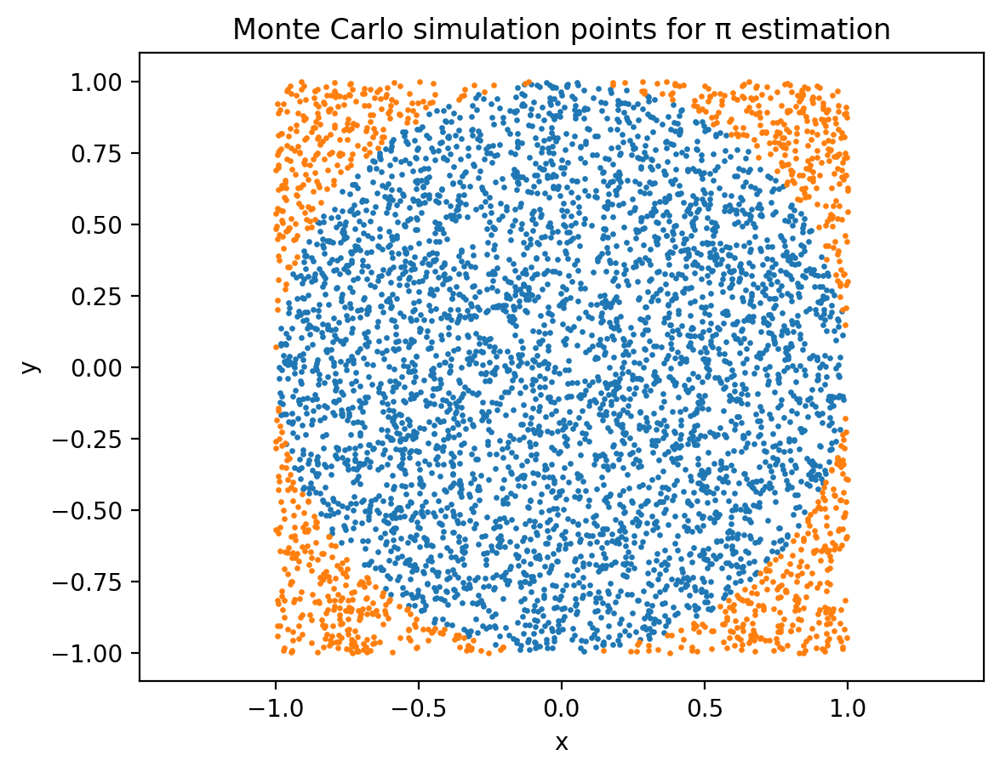
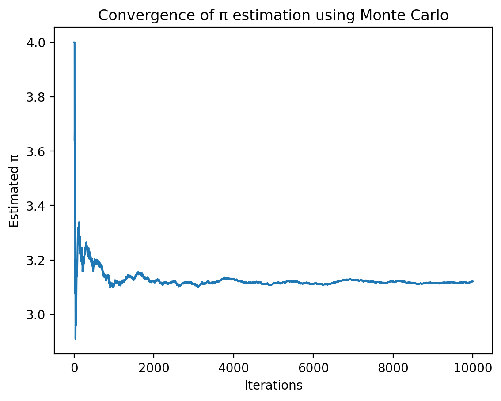

# Simulación Monte Carlo para la estimación de π

## 1. Introducción

El método Monte Carlo estima el valor de π mediante muestreo aleatorio.  
Se generan puntos uniformemente dentro de un cuadrado de lado 2 centrado en el origen, y se inscribe un círculo unitario dentro del cuadrado.  

La probabilidad de que un punto caiga dentro del círculo es:

\[
\pi \approx 4 \times \frac{\text{puntos dentro del círculo}}{\text{puntos totales}}
\]

---

## 2. Gráfica de la simulación

La siguiente figura muestra los puntos generados aleatoriamente dentro del cuadrado.  
Los puntos dentro del círculo unitario forman el patrón circular:



Valor estimado de π usando 5000 puntos:

\[
\pi \approx 3.142
\]

> **Nota:** Para generar la imagen `montecarlo_points.png`, se puede usar Python o Julia con un scatter plot de los puntos dentro y fuera del círculo.

---

## 3. Gráfica de convergencia

La siguiente figura muestra cómo la estimación de π mejora a medida que aumenta el número de iteraciones:



Se observa que:

- Al principio hay gran variabilidad en la estimación.  
- Con más iteraciones, el valor se estabiliza cerca del valor real de π (≈ 3.14159).

> **Nota:** Para generar `montecarlo_convergence.png`, se puede graficar la estimación de π acumulada a lo largo de las iteraciones.

---

## 4. Implementación en Python

```python
import random

def montecarlo_pi(n):
    dentro = 0
    for i in range(n):
        x = random.uniform(-1, 1)
        y = random.uniform(-1, 1)
        if x*x + y*y <= 1:
            dentro += 1
    return 4 * dentro / n

resultado = montecarlo_pi(1000000)
print("π ≈", resultado)
```

```python
import random

def estimate_pi(N):
    n = 0  # contador de puntos dentro del círculo
    for i in range(N):
        x = 2 * random.random() - 1 
        y = 2 * random.random() - 1
        if x**2 + y**2 <= 1:
            n += 1
    return 4 * n / N

resultado = estimate_pi(1000000)
print("π ≈", resultado)


```


## 5. Implementación en Julia

```julia
using Random

function montecarlo_pi(n)
    dentro = 0
    for i in 1:n
        x = rand()*2 - 1
        y = rand()*2 - 1
        if x^2 + y^2 <= 1
            dentro += 1
        end
    end
    return 4 * dentro / n
end

println("π ≈ ", montecarlo_pi(1_000_000))
```

## 6. Conclusión

- El método Monte Carlo permite estimar π mediante simulación probabilística.
- La precisión aumenta con más puntos generados, pero también aumenta el coste computacional.
- Las gráficas muestran visualmente cómo los puntos se distribuyen dentro del círculo y cómo la estimación converge hacia el valor real de π.

## Referencias:

- Técnicas de Monte Carlo en computación científica.
- Python `matplotlib` y Julia `Plots.jl` para visualización de datos.