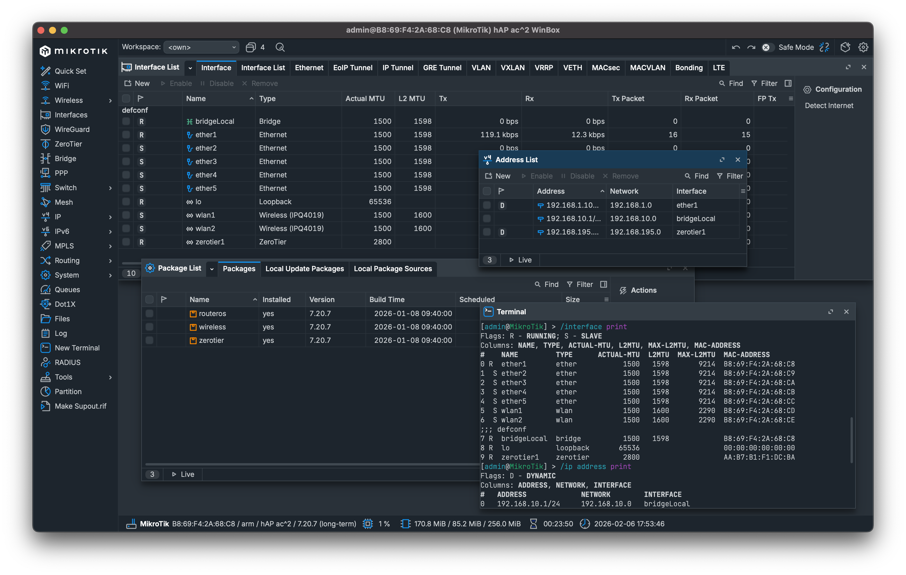

# Manual de Introducción a la Administración de Redes con RouterOS (MikroTik)

## 1. ¿Qué es MikroTik y RouterOS?

MikroTik es un fabricante de equipos de red (routers, switches inalámbricos, CPEs) muy utilizado por ISPs, empresas y entornos educativos.

**RouterOS** es el sistema operativo de MikroTik, basado en Linux, diseñado específicamente para:

- Enrutamiento avanzado
- Firewall
- NAT
- VPN
- QoS
- Redes inalámbricas
- Monitoreo y control de tráfico

Puede instalarse en:

- Hardware MikroTik (RouterBOARD)
- PCs (RouterOS x86)
- Máquinas virtuales (CHR – Cloud Hosted Router)

## 2. Conceptos básicos de redes

Antes de administrar RouterOS, debes conocer:

- **IP**: Dirección lógica de un dispositivo (ej. `192.168.1.1`)
- **Máscara**: Define el tamaño de la red (`/24`, `255.255.255.0`)
- **Gateway**: Puerta de enlace hacia otras redes
- **DNS**: Traduce nombres a direcciones IP
- **LAN / WAN**: Red interna / red externa
- **NAT**: Traducción de direcciones privadas a públicas
- **Firewall**: Controla el tráfico entrante y saliente

## 3. Métodos de acceso a RouterOS

RouterOS puede administrarse de varias formas:

### 3.1 WinBox (recomendado)

- Aplicación gráfica oficial
- Acceso por IP o MAC (permite acceso a nivel de capa 2)
- Ideal para principiantes

**WinBox** ya está disponible para MacOS



### 3.2 WebFig

- Acceso vía navegador web
- Interfaz similar a WinBox
- URL: `http://IP_DEL_ROUTER`

### 3.3 CLI (Terminal)

- Acceso por:
  - WinBox → Terminal
  - SSH
  - Consola directa
- Más potente y preciso

Ejemplo:

```bash
ssh admin@192.168.88.1
```

## 4. Primer acceso y Configuración inicial

### 4.1 Credenciales por defecto

- Usuario: admin
- Contraseña: (vacía)
  
⚠️ Siempre cambia la contraseña inmediatamente

```bash
/user set admin password=MiPasswordSeguro
```

### 4.2 Reset de fábrica

Si el router tiene una configuración desconocida:

- Botón físico RESET
- O por terminal:

```bash
/system reset-configuration no-defaults=yes
```

## 5. Interfaces

Las interfaces representan puertos físicos o virtuales:

- `ether1`, `ether2`, etc.
- `wlan1` (WiFi)
- `bridge`
- `pppoe`, `vpn`, `vlan`
  
Ver interfaces:

```bash
/interface print
```

Renombrar interfaces (buena práctica):

```bash
/interface ethernet set ether1 name=WAN
/interface ethernet set ether2 name=LAN
```

## 6. Direccionamiento IP

### 6.1 Asignar IP a una interfaz

```bash
/ip address add address=192.168.1.1/24 interface=LAN
```

Ver IPs configuradas:

```bash
/ip address print
```

## 7. Bridge (Switch virtual)

Permite unir varios puertos LAN en un solo dominio de red.

Para unir varios puertos LAN:

```bash
/interface bridge add name=bridgeLAN
/interface bridge port add bridge=bridgeLAN interface=ether2
/interface bridge port add bridge=bridgeLAN interface=ether3
```

Asignar IP al bridge (no a los puertos):

```bash
/ip address add address=192.168.1.1/24 interface=bridgeLAN
```

## 8. DHCP Server

Asigna direcciones IP automáticamente a los clientes.

### 8.1 Configuración rápida

```bash
/ip dhcp-server setup
```

Responder:

- Interface: `bridgeLAN`
- Pool: `192.168.1.100-192.168.1.200`
- Gateway: `192.168.1.1`
- DNS: `8.8.8.8`

## 9. Acceso a Internet

Configuración de ruta por defecto y NAT (masquerade).

### 9.1 Ruta por defecto

```bash
/ip route add gateway=192.168.0.1
```

(O el gateway del proveedor)

### 9.2 NAT (masquerade)

```bash
/ip firewall nat add chain=srcnat out-interface=WAN action=masquerade
```

Esto permite que la red LAN acceda a Internet.

## 10. Firewall básico

Control del tráfico entrante y saliente mediante reglas.

### 10.1 Permitir conexiones establecidas

```bash
/ip firewall filter add chain=input connection-state=established,related action=accept
```

### 10.2 Bloquear accesos desde WAN

```bash
/ip firewall filter add chain=input in-interface=WAN action=drop
```

⚠️ El orden de las reglas es crítico

## 11. DNS

Configuración de servidores DNS y resolución de nombres.

Configurar servidores DNS:

```bash
/ip dns set servers=8.8.8.8,1.1.1.1 allow-remote-requests=yes
```

## 12. Usuarios y seguridad

Creación de usuarios, cambio de contraseñas y buenas prácticas.

Crear un nuevo usuario administrador:

```bash
/user add name=admin2 group=full password=ClaveFuerte
```

Deshabilitar el admin por defecto (opcional):

```bash
/user disable admin
```

## 13. Backup y restauración

Backups binarios y exportación de configuración.

### 13.1 Backup binario

```bash
/system backup save name=backup_router
```

### 13.2 Exportar configuración (texto)

```bash
/export file=config_router
```

## 14. Actualización del sistema

Actualización de RouterOS desde paquetes oficiales.

```bash
/system package update check-for-updates
/system package update download
/system reboot
```

## 15. Buenas prácticas

- Cambiar contraseñas
- Renombrar interfaces
- Documentar IPs y reglas
- Hacer backups antes de cambios
- Probar reglas de firewall con cuidado
- No administrar desde WAN sin protección

## 16. Próximos pasos

En próximos documentos:

- VLANs
- QoS (Simple Queues, Queue Tree)
- VPN (L2TP, WireGuard, OpenVPN)
- Hotspot
- PPPoE Server
- Scripts y automatización
- Monitorización con Torch y Graphs
