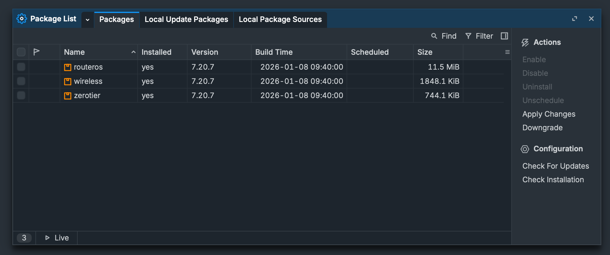
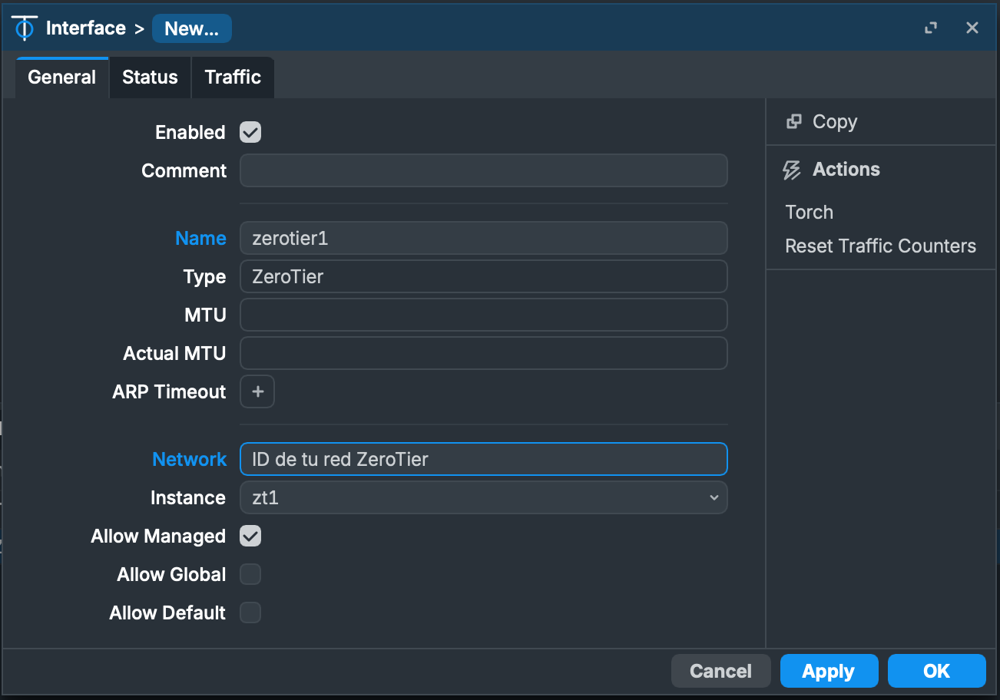

# Instalación de ZeroTier en MikroTik y permitir acceso a la red local

Este manual asume que ya tenemos creada una red ZeroTier y hay algunos dispositivos conectados a la misma. Si no es tu caso accede a la web de ZeroTier, registrate y crea tu red gratuita con hasta 25 dispositivos:

https://www.zerotier.com

En **MikroTik RouterOS**, los additional packages se instalan subiendo el paquete correspondiente al router y reiniciando el sistema. El procedimiento exacto depende de la versión (v6 o v7), pero el flujo general es el mismo.

## 1. Verificar arquitectura y versión

Primero necesitas saber la arquitectura del dispositivo (arm, mipsbe, x86, etc.) y la versión de RouterOS instalada:

En terminal:

```bash
/system resource print
```

En mi dispositivo, por ejemplo, el resultado obtenido es el siguiente:

```bash
[admin@MikroTik] > /system resource print

                   uptime: 14h44m47s          
                  version: 7.20.7 (long-term) 
               build-time: 2026-01-08 09:40:00
         factory-software: 6.42.3             
              free-memory: 170.3MiB           
             total-memory: 256.0MiB           
                      cpu: ARM                
                cpu-count: 4                  
            cpu-frequency: 672MHz             
                 cpu-load: 0%                 
           free-hdd-space: 328.0KiB           
          total-hdd-space: 16.0MiB            
  write-sect-since-reboot: 169                
         write-sect-total: 4184523            
        architecture-name: arm                
               board-name: hAP ac^2           
                 platform: MikroTik           

```

Observa:

- `architecture-name`
- `version`

Los paquetes adicionales deben coincidir **exactamente con la misma versión y arquitectura.**

Es decir, necesitaré el paquete ZeroTier **v7.20.7**para la arquitectura **ARM**

[Mas información sobre la instalación de paquetes en dispositivos RouterOS](https://help.mikrotik.com/docs/spaces/ROS/pages/40992872/Packages)


## 2. Descargar paquetes

Desde la página oficial de MikroTik:

- Descarga el archivo **“Extra packages”** correspondiente a la misma versión de RouterOS.
- Descomprime el ZIP en tu PC; verás varios `.npk` (ej.: `wireless.npk`, `container.npk`, `iot.npk`, etc.).

En versiones anteriores **(especialmente en RouterOS v6)** los paquetes que estaban copiados en *Files* podían aparecer en **System → Packages** como *disabled* o *not installed*.

En **RouterOS v7** el comportamiento cambió:
- Los `.npk` copiados ya no aparecen en Packages hasta después del reinicio.
- Solo se muestran en Files.
- Tras el reboot, si son compatibles, pasan a mostrarse como installed.

[Página de descargas de **Mikrotik**](https://mikrotik.com/download?architecture=arm)

## 3. Subir el paquete al router

Hay varias formas:

### Opción A — WinBox / WebFig

1. Abre Files.
2. Arrastra el archivo `.npk` al router.


### Opción B — SCP / FTP

Ejemplo:

```bash
scp paquete.npk admin@IP_ROUTER:
```

## 4. Reiniciar el router

Después de copiar el paquete:

```bash
/system reboot
```

Durante el arranque RouterOS instalará automáticamente los paquetes.

## 5. Verificar instalación

Tras reiniciar:

```bash
/system package print
```

El paquete debe aparecer con estado **installed.**

También podemos ver los paquetes instalados desde **WinBox** en **System → Packages**:



### Notas importantes

- El `.npk` debe coincidir exactamente con la versión instalada (ej. 7.15.3 con 7.15.3).
- Si copias varios paquetes compatibles, todos se instalarán en el mismo reinicio.
- Si el paquete no coincide con la arquitectura, será ignorado.

## 6. Configuración de ZeroTier en RouterOS

Una vez que el paquete ha sido correctamente instalado, debemos crear la interfaz **ZeroTier**

### 1️⃣ Crear la interfaz ZeroTier

#### Opción A — WinBox / WebFig

1. Abre ZeroTier del menu lateral.
2. Haz click en **New** y en la pestaña **General** completa los campos **Name** *(zerotier1)* y **Network** con el **`ID` de tu red ZeroTier**



#### Opción B — Desde el terminal

En terminal:

```bash
/interface zerotier add name=zerotier1 network=<NETWORK_ID>
```
- `zerotier1` → nombre que quieras darle a la interfaz.
- `<NETWORK_ID>` → el ID de tu red en ZeroTier (16 caracteres hex, ejemplo `8056c2e21c000001`).

### 2️⃣ Activar la interfaz

Desde la terminal, activamos la interfaz:

```bash
/zerotier/enable zerotier1
```


Luego verifica que está creada:

```bash
/zerotier/print 
```

Deberías ver algo así:
```bash

 #   NAME       NETWORK        STATUS
 0   zerotier1  8056c2e21c...  associated
associated → indica que se conectó correctamente a la red.

```

Usa la opción `detail` para ver información detallada

```bash
/zerotier/print detail
```


## 7. Autorizar el MikroTik en ZeroTier Central

En https://my.zerotier.com

- Entra en tu red
- Marca Authorize en el nuevo miembro
- (Opcional) asigna IP fija

Verifica que el router recibió IP:

```bash
/ip address print where interface=zerotier1
```

## 8. Permitir tráfico en firewall (MUY IMPORTANTE)

Permitir acceso al router:

```bash
/ip firewall filter add chain=input in-interface=zerotier1 action=accept comment="ZeroTier input"
```

Permitir acceso a la LAN:

```bash
/ip firewall filter add chain=forward in-interface=zerotier1 action=accept comment="ZeroTier forward"
```

## 9. Añadir ruta en ZeroTier Central

Para poder acceder a toda la LAN desde clientes ZeroTier:

En **ZeroTier Central → Managed Routes** añade:

```bash
- 192.168.10.0/24  ->  (IP ZeroTier del MikroTik)
```

Ejemplo:

```bash
192.168.10.0/24 via 192.168.195.254
```

Donde la dirección de red es la red local de tu router MikroTik y la dirección IP es la dirección ZeroTier del router. Esta dirección se añade manualmente en la zona de administración de la web de ZeroTier.

Podemos comprobar que recibimos nuestra IP con el comando:

```bash
/ip address print where interface=zerotier1
```

## 10. Comprobación de funcionamiento

Desde un PC conectado a ZeroTier:

```bash
ping 192.168.10.1
```

incluso puedes administrar el dispositivo desde cualquier equipo de la red

```bash
ssh admin@192.168.10.1
```

Como medida de seguiridad adicional, puedes cambiar el puerto SSH de tu dispositivo:

```bash
/ip service set ssh port=2222
```

## 11 Configuración recomendada adicional

Añadir la interfaz a una interface-list:

```bash
/interface list member add interface=zerotier1 list=LAN
```

Así heredará reglas de firewall ya existentes si tu configuración usa listas.


### Resultado

Con esto el MikroTik actúa como gateway entre ZeroTier y tu red local, permitiendo:

- acceder al router remotamente
- acceder a cualquier equipo de la LAN
- interconectar redes remotas mediante ZeroTier

