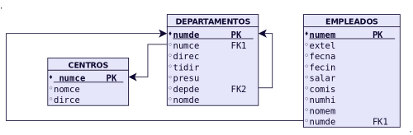

# Ejercicios - Instituto



Crear DDL y DML de las TABLAS (_En MariaDB_):

**Tabla CENTROS**
```sql

CREATE TABLE CENTROS(   
    Numce int unsigned primary key,   
    Nomce VARCHAR(50) NOT NULL UNIQUE,
    Dirce VARCHAR(50)
    ); 
```
**Tabla DEPARTAMENTOS**
```sql
CREATE TABLE DEPARTAMENTOS(   
    numde int unsigned primary key,   
    numce int unsigned,
    direc int unsigned,   
    tidir CHAR(1),   
    presu decimal(6,2),   
    depde int unsigned,   
    NOMDE varchar(50),   
    FOREIGN KEY(numce) REFERENCES CENTROS(Numce) ON DELETE CASCADE;
    FOREIGN KEY(depde) REFERENCES DEPARTAMENTOS(Numce)
    );  
```
**Tabla EMPLEADOS**
```sql
CREATE TABLE EMPLEADOS(   
    Numem int unsigned primary key,
    Extel int unsigned,   
    Fecna DATE,   
    Fecin DATE,   
    Salar decimal(6,2),     
    Comis decimal(6,2),     
    Numhi int (1),   
    NOMEM VARCHAR(20),   
    Numde int unsigned,
    FOREIGN KEY(numde)REFERENCES DEPARTAMENTOS(numde) ON DELETE CASCADE
    );
```
**CENTROS**
```sql
INSERT INTO CENTROS VALUES(10,'SEDE CENTRAL','C/ATOCHA,820,MADRID'); 
INSERT INTO CENTROS VALUES(20, 'RELACION CON CLIENTES', 'C/ATOCHA,405,MADRID');  
```
**DEPARTAMENTOS**
```sql
INSERT INTO DEPARTAMENTOS VALUES(100, 10, 260,'P', 72, NULL, 'DIRECCIÓN GENERAL'); 
INSERT INTO DEPARTAMENTOS VALUES(110, 20, 180,'P', 90, 100, 'DIRECC.COMERCIAL'); 
INSERT INTO DEPARTAMENTOS VALUES(111, 20, 180,'F', 66, 110, 'SECTOR INDUSTRIAL'); 
INSERT INTO DEPARTAMENTOS VALUES(112, 20, 270,'P', 54, 110, 'SECTOR SERVICIOS'); 
INSERT INTO DEPARTAMENTOS VALUES(120, 10, 150,'F', 18, 100, 'ORGANIZACIÓN'); 
INSERT INTO DEPARTAMENTOS VALUES(121, 10, 150,'P', 12, 120, 'PERSONAL'); 
INSERT INTO DEPARTAMENTOS VALUES(122, 10, 350,'P', 36, 120, 'PROCESO DE DATOS'); 
INSERT INTO DEPARTAMENTOS VALUES(130, 10, 310,'P', 12, 100, 'FINANZAS');
```
Las fechas en MariaDB se introducen con el formato AÑO-MES-Dia
**EMPLEADOS**  
```sql
INSERT INTO EMPLEADOS VALUES(110,350,'1970-11-10','1985-02-15',1800,NULL,3,'CESAR',121); 
INSERT INTO EMPLEADOS VALUES(120,840,'1968-06-09','1988-10-01',1900,110,1,'MARIO',112); 
INSERT INTO EMPLEADOS VALUES(130,810,'1965-09-09','1981-02-01',1500,110,2,'LUCIANO',112); 
INSERT INTO EMPLEADOS VALUES(150,340,'1972-08-10','1997-01-15',2600,NULL,0,'JULIO',121); 
INSERT INTO EMPLEADOS VALUES(160,740,'1980-07-09','2005-11-11',1800,110,2,'AUREO',111); 
INSERT INTO EMPLEADOS VALUES(180,508,'1974-10-18','1996-03-18',2800,50,2,'MARCOS',110); 
INSERT INTO EMPLEADOS VALUES(190,350,'1972-05-12','1992-02-11',1750,NULL,4,'JULIANA',121); 
INSERT INTO EMPLEADOS VALUES(210,200,'1970-09-28','1999-01-22',1910,NULL,2,'PILAR',100); 
INSERT INTO EMPLEADOS VALUES(240,760,'1967-02-26','1989-02-24',1700,100,3,'LAVINIA',111); 
INSERT INTO EMPLEADOS VALUES(250,250,'1976-10-27','1997-03-01',2700,NULL,0,'ADRIANA',100); 
INSERT INTO EMPLEADOS VALUES(260,220,'1973-12-03','2001-07-12',720,NULL,6,'ANTONIO',100); 
INSERT INTO EMPLEADOS VALUES(270,800,'1975-05-21','2003-09-10',1910,80,3,'OCTAVIO',112); 
INSERT INTO EMPLEADOS VALUES(280,410,'1978-01-10','2010-10-08',1500,NULL,5,'DOROTEA',130); 
INSERT INTO EMPLEADOS VALUES(285,620,'1979-10-25','2011-02-15',1910,NULL,0,'OTILIA',122); 
INSERT INTO EMPLEADOS VALUES(290,910,'1967-11-30','1988-02-14',1790,NULL,3,'GLORIA',120); 
INSERT INTO EMPLEADOS VALUES(310,480,'1976-11-21','2001-01-15',1950,NULL,0,'AUGUSTO',130); 
INSERT INTO EMPLEADOS VALUES(320,620,'1977-12-25','2003-02-05',2400,NULL,2,'CORNELIO',122); 
INSERT INTO EMPLEADOS VALUES(330,850,'1958-08-19','1980-03-01',1700,90,0,'AMELIA',112); 
INSERT INTO EMPLEADOS VALUES(350,610,'1979-04-13','1999-09-10',2700,NULL,1,'AURELIO',122); 
INSERT INTO EMPLEADOS VALUES(360,750,'1978-10-29','1998-10-10',1800,100,2,'DORINDA',111); 
INSERT INTO EMPLEADOS VALUES(370,360,'1977-06-22','2000-01-20',1860,NULL,1,'FABIOLA',121); 
INSERT INTO EMPLEADOS VALUES(380,880,'1978-03-30','1999-01-01',1100,NULL,0,'MICAELA',112); 
INSERT INTO EMPLEADOS VALUES(390,500,'1976-02-19','2010-10-08',1290,NULL,1,'CARMEN',110); 
INSERT INTO EMPLEADOS VALUES(400,780,'1979-08-18','2011-11-01',1150,NULL,0,'LUCRECIA',111); 
INSERT INTO EMPLEADOS VALUES(410,660,'1968-07-14','1989-10-13',1010,NULL,0,'AZUCENA',122); 
INSERT INTO EMPLEADOS VALUES(420,450,'1966-10-22','1988-11-19',2400,NULL,0,'CLAUDIA',130); 
INSERT INTO EMPLEADOS VALUES(430,650,'1967-10-26','1988-11-19',1260,NULL,1,'VALERIANA',122); 
INSERT INTO EMPLEADOS VALUES(440,760,'1966-09-26','1986-02-28',1260,100,0,'LIVIA',111); 
INSERT INTO EMPLEADOS VALUES(450,880,'1966-10-21','1986-02-28',1260,100,0,'SABINA',112); 
INSERT INTO EMPLEADOS VALUES(480,760,'1965-04-04','1986-02-28',1260,100,1,'DIANA',111); 
INSERT INTO EMPLEADOS VALUES(490,880,'1964-06-06','1988-01-01',1090,100,0,'HORACIO',112); 
INSERT INTO EMPLEADOS VALUES(500,750,'1965-10-08','1987-01-01',1200,100,0,'HONORIA',111); 
INSERT INTO EMPLEADOS VALUES(510,550,'1966-05-04','1986-11-01',1200,NULL,1,'ROMULO',110); 
INSERT INTO EMPLEADOS VALUES(550,780,'1970-01-10','1998-01-21',600,120,0,'SANCHO',111);

```
**Actualizar Fechas:**

`update EMPLEADOS set Fecna='1970/11/10' where Numem=110;`

Ejemplo Tabla Empleados con campos `Check` y `Enumerable`
```sql
CREATE TABLE empleados (
    id INT PRIMARY KEY AUTO_INCREMENT,
    nombre VARCHAR(50) NOT NULL,
    edad INT CHECK (edad >= 18),  -- La edad debe ser 18 o mayor
    genero ENUM('M', 'F') NOT NULL,  -- Solo puede ser 'M' o 'F'
    salario DECIMAL(10,2) CHECK (salario > 0)  -- El salario debe ser mayor a 0
);
```