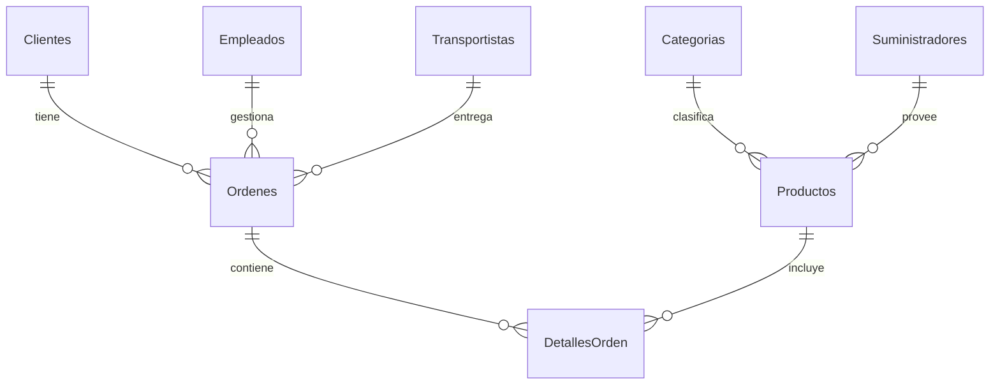
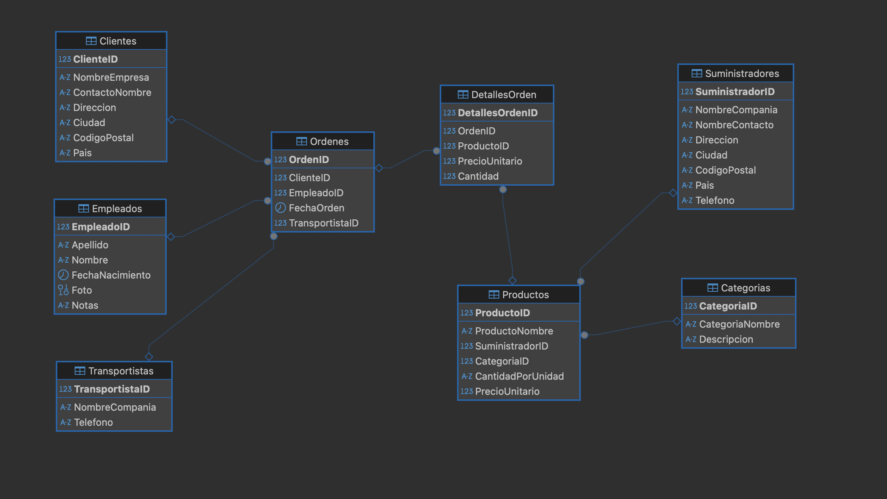

## Centro Comercial

```sql 
CREATE DATABASE IF NOT EXISTS centro_comercial;
USE centro_comercial;

CREATE TABLE Clientes (
    ClienteID INT PRIMARY KEY,
    NombreEmpresa VARCHAR(255),
    ContactoNombre VARCHAR(255),
    Direccion VARCHAR(255),
    Ciudad VARCHAR(100),
    CodigoPostal VARCHAR(20),
    Pais VARCHAR(100)
);

CREATE TABLE Empleados (
    EmpleadoID INT PRIMARY KEY,
    Apellido VARCHAR(100),
    Nombre VARCHAR(100),
    FechaNacimiento DATE,
    Foto BLOB,
    Notas TEXT
);

CREATE TABLE Transportistas (
    TransportistaID INT PRIMARY KEY,
    NombreCompania VARCHAR(255),
    Telefono VARCHAR(50)
);

CREATE TABLE Ordenes (
    OrdenID INT PRIMARY KEY,
    ClienteID INT,
    EmpleadoID INT,
    FechaOrden DATE,
    TransportistaID INT,
    FOREIGN KEY (ClienteID) REFERENCES Clientes(ClienteID),
    FOREIGN KEY (EmpleadoID) REFERENCES Empleados(EmpleadoID),
    FOREIGN KEY (TransportistaID) REFERENCES Transportistas(TransportistaID)
);

CREATE TABLE Categorias (
    CategoriaID INT PRIMARY KEY,
    CategoriaNombre VARCHAR(255),
    Descripcion TEXT
);

CREATE TABLE Suministradores (
    SuministradorID INT PRIMARY KEY,
    NombreCompania VARCHAR(255),
    NombreContacto VARCHAR(255),
    Direccion VARCHAR(255),
    Ciudad VARCHAR(100),
    CodigoPostal VARCHAR(20),
    Pais VARCHAR(100),
    Telefono VARCHAR(50)
);

CREATE TABLE Productos (
    ProductoID INT PRIMARY KEY,
    ProductoNombre VARCHAR(255),
    SuministradorID INT,
    CategoriaID INT,
    CantidadPorUnidad VARCHAR(50),
    PrecioUnitario DECIMAL(10,2),
    FOREIGN KEY (SuministradorID) REFERENCES Suministradores(SuministradorID),
    FOREIGN KEY (CategoriaID) REFERENCES Categorias(CategoriaID)
);

CREATE TABLE DetallesOrden (
    DetallesOrdenID INT PRIMARY KEY,
    OrdenID INT,
    ProductoID INT,
    PrecioUnitario DECIMAL(10,2),
    Cantidad INT,
    FOREIGN KEY (OrdenID) REFERENCES Ordenes(OrdenID),
    FOREIGN KEY (ProductoID) REFERENCES Productos(ProductoID)
);
```
### Diagrama Entidad-Relacion




-- Inserción de datos de prueba con 10 registros por tabla

```sql
INSERT INTO Clientes VALUES 
(1, 'Empresa A', 'Juan Pérez', 'Calle 123', 'Madrid', '28001', 'España'),
(2, 'Empresa B', 'María Gómez', 'Avenida 456', 'Barcelona', '08001', 'España'),
(3, 'Empresa C', 'Luis Martínez', 'Calle 789', 'Valencia', '46001', 'España'),
(4, 'Empresa D', 'Ana Torres', 'Avenida 321', 'Sevilla', '41001', 'España'),
(5, 'Empresa E', 'Carlos Rivera', 'Calle 654', 'Bilbao', '48001', 'España'),
(6, 'Empresa F', 'Sofía López', 'Plaza Mayor', 'Granada', '18001', 'España'),
(7, 'Empresa G', 'Pedro Sánchez', 'Calle Luna', 'Málaga', '29001', 'España'),
(8, 'Empresa H', 'Elena Ruiz', 'Avenida Sol', 'Murcia', '30001', 'España'),
(9, 'Empresa I', 'Miguel Fernández', 'Calle Estrella', 'Zaragoza', '50001', 'España'),
(10, 'Empresa J', 'Laura González', 'Calle Nube', 'Santander', '39001', 'España');

INSERT INTO Empleados VALUES 
(1, 'López', 'Carlos', '1985-06-15', NULL, 'Gerente de ventas'),
(2, 'Fernández', 'Ana', '1990-09-25', NULL, 'Atención al cliente'),
(3, 'Martínez', 'Luis', '1988-02-10', NULL, 'Supervisor'),
(4, 'Torres', 'Ana', '1992-07-05', NULL, 'Vendedor'),
(5, 'Rivera', 'Carlos', '1980-03-20', NULL, 'Gerente general'),
(6, 'López', 'Sofía', '1995-08-15', NULL, 'Administración'),
(7, 'Sánchez', 'Pedro', '1983-11-30', NULL, 'Logística'),
(8, 'Ruiz', 'Elena', '1991-05-12', NULL, 'Recursos humanos'),
(9, 'Fernández', 'Miguel', '1978-09-09', NULL, 'CEO'),
(10, 'González', 'Laura', '1987-04-25', NULL, 'Atención al cliente');

INSERT INTO Transportistas VALUES 
(1, 'Transporte Rápido', '123456789'),
(2, 'Envíos Express', '987654321'),
(3, 'Logística Segura', '654123987'),
(4, 'DHL', '321987654'),
(5, 'UPS', '456789123'),
(6, 'FedEx', '789654123'),
(7, 'Correos Express', '147258369'),
(8, 'GLS', '369258147'),
(9, 'Seur', '258147369'),
(10, 'MRW', '159753486');

INSERT INTO Ordenes VALUES 
(1, 1, 2, '2025-03-15', 1),
(2, 2, 3, '2025-03-16', 2),
(3, 3, 4, '2025-03-17', 3),
(4, 4, 5, '2025-03-18', 4),
(5, 5, 6, '2025-03-19', 5),
(6, 6, 7, '2025-03-20', 6),
(7, 7, 8, '2025-03-21', 7),
(8, 8, 9, '2025-03-22', 8),
(9, 9, 10, '2025-03-23', 9),
(10, 10, 1, '2025-03-24', 10);

INSERT INTO Categorias VALUES 
(1, 'Bebidas', 'Refrescos, jugos y agua mineral.'),
(2, 'Condimentos', 'Especias y salsas.'),
(3, 'Lácteos', 'Leche, queso y yogur.'),
(4, 'Carnes', 'Res, cerdo y pollo.'),
(5, 'Panadería', 'Pan, galletas y bollería.'),
(6, 'Frutas', 'Manzanas, naranjas y bananas.'),
(7, 'Verduras', 'Lechuga, tomate y cebolla.'),
(8, 'Mariscos', 'Pescado y camarones.'),
(9, 'Cereales', 'Arroz, trigo y avena.'),
(10, 'Snacks', 'Papas fritas y chocolates.');

INSERT INTO Suministradores VALUES 
(1, 'Distribuidora A', 'Pedro López', 'Calle Falsa 123', 'Madrid', '28001', 'España', '911234567'),
(2, 'Distribuidora B', 'Ana Pérez', 'Avenida Siempre Viva 456', 'Barcelona', '08001', 'España', '922345678'),
(3, 'Suministros C', 'Luis Gómez', 'Carrera 789', 'Sevilla', '41001', 'España', '933456789'),
(4, 'Almacenes D', 'María Torres', 'Paseo Marítimo 321', 'Málaga', '29001', 'España', '944567890'),
(5, 'Importaciones E', 'Carlos Rivera', 'Plaza Mayor', 'Valencia', '46001', 'España', '955678901'),
(6, 'Mayorista F', 'Sofía García', 'Calle Sol 654', 'Zaragoza', '50001', 'España', '966789012'),
(7, 'Proveedora G', 'Miguel Fernández', 'Avenida Luna', 'Granada', '18001', 'España', '977890123'),
(8, 'Exportadora H', 'Laura González', 'Calle Estrella', 'Santander', '39001', 'España', '988901234'),
(9, 'Mercado I', 'Pedro Sánchez', 'Avenida Nube', 'Murcia', '30001', 'España', '999012345'),
(10, 'Suministros J', 'Elena Ruiz', 'Paseo del Prado', 'Bilbao', '48001', 'España', '910123456');

INSERT INTO Productos VALUES 
(1, 'Coca Cola', 1, 1, 'Lata de 330ml', 1.20),
(2, 'Pepsi', 2, 1, 'Lata de 330ml', 1.15),
(3, 'Ketchup', 3, 2, 'Botella de 500ml', 2.50),
(4, 'Leche entera', 4, 3, 'Botella de 1L', 1.10),
(5, 'Carne de res', 5, 4, '1 kg', 10.00),
(6, 'Pan integral', 6, 5, 'Paquete de 500g', 2.00),
(7, 'Manzana roja', 7, 6, '1 kg', 3.50),
(8, 'Lechuga fresca', 8, 7, 'Unidad', 1.30),
(9, 'Salmón fresco', 9, 8, '500g', 8.00),
(10, 'Arroz basmati', 10, 9, 'Bolsa de 1kg', 4.20);

INSERT INTO DetallesOrden VALUES 
(1, 1, 1, 1.20, 10),
(2, 2, 2, 1.15, 5),
(3, 3, 3, 2.50, 7),
(4, 4, 4, 1.10, 12),
(5, 5, 5, 10.00, 3),
(6, 6, 6, 2.00, 8),
(7, 7, 7, 3.50, 6),
(8, 8, 8, 1.30, 15),
(9, 9, 9, 8.00, 2),
(10, 10, 10, 4.20, 9);

```


## Consultas SQL con ORDER BY, IN, BETWEEN y LIKE

## 1️⃣ Ordenar clientes por ciudad en orden alfabético  
```sql
SELECT * FROM Clientes ORDER BY Ciudad ASC;
```

## 2️⃣ Ordenar productos por precio de mayor a menor  
```sql
SELECT * FROM Productos ORDER BY PrecioUnitario DESC;
```

## 3️⃣ Seleccionar empleados nacidos entre 1980 y 1990  
```sql
SELECT * FROM Empleados WHERE FechaNacimiento BETWEEN '1980-01-01' AND '1990-12-31';
```

## 4️⃣ Seleccionar pedidos con ID entre 3 y 8  
```sql
SELECT * FROM Ordenes WHERE OrdenID BETWEEN 3 AND 8;
```

## 5️⃣ Seleccionar productos cuyo nombre empiece con 'C'  
```sql
SELECT * FROM Productos WHERE ProductoNombre LIKE 'C%';
```

## 6️⃣ Seleccionar clientes de ciudades específicas (Madrid, Barcelona y Valencia)  
```sql
SELECT * FROM Clientes WHERE Ciudad IN ('Madrid', 'Barcelona', 'Valencia');
```

## 7️⃣ Seleccionar transportistas cuyo nombre contenga 'Express'  
```sql
SELECT * FROM Transportistas WHERE NombreCompania LIKE '%Express%';
```

## 8️⃣ Ordenar suministradores por país y nombre de compañía  
```sql
SELECT * FROM Suministradores ORDER BY Pais ASC, NombreCompania ASC;
```

## 9️⃣ Seleccionar órdenes enviadas por transportistas con ID entre 2 y 5  
```sql
SELECT * FROM Ordenes WHERE TransportistaID BETWEEN 2 AND 5;
```

## 🔟 Seleccionar productos con precio entre 2 y 5 euros y ordenarlos por precio ascendente  
```sql
SELECT * FROM Productos WHERE PrecioUnitario BETWEEN 2 AND 5 ORDER BY PrecioUnitario ASC;
```
### Otras Consultas con patrones de cadena, rangos y conjuntos

```sql
SELECT * FROM Clientes where ContactoNombre Like 'E%';
```
```sql
SELECT * FROM Clientes where ContactoNombre Like '%F%';
```
```sql
SELECT * FROM Clientes where ContactoNombre Like '_a%';
```
```sql
SELECT * FROM Productos WHERE Precio BETWEEN 15 AND 20;
```
```sql
SELECT * FROM Productos WHERE Precio >=15 AND Price<=20;
```
```sql
SELECT * FROM Clientes WHERE Pais IN ('UK','Spain','Austria');
```
```sql
SELECT * FROM Clientes WHERE Pais='UK' OR Pais='España' OR Pais='Austria';
```
```sql
SELECT * FROM Clientes WHERE ContactoNombre LIKE 'J%z';
```