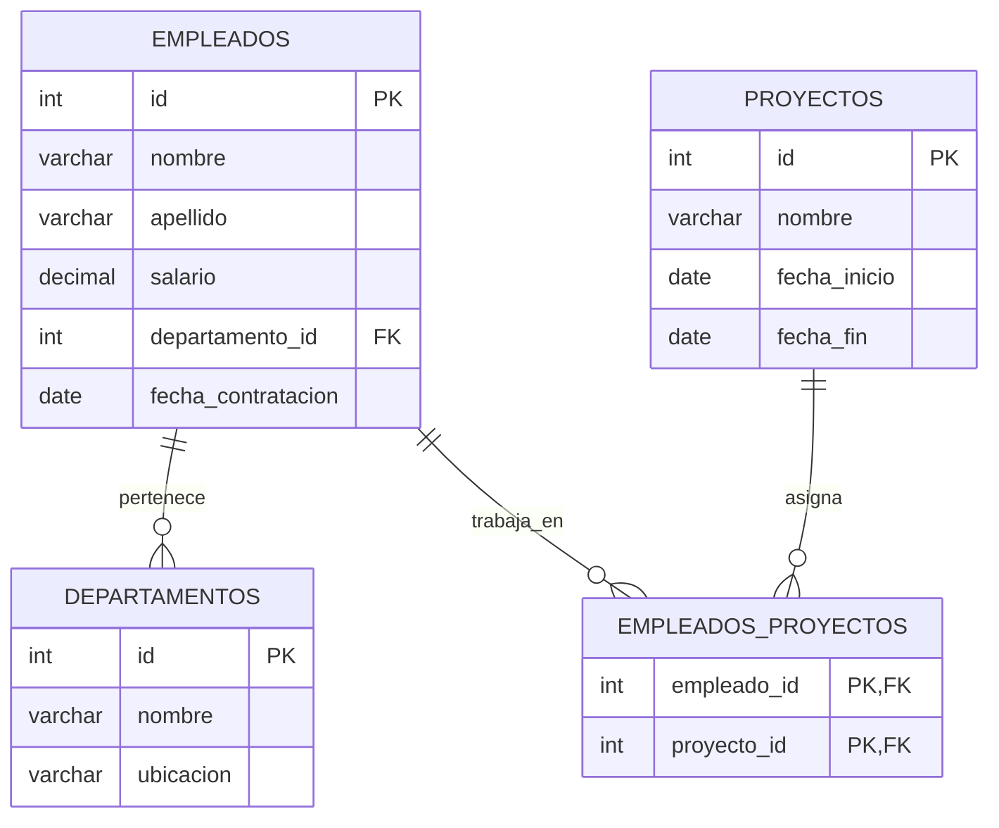

# Ejercicios - Gestión de Departamentos



**Tablas**
```sql
CREATE TABLE empleados (
    id INT PRIMARY KEY AUTO_INCREMENT,
    nombre VARCHAR(100),
    apellido VARCHAR(100),
    salario DECIMAL(10,2),
    departamento_id INT,
    fecha_contratacion DATE
);

CREATE TABLE departamentos (
    id INT PRIMARY KEY AUTO_INCREMENT,
    nombre VARCHAR(100),
    ubicacion VARCHAR(100)
);

CREATE TABLE proyectos (
    id INT PRIMARY KEY AUTO_INCREMENT,
    nombre VARCHAR(100),
    fecha_inicio DATE,
    fecha_fin DATE
);

CREATE TABLE empleados_proyectos (
    empleado_id INT,
    proyecto_id INT,
    PRIMARY KEY (empleado_id, proyecto_id),
    FOREIGN KEY (empleado_id) REFERENCES
```
**Inserts**
```sql
-- Insertar departamentos
INSERT INTO departamentos (id, nombre, ubicacion) VALUES
(1, 'Recursos Humanos', 'Madrid'),
(2, 'Ingeniería', 'Barcelona'),
(3, 'Ventas', 'Valencia'),
(4, 'Marketing', 'Sevilla'),
(5, 'Finanzas', 'Bilbao'),
(6, 'Atención al Cliente', 'Málaga'),
(7, 'Logística', 'Zaragoza'),
(8, 'IT', 'Madrid'),
(9, 'Legal', 'Barcelona'),
(10, 'Investigación', 'San Sebastián');

-- Insertar empleados
INSERT INTO empleados (id, nombre, apellido, salario, departamento_id, fecha_contratacion) VALUES
(1, 'Juan', 'Pérez', 3000.00, 2, '2021-05-10'),
(2, 'Ana', 'García', 3500.50, 1, '2019-08-21'),
(3, 'Luis', 'Martínez', 2800.00, 3, '2020-07-15'),
(4, 'Elena', 'Sánchez', 4000.00, 4, '2022-01-10'),
(5, 'Carlos', 'Fernández', 4200.75, 2, '2018-12-05'),
(6, 'Marta', 'López', 3100.25, 5, '2023-03-12'),
(7, 'Javier', 'Díaz', 2900.00, 6, '2020-10-30'),
(8, 'Lucía', 'Romero', 3300.00, 7, '2021-11-25'),
(9, 'Raúl', 'Torres', 2700.00, 8, '2019-06-18'),
(10, 'Beatriz', 'Moreno', 5000.00, 9, '2017-04-14');

-- Insertar proyectos
INSERT INTO proyectos (id, nombre, fecha_inicio, fecha_fin) VALUES
(1, 'Software ERP', '2023-02-01', NULL),
(2, 'Nueva App Móvil', '2022-09-15', NULL),
(3, 'Expansión Internacional', '2021-06-10', '2023-12-31'),
(4, 'Automatización de Procesos', '2020-03-20', '2022-11-30'),
(5, 'Investigación IA', '2024-01-01', NULL),
(6, 'Campaña Publicitaria', '2023-05-10', '2023-10-10'),
(7, 'Sistema de Facturación', '2022-04-22', NULL),
(8, 'E-commerce', '2021-12-15', '2023-08-20'),
(9, 'Optimización Logística', '2023-07-01', NULL),
(10, 'Ciberseguridad', '2022-10-10', '2024-05-30');

-- Insertar empleados_proyectos (asignación de empleados a proyectos)
INSERT INTO empleados_proyectos (empleado_id, proyecto_id) VALUES
(1, 1),
(2, 2),
(3, 3),
(4, 4),
(5, 5),
(6, 6),
(7, 7),
(8, 8),
(9, 9),
(10, 10),
(1, 2),
(3, 5),
(4, 6),
(5, 7),
(6, 8),
(7, 9),
(8, 10),
(2, 3),
(9, 4),
(10, 1);
```


## 🔹 Consultas sobre una sola tabla en SQL
### 🔥 Consultas Básicas (SELECT, WHERE, ORDER BY, LIMIT)

1️⃣ Obtener todos los empleados ordenados por apellido en orden ascendente.
```sql
SELECT * FROM empleados ORDER BY apellido ASC;
```
2️⃣ Listar los 5 empleados con los salarios más altos.
```sql
SELECT * FROM empleados ORDER BY salario DESC LIMIT 5;
```
3️⃣ Buscar empleados cuyo nombre comience con 'J'.
```sql
SELECT * FROM empleados WHERE nombre LIKE 'J%';
```
4️⃣ Listar empleados contratados después del 1 de enero de 2021.
```sql
SELECT * FROM empleados WHERE fecha_contratacion > '2021-01-01';
```
5️⃣ Buscar empleados que ganen entre 3000 y 5000 euros.
```sql
SELECT * FROM empleados WHERE salario BETWEEN 3000 AND 5000;
```

### 🛠 Consultas con Funciones Agregadas (COUNT, SUM, AVG, MIN, MAX)

6️⃣ Contar cuántos empleados hay en la empresa.
```sql
SELECT COUNT(*) AS total_empleados FROM empleados;
```
7️⃣ Obtener el salario promedio de todos los empleados.
```sql
SELECT AVG(salario) AS salario_promedio FROM empleados;
```
8️⃣ Determinar el salario más alto y el más bajo de la empresa.

```sql
SELECT MAX(salario) AS salario_maximo, MIN(salario) AS salario_minimo FROM empleados;
```

9️⃣ Calcular el total de dinero que la empresa gasta en salarios.
```sql
SELECT SUM(salario) AS total_salarios FROM empleados;
```
🔟 Obtener cuántos empleados fueron contratados en cada año.
```sql
SELECT YEAR(fecha_contratacion) AS año, COUNT(*) AS empleados_contratados
FROM empleados
GROUP BY año
ORDER BY año DESC;
```

### 🏗 Consultas con Funciones de Cadenas y Fechas


1️⃣1️⃣ Obtener la inicial del apellido de cada empleado.
```sql
SELECT id, nombre, apellido, LEFT(apellido, 1) AS inicial_apellido FROM empleados;
```
1️⃣2️⃣ Convertir los nombres de los empleados a mayúsculas.
```sql
SELECT id, UPPER(nombre) AS nombre_mayusculas, UPPER(apellido) AS apellido_mayusculas FROM empleados;
```
1️⃣3️⃣ Obtener la antigüedad de cada empleado en la empresa en años.
```sql
SELECT id, nombre, apellido, TIMESTAMPDIFF(YEAR, fecha_contratacion, CURDATE()) AS antiguedad_años FROM empleados;
```
1️⃣4️⃣ Obtener la fecha de contratación en formato "día/mes/año".
```sql
SELECT id, nombre, apellido, DATE_FORMAT(fecha_contratacion, '%d/%m/%Y') AS fecha_contratacion FROM empleados;
```

### 🏷 Consultas con CASE y Agrupaciones

1️⃣5️⃣ Clasificar empleados según su salario.
```sql
SELECT id, nombre, apellido, salario,
    CASE 
        WHEN salario < 2500 THEN 'Bajo'
        WHEN salario BETWEEN 2500 AND 4500 THEN 'Medio'
        ELSE 'Alto'
    END AS categoria_salarial
FROM empleados;
```
1️⃣6️⃣ Contar cuántos empleados hay en cada rango salarial.
```sql
SELECT 
    CASE 
        WHEN salario < 2000 THEN 'Menos de 2000'
        WHEN salario BETWEEN 2000 AND 4000 THEN '2000 - 4000'
        WHEN salario BETWEEN 4000 AND 6000 THEN '4000 - 6000'
        ELSE 'Más de 6000'
    END AS rango_salarial,
    COUNT(*) AS cantidad_empleados
FROM empleados
GROUP BY rango_salarial;
```

### 🔄 Consultas con DISTINCT y LIMIT

1️⃣7️⃣ Obtener los distintos salarios registrados en la tabla empleados.
```sql
SELECT DISTINCT salario FROM empleados ORDER BY salario ASC;
```
1️⃣8️⃣ Listar los 3 empleados más recientes contratados en la empresa.
```sql
SELECT * FROM empleados ORDER BY fecha_contratacion DESC LIMIT 3;
```

### 🔍 Consultas con EXISTS e IN

1️⃣9️⃣ Obtener los empleados que tengan el mismo salario que otro empleado.
```sql
SELECT * FROM empleados e1 
WHERE EXISTS (
    SELECT 1 FROM empleados e2 WHERE e1.salario = e2.salario AND e1.id <> e2.id
);
```
2️⃣0️⃣ Seleccionar empleados que pertenecen a los departamentos con ID 1, 3 o 5.
```sql
SELECT * FROM empleados WHERE departamento_id IN (1, 3, 5);
````

### ✅ Resumen
Estas consultas cubren una amplia variedad de funciones SQL:  
✅ Filtros (WHERE, LIKE, BETWEEN)  
✅ Ordenamientos (ORDER BY, LIMIT)  
✅ Funciones agregadas (COUNT, SUM, AVG, etc.)  
✅ Funciones de cadena y fecha (UPPER, DATE_FORMAT, TIMESTAMPDIFF)  
✅ Clasificaciones y agrupaciones (CASE, GROUP BY)  
✅ Condiciones avanzadas (EXISTS, IN)  

---

## 🔹 Consultas Multitablas en SQL
### 🔥 Consultas con INNER JOIN (Unión de Tablas con Relación Directa)

1️⃣ Obtener la lista de empleados con el nombre de su departamento.
```sql
SELECT e.id, e.nombre, e.apellido, d.nombre AS departamento
FROM empleados e
INNER JOIN departamentos d ON e.departamento_id = d.id;
```
2️⃣ Listar los empleados con los proyectos en los que trabajan.
```sql
SELECT e.nombre, e.apellido, p.nombre AS proyecto
FROM empleados e
INNER JOIN empleados_proyectos ep ON e.id = ep.empleado_id
INNER JOIN proyectos p ON ep.proyecto_id = p.id;
```
3️⃣ Mostrar los empleados junto con el nombre de su departamento y su salario ordenado de mayor a menor.
```sql
SELECT e.nombre, e.apellido, d.nombre AS departamento, e.salario
FROM empleados e
INNER JOIN departamentos d ON e.departamento_id = d.id
ORDER BY e.salario DESC;
```
4️⃣ Obtener los proyectos junto con los nombres de los empleados asignados a cada uno.
```sql
SELECT p.nombre AS proyecto, e.nombre, e.apellido
FROM proyectos p
INNER JOIN empleados_proyectos ep ON p.id = ep.proyecto_id
INNER JOIN empleados e ON ep.empleado_id = e.id;
```
5️⃣ Obtener el número de empleados por departamento.
```sql
SELECT d.nombre AS departamento, COUNT(e.id) AS total_empleados
FROM departamentos d
LEFT JOIN empleados e ON d.id = e.departamento_id
GROUP BY d.nombre;
``` 

### 🏗 Consultas con LEFT JOIN y RIGHT JOIN (Uniones Parciales)

6️⃣ Listar todos los departamentos, incluso aquellos sin empleados asignados.
```sql
SELECT d.nombre AS departamento, COUNT(e.id) AS total_empleados
FROM departamentos d
LEFT JOIN empleados e ON d.id = e.departamento_id
GROUP BY d.nombre;
```
7️⃣ Mostrar todos los empleados, incluyendo los que no están asignados a ningún proyecto.
```sql
SELECT e.nombre, e.apellido, p.nombre AS proyecto
FROM empleados e
LEFT JOIN empleados_proyectos ep ON e.id = ep.empleado_id
LEFT JOIN proyectos p ON ep.proyecto_id = p.id;
```
8️⃣ Obtener la lista de proyectos con empleados asignados y aquellos sin empleados.
```sql
SELECT p.nombre AS proyecto, COUNT(ep.empleado_id) AS total_empleados
FROM proyectos p
LEFT JOIN empleados_proyectos ep ON p.id = ep.proyecto_id
GROUP BY p.nombre;
```
9️⃣ Obtener los empleados que no están en ningún proyecto.
```sql
SELECT e.*
FROM empleados e
LEFT JOIN empleados_proyectos ep ON e.id = ep.empleado_id
WHERE ep.empleado_id IS NULL;
```
🔟 Listar todos los proyectos, incluso aquellos sin empleados asignados.
```sql
SELECT p.nombre AS proyecto, COUNT(ep.empleado_id) AS cantidad_empleados
FROM proyectos p
LEFT JOIN empleados_proyectos ep ON p.id = ep.proyecto_id
GROUP BY p.nombre;
```

### 🔄 Consultas con Funciones Agregadas y Agrupaciones (GROUP BY)

1️⃣1️⃣ Calcular el salario total pagado en cada departamento.
```sql
SELECT d.nombre AS departamento, SUM(e.salario) AS total_salarios
FROM departamentos d
LEFT JOIN empleados e ON d.id = e.departamento_id
GROUP BY d.nombre;
```
1️⃣2️⃣ Obtener el salario promedio de los empleados por cada departamento.
```sql
SELECT d.nombre AS departamento, AVG(e.salario) AS salario_promedio
FROM departamentos d
LEFT JOIN empleados e ON d.id = e.departamento_id
GROUP BY d.nombre;
```
1️⃣3️⃣ Obtener el proyecto con más empleados asignados.
```sql
SELECT p.nombre AS proyecto, COUNT(ep.empleado_id) AS total_empleados
FROM proyectos p
LEFT JOIN empleados_proyectos ep ON p.id = ep.proyecto_id
GROUP BY p.nombre
ORDER BY total_empleados DESC
LIMIT 1;
```
1️⃣4️⃣ Obtener cuántos proyectos están activos y cuántos finalizados.
```sql
SELECT 
    CASE 
        WHEN fecha_fin IS NULL THEN 'Activo'
        ELSE 'Finalizado'
    END AS estado_proyecto,
    COUNT(*) AS cantidad
FROM proyectos
GROUP BY estado_proyecto;
```

### 🔍 Consultas con HAVING y ORDER BY

1️⃣5️⃣ Obtener los departamentos con más de 3 empleados.
```sql
SELECT d.nombre AS departamento, COUNT(e.id) AS total_empleados
FROM departamentos d
LEFT JOIN empleados e ON d.id = e.departamento_id
GROUP BY d.nombre
HAVING total_empleados > 3;
```
1️⃣6️⃣ Listar los empleados con más de un proyecto asignado.
```sql
SELECT e.nombre, e.apellido, COUNT(ep.proyecto_id) AS cantidad_proyectos
FROM empleados e
INNER JOIN empleados_proyectos ep ON e.id = ep.empleado_id
GROUP BY e.id, e.nombre, e.apellido
HAVING cantidad_proyectos > 1;
```

### 🔗 Consultas con Subconsultas

1️⃣7️⃣ Obtener los empleados con el salario más alto de cada departamento.
```sql
SELECT e.nombre, e.apellido, e.salario, d.nombre AS departamento
FROM empleados e
INNER JOIN departamentos d ON e.departamento_id = d.id
WHERE e.salario = (SELECT MAX(salario) FROM empleados WHERE departamento_id = e.departamento_id);
```
1️⃣8️⃣ Listar los empleados cuyo salario es mayor que el salario promedio de todos los empleados.
```sql
SELECT e.nombre, e.apellido, e.salario
FROM empleados e
WHERE e.salario > (SELECT AVG(salario) FROM empleados);
```
1️⃣9️⃣ Obtener el departamento con el mayor número de empleados.
```sql
SELECT d.nombre AS departamento, COUNT(e.id) AS total_empleados
FROM departamentos d
LEFT JOIN empleados e ON d.id = e.departamento_id
GROUP BY d.nombre
ORDER BY total_empleados DESC
LIMIT 1;
```
2️⃣0️⃣ Obtener los empleados que trabajan en el mismo departamento que 'Juan Pérez'.
```sql
SELECT e.nombre, e.apellido, d.nombre AS departamento
FROM empleados e
INNER JOIN departamentos d ON e.departamento_id = d.id
WHERE e.departamento_id = (SELECT departamento_id FROM empleados WHERE nombre = 'Juan' AND apellido = 'Pérez');
```

### ✅ Resumen
Estas consultas utilizan:  
✅ JOIN, LEFT JOIN, RIGHT JOIN para combinar datos de múltiples tablas  
✅ Funciones agregadas (SUM, AVG, COUNT, MIN, MAX)  
✅ Agrupaciones y filtros avanzados (GROUP BY, HAVING, ORDER BY)  
✅ Subconsultas anidadas para análisis avanzados  


## 🔹 Consultas de Resumen (Funciones Agregadas en SQL)
1️⃣ Contar el número total de empleados en la empresa.
```sql
SELECT COUNT(*) AS total_empleados FROM empleados;
```
2️⃣ Calcular el salario promedio de todos los empleados.
```sql
SELECT AVG(salario) AS salario_promedio FROM empleados;
```
3️⃣ Obtener el salario mínimo y máximo de la empresa.
```sql
SELECT MIN(salario) AS salario_minimo, MAX(salario) AS salario_maximo FROM empleados;
```
4️⃣ Determinar el total de salarios pagados en la empresa.
```sql
SELECT SUM(salario) AS total_salarios FROM empleados;
```
5️⃣ Obtener la cantidad de empleados en cada departamento.
```sql
SELECT d.nombre AS departamento, COUNT(e.id) AS total_empleados
FROM departamentos d
LEFT JOIN empleados e ON d.id = e.departamento_id
GROUP BY d.nombre;
```
6️⃣ Calcular el salario promedio por departamento.
```sql
SELECT d.nombre AS departamento, AVG(e.salario) AS salario_promedio
FROM departamentos d
LEFT JOIN empleados e ON d.id = e.departamento_id
GROUP BY d.nombre;
```
7️⃣ Encontrar el departamento con el salario más alto promedio.
```sql
SELECT d.nombre AS departamento, AVG(e.salario) AS salario_promedio
FROM departamentos d
LEFT JOIN empleados e ON d.id = e.departamento_id
GROUP BY d.nombre
ORDER BY salario_promedio DESC
LIMIT 1;
```
8️⃣ Calcular cuántos empleados fueron contratados cada año.
```sql
SELECT YEAR(fecha_contratacion) AS año, COUNT(*) AS total_contratados
FROM empleados
GROUP BY YEAR(fecha_contratacion)
ORDER BY año DESC;
```
9️⃣ Determinar el total de proyectos en la empresa.
```sql
SELECT COUNT(*) AS total_proyectos FROM proyectos;
```
🔟 Contar cuántos proyectos están activos (sin fecha de finalización).
```sql
SELECT COUNT(*) AS proyectos_activos FROM proyectos WHERE fecha_fin IS NULL;
```
1️⃣1️⃣ Calcular cuántos empleados están asignados a al menos un proyecto.
```sql
SELECT COUNT(DISTINCT empleado_id) AS empleados_con_proyectos FROM empleados_proyectos;
```
1️⃣2️⃣ Determinar qué proyecto tiene más empleados asignados.
```sql
SELECT p.nombre AS proyecto, COUNT(ep.empleado_id) AS total_empleados
FROM proyectos p
LEFT JOIN empleados_proyectos ep ON p.id = ep.proyecto_id
GROUP BY p.nombre
ORDER BY total_empleados DESC
LIMIT 1;
```
1️⃣3️⃣ Obtener la cantidad de proyectos en los que participa cada empleado.
```sql
SELECT e.nombre, e.apellido, COUNT(ep.proyecto_id) AS total_proyectos
FROM empleados e
LEFT JOIN empleados_proyectos ep ON e.id = ep.empleado_id
GROUP BY e.id, e.nombre, e.apellido
ORDER BY total_proyectos DESC;
```
1️⃣4️⃣ Determinar el salario total pagado en cada departamento.
```sql
SELECT d.nombre AS departamento, SUM(e.salario) AS total_salarios
FROM departamentos d
LEFT JOIN empleados e ON d.id = e.departamento_id
GROUP BY d.nombre;
```
1️⃣5️⃣ Calcular el número de empleados en cada rango de salario.
```sql
SELECT 
    CASE 
        WHEN salario < 2000 THEN 'Menos de 2000'
        WHEN salario BETWEEN 2000 AND 4000 THEN '2000 - 4000'
        WHEN salario BETWEEN 4000 AND 6000 THEN '4000 - 6000'
        ELSE 'Más de 6000'
    END AS rango_salarial,
    COUNT(*) AS cantidad_empleados
FROM empleados
GROUP BY rango_salarial;
```
1️⃣6️⃣ Obtener el promedio de duración de los proyectos (en días).
```sql
SELECT AVG(DATEDIFF(fecha_fin, fecha_inicio)) AS duracion_promedio_dias
FROM proyectos
WHERE fecha_fin IS NOT NULL;
```
1️⃣7️⃣ Determinar qué departamento tiene más empleados.
```sql
SELECT d.nombre AS departamento, COUNT(e.id) AS total_empleados
FROM departamentos d
LEFT JOIN empleados e ON d.id = e.departamento_id
GROUP BY d.nombre
ORDER BY total_empleados DESC
LIMIT 1;
```
1️⃣8️⃣ Calcular el salario promedio de los empleados que participan en proyectos.
```sql
SELECT AVG(e.salario) AS salario_promedio_proyectos
FROM empleados e
WHERE e.id IN (SELECT DISTINCT empleado_id FROM empleados_proyectos);
```
1️⃣9️⃣ Contar cuántos empleados no están asignados a ningún proyecto.
```sql
SELECT COUNT(*) AS empleados_sin_proyecto
FROM empleados
WHERE id NOT IN (SELECT DISTINCT empleado_id FROM empleados_proyectos);
```
2️⃣0️⃣ Calcular el porcentaje de empleados que participan en al menos un proyecto.
```sql
SELECT 
    (COUNT(DISTINCT empleado_id) * 100.0 / (SELECT COUNT(*) FROM empleados)) AS porcentaje_empleados_con_proyectos
FROM empleados_proyectos;
```


## 🔹 Consultas con Subconsultas en SQL
### 🔥 Subconsultas en WHERE (Filtrado por Resultados de Otra Consulta)

1️⃣ Obtener empleados cuyo salario sea superior al salario promedio de la empresa.
```sql
SELECT nombre, apellido, salario
FROM empleados
WHERE salario > (SELECT AVG(salario) FROM empleados);
```
2️⃣ Listar empleados que ganan más que cualquier empleado del departamento de 'Ventas'.
```sql
SELECT nombre, apellido, salario
FROM empleados
WHERE salario > (SELECT MAX(salario) FROM empleados WHERE departamento_id = (SELECT id FROM departamentos WHERE nombre = 'Ventas'));
```
3️⃣ Obtener los empleados que trabajan en el mismo departamento que ‘Juan Pérez’.
```sql
SELECT nombre, apellido, departamento_id
FROM empleados
WHERE departamento_id = (SELECT departamento_id FROM empleados WHERE nombre = 'Juan' AND apellido = 'Pérez');
```
4️⃣ Seleccionar empleados que no están asignados a ningún proyecto.
```sql
SELECT nombre, apellido
FROM empleados
WHERE id NOT IN (SELECT empleado_id FROM empleados_proyectos);
```
5️⃣ Obtener los proyectos en los que trabaja un empleado específico (‘Ana López’).
```sql
SELECT nombre
FROM proyectos
WHERE id IN (SELECT proyecto_id FROM empleados_proyectos WHERE empleado_id = (SELECT id FROM empleados WHERE nombre = 'Ana' AND apellido = 'López'));
```

### 🏗 Subconsultas en SELECT (Valores Calculados por Subconsultas)

6️⃣ Mostrar los empleados con su salario y el salario promedio de su departamento.
```sql
SELECT e.nombre, e.apellido, e.salario,
       (SELECT AVG(salario) FROM empleados WHERE departamento_id = e.departamento_id) AS salario_promedio_departamento
FROM empleados e;
```
7️⃣ Obtener empleados junto con el nombre de su departamento.
```sql
SELECT e.nombre, e.apellido,
       (SELECT nombre FROM departamentos WHERE id = e.departamento_id) AS departamento
FROM empleados e;
```
8️⃣ Listar los proyectos junto con la cantidad de empleados asignados a cada uno.
```sql
SELECT nombre,
       (SELECT COUNT(*) FROM empleados_proyectos WHERE proyecto_id = proyectos.id) AS total_empleados
FROM proyectos;
```
9️⃣ Mostrar el nombre del departamento con más empleados.
```sql
SELECT nombre
FROM departamentos
WHERE id = (SELECT departamento_id FROM empleados GROUP BY departamento_id ORDER BY COUNT(*) DESC LIMIT 1);
```
🔟 Obtener el nombre del proyecto con más empleados asignados.
```sql
SELECT nombre
FROM proyectos
WHERE id = (SELECT proyecto_id FROM empleados_proyectos GROUP BY proyecto_id ORDER BY COUNT(*) DESC LIMIT 1);
```

### 🔄 Subconsultas en FROM (Creación de Tablas Temporales)

1️⃣1️⃣ Obtener la cantidad de empleados por departamento y mostrar solo los que tienen más de 5 empleados.
```sql
SELECT departamento, total_empleados
FROM (SELECT d.nombre AS departamento, COUNT(e.id) AS total_empleados FROM departamentos d
      LEFT JOIN empleados e ON d.id = e.departamento_id
      GROUP BY d.nombre) AS empleados_por_depto
WHERE total_empleados > 5;
```
1️⃣2️⃣ Obtener los empleados cuyo salario es mayor que el promedio de su propio departamento.
```sql
SELECT nombre, apellido, salario, departamento_id
FROM empleados e
WHERE salario > (SELECT AVG(salario) FROM empleados WHERE departamento_id = e.departamento_id);
```
1️⃣3️⃣ Listar los empleados junto con la cantidad de proyectos en los que participan.
```sql
SELECT e.nombre, e.apellido,
       (SELECT COUNT(*) FROM empleados_proyectos WHERE empleado_id = e.id) AS cantidad_proyectos
FROM empleados e;
```
1️⃣4️⃣ Obtener el total de salario pagado en cada departamento.
```sql
SELECT departamento, total_salario
FROM (SELECT d.nombre AS departamento, SUM(e.salario) AS total_salario FROM departamentos d
      LEFT JOIN empleados e ON d.id = e.departamento_id
      GROUP BY d.nombre) AS salarios_por_depto;
```

### 🔍 Subconsultas con HAVING y EXISTS

1️⃣5️⃣ Obtener los departamentos con más de 3 empleados.
```sql
SELECT nombre
FROM departamentos
WHERE id IN (SELECT departamento_id FROM empleados GROUP BY departamento_id HAVING COUNT(*) > 3);
```
1️⃣6️⃣ Listar los empleados que trabajan en más de un proyecto.
```sql
SELECT nombre, apellido
FROM empleados
WHERE id IN (SELECT empleado_id FROM empleados_proyectos GROUP BY empleado_id HAVING COUNT(*) > 1);
```
1️⃣7️⃣ Obtener los proyectos que tienen al menos un empleado asignado.
```sql
SELECT nombre
FROM proyectos
WHERE EXISTS (SELECT 1 FROM empleados_proyectos WHERE proyecto_id = proyectos.id);
```
1️⃣8️⃣ Obtener los empleados cuyo salario es mayor que el de al menos un empleado del departamento de ‘Marketing’.
```sql
SELECT nombre, apellido, salario
FROM empleados e
WHERE salario > ANY (SELECT salario FROM empleados WHERE departamento_id = (SELECT id FROM departamentos WHERE nombre = 'Marketing'));
```
1️⃣9️⃣ Seleccionar los empleados cuyo salario es mayor que todos los empleados del departamento ‘RRHH’.
```sql
SELECT nombre, apellido, salario
FROM empleados
WHERE salario > ALL (SELECT salario FROM empleados WHERE departamento_id = (SELECT id FROM departamentos WHERE nombre = 'RRHH'));
```
2️⃣0️⃣ Obtener los empleados que están en el mismo proyecto que 'Carlos Gómez'.
```sql
SELECT nombre, apellido
FROM empleados
WHERE id IN (SELECT empleado_id FROM empleados_proyectos WHERE proyecto_id IN 
             (SELECT proyecto_id FROM empleados_proyectos WHERE empleado_id = (SELECT id FROM empleados WHERE nombre = 'Carlos' AND apellido = 'Gómez')));
```

### ✅ Resumen
Estas consultas incluyen:  
✅ Subconsultas en WHERE, SELECT, FROM y HAVING  
✅ Uso de funciones agregadas (AVG, SUM, COUNT, MAX, MIN)  
✅ Condiciones avanzadas (EXISTS, IN, ANY, ALL)  
✅ Comparaciones con valores de otras subconsultas  