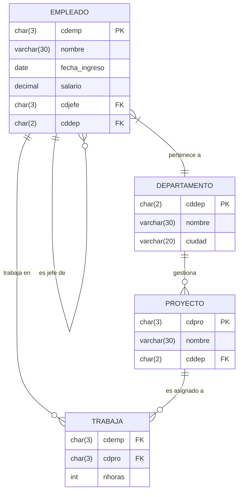
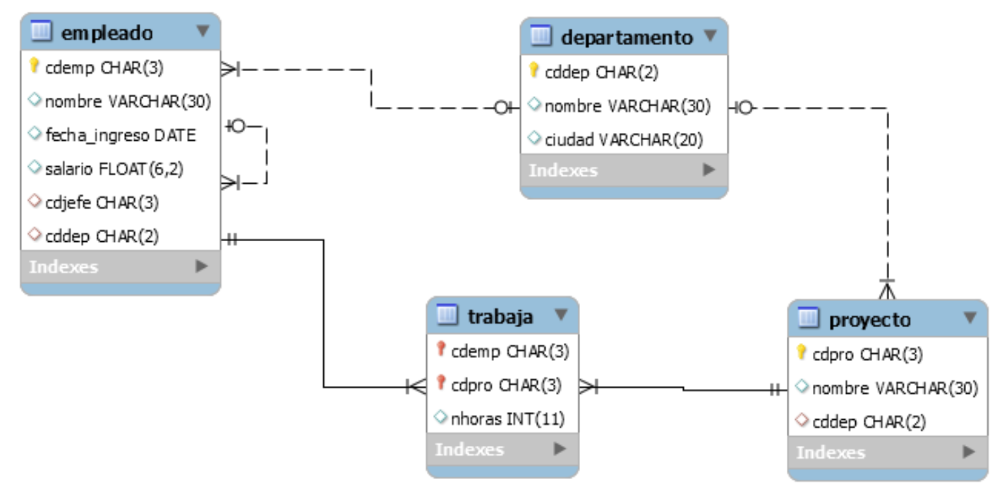

# Ejercicios Empresa:

Dada la base de datos que se muestra en la figura:





**Implementar las siguientes consultas:**
1. Creación de tablas, con las siguientes restricciones:
    - En la tabla `empleado`:
        + fecha ingreso y cdjefe tendrán por defecto NULL.
        + Salario tendrá 2 dígitos decimales y cuatro enteros, sin signo.
    - En la tabla `trabaja`:
      - nhoras solo acepta valores entre 0 y 20.
2. Inserta los siguientes valores a cada tabla:
    - En la tabla `departamento`:
  
            ('01','Contabilidad-1','Almería'),
            ('02','Ventas','Sevilla'),
            ('03','I+D','Málaga'),
            ('04','Gerencia','Córdoba'),
            ('05','Administración','Córdoba'),
            ('06','Contabilidad-2','Córdoba'),
            ('07','Marketing','Granada')

    - En la tabla `empleado`:
  
          ('A11','Esperanza Amarillo','1993-09-23',3000,NULL,'04'),
          ('A03','Pedro Rojo','1995-03-07',2000,'A11','01'),
          ('C01','Juan Rojo','1997-02-03',1800,'A03','01'),
          ('B02','María Azul','1996-01-09',1450,'A03','01'),
          ('A07','Elena Blanco','1994-04-09',2000,'A11','02'),
          ('B06','Carmen Violeta','1997-02-03',2200,'A07','02'),
          ('C05','Alfonso Amarillo','1998-12-03',2000,'B06','02'),
          ('B09','Pablo Verde','1998-10-12',1600,'A11','03'),
          ('C04','Ana Verde',NULL,2000,'A07','02'),
          ('C08','Javier Naranja',NULL,1680,'B09','03'),
          ('A10','Dolores Blanco','1998-11-15',1900,'A11','04'),
          ('B12','Juan Negro','1997-02-03',1900,'A11','05'),
          ('A13','Jesús Marrón','1999-02-21',2200,'A11','05'),
          ('A14','Manuel Amarillo','2000-09-01',2000,'A11',NULL)

    - En la tabla `proyecto`:

          ('GRE','Gestión de residuos','03'),
          ('DAG','Depuración de aguas','03'),
          ('AEE','Análisis económico energías','04'),
          ('MES','Marketing de energía solar','02')

    - En la tabla `trabaja`:
  
          ('C01','GRE',10),
          ('C08','GRE',54),
          ('C01','DAG',5),
          ('C08','DAG',150),
          ('B09','DAG',100),
          ('A14','DAG',10),
          ('A11','AEE',15),
          ('C04','AEE',20),
          ('A11','MES',0),
          ('A03','MES', 0)

3. Consulta 1: De la tabla `EMPLEADO`, el código, nombre y salario de los empleados ordenados por nombre ascendentemente y por salario de manera descendente.
4. Consulta 2: Todos los nombres de departamentos menos los de `Sevilla` o `Granada`.
5. Consulta 3: Número de empleados con departamento asignado.
6. Consulta 4: Media de horas trabajadas en proyectos de la tabla trabaja.
7. Consulta 5: Total de empleados de cada departamento que ganan un salario superior a 1500€, pero que sólo se mostraran los departamentos con más de 2 empleados con salario superior a 1500€.
8. Consulta 6: Nombre de cada empleado de la base de datos junto al nombre de su jefe.
9. Consulta 7: Nombre del departamento con más empleados.
10. Consulta 8: Empleado que más horas ha trabajado en cada proyecto.
11. Consulta 9: Nombre de los departamentos que NO tienen empleados que ingresaron antes de 2005.
12. Consulta 10: Datos de los empleados cuyo nombre comienza por "A"


----


1. Creación de la base de datos y las tablas:
```sql   
CREATE TABLE empleado (
    cdemp CHAR(3) PRIMARY KEY,                       -- Código del empleado (clave primaria)
    nombre VARCHAR(30) NOT NULL,                     -- Nombre del empleado (no nulo)
    fecha_ingreso DATE DEFAULT NULL,                 -- Fecha de ingreso (por defecto NULL)
    salario DECIMAL(6,2) UNSIGNED,                   -- Salario con precisión adecuada
    cdjefe CHAR(3) DEFAULT NULL,                     -- Código del jefe (por defecto NULL)
    cddep CHAR(2),                                   -- Código del departamento
    FOREIGN KEY (cdjefe) REFERENCES empleado(cdemp) ON DELETE SET NULL,
    FOREIGN KEY (cddep) REFERENCES departamento(cddep) ON DELETE SET NULL
);
```
```sql
CREATE TABLE trabaja (
    cdemp CHAR(3),                                           -- Código del empleado
    cdpro CHAR(3),                                           -- Código del proyecto
    nhoras INT(11) CHECK (nhoras >= 0 AND nhoras <= 20),     -- Horas trabajadas (entre 0 y 20)
    PRIMARY KEY (cdemp, cdpro),                              -- Clave primaria compuesta
    FOREIGN KEY (cdemp) REFERENCES empleado(cdemp)           -- Clave foránea que referencia a la tabla empleado
);
```
```sql
CREATE TABLE departamento (
    cddep CHAR(2) PRIMARY KEY,                              -- Código del departamento (clave primaria)
    nombre VARCHAR(30) NOT NULL,                            -- Nombre del departamento (no nulo)
    ciudad VARCHAR(20)                                      -- Ciudad donde se ubica el departamento
);
```

```sql
CREATE TABLE proyecto (
    cdpro char(3) NOT NULL,
    nombre varchar(30) NOT NULL,
    cddep char(2) DEFAULT NULL
);
```

---

2. Inserts de datos

```sql
INSERT INTO `departamento` (`cddep`, `nombre`, `ciudad`) VALUES
    ('01', 'Contabilidad-1', 'Almería'),
    ('02', 'Ventas', 'Sevilla'),
    ('03', 'I+D', 'Málaga'),
    ('04', 'Gerencia', 'Córdoba'),
    ('05', 'Administración', 'Córdoba'),
    ('06', 'Contabilidad-2', 'Córdoba'),
    ('07', 'Marketing', 'Granada');
```

```sql
INSERT INTO `empleado` (`cdemp`, `nombre`, `fecha_ingreso`, `salario`, `cdjefe`, `cddep`) VALUES
    ('A03', 'Pedro Rojo', '1995-03-07', 2000.00, 'A11', '01'),
    ('A07', 'Elena Blanco', '1994-04-09', 2000.00, 'A11', '02'),
    ('A10', 'Dolores Blanco', '1998-11-15', 1900.00, 'A11', '04'),
    ('A11', 'Esperanza Amarillo', '1993-09-23', 3000.00, NULL, '04'),
    ('A13', 'Jesús Marrón', '1999-02-21', 2200.00, 'A11', '05'),
    ('A14', 'Manuel Amarillo', '2000-09-01', 2000.00, 'A11', NULL),
    ('B02', 'María Azul', '1996-01-09', 1450.00, 'A03', '01'),
    ('B06', 'Carmen Violeta', '1997-02-03', 2200.00, 'A07', '02'),
    ('B09', 'Pablo Verde', '1998-10-12', 1600.00, 'A11', '03'),
    ('B12', 'Juan Negro', '1997-02-03', 1900.00, 'A11', '05'),
    ('C01', 'Juan Rojo', '1997-02-03', 1800.00, 'A03', '01'),
    ('C04', 'Ana Verde', NULL, 2000.00, 'A07', '02'),
    ('C05', 'Alfonso Amarillo', '1998-12-03', 2000.00, 'B06', '02'),
    ('C08', 'Javier Naranja', NULL, 1680.00, 'B09', '03');
```
```sql
INSERT INTO `proyecto` (`cdpro`, `nombre`, `cddep`) VALUES
    ('AEE', 'Análisis económico energías', '04'),
    ('DAG', 'Depuración de aguas', '03'),
    ('GRE', 'Gestión de residuos', '03'),
    ('MES', 'Marketing de energía solar', '02');
```

```sql
INSERT INTO `trabaja` (`cdemp`, `cdpro`, `nhoras`) VALUES
    ('A03', 'MES', 0),
    ('A11', 'AEE', 15),
    ('A11', 'MES', 0),
    ('A14', 'DAG', 10),
    ('B09', 'DAG', 100),
    ('C01', 'DAG', 5),
    ('C01', 'GRE', 10),
    ('C04', 'AEE', 20),
    ('C08', 'DAG', 150),
    ('C08', 'GRE', 54);
```
De acuerdo con las restricciones del campo `nhoras` donde solo aceptaba valores entre 0 y 20, estas inserciones devolverán error, por lo que será necesario modificar la tabla `trabaja`:

```sql
ALTER table trabaja modify nhoras int(11) check (nhoras >=0);
```

--------------------------------

3. Consultas 

+ Consulta 1: De la tabla `EMPLEADO`, el código, nombre y salario de los empleados ordenados por nombre ascendentemente y por salario de manera descendente.

    ```sql
    SELECT nombre FROM departamento WHERE ciudad NOT IN ('Sevilla', 'Granada');
    ```
+ Consulta 2: Todos los nombres de departamentos menos los de `Sevilla` o `Granada`.
    ```sql
    SELECT cdemp, nombre, salario FROM empleado ORDER BY nombre ASC, salario DESC;
    ```

+ Consulta 3: Número de empleados con departamento asignado.

    ```sql
    SELECT COUNT(*) AS num_empl_dep FROM empleado WHERE cddep IS NOT NULL;
    ```

+ Consulta 4: Media de horas trabajadas en proyectos de la tabla `trabaja`:
    ```sql
    SELECT AVG(nhoras) AS media_horas_trabajadas FROM trabaja;
    SELECT AVG(nhoras) AS media_horas_trabajadas FROM trabaja WHERE nhoras > 0; --Excluimos los que trabajan 0 horas
    ```

+ Consulta 5: Total de empleados de cada departamento que ganan un salario superior a 1500€, pero que sólo se mostraran los epartamentos con más de 2 empleados con salario superior a 1500€.
    ```sql
    SELECT cddep, COUNT(*) AS total_empleados FROM empleado WHERE salario > 1500
    GROUP BY cddepHAVING COUNT(*) > 2;
    ``` 
+ Consulta 6: Nombre de cada empleado de la base de datos junto al nombre de su jefe.
    ```sql
    SELECT e.nombre AS nombre_empleado, j.nombre AS nombre_jefe FROM empleado e INNER JOIN empleado j ON e.cdjefe = j.cdemp; -- Si queremos ver los q no tienen jefe usamos LEFT JOIN
    ```

+ Consulta 7: Nombre del departamento con más empleados.
    ```sql
    SELECT d.nombre FROM departamento d JOIN empleado e ON d.cddep = e.cddep
    GROUP BY d.nombre HAVING COUNT(*) = (SELECT COUNT(*)FROM empleado GROUP BY cddep ORDER BY COUNT(*) DESC LIMIT 1);
    ```

+ Consulta 8: Empleado que más horas ha trabajado en cada proyecto.

    ```sql
    SELECT 
        t.cdpro,
        t.cdemp,
        e.nombre AS nombre_empleado,
        t.nhoras
    FROM trabaja t
    JOIN empleado e ON t.cdemp = e.cdemp
    JOIN (
        SELECT 
            cdpro, 
            MAX(nhoras) AS max_horas
        FROM trabaja
        WHERE nhoras > 0  -- Excluir casos con 0 horas
        GROUP BY cdpro
        ) max_horas_por_proyecto ON t.cdpro = max_horas_por_proyecto.cdpro 
                                AND t.nhoras = max_horas_por_proyecto.max_horas;
    ```

+ Consulta 9: Nombre de los departamentos que NO tienen empleados que ingresaron antes de 2005.
  - **Opcion 1**: Usando una subconsulta con la cláusula `NOT EXISTS`
    ```sql
    SELECT d.nombre
    FROM departamento d
    WHERE NOT EXISTS (
        SELECT 1
        FROM empleado e
        WHERE e.cddep = d.cddep
        AND e.fecha_ingreso < '2005-01-01'
    );
    ```

  - **Opcion 2**: Otra forma de resolverlo es usando un `LEFT JOIN` y filtrando los departamentos que no tienen coincidencias en la subconsulta:

    ```sql
    SELECT d.nombre
    FROM departamento d
    LEFT JOIN (
        SELECT DISTINCT cddep
        FROM empleado
        WHERE fecha_ingreso < '2005-01-01'
    ) empleados_antes_2005 ON d.cddep = empleados_antes_2005.cddep
    WHERE empleados_antes_2005.cddep IS NULL;
    ```

+ Consulta 10: Datos de los empleados cuyo nombre comienza por "A"
    ```sql
    SELECT * FROM empleado WHERE LOWER(nombre) LIKE 'a%';
    ```
