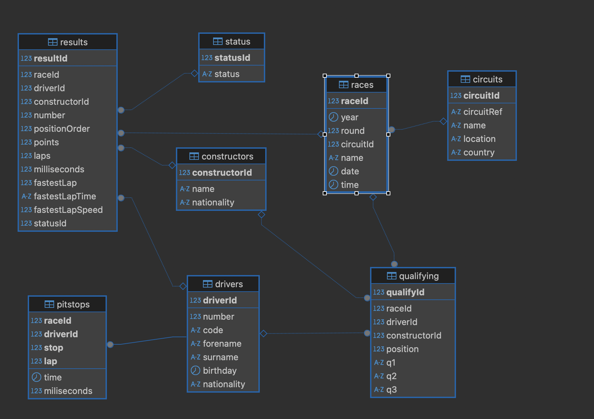

# Base de datos Formula1

La Federación Internacional de Automovilismo (FIA), como parte de su esfuerzo continuo para optimizar y mejorar la calidad de las carreras de Fórmula 1, ha tomado la decisión de recopilar y centralizar en una base de datos toda la información relevante relacionada con estos eventos de competición.

Para ello, se ha diseñado una base de datos robusta y estructurada que consta de diversas tablas, las cuales tienen la función de almacenar de manera organizada toda la información referente a las carreras que se llevan a cabo durante los fines de semana en diferentes países del mundo.

Estas tablas están diseñadas para capturar datos esenciales sobre cada carrera, como los equipos participantes, los pilotos, los resultados, las clasificaciones, y otros aspectos logísticos y técnicos del evento. La Figura 1 ilustra el modelo relacional de esta base de datos, proporcionando una visión clara de cómo se interconectan las diferentes tablas para ofrecer una representación integral de toda la información gestionada por la FIA en el contexto de la Fórmula 1.



# Base de Datos de Fórmula 1 (FIA)

## Descripción de las Tablas

### Tablas Principales

| Tabla          | Descripción |
|----------------|------------|
| **`drivers`**  | Almacena información de pilotos: `forename` (nombre), `surname` (apellidos), `nationality` (nacionalidad). |
| **`results`**  | Registra resultados por carrera: `positionOrder` (posición final), `points` (puntos obtenidos). |
| **`races`**    | Contiene datos de cada Gran Premio: `name` (nombre), `date` (fecha), circuito asociado. |
| **`circuits`** | Detalles de circuitos: `name` (nombre), `location` (ubicación). |
| **`constructors`** | Equipos participantes (cada equipo con 2 pilotos por carrera). |
| **`qualifying`** | Resultados de calificación: `q1`, `q2`, `q3` (tandas eliminatorias). |
| **`pitstops`** | Paradas en boxes: `lap` (vuelta), `milliseconds` (duración). |
| **`status`**   | Estado final del piloto: abandono, problemas técnicos, etc. |

Adicionalmente, se hace constar que este modelo tiene las siguientes restricciones:

**Identificadores**: Todos son numéricos `INT`   
**Campos de texto**: Máximo 250 caracteres `VARCHAR(250)`.
**Campos numéricos**:
+ `INT` (vueltas, IDs).
+ `FLOAT/DOUBLE` (puntos, velocidades).

**Formatos temporales**:
+ `TIME` (ej: tiempo de vuelta).
+ `DATE` (fechas de carrera/nacimiento).
+ `YEAR` (años históricos).

## Estructuras de las tablas
```sql

CREATE TABLE status (
  statusId INT NOT NULL,
  status VARCHAR(250) DEFAULT NULL,
  PRIMARY KEY (statusId)
);

CREATE TABLE circuits (
  circuitId INT NOT NULL,
  circuitRef VARCHAR(250) DEFAULT NULL,
  name VARCHAR(250) DEFAULT NULL,
  location VARCHAR(250) DEFAULT NULL,
  country VARCHAR(250) DEFAULT NULL,
  PRIMARY KEY (circuitId)
);

CREATE TABLE constructors (
  constructorId INT NOT NULL,
  name VARCHAR(250) DEFAULT NULL,
  nationality VARCHAR(250) DEFAULT NULL,
  PRIMARY KEY (constructorId)
);

CREATE TABLE drivers (
  driverId INT NOT NULL,
  number INT DEFAULT NULL,
  code VARCHAR(250) DEFAULT NULL,
  forename VARCHAR(250) DEFAULT NULL,
  surname VARCHAR(250) DEFAULT NULL,
  birthday DATE DEFAULT NULL,
  nationality VARCHAR(250) DEFAULT NULL,
  PRIMARY KEY (driverId)
);

CREATE TABLE races (
  raceId INT NOT NULL,
  year year(4) DEFAULT NULL,
  round INT DEFAULT NULL,
  circuitId INT DEFAULT NULL,
  name VARCHAR(250) DEFAULT NULL,
  date DATE DEFAULT NULL,
  time TIME(6) DEFAULT NULL,
  PRIMARY KEY (raceId),
  CONSTRAINT FOREIGN KEY (circuitId) REFERENCES circuits (circuitId) 
);

CREATE TABLE pitstops (
  raceId INT NOT NULL,
  driverId INT NOT NULL,
  stop INT NOT NULL,
  lap INT NOT NULL,
  time TIME(6) DEFAULT NULL,
  miliseconds INT DEFAULT NULL,
  PRIMARY KEY (raceId,driverId,stop,lap),
  CONSTRAINT FOREIGN KEY (driverId) REFERENCES drivers (driverId) 
);

CREATE TABLE results (
  resultId INT NOT NULL,
  raceId INT DEFAULT NULL,
  driverId INT DEFAULT NULL,
  constructorId INT DEFAULT NULL,
  number INT DEFAULT NULL,
  positionOrder INT DEFAULT NULL,
  points DECIMAL(4,2) DEFAULT NULL,
  laps INT DEFAULT NULL,
  milliseconds INT DEFAULT NULL,
  fastestLap INT DEFAULT NULL,
  fastestLapTime VARCHAR(250) DEFAULT NULL,
  fastestLapSpeed float DEFAULT NULL,
  statusId INT DEFAULT NULL,
  PRIMARY KEY (resultId),
  CONSTRAINT FOREIGN KEY (driverId) REFERENCES drivers (driverId),
  CONSTRAINT FOREIGN KEY (raceId) REFERENCES races (raceId),
  CONSTRAINT FOREIGN KEY (constructorId) REFERENCES constructors (constructorId),
  CONSTRAINT FOREIGN KEY (statusId) REFERENCES status (statusId)  
);

CREATE TABLE qualifying (
  qualifyId INT NOT NULL,
  raceId INT DEFAULT NULL,
  driverId INT DEFAULT NULL,
  constructorId INT DEFAULT NULL,
  position INT DEFAULT NULL,
  q1 VARCHAR(250) DEFAULT NULL,
  q2 VARCHAR(250) DEFAULT NULL,
  q3 VARCHAR(250) DEFAULT NULL,
  PRIMARY KEY (qualifyId),
  CONSTRAINT FOREIGN KEY (constructorId) REFERENCES constructors (constructorId),
  CONSTRAINT FOREIGN KEY (driverId) REFERENCES drivers (driverId),
  CONSTRAINT FOREIGN KEY (raceId) REFERENCES races (raceId)
);
````

[Descarga la base de datos completa en formato SQL](images/formula-1.sql)


# Consultas SQL para Base de Datos de Fórmula 1 (FIA)

## Listado de Consultas

1. **Obtener el nombre y apellidos de los pilotos españoles.**
2. **Obtener todos los datos de los circuitos alemanes.**
3. **Obtener los países en los que se disputaron carreras en el año 2010.**
4. **Obtener el nombre de los pilotos que han participado en al menos 1 carrera del año 2016.**
5. **Nombre de los constructores con los que han disputado carreras más de 50 pilotos diferentes.**
6. **Nombre y apellidos de los pilotos que nunca han ganado una carrera.**
7. **Obtener el nombre y apellidos de los pilotos que durante el año 2017 han participado en todas las carreras.**
8. **Obtener el nombre, localización, país y año para cada circuito de las carreras que se han disputado entre 2015 y 2017, ordenado por el ID del circuito.**
9. **Obtener los constructores que no han participado en alguna clasificación.**
10. **Obtener nombres y apellidos de los pilotos que han ganado más de 30 Grandes Premios, así como el número de Grandes Premios ganados.**
11. **Nombre y apellidos del piloto que obtuvo la vuelta con velocidad media más alta, así como el circuito y el año en el que se obtuvo.**
12. **Obtener el nombre, apellidos y la velocidad media del piloto que obtuvo la vuelta con velocidad media más alta en el Gran Premio de Japón de 2009.**
13. **Obtener el nombre de los pilotos que durante el año 2017 consiguieron puntos en todas las carreras.**
14. **Obtener el nombre de los pilotos, el circuito y el total de paradas, para aquellos pilotos que entre todos los Grandes Premios disputados han realizado en alguno de ellos el mayor número de paradas y también los que han realizado el menor número de ellas.**
15. **De entre todos los pilotos que han participado en todas las rondas de clasificación (Q1, Q2 y Q3) del Gran Premio de Abu Dhabi de 2017 (`qualifying.q1 <> '' AND qualifying.q2 <> '' AND qualifying.q3 <> ''`), obtener el nombre de los pilotos y el ID de los equipos, para aquellos equipos que tienen a sus dos pilotos en esa situación.**
16. **Obtener el nombre y apellido de los pilotos y el nombre de aquellas carreras en las que han participado pilotos rusos y polacos.**

# Consultas SQL para Base de Datos de Fórmula 1 (FIA) - Parte 2

## Listado de Consultas Avanzadas

17. **Obtener el nombre y apellidos de los pilotos y el número de vueltas totales recorridas en el año 2011, siempre y cuando sea mayor que la media del número de vueltas totales recorridas el año anterior por todos los pilotos.**

18. **Obtener el nombre y año de las carreras en las que se disputó una clasificación (qualifying) pero no se realizaron pitstops.**

19. **Obtener la nacionalidad de los pilotos que han disputado todas las ediciones del Gran Premio 'Australian Grand Prix'.**

20. **Eliminar de la tabla qualifying aquellas tuplas donde un piloto no haya participado en la clasificación.**

21. **Obtener aquellos constructores que, habiendo ganado más de 5 carreras entre 2003 y 2010, no hayan participado en ninguna carrera desde el siguiente año.**

22. **Obtener el nombre de la carrera y el año en la que tuvo lugar todos los tipos de incidentes que se enumeran a continuación: descalificación, accidente, colisión, fallo de motor, caja de cambios y transmisión (statusId de 2 a 7).**

23. **Obtener nombre y apellidos del piloto, el nombre del circuito, el año de la carrera donde un piloto español obtuvo el tiempo de parada más pequeño (atributo milliseconds). Incluya este atributo en la salida de la consulta.**

24. **Obtener el nombre de aquellos constructores que sean italianos (nationality = 'Italian') con los que hayan disputado carreras al menos un piloto italiano.**

25. **Obtener el nombre y apellidos del piloto que más accidentes (status.status = 'Accident') ha tenido. Mostrar también el número de accidentes.**

26. **Obtener el nombre y apellidos de los pilotos que hayan calificado entre los 10 primeros puestos (position <= 10) de todas las carreras del año 2015.**

27. **Obtener una lista con los nombres de aquellos constructores italianos ('Italian' en inglés) que nunca han competido con pilotos italianos.**

28. **Obtener toda la información de los constructores que en todas las carreras del año 2006 consiguieron que alguno de sus pilotos quedara entre los diez primeros de la clasificación.**

29. **Obtener nombre y apellidos del piloto que acabó la competición con más puntos entre los años 1990 y 2000, así como dicha suma de puntos.**

30. **Obtener el nombre y apellidos de los pilotos que ganaron una carrera (results.positionOrder = 1) sin haber estado clasificados entre los 10 primeros pilotos (qualifying.position > 10). Mostrar además el nombre de la carrera y el año en la que lo consiguieron.**

31. **Obtener el nombre y apellidos del piloto que realizó más pitstops en una carrera del año 2013. Mostrar también el número de pitstops.**

32. **Obtener el nombre y apellidos de los pilotos que hayan quedado entre los 10 primeros puestos (positionOrder <= 10) de todas las carreras del año 2017.**