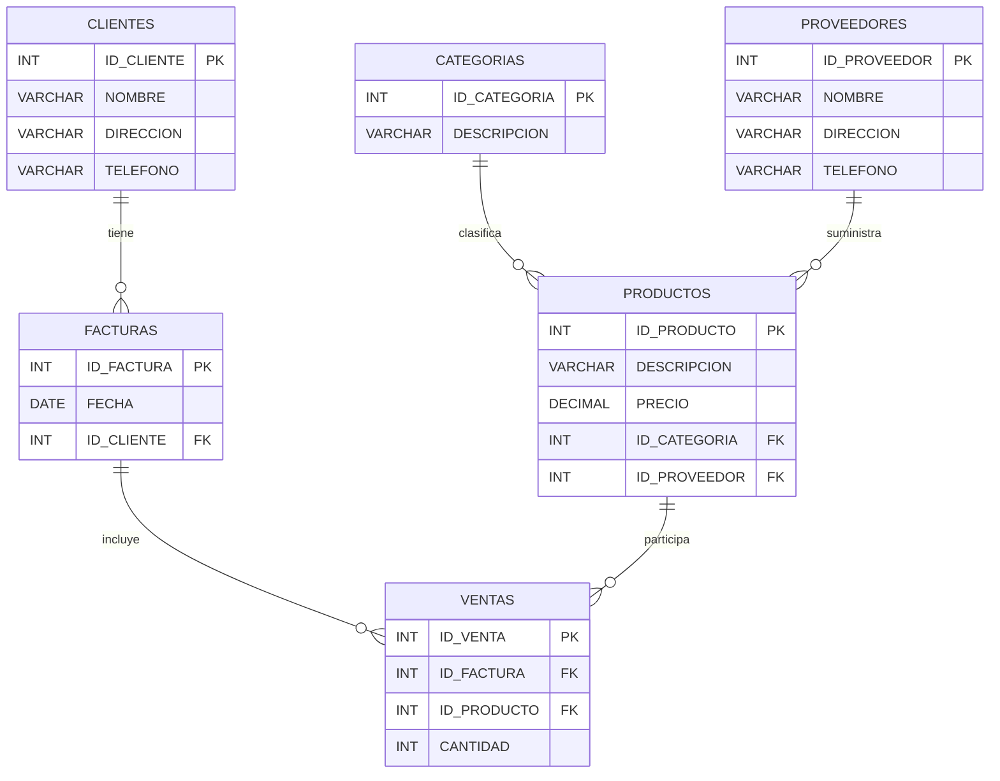

```sql
CREATE TABLE CLIENTES (
    ID_CLIENTE INT PRIMARY KEY,
    NOMBRE VARCHAR(100),
    DIRECCION VARCHAR(200),
    TELEFONO VARCHAR(20)
);

CREATE TABLE PROVEEDORES (
    ID_PROVEEDOR INT PRIMARY KEY,
    NOMBRE VARCHAR(100),
    DIRECCION VARCHAR(200),
    TELEFONO VARCHAR(20)
);

CREATE TABLE CATEGORIAS (
    ID_CATEGORIA INT PRIMARY KEY,
    DESCRIPCION VARCHAR(100)
);

CREATE TABLE PRODUCTOS (
    ID_PRODUCTO INT PRIMARY KEY,
    DESCRIPCION VARCHAR(200),
    PRECIO DECIMAL(10,2),
    ID_CATEGORIA INT,
    ID_PROVEEDOR INT,
    FOREIGN KEY (ID_CATEGORIA) REFERENCES CATEGORIAS(ID_CATEGORIA),
    FOREIGN KEY (ID_PROVEEDOR) REFERENCES PROVEEDORES(ID_PROVEEDOR)
);

CREATE TABLE FACTURAS (
    ID_FACTURA INT PRIMARY KEY,
    FECHA DATE,
    ID_CLIENTE INT,
    FOREIGN KEY (ID_CLIENTE) REFERENCES CLIENTES(ID_CLIENTE)
);

CREATE TABLE VENTAS (
    ID_VENTA INT PRIMARY KEY,
    ID_FACTURA INT,
    ID_PRODUCTO INT,
    CANTIDAD INT,
    FOREIGN KEY (ID_FACTURA) REFERENCES FACTURAS(ID_FACTURA),
    FOREIGN KEY (ID_PRODUCTO) REFERENCES PRODUCTOS(ID_PRODUCTO)
);
```
