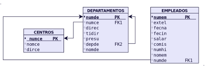

# Prácticas SQL 
Repositorio dedicado a la resolución de ejercicios SQL con MariaDB

Los ejercicios fueron obtenidos desde la página del gran [José Juan Sanchez](https://josejuansanchez.org/bd/ejercicios-consultas-sql/index.html).

La misma cuenta con múltiples bases de datos y ejercicios.

## Ejercicios

### Base de datos N° 1 - Tienda de informática

<a href="informatica.html">Ir a los ejercicios de Tienda Informática</a>

### Base de datos N° 2 - Gestión de empleados

<a href="empleados.html">Ir a los ejercicios de Gestión de Empleados</a>

### Base de datos N° 3 - Gestión de ventas

<a href="ventas.html">Ir a los ejercicios de Gestión de Ventas</a>

### Base de datos N° 4 - Jardinería

<a href="jardineria.html">Ir a los ejercicios de Jardinería</a>

### Base de datos N° 5 - Universidad

<a href="universidad.html">Ir a los ejercicios de Universidad</a>

### Base de datos N° 6 - Instituto

[Ir a los ejercicios de Instituto](actividad35.md)

#### Repositorio de MariaDB SQL completo con ejercicios y scripts:

[Github Repositorio](https://github.com/dgmx/Bases-de-DATOS)