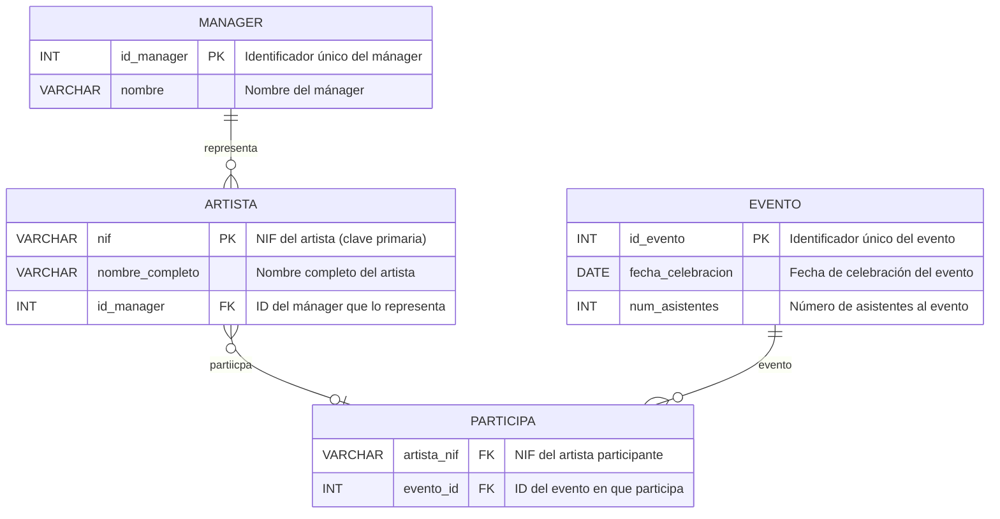

# Bases de datos

## Modelo Entidad Relacion Agencia de Management

Una empresa discográfica necesita modelar los datos sobre sus diferentes recursos según las siguientes características:

Manager: de cada mánager se almacena un identificador de manager y su nombre. Un manager representa a una serie de artistas.

Artista: un artista es representado por un manager. De los artistas se almacena su nombre completo (usando un único atributo) y su NIF.

Evento de promoción: los artistas participan en eventos de promoción para dar a conocer sus trabajos. En un evento de promoción pueden participar varios artistas. De un evento se almacena un identificador único, la fecha de celebración y el número de asistentes.

Se pide:

Dibuje un Diagrama E/R que modele la base de datos descrita, usando un conjunto de entidades para cada uno de los conceptos anteriores (es decir, su diseño debe tener 3 conjuntos de entidades).

## Modelo Entidad Relación


### Entidades y Atributos

**Entidad: MANAGER**
```
  --------------
 |   MANAGER    |
  --------------
       |
       |----(⚫) id_manager  (PK)
       |----(⚪) nombre
```

* **(⚫) `id_manager`**: Clave Primaria (PK), Identificador único del mánager.
* **(⚪) `nombre`**: Nombre del mánager.

**Entidad: ARTISTA**
```
  --------------
 |   ARTISTA    |
  --------------
       |
       |----(⚫) nif  (PK)
       |----(⚪) nombre_completo

```
* **(⚫) `nif`**: Clave Primaria (PK), NIF del artista.
* **(⚪) `nombre_completo`**: Nombre completo del artista.

**Entidad: EVENTO**
```
  --------
 | EVENTO |
  --------
       |
       |----(⚫) id_evento  (PK)
       |----(⚪) fecha_celebracion
       |----(⚪) num_asistentes
```
* **(⚫) `id_evento`**: Clave Primaria (PK), Identificador único del evento.
* **(⚪) `fecha_celebracion`**: Fecha de celebración del evento.
* **(⚪) `num_asistentes`**: Número de asistentes al evento.

## Relaciones

1.  **Relación: `representa`**
    * **Entre**: `MANAGER` y `ARTISTA`
    * **Cardinalidad**: 1:N (Uno a Muchos)
        * Un `MANAGER` representa a N `ARTISTA`.
        * Un `ARTISTA` es representado por 1 `MANAGER`.
    * **Visualización**: Una línea conectando `MANAGER` y `ARTISTA`, con marcas de cardinalidad (1 en el lado `MANAGER`, N en el lado `ARTISTA`).

2.  **Relación: `participa`**
    * **Entre**: `ARTISTA` y `EVENTO`
    * **Cardinalidad**: N:M (Muchos a Muchos)
        * Un `ARTISTA` participa en M `EVENTO`.
        * Un `EVENTO` tiene N `ARTISTA` participantes.
    * **Visualización**: Una línea (o un rombo representando la relación) conectando `ARTISTA` y `EVENTO`, con marcas de cardinalidad (N en el lado `ARTISTA`, M en el lado `EVENTO`).
    * **Nota de Implementación Relacional**: Esta relación requeriría una **tabla asociativa intermedia** (ej. `PARTICIPA`) en la base de datos. Esta tabla contendría las claves foráneas `artista_nif` y `evento_id`, formando su clave primaria compuesta, y tendría relaciones 1:N con `ARTISTA` y `EVENTO`.

## Modelo Relacional



### Explicación del Diagrama 

Este diagrama modela la estructura de datos descrita para la empresa discográfica, identificando las entidades principales, sus atributos y las relaciones entre ellas.

#### Entidades

Se identifican las siguientes entidades principales:

* **`MANAGER`**:
    * Representa a los mánagers de la discográfica.
    * Atributos principales:
        * `id_manager`: Identificador único (Clave Primaria - **PK**).
        * `nombre`: Nombre del mánager.
* **`ARTISTA`**:
    * Representa a los artistas musicales.
    * Atributos principales:
        * `nif`: Número de Identificación Fiscal del artista (se asume como Clave Primaria - **PK** por unicidad).
        * `nombre_completo`: Nombre completo del artista.
        * `id_manager`: Identificador del mánager que representa al artista (Clave Foránea - **FK** que referencia a `MANAGER`).
* **`EVENTO`**:
    * Representa los eventos de promoción organizados.
    * Atributos principales:
        * `id_evento`: Identificador único del evento (Clave Primaria - **PK**).
        * `fecha_celebracion`: Fecha en la que se realiza el evento.
        * `num_asistentes`: Número de personas que asistieron al evento.

#### Tabla Intermedia (para relación N:M)

* **`PARTICIPA`**:
    * Esta tabla es necesaria para implementar la relación "muchos a muchos" entre `ARTISTA` y `EVENTO`.
    * Registra qué artista participa en qué evento.
    * Atributos principales:
        * `artista_nif`: NIF del artista participante (Clave Foránea - **FK** que referencia a `ARTISTA`).
        * `evento_id`: ID del evento en el que participa (Clave Foránea - **FK** que referencia a `EVENTO`).
    * La combinación de `artista_nif` y `evento_id` suele formar la Clave Primaria compuesta de esta tabla para asegurar que un artista no se registre dos veces en el mismo evento.

#### Relaciones

Se establecen las siguientes relaciones basadas en la descripción:

1.  **`MANAGER` 1--N `ARTISTA`**:
    * **Descripción**: Un mánager representa a uno o varios artistas. Un artista es representado por exactamente un mánager.
    * **Tipo**: Uno a Muchos.
    * **Implementación**: A través de la clave foránea `id_manager` en la tabla `ARTISTA`.

2.  **`ARTISTA` N--M `EVENTO`**:
    * **Descripción**: Un artista puede participar en muchos eventos de promoción. Un evento de promoción puede tener la participación de varios artistas.
    * **Tipo**: Muchos a Muchos.
    * **Implementación**: Se realiza mediante la tabla intermedia `PARTICIPA`. Esta tabla tiene una relación **Uno a Muchos** con `ARTISTA` (un artista puede estar en muchas filas de `PARTICIPA`) y una relación **Uno a Muchos** con `EVENTO` (un evento puede estar en muchas filas de `PARTICIPA`).

Este modelo refleja la estructura descrita en el texto, utilizando las entidades requeridas y resolviendo la relación muchos a muchos de forma estándar para bases de datos relacionales.

## Modelo Físico

```sql
-- --- TABLAS PARA LA BASE DE DATOS DE LA DISCOGRÁFICA ---

-- Nota: El orden de creación es importante debido a las claves foráneas.
-- Creamos primero las tablas que no dependen de otras (Manager, Evento).

-- Tabla para los Mánagers
CREATE TABLE Manager (
    id_manager INT AUTO_INCREMENT PRIMARY KEY,
    nombre VARCHAR(255) NOT NULL COMMENT 'Nombre del mánager'
) ENGINE=InnoDB DEFAULT CHARSET=utf8mb4 COLLATE=utf8mb4_unicode_ci COMMENT='Tabla de Mánagers';

-- Tabla para los Eventos de Promoción
CREATE TABLE Evento (
    id_evento INT AUTO_INCREMENT PRIMARY KEY,
    fecha_celebracion DATE COMMENT 'Fecha de celebración del evento',
    num_asistentes INT DEFAULT 0 COMMENT 'Número de asistentes al evento'
) ENGINE=InnoDB DEFAULT CHARSET=utf8mb4 COLLATE=utf8mb4_unicode_ci COMMENT='Tabla de Eventos de Promoción';

-- Tabla para los Artistas (depende de Manager)
CREATE TABLE Artista (
    nif VARCHAR(15) PRIMARY KEY COMMENT 'NIF único del artista',
    nombre_completo VARCHAR(255) NOT NULL COMMENT 'Nombre completo del artista',
    id_manager INT NOT NULL COMMENT 'FK - ID del mánager que representa al artista',
    
    FOREIGN KEY (id_manager) REFERENCES Manager(id_manager)
        ON DELETE RESTRICT -- No permitir borrar un mánager si tiene artistas asociados
        ON UPDATE CASCADE  -- Si el ID del mánager cambia, actualizarlo aquí
) ENGINE=InnoDB DEFAULT CHARSET=utf8mb4 COLLATE=utf8mb4_unicode_ci COMMENT='Tabla de Artistas';

-- Tabla Intermedia para la relación N:M entre Artista y Evento (depende de Artista y Evento)
CREATE TABLE Participa (
    artista_nif VARCHAR(15) NOT NULL COMMENT 'FK - NIF del artista participante',
    evento_id INT NOT NULL COMMENT 'FK - ID del evento en que participa',
    
    -- Clave primaria compuesta para asegurar que un artista no participa dos veces en el mismo evento
    PRIMARY KEY (artista_nif, evento_id), 
    
    FOREIGN KEY (artista_nif) REFERENCES Artista(nif)
        ON DELETE CASCADE -- Si se borra un artista, se borra su registro de participación
        ON UPDATE CASCADE, -- Si el NIF del artista cambia (poco probable), actualizarlo aquí
        
    FOREIGN KEY (evento_id) REFERENCES Evento(id_evento)
        ON DELETE CASCADE -- Si se borra un evento, se borran los registros de participación
        ON UPDATE CASCADE  -- Si el ID del evento cambia, actualizarlo aquí
) ENGINE=InnoDB DEFAULT CHARSET=utf8mb4 COLLATE=utf8mb4_unicode_ci COMMENT='Tabla de Participación Artista-Evento (Relación N:M)';
```

### Notas sobre el Código SQL de Creación de Tablas (MySQL)

1.  **`ENGINE=InnoDB`**:
    * Esencial para que la base de datos soporte características avanzadas como **claves foráneas** (Foreign Keys) y **transacciones**, fundamentales para mantener la integridad de los datos en bases de datos relacionales.

2.  **`DEFAULT CHARSET=utf8mb4 COLLATE=utf8mb4_unicode_ci`**:
    * Se recomienda para asegurar una correcta gestión y almacenamiento de un amplio rango de **caracteres internacionales**, incluyendo acentos, símbolos especiales y emojis. `utf8mb4` es la codificación preferida en MySQL moderno sobre `utf8`.

3.  **`AUTO_INCREMENT`**:
    * Utilizado en las columnas de clave primaria de tipo numérico (`id_manager`, `id_evento`). Indica a MySQL que genere automáticamente un **valor numérico único y secuencial** para cada nueva fila insertada, simplificando la gestión de IDs.

4.  **`PRIMARY KEY`**:
    * Define la **columna (o conjunto de columnas)** cuyos valores identifican de forma única cada fila dentro de la tabla. No puede contener valores nulos. En la tabla `Participa`, se usa una **clave primaria compuesta** (`artista_nif`, `evento_id`).

5.  **`FOREIGN KEY`**:
    * Define una **columna (o conjunto de columnas)** en una tabla que referencia a la clave primaria de otra tabla. Establece y refuerza las **relaciones entre tablas**, garantizando la **integridad referencial** (por ejemplo, un `Artista` debe tener un `id_manager` que exista en la tabla `Manager`).

6.  **`ON DELETE` / `ON UPDATE`**:
    * Cláusulas asociadas a las `FOREIGN KEY` que definen el comportamiento automático cuando una fila referenciada (en la tabla "padre") es eliminada (`ON DELETE`) o su clave primaria es actualizada (`ON UPDATE`):
        * **`RESTRICT`**: Impide la eliminación/actualización en la tabla padre si existen registros relacionados en la tabla hija. Es una opción segura por defecto.
        * **`CASCADE`**: Propaga la acción. Si se elimina/actualiza la fila padre, las filas relacionadas en la tabla hija también se eliminan/actualizan automáticamente. Útil para registros dependientes como los de la tabla `Participa`.
        * **`SET NULL`**: (No se usó en este script) Establece el valor de la clave foránea en la tabla hija a `NULL` si la fila padre referenciada se elimina/actualiza. Requiere que la columna de la clave foránea permita valores `NULL`.

7.  **`NOT NULL`**:
    * Restricción que asegura que la columna **no puede contener valores nulos**; siempre debe tener un valor asignado al insertar o actualizar una fila.

8.  **`VARCHAR(length)`**:
    * Tipo de dato para almacenar **cadenas de texto de longitud variable**, hasta un máximo especificado por `length`. Es importante elegir una **longitud máxima adecuada** (ej. `VARCHAR(255)` para nombres, `VARCHAR(15)` como estimación para NIF).

9.  **`COMMENT`**:
    * Permite añadir **comentarios descriptivos** directamente en la definición de las tablas y columnas dentro de la base de datos. Es una **buena práctica** para la documentación y comprensión del esquema.


## Modificaciones en la estructura de las tablas

* **Tabla Manager**

Vamos a necesitar almacenar mas información en la tabla `Manager`, en concreto  un email y un teléfono, para ello se usa el comando **DDL** `ALTER`. Los nuevos atributos no implican ningún tipo de restricción:

```sql
alter table Manager add column email varchar(100);
alter table Manager add column telefono varchar(10);
```

Para insertar datos en las tablas, se usa el comando **DML** `INSERT`, estos ejemplos nos van a permitir realizar consultas con los criterios de selección que se requieran.

Se pueden insertar todos los valores o solo los que se especifiquen, siempre y cuando los omitidos no impliquen alguna restricción como no permitir valores nulos. En el caso siguiente, la clave primaria no es necesaria al ser auto incremental, lo que implica que se genera por si misma al introducir el resto de valores de la ocurrencia.

```sql
INSERT INTO Manager (nombre, email, telefono)
VALUES 
    ('Juan Pérez', 'juan@example.com', '555-1001'),
    ('María García', 'maria@example.com', '555-1002'),
    ('Carlos López', 'carlos@example.com', '555-1003'),
    ('Ana Martínez', 'ana@example.com', '555-1004'),
    ('Luis Rodríguez', 'luis@example.com', '555-1005'),
    ('Sofía Hernández', 'sofia@example.com', '555-1006'),
    ('Pedro Díaz', 'pedro@example.com', '555-1007'),
    ('Laura Sánchez', 'laura@example.com', '555-1008'),
    ('Jorge Ramírez', 'jorge@example.com', '555-1009'),
    ('Elena Flores', 'elena@example.com', '555-1010');

```
