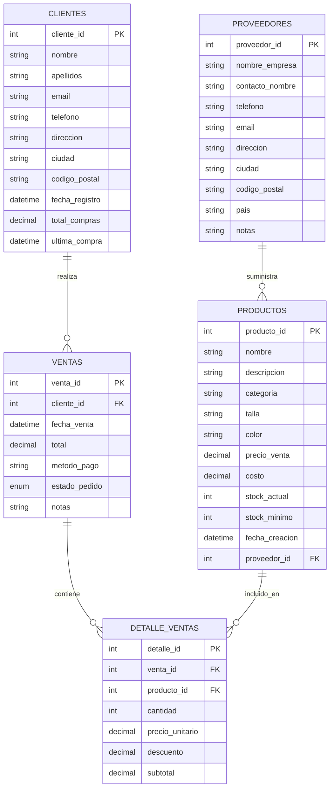

## Tienda de Ropa

A partir del siguiente modelo relacional, crea las tablas y los insert correspondientes


### Creación de las Tablas:
```sql
-- Creación de la tabla Productos
CREATE TABLE Productos (
    producto_id INT PRIMARY KEY AUTO_INCREMENT,
    nombre VARCHAR(100) NOT NULL,
    descripcion TEXT,
    categoria VARCHAR(50) NOT NULL,
    talla VARCHAR(10) NOT NULL,
    color VARCHAR(30) NOT NULL,
    precio_venta DECIMAL(10, 2) NOT NULL,
    costo DECIMAL(10, 2) NOT NULL,
    stock_actual INT NOT NULL DEFAULT 0,
    stock_minimo INT NOT NULL DEFAULT 5,
    fecha_creacion DATETIME DEFAULT CURRENT_TIMESTAMP,
    proveedor_id INT,
    FOREIGN KEY (proveedor_id) REFERENCES Proveedores(proveedor_id)
);

-- Creación de la tabla Clientes
CREATE TABLE Clientes (
    cliente_id INT PRIMARY KEY AUTO_INCREMENT,
    nombre VARCHAR(50) NOT NULL,
    apellidos VARCHAR(100) NOT NULL,
    email VARCHAR(100) UNIQUE,
    telefono VARCHAR(20),
    direccion VARCHAR(200),
    ciudad VARCHAR(50),
    codigo_postal VARCHAR(10),
    fecha_registro DATETIME DEFAULT CURRENT_TIMESTAMP,
    total_compras DECIMAL(12, 2) DEFAULT 0,
    ultima_compra DATETIME
);

-- Creación de la tabla Ventas
CREATE TABLE Ventas (
    venta_id INT PRIMARY KEY AUTO_INCREMENT,
    cliente_id INT NOT NULL,
    fecha_venta DATETIME DEFAULT CURRENT_TIMESTAMP,
    total DECIMAL(10, 2) NOT NULL,
    metodo_pago VARCHAR(50) NOT NULL,
    estado_pedido ENUM('Pendiente', 'Completado', 'Cancelado') DEFAULT 'Pendiente',
    notas TEXT,
    FOREIGN KEY (cliente_id) REFERENCES Clientes(cliente_id)
);

-- Tabla de relación entre Ventas y Productos (para detalles de la venta)
CREATE TABLE Detalle_Ventas (
    detalle_id INT PRIMARY KEY AUTO_INCREMENT,
    venta_id INT NOT NULL,
    producto_id INT NOT NULL,
    cantidad INT NOT NULL,
    precio_unitario DECIMAL(10, 2) NOT NULL,
    descuento DECIMAL(10, 2) DEFAULT 0,
    subtotal DECIMAL(10, 2) NOT NULL,
    FOREIGN KEY (venta_id) REFERENCES Ventas(venta_id),
    FOREIGN KEY (producto_id) REFERENCES Productos(producto_id)
);

-- Creación de la tabla Proveedores
CREATE TABLE Proveedores (
    proveedor_id INT PRIMARY KEY AUTO_INCREMENT,
    nombre_empresa VARCHAR(100) NOT NULL,
    contacto_nombre VARCHAR(100),
    telefono VARCHAR(20),
    email VARCHAR(100),
    direccion VARCHAR(200),
    ciudad VARCHAR(50),
    codigo_postal VARCHAR(10),
    pais VARCHAR(50),
    notas TEXT
);

-- Índices para mejorar el rendimiento
CREATE INDEX idx_productos_categoria ON Productos(categoria);
CREATE INDEX idx_productos_nombre ON Productos(nombre);
CREATE INDEX idx_clientes_nombre ON Clientes(nombre, apellidos);
CREATE INDEX idx_ventas_fecha ON Ventas(fecha_venta);
CREATE INDEX idx_ventas_cliente ON Ventas(cliente_id);
```

### Datos de las tablas:
```sql
-- Insertar datos en la tabla Proveedores
INSERT INTO Proveedores (nombre_empresa, contacto_nombre, telefono, email, direccion, ciudad, codigo_postal, pais, notas) VALUES 
('Textiles Modernos, S.A.', 'María García', '+34 912345678', 'contacto@textilesmodernos.com', 'Calle Industrial 45', 'Madrid', '28001', 'España', 'Proveedor principal de camisetas y tops'),
('Moda Italiana, SRL', 'Marco Bianchi', '+39 0612345678', 'marco@modaitaliana.it', 'Via Roma 78', 'Milán', '20121', 'Italia', 'Especialistas en prendas de vestir formales'),
('Denim & Co', 'Jean Dupont', '+33 123456789', 'jean@denimandco.fr', '15 Rue de la Mode', 'París', '75008', 'Francia', 'Proveedor de pantalones vaqueros premium'),
('Asian Textiles Ltd', 'Li Wei', '+86 9876543210', 'liwei@asiantextiles.cn', '123 Manufacturing Road', 'Shanghai', '200000', 'China', 'Buenos precios en grandes volúmenes'),
('Algodones del Sur', 'José Martínez', '+34 954321098', 'info@algodonesdelsur.es', 'Avenida de la Industria 67', 'Sevilla', '41001', 'España', 'Algodón orgánico y sostenible');

-- Insertar datos en la tabla Productos
INSERT INTO Productos (nombre, descripcion, categoria, talla, color, precio_venta, costo, stock_actual, stock_minimo, proveedor_id) VALUES 
('Camiseta Básica', 'Camiseta de algodón 100% con cuello redondo', 'Camisetas', 'M', 'Blanco', 19.99, 8.50, 120, 20, 1),
('Camiseta Básica', 'Camiseta de algodón 100% con cuello redondo', 'Camisetas', 'L', 'Blanco', 19.99, 8.50, 85, 20, 1),
('Camiseta Básica', 'Camiseta de algodón 100% con cuello redondo', 'Camisetas', 'M', 'Negro', 19.99, 8.50, 95, 20, 1),
('Camiseta Básica', 'Camiseta de algodón 100% con cuello redondo', 'Camisetas', 'L', 'Negro', 19.99, 8.50, 78, 20, 1),
('Pantalón Vaquero Slim', 'Pantalón vaquero de corte slim fit', 'Pantalones', '38', 'Azul oscuro', 59.99, 25.75, 45, 10, 3),
('Pantalón Vaquero Slim', 'Pantalón vaquero de corte slim fit', 'Pantalones', '40', 'Azul oscuro', 59.99, 25.75, 38, 10, 3),
('Pantalón Vaquero Slim', 'Pantalón vaquero de corte slim fit', 'Pantalones', '42', 'Azul oscuro', 59.99, 25.75, 42, 10, 3),
('Blusa Elegante', 'Blusa de seda con detalle en cuello', 'Blusas', 'S', 'Beige', 45.50, 22.25, 30, 8, 2),
('Blusa Elegante', 'Blusa de seda con detalle en cuello', 'Blusas', 'M', 'Beige', 45.50, 22.25, 25, 8, 2),
('Blusa Elegante', 'Blusa de seda con detalle en cuello', 'Blusas', 'S', 'Rosa', 45.50, 22.25, 28, 8, 2),
('Vestido Casual', 'Vestido casual para primavera/verano', 'Vestidos', 'M', 'Floral', 65.99, 30.50, 20, 5, 2),
('Vestido Casual', 'Vestido casual para primavera/verano', 'Vestidos', 'L', 'Floral', 65.99, 30.50, 15, 5, 2),
('Jersey de Punto', 'Jersey de punto grueso para invierno', 'Jerseys', 'M', 'Gris', 49.99, 22.50, 40, 10, 5),
('Jersey de Punto', 'Jersey de punto grueso para invierno', 'Jerseys', 'L', 'Gris', 49.99, 22.50, 35, 10, 5),
('Jersey de Punto', 'Jersey de punto grueso para invierno', 'Jerseys', 'XL', 'Gris', 49.99, 22.50, 30, 10, 5),
('Chaqueta Vaquera', 'Chaqueta vaquera clásica', 'Chaquetas', 'M', 'Azul claro', 79.99, 38.25, 22, 5, 3),
('Chaqueta Vaquera', 'Chaqueta vaquera clásica', 'Chaquetas', 'L', 'Azul claro', 79.99, 38.25, 18, 5, 3),
('Falda Midi', 'Falda midi plisada', 'Faldas', 'S', 'Negro', 39.99, 17.75, 25, 8, 2),
('Falda Midi', 'Falda midi plisada', 'Faldas', 'M', 'Negro', 39.99, 17.75, 20, 8, 2),
('Camisa Formal', 'Camisa formal de manga larga', 'Camisas', '39', 'Blanco', 42.50, 19.25, 30, 10, 5);

-- Insertar datos en la tabla Clientes
INSERT INTO Clientes (nombre, apellidos, email, telefono, direccion, ciudad, codigo_postal) VALUES 
('Ana', 'Martínez López', 'ana.martinez@email.com', '+34 612345678', 'Calle Mayor 12, 3B', 'Madrid', '28001'),
('Carlos', 'González Ruiz', 'carlos.gonzalez@email.com', '+34 623456789', 'Avenida Libertad 45', 'Barcelona', '08001'),
('Laura', 'Fernández García', 'laura.fernandez@email.com', '+34 634567890', 'Calle del Sol 8, 5A', 'Valencia', '46001'),
('Javier', 'Rodríguez Sánchez', 'javier.rodriguez@email.com', '+34 645678901', 'Plaza Mayor 3, 2C', 'Sevilla', '41001'),
('Elena', 'López Martín', 'elena.lopez@email.com', '+34 656789012', 'Calle Nueva 18, 7D', 'Zaragoza', '50001'),
('Miguel', 'Sánchez Fernández', 'miguel.sanchez@email.com', '+34 667890123', 'Avenida del Parque 22', 'Málaga', '29001'),
('Carmen', 'Martín González', 'carmen.martin@email.com', '+34 678901234', 'Calle Ancha 55, 1B', 'Murcia', '30001'),
('David', 'García Pérez', 'david.garcia@email.com', '+34 689012345', 'Ronda de Toledo 9, 4A', 'Las Palmas', '35001'),
('Sara', 'Pérez Martínez', 'sara.perez@email.com', '+34 690123456', 'Calle Real 77, 3C', 'Palma de Mallorca', '07001'),
('Juan', 'Díaz López', 'juan.diaz@email.com', '+34 601234567', 'Avenida Principal 63, 8B', 'Bilbao', '48001');

-- Insertar datos en la tabla Ventas
INSERT INTO Ventas (cliente_id, fecha_venta, total, metodo_pago, estado_pedido) VALUES 
(1, '2023-01-15 10:30:00', 79.96, 'Tarjeta de crédito', 'Completado'),
(2, '2023-01-17 11:45:00', 59.99, 'PayPal', 'Completado'),
(3, '2023-01-20 15:20:00', 108.49, 'Tarjeta de crédito', 'Completado'),
(4, '2023-01-25 09:15:00', 45.50, 'Efectivo', 'Completado'),
(5, '2023-02-02 16:30:00', 129.98, 'Tarjeta de débito', 'Completado'),
(1, '2023-02-10 14:45:00', 85.48, 'Tarjeta de crédito', 'Completado'),
(6, '2023-02-12 18:20:00', 65.99, 'PayPal', 'Completado'),
(2, '2023-02-15 12:10:00', 119.98, 'Tarjeta de crédito', 'Completado'),
(7, '2023-02-18 10:05:00', 49.99, 'Efectivo', 'Completado'),
(3, '2023-02-20 17:30:00', 91.00, 'Tarjeta de débito', 'Completado'),
(8, '2023-03-01 11:20:00', 79.99, 'PayPal', 'Completado'),
(9, '2023-03-05 14:15:00', 159.97, 'Tarjeta de crédito', 'Completado'),
(4, '2023-03-08 13:40:00', 45.50, 'Efectivo', 'Completado'),
(10, '2023-03-10 16:50:00', 129.98, 'Tarjeta de débito', 'Completado'),
(5, '2023-03-15 09:30:00', 39.99, 'PayPal', 'Completado');

-- Insertar datos en la tabla Detalle_Ventas
INSERT INTO Detalle_Ventas (venta_id, producto_id, cantidad, precio_unitario, descuento, subtotal) VALUES 
(1, 1, 2, 19.99, 0, 39.98),
(1, 3, 2, 19.99, 0, 39.98),
(2, 5, 1, 59.99, 0, 59.99),
(3, 8, 1, 45.50, 0, 45.50),
(3, 12, 1, 65.99, 3.00, 62.99),
(4, 9, 1, 45.50, 0, 45.50),
(5, 16, 1, 79.99, 0, 79.99),
(5, 13, 1, 49.99, 0, 49.99),
(6, 19, 1, 39.99, 0, 39.99),
(6, 1, 1, 19.99, 0, 19.99),
(6, 10, 1, 45.50, 20.00, 25.50),
(7, 11, 1, 65.99, 0, 65.99),
(8, 5, 1, 59.99, 0, 59.99),
(8, 6, 1, 59.99, 0, 59.99),
(9, 13, 1, 49.99, 0, 49.99),
(10, 8, 1, 45.50, 0, 45.50),
(10, 9, 1, 45.50, 0, 45.50),
(11, 16, 1, 79.99, 0, 79.99),
(12, 13, 1, 49.99, 0, 49.99),
(12, 14, 1, 49.99, 0, 49.99),
(12, 15, 1, 49.99, 0, 59.99),
(13, 10, 1, 45.50, 0, 45.50),
(14, 16, 1, 79.99, 0, 79.99),
(14, 7, 1, 59.99, 10.00, 49.99),
(15, 18, 1, 39.99, 0, 39.99);

-- Actualizar información de última compra y total de compras en Clientes
UPDATE Clientes c
SET 
    ultima_compra = (SELECT MAX(v.fecha_venta) FROM Ventas v WHERE v.cliente_id = c.cliente_id),
    total_compras = (SELECT SUM(v.total) FROM Ventas v WHERE v.cliente_id = c.cliente_id);
```

## Consultas Básicas
1. Consulta básica SELECT con filtro WHERE  
 Obtener todos los productos de la categoría "Camisetas"
```sql
SELECT
producto_id,
nombre,
talla,
color,
precio_venta
FROM
Productos
WHERE
categoria = 'Camisetas';
```
2. Consulta con ORDER BY para ordenar resultados  
Listar productos ordenados por precio de mayor a menor
```sql
SELECT
nombre,
categoria,
talla,
color,
precio_venta
FROM
Productos
ORDER BY
precio_venta DESC;
```
3. Consulta con LIMIT para limitar el número de resultados
-- Mostrar los 5 productos más caros
```sql
SELECT
nombre,
categoria,
precio_venta
FROM
Productos
ORDER BY
precio_venta DESC
LIMIT 5;
```
4. Consulta con funciones de agregación  
Calcular el precio promedio, mínimo y máximo por categoría
```sql
SELECT
categoria,
COUNT(*) AS total_productos,
AVG(precio_venta) AS precio_promedio,
MIN(precio_venta) AS precio_minimo,
MAX(precio_venta) AS precio_maximo
FROM
Productos
GROUP BY
categoria;
```
5. Consulta con LIKE para búsqueda de patrones  
Encontrar productos cuyo nombre contenga "Básica"
```sql
SELECT
producto_id,
nombre,
categoria,
talla,
color
FROM
Productos
WHERE
nombre LIKE '%Básica%';
```
6. Consulta con IN para múltiples posibles valores  
Encontrar productos de tallas específicas
```sql
SELECT
nombre,
categoria,
talla,
color,
precio_venta
FROM
Productos
WHERE
talla IN ('S', 'M', 'L');
```
7. Consulta con BETWEEN para rangos de valores  
Listar productos con precios entre 40 y 60 euros
```sql
SELECT
nombre,
categoria,
talla,
color,
precio_venta
FROM
Productos
WHERE
precio_venta BETWEEN 40 AND 60;
```
8. Consulta con HAVING para filtrar grupos  
Encontrar categorías con más de 5 productos
```sql
SELECT
categoria,
COUNT() AS total_productos
FROM
Productos
GROUP BY
categoria
HAVING
COUNT() > 5;
```
9. Consulta con CASE para resultados condicionales  
Clasificar productos por rango de precios
```sql
SELECT
nombre,
categoria,
precio_venta,
CASE
WHEN precio_venta < 30 THEN 'Económico'
WHEN precio_venta BETWEEN 30 AND 60 THEN 'Precio medio'
ELSE 'Premium'
END AS rango_precio
FROM
Productos;
```
10.  Consulta con subconsulta  
Encontrar productos con precio mayor al promedio
```sql
SELECT
nombre,
categoria,
talla,
color,
precio_venta
FROM
Productos
WHERE
precio_venta > (SELECT AVG(precio_venta) FROM Productos);
```


## Consultas Complejas

1. Obtener todos los productos con stock bajo (por debajo del mínimo)
```sql
SELECT producto_id, nombre, talla, color, stock_actual stock_minimo
FROM Productos WHERE stock_actual < stock_minimo
ORDER BY stock_actual ASC;
```
2. Listar los 5 productos más vendidos
```sql
SELECT
p.producto_id,
p.nombre,
p.categoria,
SUM(dv.cantidad) AS total_vendido
FROM
Productos p
JOIN
Detalle_Ventas dv ON p.producto_id = dv.producto_id
GROUP BY
p.producto_id, p.nombre, p.categoria
ORDER BY
total_vendido DESC
LIMIT 5;
```
3. Calcular el margen de beneficio por producto
```sql
SELECT
producto_id,
nombre,
categoria,
talla,
color,
precio_venta,
costo,
(precio_venta - costo) AS margen_beneficio,
ROUND(((precio_venta - costo) / precio_venta * 100), 2) AS porcentaje_beneficio
FROM
Productos
ORDER BY
porcentaje_beneficio DESC;
```

4. Obtener las ventas totales por mes
```sql
SELECT
YEAR(fecha_venta) AS año,
MONTH(fecha_venta) AS mes,
COUNT(*) AS numero_ventas,
SUM(total) AS ventas_totales
FROM
Ventas
GROUP BY
YEAR(fecha_venta), MONTH(fecha_venta)
ORDER BY
año, mes;
```
5. Listar los clientes que han realizado más de 2 compras
```sql
SELECT
c.cliente_id,
c.nombre,
c.apellidos,
COUNT(v.venta_id) AS total_compras,
SUM(v.total) AS importe_total
FROM
Clientes c
JOIN
Ventas v ON c.cliente_id = v.cliente_id
GROUP BY
c.cliente_id, c.nombre, c.apellidos
HAVING
COUNT(v.venta_id) > 2
ORDER BY
total_compras DESC;
```
6. Encontrar productos que nunca se han vendido
```sql
SELECT
p.producto_id,
p.nombre,
p.categoria,
p.talla,
p.color,
p.stock_actual
FROM
Productos p
LEFT JOIN
Detalle_Ventas dv ON p.producto_id = dv.producto_id
WHERE
dv.detalle_id IS NULL;
```
7. Obtener el valor total del inventario actual
```sql
SELECT
SUM(stock_actual * precio_venta) AS valor_inventario_pvp,
SUM(stock_actual * costo) AS valor_inventario_costo
FROM
Productos;
```
8. Calcular el ticket medio por cliente
```sql
SELECT
c.cliente_id,
c.nombre,
c.apellidos,
COUNT(v.venta_id) AS numero_compras,
SUM(v.total) AS importe_total,
ROUND(AVG(v.total), 2) AS ticket_medio
FROM
Clientes c
JOIN
Ventas v ON c.cliente_id = v.cliente_id
GROUP BY
c.cliente_id, c.nombre, c.apellidos
ORDER BY
ticket_medio DESC;
```
9. Listar los productos agrupados por proveedor
```sql
SELECT
prov.proveedor_id,
prov.nombre_empresa,
COUNT(prod.producto_id) AS total_productos,
SUM(prod.stock_actual) AS stock_total,
GROUP_CONCAT(DISTINCT prod.categoria) AS categorias
FROM
Proveedores prov
LEFT JOIN
Productos prod ON prov.proveedor_id = prod.proveedor_id
GROUP BY
prov.proveedor_id, prov.nombre_empresa
ORDER BY
total_productos DESC;
```
10. Encontrar las ventas con descuentos aplicados
```sql
SELECT
v.venta_id,
v.fecha_venta,
c.nombre AS nombre_cliente,
c.apellidos AS apellidos_cliente,
p.nombre AS producto,
p.talla,
p.color,
dv.precio_unitario,
dv.cantidad,
dv.descuento,
dv.subtotal,
ROUND((dv.descuento / dv.precio_unitario * 100), 2) AS porcentaje_descuento
FROM
Ventas v
JOIN
Clientes c ON v.cliente_id = c.cliente_id
JOIN
Detalle_Ventas dv ON v.venta_id = dv.venta_id
JOIN
Productos p ON dv.producto_id = p.producto_id
WHERE
dv.descuento > 0
ORDER BY
porcentaje_descuento DESC;
```