Tabla de Contenidos
-------------------

1.  Arduino:
    *   Microcontroladores
    *   Que es Arduino
    *   Para que sirve un microcontrolador
2.  Espacio de Trabajo
    *   Tinkercad
    *   Registro
3.  Ejemplo para empezar
4.  Conectando componentes a Arduino.
5.  Programando Arduino
    *   Partes de un programa Arduino
    *   Configuración de los pines de Arduino
    *   Configuración con múltiples componentes
    *   Ordenes a un componente
    *   Ejemplos
6.  LED RGB
    *   Que es y como conectar a Arduino
    *   Controlando un RGB LED con Arduino
    *   Ejemplos

1\. Arduino
-----------

##### ¿Qué es un microcontrolador?

Un microcontrolador es **un circuito eléctrónico** muy complejo compuesto de miles y miles de componentes electrónicos: resistencias, transistores, diodos, condensadores… En la siguiente imagen puedes ver un ejemplo de microcontrolador:

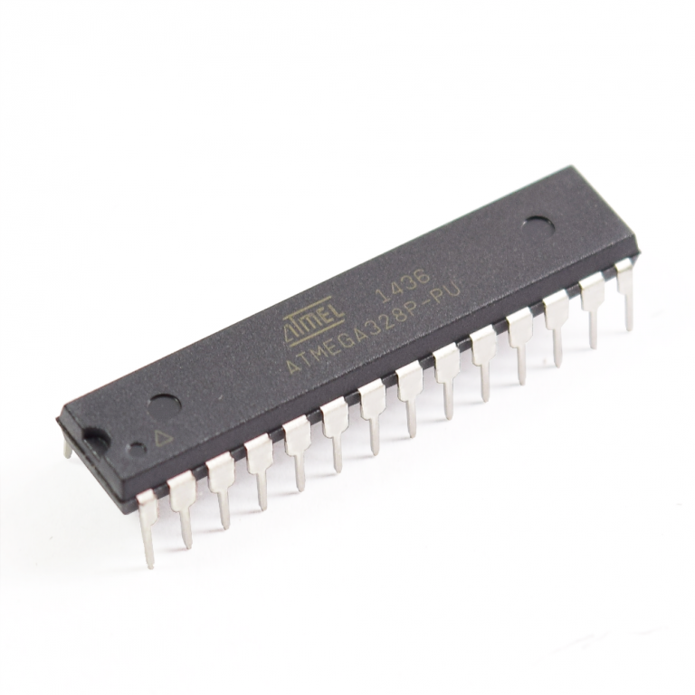

Como puedes observar, no se ve ningún tipo de componente electrónico a simple vista. El motivo es que un microcontrolador es un **circuito integrado** (o microchip), lo que significa que los diferentes componentes se encuentran confinados en una cápsula de unos pocos centímetros cuadrados. Para conseguirlo se emplea una técnica muy compleja denominada [fotolitografía](https://es.wikipedia.org/wiki/Fotolitograf%C3%ADa) que básicamente consiste en «dibujar» los componentes sobre una lámina de silicio (material semiconductor).

* * *

Seguro que has oído hablar de **Silicon Valle**y (**Valle del Silicio** en español), una zona de California en la que se pueden encontrar algunas de las principales empresas tecnológicas del mundo. Apple, Intel, Hewlett-Packard, Facebook, Tesla, Twitter… Pues bien, el nombre procede precisamente de que las empresas que allí se instalaron fueron las primeras en empezar a utilizar circuitos integrados y estos eran fabricados con silicio.

* * *

Pero un microcontrolador no es un circuito cualquiera, sino que es un circuito programable. Es decir, es un circuito al que se le pueden dar órdenes. **A la lista de órdenes que se le da a un microcontrolador se le denomina programa.** Y programar no es otra cosa que escribir un programa para un microcontrolador.

El único problema es que para programar hay que emplear un lenguaje específico que el microcontrolador es capaz de entender, a ese lenguaje se le llama **lenguaje de programación**. Es necesario aprender ese lenguaje para poder dar órdenes a un microcontrolador y así conseguir que haga lo que deseamos.

* * *

##### ¿Qué es Arduino?

Arduino es una empresa italiana que se dedica sobre todo a fabricar microcontroladores. Es muy conocida a nivel mundial porque todos los componentes que desarrollan se distribuyen de manera libre. Lo que significa que ponen a disposición de todo el mundo los planos y las instrucciones para que cualquier persona o empresa pueda fabricar libremente sus productos sin ningún coste.

En esta guía vamos a aprender a programar un microcontrolador de la marca Arduino: el **Arduino Uno**. Sin embargo, una vez que se aprende a programar un tipo de microcontrolador es muy sencillo aprender a programar otros modelos.

En la siguiente imagen puedes ver un Arduino Uno real:

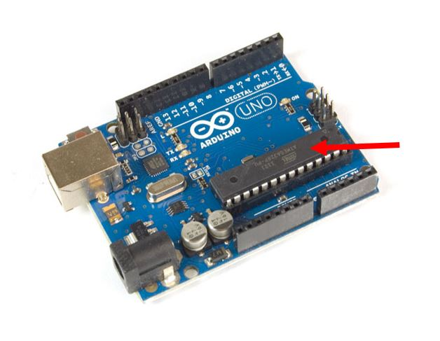

Puedes pensar que no se parece en nada al microcontrolador de la primera imagen, pero si te fijas comprobarás que el componente al que apunta la flecha es exactamente el mismo. De hecho ese componente es realmente el microcontrolador, mientras que la función del resto de la placa es básicamente facilitar las conexiones como veremos más adelante.

* * *

##### ¿Para qué sirve un microcontrolador?

No te puedes imaginar la cantidad de situaciones a lo largo del día en la que un microcontrolador te facilita la vida. Un semáforo, una puerta automática, un sistema de alarma, un ascensor… son sólo algunos ejemplos de sistemas que necesitan un microcontrolador que coordine el funcionamiento de sus diferentes partes.

En el siguiente vídeo puedes ver varios proyectos realizados con Arduino:

En todos esos proyectos los distintos componentes: motores, LEDs, sensores… están conectados a un microcontrolador adecuadamente programado para que los controle de una manera determinada. Se puede decir que el microcontrolador **es el cerebro** que, una vez programado, manda órdenes a los distintos componentes.

Ahora que ya sabes qué es Arduino y para qué sirve vamos a aprender cómo se utiliza.

2\. Espacio de Trabajo
----------------------

##### Tinkercad

Esta guía está dirigida a usar un simulador de Arduino, es decir, una aplicación que imita el funcionamiento de este modelo de microcontrolador. El simulador que se va a utilizar es el de la página web [**Tinkercad**,](https://www.tinkercad.com/circuits) a la cual puedes acceder a través del siguiente enlace:

[https://www.tinkercad.com/](https://www.tinkercad.com/)

##### Registro

Para registrarse en la página hay que hacer click en _**Registrarse:**_

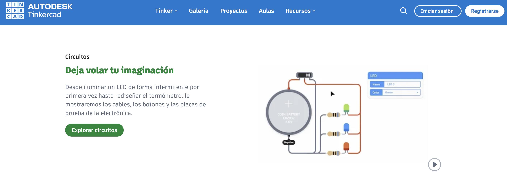

Seleccionar _**CREAR CUENTA PERSONAL**_ y elegir la cuenta con la que deseas registrarte:

Accederás a la aplicación, donde deberás seleccionar la opción _**Circuits**_:

Y hacer click en _**Crear nuevo circuito**_:

Así entrarás en el simulador, el cual se divide en dos zonas fundamentalmente:

*   En la zona central (recuadro verde) es donde se colocan y conectan los componentes electrónicos al microcontrolador.
*   La zona de la derecha (recuadro azul) es donde se pueden encontrar los distintos componentes: LEDs, resistencias, motores, sensores, interruptores, microcontroladores, baterías…
*   Los botones _Código_ e _Iniciar simulación_ se utilizan para escribir el programa del microcontrolador e iniciar el funcionamiento del circuito repectivamente.
*   Por último, el botón _Compartir_ permite obtener un enlace al proyecto, para que cualquier persona que esté registrada en la aplicación pueda entrar a verlo.

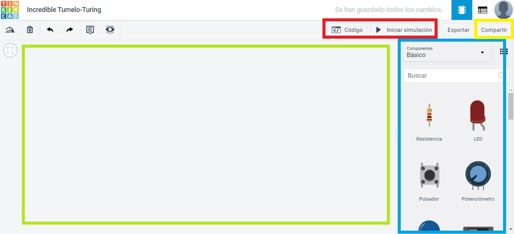

Para cerrar la sesión tendrás que hacer lo siguiente:

Y ahora que ya estás registrado en Tinkercad cada vez que salgas y quieras volver a entrar tendrás que hacer click en _Iniciar sesión_ y seleccionar la cuenta con la que os habéis registrado (¡no registarte de nuevo!):

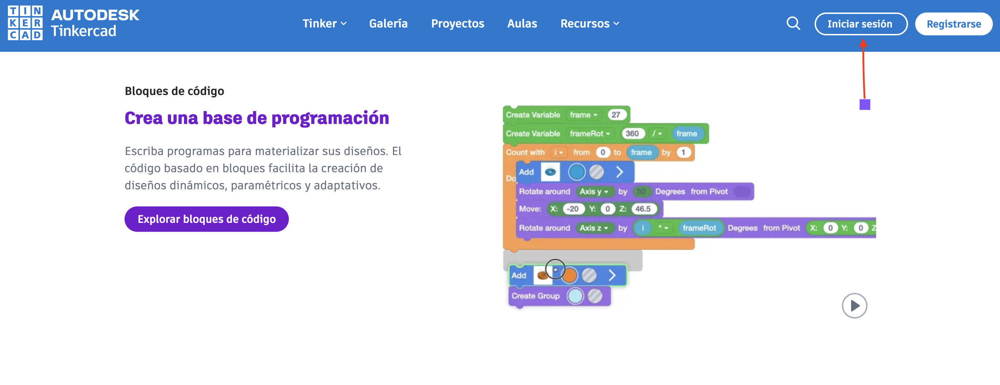

3\. Un ejemplo para empezar.
----------------------------

Imagina que quieres hacer que una bombilla parpadee cada dos segundos, es decir, que esté dos segundos encendida y otros dos segundos apagada una y otra vez.

Si dispones de una bombilla, de un pulsador, de una batería y de un reloj podrías conseguirlo ¿no? Bastaría con conectar los tres componentes como en el siguiente esquema y cambiar la posición del pulsador cada dos segundos fijándote en el reloj:

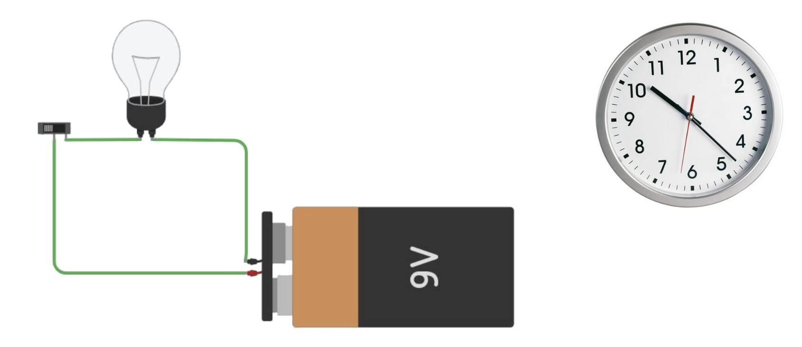

Sin embargo te encontrarías con dos grandes problemas:

*   Que siempre cometerías un pequeño error (aunque fuera de unas pocas milésimas de segundo) ya que sería imposible que justo acertaras a cambiar la posición del interruptor cada dos segundos.
*   Y lo más importante, que te acabarías cansando.

Justo este tipo de cosas son las que un microcontrolador puede hacer a la perfección y con gran precisión. Al fin y al cabo se trata de hacer que un componente actúe de manera automática.Vamos a ver cómo se conseguiría en el simulador de Tinkercad.

Lo primero que hay que hacer es conectar la bombilla al Arduino como en la imagen de abajo (fíjate que en este caso no son necesarios ni el interruptor ni la batería):

Para eso lo más rápido es que busques las palabras «bombilla» y «Arduino» en el menú de componentes de la derecha y que los arrastres al centro de la pantalla:

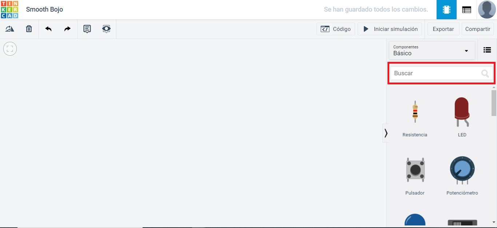

A continuación, conecta los dos terminales de la bombilla a los «agujeros» que se indican en la imagen: el izquierdo a GND y el derecho al número 8.

Aunque ahora mismo no entiendas por qué se conecta de ese modo la bombilla no te preocupes, más adelante lo comprenderás.

Una vez conectada la bombilla hay que escribir el programa, es decir, hay que indicarle al Arduino qué ordenes debe ejecutar. Para escribir el programa hay que hacer click en el botón _Código_:

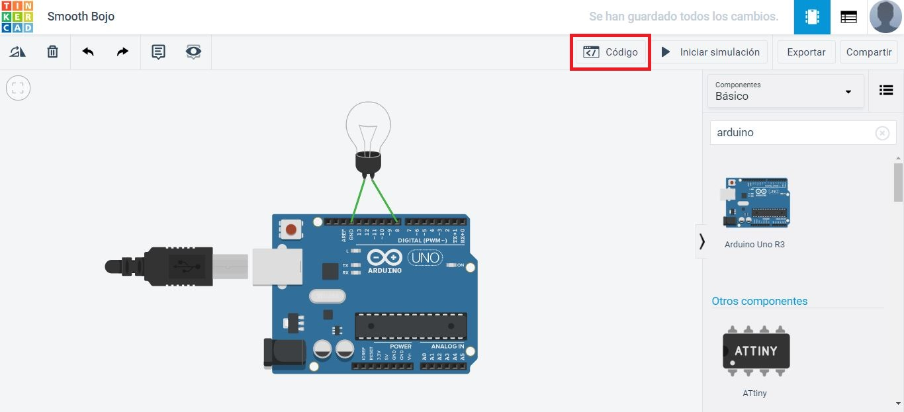

Y después cambiar la opción _Bloques_ por _Texto_:

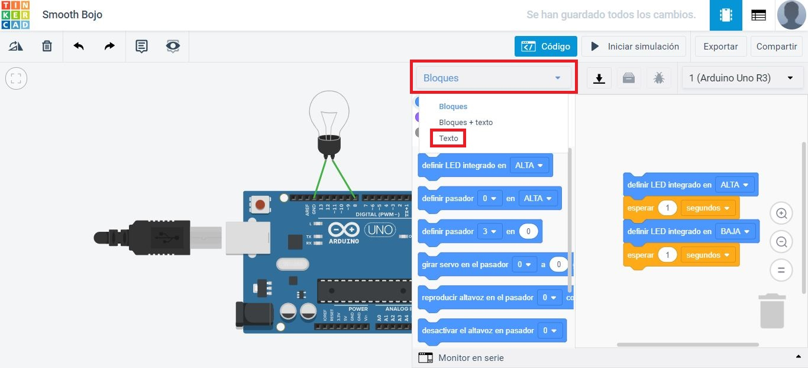

Y hacer click en _Continuar_:

Los programas siempre se van a escribir en el área recuadrada de la imagen:

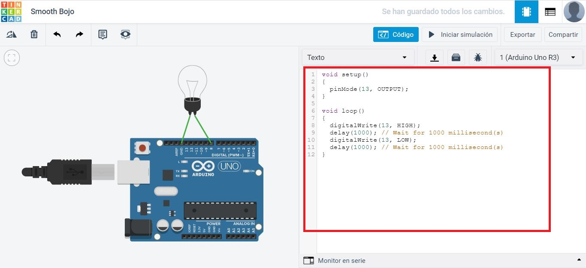

Como puedes comprobar, en esa zona aparece un programa por defecto que vamos borrar.

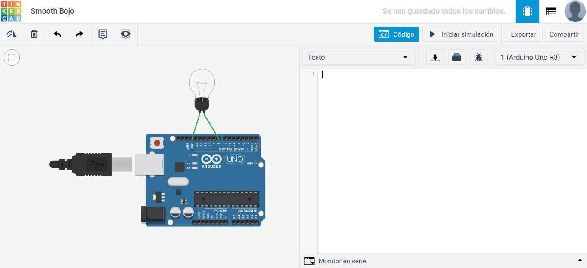

A continuación vamos a escribir el programa que va a hacer que la bombilla parpadee cada dos segundos. Las órdenes que se deberán dar son las siguientes:

1.  Endender la bombilla que está conectada al agujero nº 8.
2.  Esperar 2 segundos con la bombilla encendida.
3.  Apagar la bombilla que está conectada al agujero nº 8.
4.  Esperar 2 segundos con la bombilla apagada.
5.  …

Fíjate en que las **órdenes** que hay que dar al microcontrolador deben estar **muy detalladas**. No basta con decirle que tiene que encender la bombilla, si no se especifica durante cuánto tiempo tiene que hacerlo las instrucciones están incompletas. También es necesario indicar en qué agujero se ha conectado la bombilla ya que en caso de que hubiera más de una bombilla conectada no sería lo mismo encender una que otra.

Sin embargo, como se ha explicado en la página anterior, los microcontroladores utilizan un lenguaje específico, lo que se denomina un lenguaje de programación. Por tanto, debemos traducir las órdenes anteriores al lenguaje que puede entender el Arduino. Eso es lo que vamos a aprender a hacer a partir de ahora, pero de momento tienes que creerte que la traducción de las órdenes anteriores sería la siguiente:

`void setup()` `{`  
`pinMode(8, OUTPUT);`  
`}`

`void loop()` `{`  
`digitalWrite(8, HIGH);`  
`delay(2000);`  
`digitalWrite(8, LOW);`  
`elay(2000);`  
`}`

Puedes copiar y pegar directamente el texto azul en el área del programa y a continuación hacer click en el botón _Iniciar simulación_:

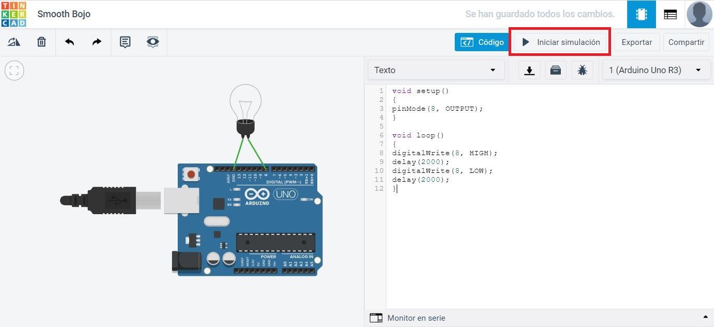

Y comprobarás que la bombilla empieza a parpadear así:

Ya has hecho tu primer programa, uno muy sencillo que solamente controla una bombilla. Sin embargo, los has hecho copiando y pegando un programa que realmente no sabes cómo funciona. En las siguientes páginas lo entenderás.

También tienes que tener presente que el ejemplo que hemos visto es muy sencillo, pero la cosa se puede ir complicando tanto como lo desees. Imagina que además de la bombilla conectas un sensor de presencia al Arduino. Con el programa adecuado podrías crear un sistema automático en el que se enciende una bombilla cuando alguien entra en una habitación. O imagínate que conectas un sensor de luz y un motor además de la bombilla. Podrías crear un sistema que abra o cierre unas persianas en función del nivel de luz que entra en un local.

* * *

Antes de pasar a la siguiente página puede que te preguntes **qué diferencia hay entre el uso de un simulador y de un Arduino real**. La respuesta es que si eres capaz de controlar un circuito con el simulador también serás capaz de hacerlo en un Arduino real. la única diferencia será que para programar un Arduino real, una vez escrito el programa, tendrás que cargarlo (grabarlo) en el microcontrolador. Esto se hace mediante un cable USB como los que se utilizan para conectar las impresoras al ordenador:

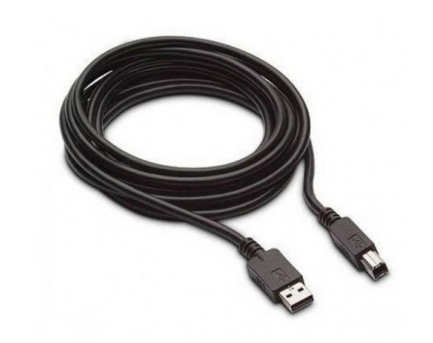

Una vez subido el programa los componentes comenzarán a funcionar como corresponda, igual que sucede en el simulador cuando aprietas el botón _Iniciar simulación_. Es más el último programa que hayas introducido se quedará grabado en la memoria del Arduino hasta que le cargues un nuevo programa distinto.

4\. Conectando componentes a Arduino
------------------------------------

El primer paso para aprender a programar un Arduino es saber cómo se deben conectar los distintos componentes electrónicos que deseamos controlar a los distintos «agujeritos» del Arduino. A partir de ahora, a esos «agujeritos» les vamos a llamar **pines**, que es el nombre que se suele utilizar.

Como ya sabrás, para que cualquier componente electrónico funcione es necesario que circule una corriente eléctrica por él, y las encargadas de generar las corrientes eléctricas de los circuitos son las baterías o pilas. Por tanto, para conseguir que una corriente atraviese un componente lo que hay que hacer es conectar uno de sus terminales al polo positivo de la batería (el cable rojo de la izquierda) y el otro al polo negativo (el cable negro de la derecha):

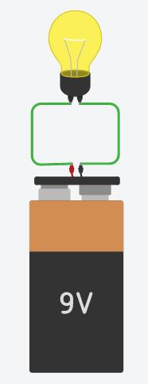

Pues bien, para conectar cualquier componente a Arduino hay que hacer algo parecido. En primer lugar debes fijarte en que hay tres pines del Arduino en los que aparecen las letras **GND**:

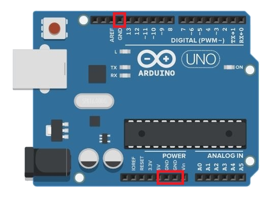

Esas siglas vienen de la palabra inglesa _ground_ que significa tierra (o suelo) en español. Cada uno de **los pines GND son el equivalente al polo negativo de una pila**. Por tanto, siempre que queramos conectar un componente uno de sus terminales tendrá que ir conectado a uno cualquiera de estos pines (ya veremos cómo hacer para conectar apropiadamente más de tres componentes a la vez llegado el momento):

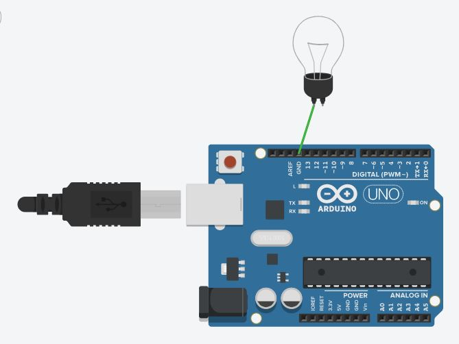

El otro terminal del componente, el que se conectaría al polo positivo en el caso de una batería, tiene que conectarse a uno cualquiera de los pines que se indican en la foto (aunque es preferible evitar el uso del 0 y el 1):

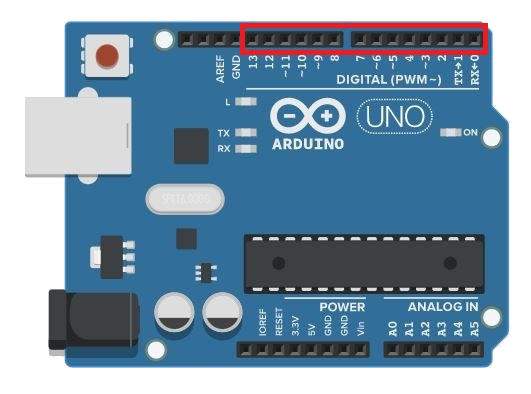

Por ejemplo, en el ejemplo de la página anterior se conectó la bombilla al pin número 8, pero cualquier otro también valdría:

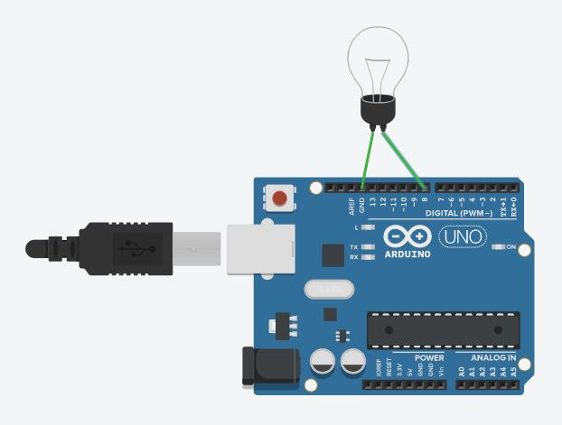

Ahora ya sabes cómo conectar un componente. Si quieres conectar, por ejemplo, un motor habría que hacer lo mismo. Por ejemplo, en la siguiente imagen se ha conectado un motor a un pin GND diferente y al pin número 5:

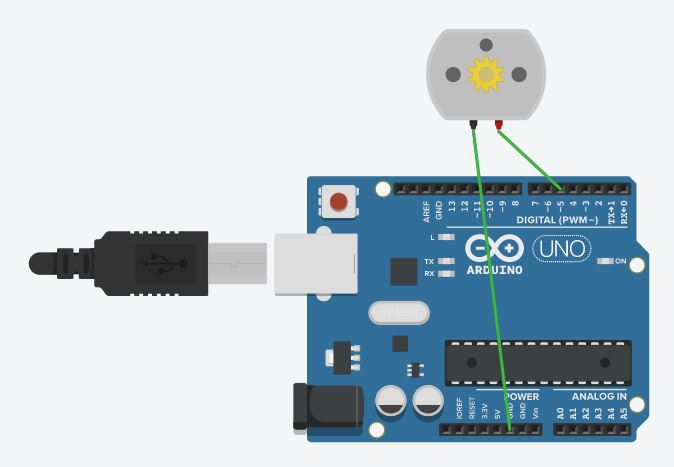

Por último, vamos a recordar cómo se tenían que conectar los LEDs. Un **LED** (del inglés _Light Emitting Diode_) es un tipo de **bombilla que sólo emite luz cuando la corriente circula en un sentido**. Para que un LED se ilumine es necesario que el terminal positivo del LED esté conectado al polo positivo de la pila y que el terminal negativo del LED esté conectado al polo negativo. De esta manera, la corriente circula del terminal positivo al negativo y el LED emite luz, en sentido contrario la corriente es bloqueada y por tanto el LED permanece apagado.

**¿Y cómo se sabe cuál es el terminal positivo del LED?**

Pues muy sencillo, los LEDs reales (imagen izquierda) suelen tener un terminal (patilla) más largo que otro. Precisamente **el terminal más largo es el positivo**. En el simulador de Tinkercad (imagen derecha) los LEDs tienen los terminales muy cortos, pero uno de ellos está doblado, ese es el terminal positivo:

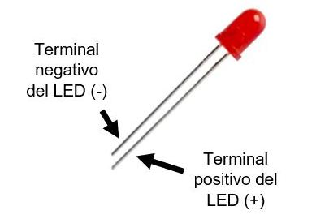

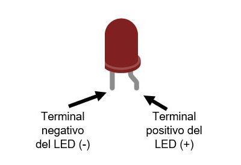

Además, los LEDs tienen la peculiaridad de que **necesitan una resistencia que limite la corriente que circula por ellos**. De lo contrario, si circula más corriente de la adecuada se pueden fundir. En el simulador los LED’s no se fundirán, pero saltará un aviso indicando que es conveniente conectar una resistencia. La resistencia **se puede conectar a cualquiera de las patas del LED**, lo que es necesario respetar es que la pata corta del LED se conecte a un pin GND y la larga a uno de los números. Por tanto, si se quiere conectar un LED, por ejemplo, al pin número 10, las dos conexiones de la imagen serían válidas:

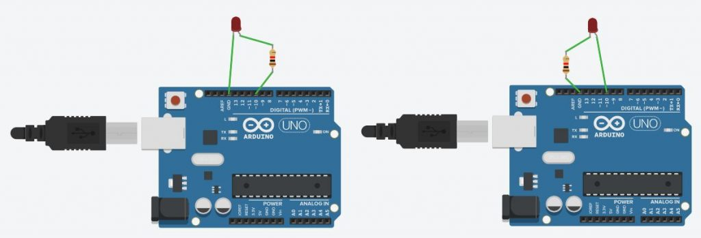

5\. Programación de Arduino
---------------------------

##### Partes de un programa Arduino

Una vez que ya sabes cómo conectar los componentes puedes empezar a controlarlos mediante programas.

Lo primero que tienes que saber es que cualquier programa de Arduino tiene **dos partes**:

*   El **set up** ( )
*   Y el **void loop** ( )

Por eso, hay ciertas líneas que siempre van a estar presentes en un programa de Arduino ya que constituyen la estructura del programa:

`void setup()   {`

`}`

`void loop()   {`

`}`

Es importante no borrar las llaves, «{» y «}», de ambas partes del programa, ya que si se hace se producirá un error y el programa no funcionará. Si por algún motivo se borran puedes o bien copiar y pegar de nuevo el texto azul de arriba o escribirlas con tu teclado (pulsando _AltGr_ y las teclas que se encuentran a la izquierda de la tecla intro).

*   Pues bien, dentro de las llaves del **set up ( )** lo que se hace es indicar en qué pines has conectado los componentes. A esta acción se le denomina **configurar los pines**.
*   Por el contrario, entre las llaves del **void loop ( )** se van a escribir propiamente las órdenes del programa que se le van a dar a los distitos componentes.

* * *

##### Configuración de los pines de Arduino

Como se ha dicho antes, en el **set up ( )** del programa lo que vamos a hacer es indicarle al Arduino donde están conectados los componentes. Y eso se hace con una orden muy sencilla:

_**pinMode(«nº de pin», OUTPUT);**_

Veámoslo con un ejemplo práctico. Si hemos conectado un motor al pin número 7, el set up ( ) del programa debera ser así:

`void setup()`  
`{`  
`pinMode(7,OUTPUT);`  
`}`

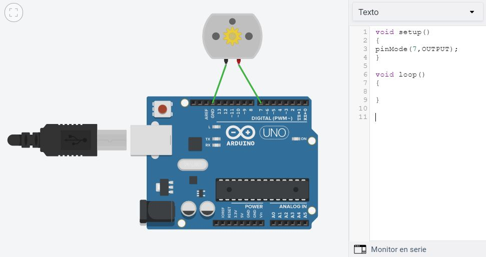

Es decir, lo único que hay que cambiar es el número para que coincida con el pin en el que se ha conectado el componente. En cuanto a la palabra **OUTPUT** (que significa salida en inglés) lo que le indica al Arduino es que el componente que se ha conectado es lo que se denomina un **actuador**. Un actuador es un **componente que aprovecha la energía eléctrica para realizar una acción**. Algunos ejemplos de actuador son: una bombilla (que emite luz al recibir una corriente), un motor (que genera movimiento), un zumbador (que produce sonido)…

De momento todos los componentes que vamos a utilizar son actuadores, así que siempre habrá que escribir la palabra OUTPUT. Más adelante, cuando empecemos a utilizar **sensores**, que son componentes cuya función es medir una magnitud física (temperatura, presión, distancia…) habrá que emplear la palabra **INPUT** (entrada en inglés) en vez de OUTPUT en algunas ocasiones.

* * *

**IMPORTANTE**: el lenguaje de programación es muy preciso y cualquier pequeño cambio puede hacer que nada funcione. Por ejemplo, en la única línea que hemos escrito hasta el momento:

_pinMode(7,OUTPUT);_

Es necesario que la letra M se escriba con mayúsculas, que la palabra OUTPUT también y que no te olvides de escribir el «;» al final de la línea.

* * *

##### Configuración con múltiples componentes

Antes de pasar a escribir las órdenes del programa vamos a ver cómo se configurarían los pines si se conecta más de un componente. Por ejemplo, si se han conectado tres bombillas como en la imagen de abajo (a los pines 12, 6 y 2):

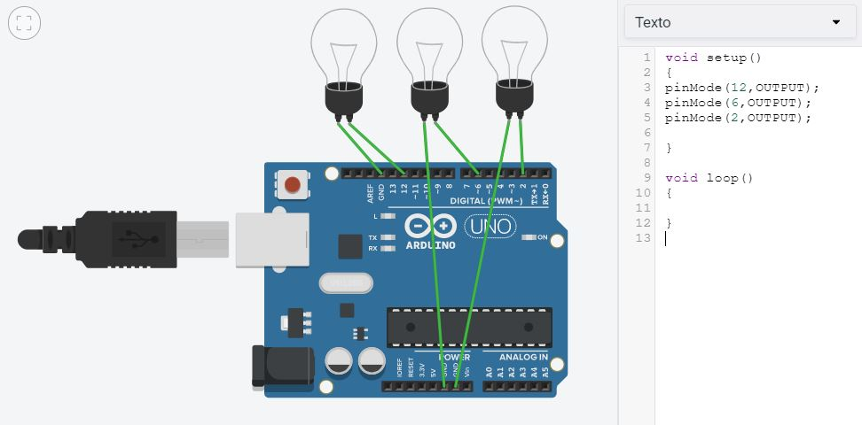

En el set up ( ) del programa habrá que escribir esto:

`void setup()`  
`{`  
`pinMode(12,OUTPUT);`  
`pinMode(6,OUTPUT);`  
`pinMode(2,OUTPUT);`  
`}`

Es decir, habrá que repetir esa línea del programa tantas veces como componentes se hayan conectado al Arduino.

En la siguiente página se verá como se programa la segunda parte de cualquier programa: **el void loop ( )**.

##### Ordenes a un componente

Por fin llegamos a la parte más importante del programa. Como se ha dicho antes, en el **void loop ( )** hay que escribir las órdenes que van a recibir los componentes electrónicos que se han conectado al Arduino. Además, hay algo importante que debes saber: **las órdenes que se escriben dentro del void loop ( ) se repiten una y otra vez indefinidamente (en bucle).**

Las dos primera órdenes que debes conocer son las siguientes:

_**digitalWrite(«nº de pin», HIGH);**_

y

_**digitalWrite(«nº de pin», LOW);**_

La primera es la orden (sustituyendo «nº de pin» por el número correspondiente) es la que deberemos escribir si queremos que salga corriente por un pin del Arduino. La segunda orden hace justo lo contrario, cortar la corriente de un pin determinado.

Por ejemplo, si se quiere encender una bombilla que está conectada al pin número 4, querremos que salga corriente del pin 4 y por tanto habrá que escribir:

`digitalWrite(4, HIGH);`

Si por el contrario se quiere apagar un motor que está conectado al pin número 9, habrá que escribir:

`digitalWrite(9, LOW);`

Es fácil de recordar, ya que **HIGH** significa alto en inglés lo que representa que hay corriente y **LOW** significa bajo, lo que indica que no hay corriente.

La tercera orden que debes conocer es la que hace que el programa se detenga (permanezca sin cambios) durante un cierto tiempo:

**delay(«tiempo»);**

Indicando entre los paréntesis el tiempo que se desea detener el programa. Sólo hay un pequeño detalle a tener en cuenta, y es que el tiempo se debe escribir en **milisegundos**. Por tanto, habrá que escribir:

*   delay(1000); para esperar un segundo.
*   delay(2000); para esperar dos segundos.
*   delay(500); para esperar medio segundo.
*   delay(3250); para esperar 3 segundos y cuarto.
*   …

Por ejemplo, si quieres hacer que un LED conectado al pin 3 parpadee cada medio segundo (medio segundo encendido y medio segundo apagado), tendrás que escribir las siguiente órdenes:

`digitalWrite(3, HIGH);`

`delay(500);`

`digitalWrite(3, LOW);`

`delay(500);`

##### Ejemplos

Ahora ya podemos escribir un programa completo.

**Ejemplo 1: ¿Qué habría que hacer para conseguir que un LED conectado al pin número 6 parpadee cada segundo y medio?**

En primer lugar habría que conectar el LED: la pata larga (doblada) al pin 6 y la corta a uno de los pines GND.

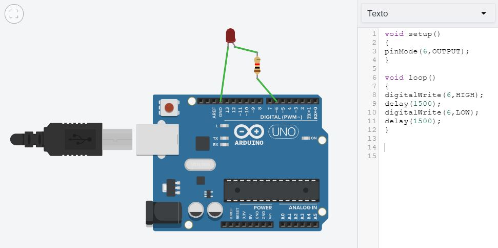

Después escribir el siguiente programa, como se puede ver en la imagen, y hacer click en el botón _Iniciar simulación_:

`void setup()`  
`{`  
`pinMode(6,OUTPUT);`  
`}`

`void loop()`  
`{`  
`digitalWrite(6,HIGH);`  
`delay(1500);`  
`digitalWrite(6,LOW);`  
`delay(1500);`  
`}`

Y este sería el resultado:

* * *

Fíjate en el hecho de que con tan sólo cuatro órdenes el LED parpadea de manera indefinida. Eso se debe a que, como se ha dicho antes, las órdenes que se escriben en el void loop ( ) **se repiten una y otra vez**. Es decir, en este caso, se enciende el led, se mantiene encendido un segundo y medio, se apaga el led, se mantiene apagado un segundo y medio y tras esto vuelve a repetirse la primera orden (encender el LED).

* * *

Ahora te hago la siguiente pregunta **¿qué ocurrirá si con el mismo programa del ejemplo anterior se sustituye el LED por un motor conectado al mismo pin?**

Pues lo que ocurrirá es que el motor girará durante un segundo y medio y después se parará otro segundo y medio, como puedes ver en el gif:

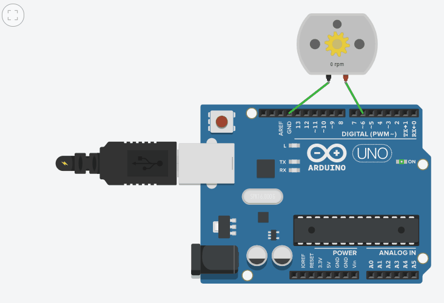

Ten en cuenta que las órdenes que hemos visto lo que hacen es enviar o no enviar corriente eléctrica por un pin determinado. En realidad **no importa que el componente que se conecte a dicho pin sea un LED, un motor, una bombilla o un zumbador**. La orden no cambia, lo único que cambia es el efecto que se produce, ya que cada componente reacciona de diferente manera al paso de corriente (unos emiten luz, otros generan movimiento…).

Con tan sólo las tres órdenes que se han explicado se pueden crear un montón de programas diferentes. Sólo hay que combinarlas adecuadamente y tener en cuenta que el orden en que se escriben es muy relevante, ya que las órdenes se ejecutan de arriba hacia abajo y cuando ya se ha ejecutado la última se vuelve al inicio.

* * *

Tampoco te olvides de ser cuidadoso con la escritura del programa, es muy frecuente que un programa dé error porque se ha olvidado escribir el «;» al final de una línea o porque una letra que debía escribirse con mayúsculas se ha escrito con minúsculas.

* * *

**Ejemplo 2: a continuación se muestra un ejemplo en el que se hace que dos LEDs, uno azul conectado al pin 9 y otro amarillo conectado al pin 12 parpadeen a la vez, pero en este caso no se desea que estén el mismo tiempo apagados que encendidos. Por el contrario, se quiere que estén apagados un segundo y que después se enciendan durante dos segundos.**

En primer lugar hay que conectar los dos LEDs, cada uno con una resistencia:

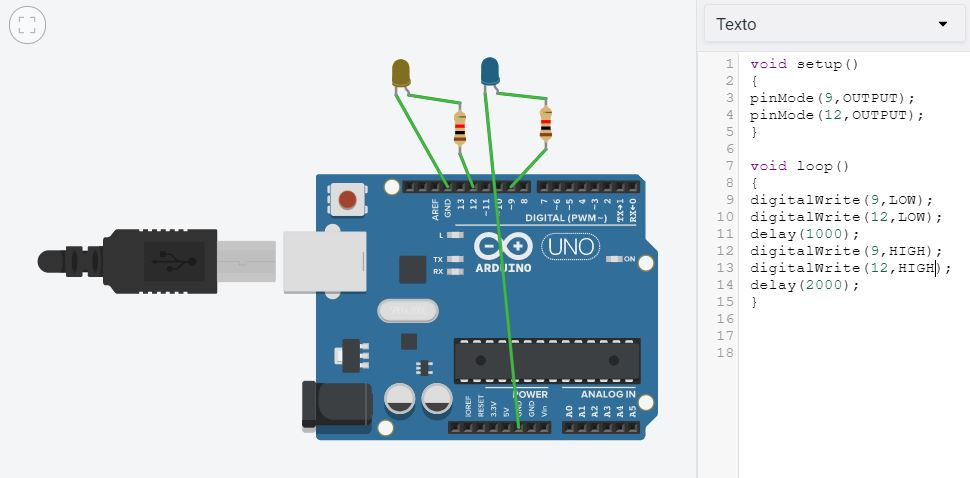

Para cambiar el color de un LED hay que seleccionar el componente y cambiar el color en el menú que aparece:

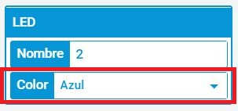

Por último, hay que escribir el siguiente programa en la parte derecha:

`void setup()`  
`{`  
`pinMode(9,OUTPUT);`  
`pinMode(12,OUTPUT);`  
`}`

`void loop()`  
`{`  
`digitalWrite(9,LOW);`  
`digitalWrite(12,LOW);`  
`delay(1000);`  
`digitalWrite(9,HIGH);`  
`digitalWrite(12,HIGH);`  
`delay(2000);`  
`}`

Al hacer click en _Iniciar simulación_ los LEDs parpearán así:

* * *

Te invito a pensar qué programa habría que escribir para conseguir que dos LEDs parpadeen cada dos segundos, pero de forma alternada, como en el siguiente gif. Es decir, cuando uno está encendido el otro está apagado y viceversa:

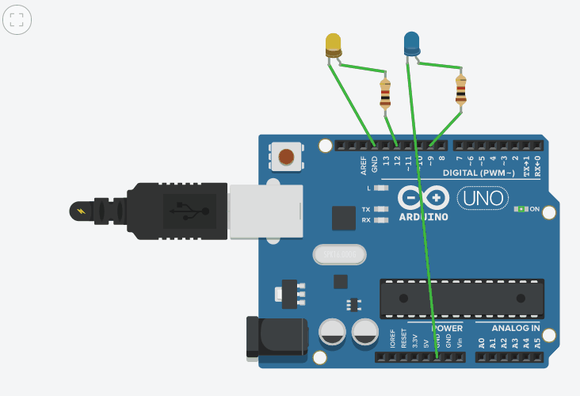

¿Y para conseguir lo mismo, pero con 3 LEDs?

¿Y para que la luz se desplace hacia la izquierda en vez de hacia la derecha y mucho más rápido?

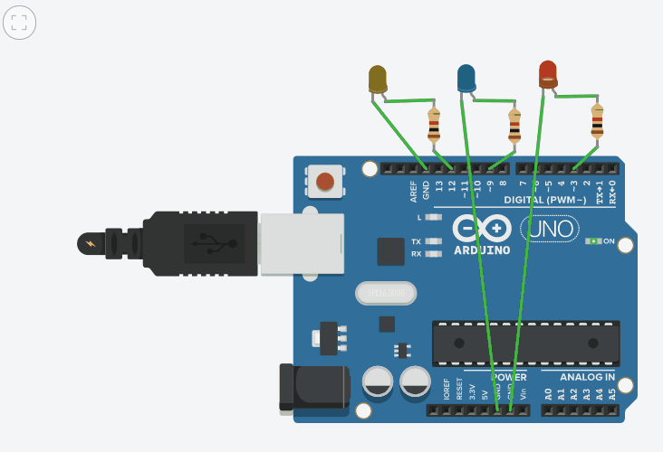

Esos son algunos de los ejercicios que te propopongo ahora que ya sabes como controlar uno y varios LEDs a la vez.

[Ejercicios](https://www.yourtechnologyweb.com/ejercicios-1o-de-bach/ejercicios-de-arduino/)

6\. LED RGB
-----------

##### Que es y como conectar a Arduino

Un LED RGB (_Red-Green-Blue_) es un tipo especial de LED que puede emitir luz de los tres colores primarios: **rojo**, **verde** y **azul**. Este componente electrónico es la base de las **pantallas LED** que actualmente se emplean en televisiones, ordenadores, teléfonos móviles… Todas estas pantallas están compuestas por miles o incluso millones de diminutos LEDs RGB que en función del color o de la mezcla de colores que emiten, forman una u otra imagen.

Puesto que un LED normal dispone de dos terminales (uno positivo y uno negativo) podrías pensar que un LED RGB debe tener seis terminales (2 x 3). Sin embargo, no es así, un LED RGB dispone de **cuatro terminale**s: **tres positivos** (uno por cada color) y **uno negativo**, que es compartido por todos los colores. En la imagen de abajo a la izquierda puedes ver un LED RGB real y a la derecha un esquema que indica a qué terminal corresponde cada color en el simulador que estamos utilizando (aunque en la realidad esto puede cambiar de unos LEDs a otros).

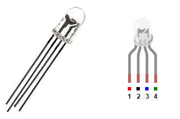

Como hemos dicho antes, este tipo de LED dispone de tres terminales positivos, uno para cada color, por tanto estos deberán conectarse a tres pines diferentes. El terminal restante, el negativo, deberá conectarse a cualquier pin GND. Una **posible conexión** sería la siguiente:

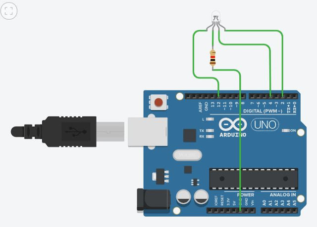

*   El terminal **rojo** al pin **12**.
*   El terminal **verde** al pin **4**.
*   El terminal **azul** al pin **2**.

Pero los terminales de color se podrían haber conectado a cualquier otro pin siempre y cuando el terminal negativo se conecte a un pin GND. Y recuerda, para encontrar cualquier componente en el simulador de _Tinkercad_ basta con escribir su nombre en el buscador del menú de la derecha.

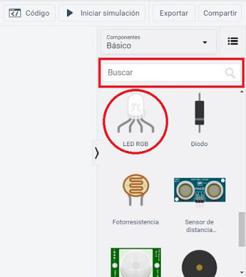

Por último, para que el componente no se estropee y funcione correctamente, es importante **conectar una resistencia** que limite la intensidad que circula por el LED. En un LED normal, como ya se ha visto anteriormente, no importa en qué terminal se conecte la resistencia. Sin embargo, el caso de un LED RGB es un poco particular. Las dos posibilidades de abajo serían válidas:

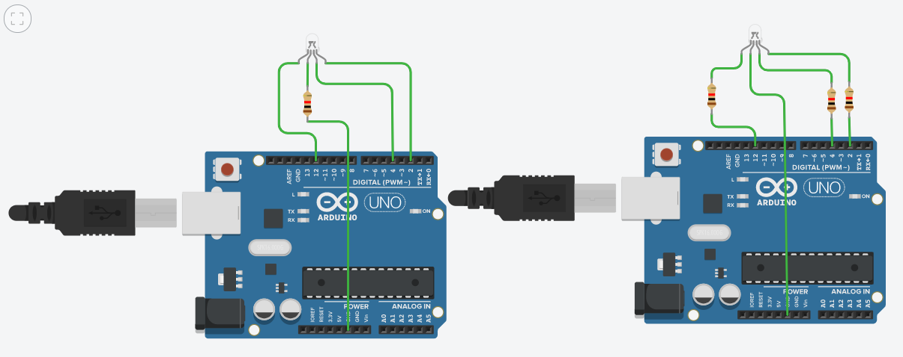

Sin embargo, como puedes imaginarte, la opción de la izquierda es mucho más sencilla y económica, ya que sólo requiere la conexión de una resistencia. La clave está en que **el terminal negativo está compartido por los tres colores** Por ese motivo, es suficiente conectar una resistencia a ese terminal, pues de esa forma la resistencia está afectando a los tres colores. Por el contario, si se conecta a los terminales de color será neceario conectar una resistencia por cada uno de los colores.

* * *

##### Controlando un RGB LED con Arduino

Como se ha dicho al principio, el principal uso de los LEDs RGB es en la fabricación de pantallas. Y para conseguir formar una imagen o un vídeo, que no es más que una sucesión de imágenes, es necesario controlar todos y cada uno de los LEDs de la pantalla. Es decir, es necesario indicarle de qué color debe ser la luz que emita para que la imagen obtenida sea la deseada.

Para ello es necesario indicarle la intensidad con la que debe emitir cada uno de los tres tipos de luz que es capaz de generar: roja, verde y azul. En la siguiente imagen se puede ver el resultado de mezclar dos colores de luz:

Además, si se mezclan los tres colores se obtiene luz blanca. De hecho, una pantalla LED completamente blanca se consigue activando todos los colores de todos los LEDs de la pantalla. Por el contrario, una pantalla negra se consigue apagando todos los colores de todos los LEDs.

Las órdenes necesarias para controlar un LED RGB con Arduino son exactamente las mismas que para controlar un LED normal. A continuación vamos a ver algunos ejemplos en los que el LED se ha conectado como en el ejemplo del apartado anterior:

*   El terminal **rojo** al pin **12**.
*   El terminal **verde** al pin **4**.
*   El terminal **azul** al pin **2**.

##### Ejemplos

**Ejemplo 1: hacer que el LED RBG parpadee con luz azul cada segundo.**

Como se quiere emitir luz azul, que es uno de los colores primarios, bastará con activar el pin del Arduino que se corresponde con el terminal azul del LED, que en este caso es el 4, durante un segundo, y después desactivarlo durante otro segundo:

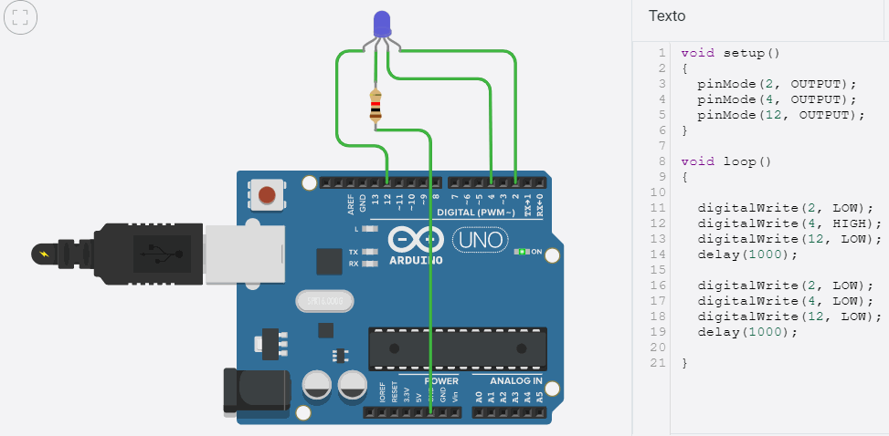

El programa sería el siguiente:

`void setup()   {   pinMode(2, OUTPUT);   pinMode(4, OUTPUT);   pinMode(12, OUTPUT);   }`

`void loop()   {`

`digitalWrite(2, LOW);   digitalWrite(4, HIGH);   digitalWrite(12, LOW);   delay(1000);`

`digitalWrite(2, LOW);   digitalWrite(4, LOW);   digitalWrite(12, LOW);   delay(1000);`

`}`

* * *

**Ejemplo 2: hacer que el LED RBG parpadee con luz amarilla cada dos segundos.**

Para conseguir luz amarilla es necesario mezclar luz roja y verde. Por tanto, será necesario activar el pin 2 (rojo) y el 12 (verde), esperar dos segundos, a continuació apagar los tres colores y esperar otros dos segundos:

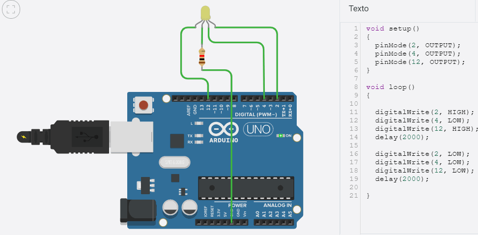

El programa sería el siguiente:

`void setup()   {   pinMode(2, OUTPUT);   pinMode(4, OUTPUT);   pinMode(12, OUTPUT);   }`

`void loop()   {`

`digitalWrite(2, HIGH);   digitalWrite(4, LOW);   digitalWrite(12, HIGH);   delay(2000);`

`digitalWrite(2, LOW);   digitalWrite(4, LOW);   digitalWrite(12, LOW);   delay(2000);`

`}`

* * *

**Nota:** en realidad, para conseguir todos los colores posibles en una pantalla real no basta con indicar qué colores se activan, sino la intensidad con que debe emitirse cada uno de los tres tipos de luz. Eso es lo que se conoce como **código RGB** de un color. El código RGB son tres valores entre el 0 y el 255 que indican qué intensidad de cada color de luz es necesaria para generar ese color. Es muy fácil comprobar el funcionamiento de este código por ejemplo en el cuadro de selección de color de un editor de texto (word, por ejemplo):

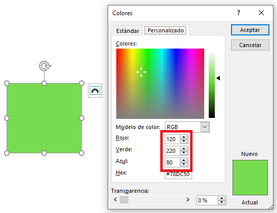

En el **ejemplo 2** la luz **amarilla** que se ha conseguido mezclando luz roja y verde se correspondería con el código RGB: **255, 255, 0** (rojo y verde al máximo y azul apagado):

