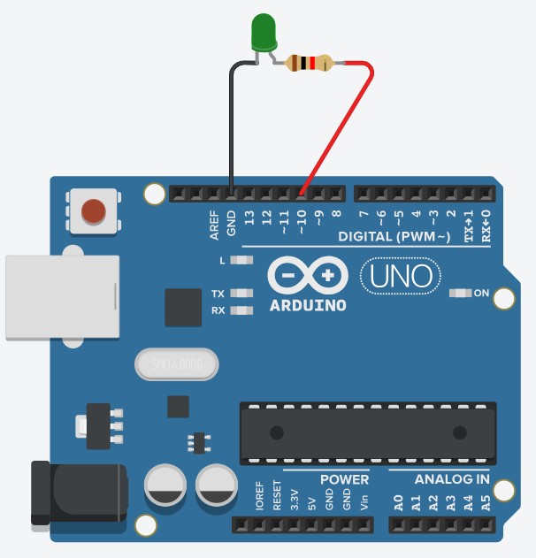
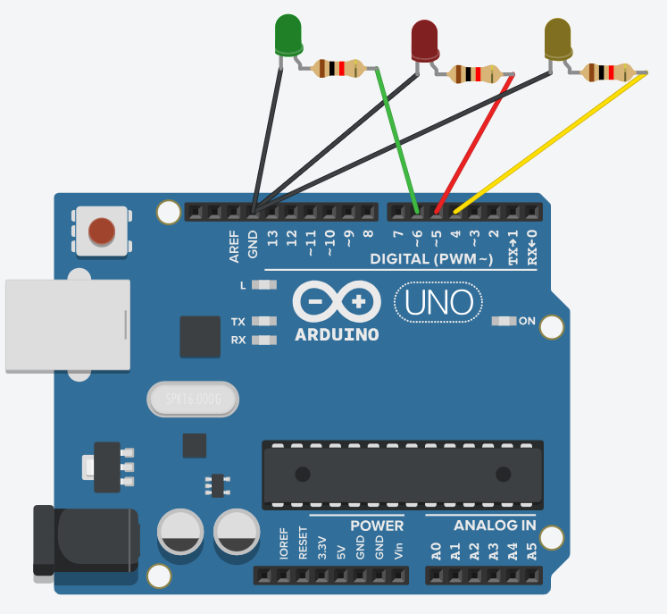
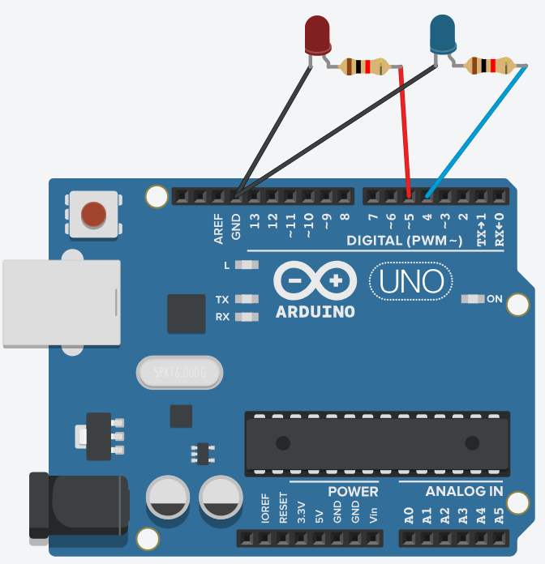
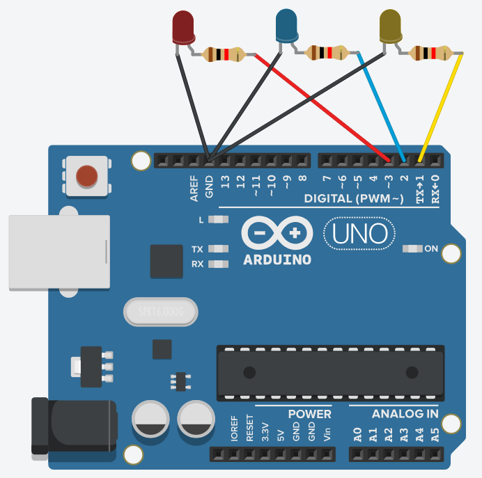
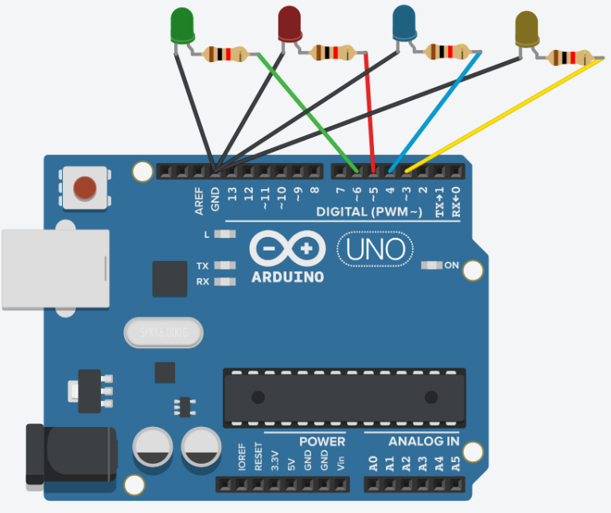
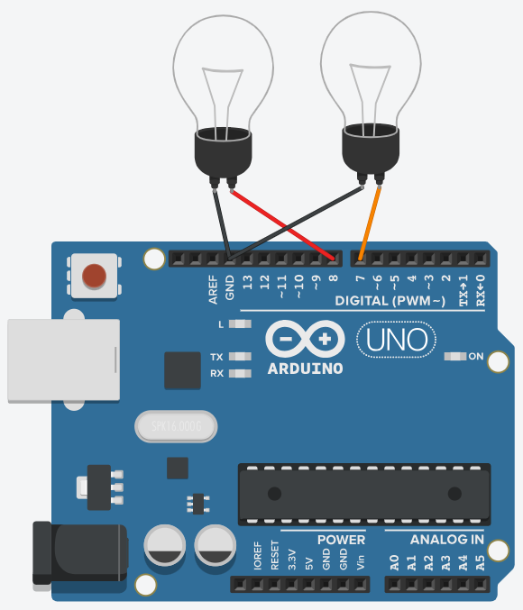
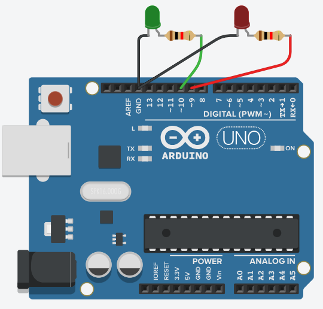

Ejercicios de Arduino con variables, condicionales y bucles
===========================================================

**Uso de variables:**

Una **variable** es un espacio en la memoria del ordenador en el que se puede almacenar un dato. Ese espacio viene identificado por un nombre (nombre de la variable). En general, los nombres de las variables pueden contener letras, símbolos comunes (no tildes, por ejemplo) y números (pero nunca al inicio del nombre).

Para poder untilizar una variable, lo primero que hay que hacer es **declarar esa variable**, es decir, crearla. Para declarar una variable hay que escribir un **identificador** (que dependerá del tipo de dato que se va a almacenar, un espacio y, a continuación, el **nombre**.

|     |     |     |
| --- | --- | --- |
| **Tipo de dato** | **Identificador** | **Ejemplo** |
| Número entero | int | 1, 5, 100… |
| Número decimal | float o double | 1.6, 4.5, 0.76, -1.65 |
| Caracter | char | a, R, +, w… |
| Cadenas de caracteres | String | Hola, numero, contador |

**Ejemplo**: abajo se muestra la orden que se debe incluir en un programa de Arduino para crear una variable de tipo número entero (int) a la que se va a llamar dato. En la línea siguiente, se asigna (guarda) el valor 5 en dicha variable.

```c
int dato;

dato = 5;
```


**Ejercicio 1** **\[fácil\]**

Escribir un programa en el que un LED parpadee cada cierto tiempo. El tiempo que el LED permanece apagado y encendido será el valor que previamente se haya guardado en una **variable llamada `tiempo`**.



* * *

**Ejercicio 2** **\[fácil\]**

Crear un programa similar al del ejercicio anterior, pero, en este caso, se guardará el una variable llamada `encendido` el tiempo que queremos que el LED permanezca encendido y en otra llamada apagado el tiempo que deseamos que esté apagado. El LED debe encenderse 1 segundo y apagarse 2 segundos.

* * *

**Ejercicio 3** **\[fácil\]**

Conectar 3 LEDs de colores distintos (vered, rojo y amarillo) como se muestra en la imagen. A continuación, escribir un programa en el que se guarde en una variable de tipo entero (int) llamada `numero` el número del LED que se quiere encender (Ejemplo: si `numero=4` se encenderá el LED conectado al PIN número 4, el amarillo).



* * *

**Uso de la sentencia condicional if:**

A continuación, vamos a aprender a incluir condiciones en los programas que escribamos. Esto es de gran utilidad, ya que nos permitirá realizar ciertas acciones únicamente cuando se cumpla una condición. Abajo se muestra un ejemplo de la sintaxis que se debe utilizar y una traducción en pseudocódigo a la derecha.

```c
if (numero > 3) digitalWrite(7,HIGH);

// Si el valor de la variable numero es mayor que 3 se enciende el LED conectado al PIN número 7.

if (numero < 3) digitalWrite(7,LOW);

// Si el valor de la variable numero es mayor que 3 se apaga el LED conectado al PIN número 7.

```


También puede ocurrir que deseemos ejecutar varias órdenes seguidas cuando se cumple una condición. En ese caso, deberemos utilizar el símbolo de las llaves { y } para agrupar todas las órdenes. Veamos un ejemplo:


```c

if (numero > 3) {
   digitalWrite(7,HIGH);
   delay(1000);
   digitalWrite(7,LOW);
   delay(1000);

// Si el valor de la variable numero es mayor que 3 se el LED conectado al PIN número 7 parpadeará encendiéndose y apagándose cada segundo (1000ms).
}

if (numero < 3) {
   digitalWrite(7,HIGH);
   delay(500);
   digitalWrite(7,LOW);
   delay(500);

// Si el valor de la variable numero es menor que 3 se el LED conectado al PIN número 7 parpadeará encendiéndose y apagándose cada medio segundo (500ms)._
}
```


Para escribir las condiciones de la sentencia if es necesario recurrir a una serie de símbolos que se indican a continuación:

|     |     |     |     |
| --- | --- | --- | --- |
| **Símbolo** | **Significado** | **Símbolo** | **Significado** |
| \>  | Mayor que | \== | Igual que |
| <   | Menor que | !=  | Distinto que |
| \>= | Mayor o igual que | \| \| (Alt Gr + 1) | o |
| <=  | Menor o igual que | && (Mayús + 6) | y |

Veamos algunos ejemplos:

a) _if(dato>5)_

b) _if(numero==10)_

c) _if(tiempo!=0)_

d) _if(temperatura<=25)_

e) _if(precio>100&&precio<200)_

f) _if(distancia<4| |distancia>8)_

a) _Si la variable dato es mayor que 5._

b) _Si la variable numero vale 10._

c) _Si la variable tiempo tiene un valor distinto de 0._

d) _Si la variable temperatura vale 25 o menos._

e) _Si la variable precio es mayor que 100 y menor que 200 (es decir, si está entre 100 y 200)._

f) _Si la variable distancia es menor que 4 o mayor que 8._

* * *

**Ejercicio 4** **\[fácil\]**

Conectar dos LEDs en los pines 4 y 5 de Arduino, como se muestra en la imagen. A continuación, escribir un programa que haga lo siguiente:

*   Si el valor de una variable llamada distancia es menor que 5, se encenderá el LED rojo.
*   Si el valor de la variable distancia es mayor que 5 se encenderá el LED azul.
*   Si el valor de la variable distancia es 5, se encederán ambos LEDs.



* * *

**Ejercicio 5** **\[medio\]**

Con la misma conexión del ejercicio anterior (se puede duplicar un proyecto haciendo click en el símbolo de la rueda dentada y haciendo _click_ en Duplicar) modificar el programa para que haga lo siguiente:

*   Si el valor de una variable llamada distancia es menor que 10, parpadeará el LED rojo con un _delay_ de medio segundo.
*   Si el valor de una variable llamada distancia es mayor que 20, parpadeará el LED azul con un _delay_ de medio segundo.
*   Si el valor de la variable distancia está entre 10 y 20 (ambos incluidos) ambos LEDs parpaderán con un _delay_ de un segundo.


* * *

**Ejercicio 6** **\[fácil\]**

Conectar tres LEDs a los pines 1, 2 y 3 de Arduino, como en la imagen. A continuación, crear un programa utilizando la sentencia condicional `if` con el que encienda el número de LEDs que previamente se ha indicado en una variable llamada `encendidos` (ejemplo: si `encendidos=2` se encenderán los 2 primeros LEDs, si `encendidos=0`, no se encenderá ningún LED).



* * *

**Ejercicio 7** **\[fácil\]**

Conectar 4 LEDs de colores distintos (verde, rojo, azul y amarillo) como se muestra en la imagen. A continuación, crear un programa en el que se guardará en una variable llamada `color` el color del LED que queremos que se encienda (ejemplo: si `color = rojo` se deberá encender únicamente el LED rojo).



* * *

**Ejercicio 8** **\[medio\]**

Conectar dos bombillas como en la imagen. A continuación, crear un programa, con una variable llamada hora de tal manera que ambas bombillas estén apagadas cuando la hora está entre las 7 y las 19 (cuando hay luz del sol). Entre las 21 y las 5 ambas bombillas deben estar encendidas (cuando es completamente de noche). Por último, en las horas intermedias, sólo se encenderá una bombilla.



* * *

**Uso de sentencias if anidadas: uso de else y else if:**

Cuando se desean incluir varias sentencias if, una a continuación de la otra, resulta útil emplear las sentencias else y else if.

Abajo se muestra un **ejemplo de la sentencia else**. Esta sentencia sirve para indicar qué debe ocurrir cuando se cumpla una condición y en caso de que esta no se cumpla, por ese motivo, no se debe incluir ninguna condición específica:


```c
if (dato == 1) {
    digitalWrite(3,HIGH);
    digitalWrite(7,LOW);

// Si el valor de la variable dato es 1, se enciende el componente del PIN 3 y se apaga el componente del PIN 7.
}

else {
    digitalWrite(3,LOW);
    digitalWrite(7,HIGH);

// En caso contrario, se apaga el componente del PIN 3 y se enciende el componente del PIN 7.

}
```

Y, a continuación se muestra un ejemplo de uso de la sentencia else if, que resulta útil cuando existen muchas condiciones posibles\*.

_\*La ventaja de utilizar else if en vez de if es que una vez que se ha entrado en una de las condiciones, no se seguirán comprobando las demás condiciones, sino que se saltarán._

```c
if (dato == 1) {
    digitalWrite(1,HIGH);
    digitalWrite(2,LOW);
    digitalWrite(3,LOW);
    digitalWrite(4,LOW);

// Si el valor de la variable dato es 1, se encenderá únicamente el componente conectado al PIN 1
}

else if (dato == 2) {
    digitalWrite(1,LOW);
    digitalWrite(2,HIGH);
    digitalWrite(3,LOW);
    digitalWrite(4,LOW);

// Si el valor de la variable dato es 2, se encenderá únicamente el componente conectado al PIN 2.

}

else if (dato == 3) {
    digitalWrite(1,LOW);
    digitalWrite(2,LOW);
    digitalWrite(3,HIGH);
    digitalWrite(4,LOW);

// Si el valor de la variable dato es 3, se encenderá únicamente el componente conectado al PIN 3.

}

else {
    digitalWrite(1,LOW);
    digitalWrite(2,LOW);
    digitalWrite(3,LOW);
    digitalWrite(4,HIGH);

// Si el valor de la variable dato no es ni 1, ni 2, ni 3, se encenderá el componente conectado al PIN 4.

}
```
* * *

**Ejercicio 9** ****\[fácil\]****

Conectar una bombilla al pin número 3 y un motor de corriente continua (**motor de CC**, en Tinkercad) al pin número 4. A continuación, escribir un programa en el que se encienda la bombilla y se apague el motor si una variable llamada luz vale 1 y que se apague la bombilla y se encienda el motor si la variable luz tiene cualquier otro valor.

* * *

**Ejercicio 10** ****\[fácil\]****

Conectar una bombilla al PIN número 5 y hacer que se encienda cuando se guarde la palabra encender en una variable tipo String llamada estado. Para cualquier otro valor de la variable estado la bombilla debe permanecer apagada.

* * *

**Ejercicio 11** **\[medio\]**

Conectar 4 LEDs a los pines 1, 2, 3 y 4 y escribir un **programa con if, else if y else** de tal manera que se cumpla lo siguiente en función del valor de la variable luz:

*   Si luz es igual a 0 se apagarán todos los LEDs.
*   Si luz es igual a 1, parpadeará (con medio segundo de delay) el LED del pin 1.
*   Si luz es igual a 2, parpadeará (con medio segundo de delay) el LED del pin 2.
*   Si luz es igual a 3, parpadeará (con medio segundo de delay) el LED del pin 3.
*   Si luz es igual a 4, parpadeará (con medio segundo de delay) el LED del pin 4.
*   Si luz tiene cualquier otro valor, deberán parpadear los 4 LEDs a la vez.

* * *

**Ejercicio 12** **\[medio\]**

Se quiere hacer un programa con el que se active un motor de corriente continua, conectado al PIN 2, cuando se presionen dos botones a la vez (medida de seguridad). Además, cuando sólo se pulse uno de los botones, deberá encenderse un LED rojo conectado al PIN 7, a modo de señal de emergencia. En el programa existen dos variables: boton1 y boton2, que serán de tipo entero (int). Cuando se presiona un botón, la variable correspondiente a ese botón valdrá 1 y cuando no se apriete valdrá 0. Escribir el programa correspondiente.

* * *

**Uso del bucle while (mientras):**

Cuando se desea repetir una orden o una serie de órdenes **mientras** se cumpla una condición, se puede emplear la sentencia while. Abajo se muestra un ejemplo en el que un LED rojo parpadea 5 veces (cada medio segundo) y después pasa a parpadear, indefinidamente, un LED verde (cada segundo). En este caso, la condición del bucle while es que la variable veces sea menor o igual que cinco, ya que deseamos que el LED rojo parpadee 5 veces únicamente\*.

_Hay que destacar que la variable veces se ha creado al inicio del programa, no dentro del loop, de tal manera que no se le vuelve a dar el valor cero cada vez que vuelve a ejecutarse el loop._

La conexión es la siguiente:



Y el programa es:


```c
int veces;
veces=1;

void setup() {
    pinMode(8,OUTPUT);
    pinMode(9,OUTPUT);
}
void loop() {
    while(veces<=5){
        digitalWrite(8,HIGH);
        delay(500);
        digitalWrite(8,LOW);
        delay(500);
    veces=veces+1;
}
    digitalWrite(9,HIGH);
    delay(1000);
    digitalWrite(9,LOW);
    delay(1000);

}
```

Se crea una variable entera, llamada `veces`, a la que se da un valor inicial de 1.

Mientras la variable veces tenga un valor menor o igual que 5, parpadeará el LED rojo (PIN 8) con un `delay` de medio segundo.

Tras cada parpadeo, el valor de la variable veces se incrementará en una unidad `(veces=veces+1)`. Si no se incluyera esta orden, la variable veces siempre valdría 1 y nunca se saldría del bucle while.

_Esta orden también se puedes escribir, de manera abreviada como `veces++`._

Por último, cuando la variable veces llegue a 5, el programa saldrá del bucle while y ya nunca más volverá a entrar en él, quedando el LED verde parpadeando ininterrumpidamente.

**Nota: puedes comprobar (modificando el programa y ejecutándolo) cómo, la función del bucle while es distinta de la de la sentencia if, ya que, una vez que se entra en un bucle while, no se sale de este hasta que deja de cumplirse la condición, cosa que no ocurre con la sentencia if.**

**Si, en este mismo programa, sustituyéramos el while por un if, el LED rojo también parpadearía únicamente cinco veces (igual que antes), la diferencia estaría en que, entre medias, también parapadearía el LED verde, ya que después de ejecutarse el if se ejecutaría las órdenes que hacer parpadear al LED verde.**

* * *

**Ejercicio 13** ****\[medio\]****

Crear un programa con dos LEDs, conectados como en el ejemplo de arriba, de tal manera que ambos parpadeen 10 veces, con un delay de 300 milisegundos, y a continuación se queden permanentemente encendidos.

* * *

**Ejercicio 14** **\[medio\]**

Con la misma conexión del ejercicio anterior, escribir un programa en el que, primero, se encienda el LED del PIN 8 durante 5 segundos y, a continuación, se apague y el LED del PIN 9 empiece a parpadear para siempre (con un delay de 1 segundo).

* * *

**Ejercicio 15** **\[medio\]**

Con la misma conexión del ejercicio anterior, escribir un programa en el que, primero, el LED del PIN 8 parpadee 5 veces y, a continuación, se apague y el LED del PIN 9 empiece a parpadear para siempre (con un delay de medio segundo).

* * *

**Uso del bucle for (para):**

Cuando se desea repetir una orden o un conjunto de órdenes un número concreto de veces (3, 4, 5…) normalmente la mejor opción es utilizar un bucle for. La sitnaxis del bucle for en la siguiente:

```c
for (int i=1 ; i<=10 ; i=i+1){

// órdenes que se desean ejecutar_

}
```
Como puedes ver, tras la palabra `for` se deben abrir paréntesis y, dentro, incluir **tres apartados separados por _punto y coma_**:

1.  Crear una variable (habitualmente entera, int, que en el ejemplo se ha llamado `i`) y darle un valor inicial (en el ejemplo se h dado el valor 1).
2.  Indicar hasta que valor de la variable creada debe repetirse el bucle (en el ejemplo se repetirá hasta que la variable `i` valga 10).
3.  Indicar cómo se debe modificar la variable `i` cada vez que se ejecuta el bucle (en el ejemplo, cada vez que se ejecuten las órdenes del bucle, la variable `i` se incrementará en una unidad).

En función de los valores que se introduzcan entre paréntesis, se logrará repetir las órdenes del bucle un número de veces determinado.

Veamos un ejemplo:


```c
//dentro del loop

for(int a=1;a<=6;a=a+2){
    
    digitalWrite(8,HIGH);
    delay(500);
    digitalWrite(8,LOW);
    delay(500);

}
```

En el bucle for de la izquierda, se crea una variable, llamada `a` a la que se da un valor inicial de 1.

El bucle se repetirá mientras la variable a valga 6 o menos.

Cada vez que se ejecuta el bucle, la variable `a` se incrementará en dos unidades.

Esos parámetros harán que el LED del PIN número 8 parpadee 3 veces seguidas,la primera vez, la variable `a` vale 1, la segunda vez, vale 3 y la tercera vez 5. A la siguiente repetición, ya valdría 7, por lo que no se ejecutarían las órdenes.

* * *

**Ejercicio 16** ****\[fácil\]****

Con la misma conexión del apartado anterior, hacer un programa en el que, primero, el LED conectado al PIN 8 parpadee 15 veces (con un _delay_ de medio segundo) y, a continuación, el LED del PIN 9 parpadee 5 veces. Esta secuencia se repetirá indefinidamente (5-15-5-15-5…).

**Nota: dentro del loop no debe haber más de 10 órdenes (12 si cuentas los bucles `while`).**

* * *

**Ejercicio 17** ****\[fácil\]****

Conectar un único LED al PIN número 5 y hacer que parpadee 5 veces con un delay de 200ms, 5 veces con un delay de 300ms, 5 veces con un delay de 400ms y 5 veces con un delay de 500ms. Tras esto, la secuencia debe repetirse.

* * *

**Ejercicio 18** **\[medio\]**

Conectar un LED al pin número 5 y hacer que parpadee 20 veces, pero cada vez más rápido. Debe empezar parpadeando con un delay de 100ms, después 200ms, después 300ms… y así sucesivamente hasta llegar a los 2 segundos. El programa dentro del _loop_ no debe ocupar más de 5 líneas.

Una vez que el delay haya llegado a los dos segundos, la secuencia debe repetirse (100, 200, 300…).