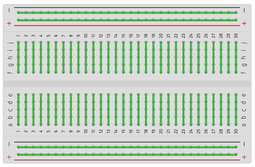
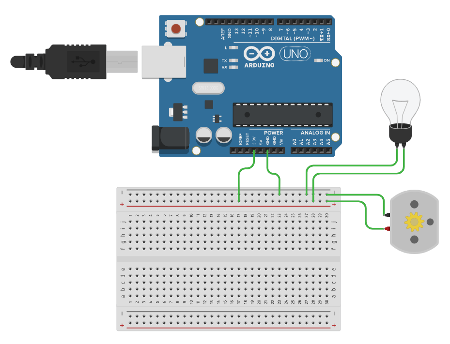
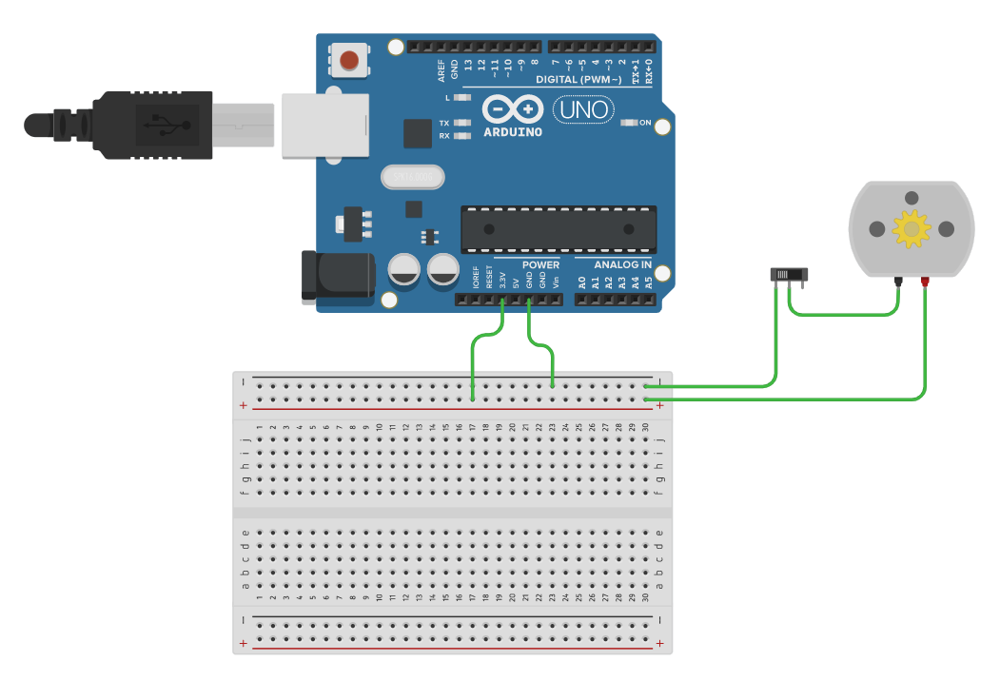
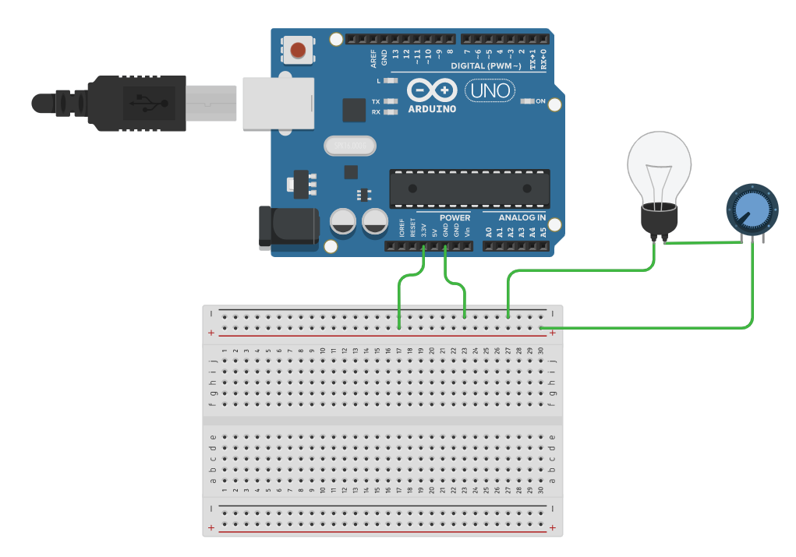
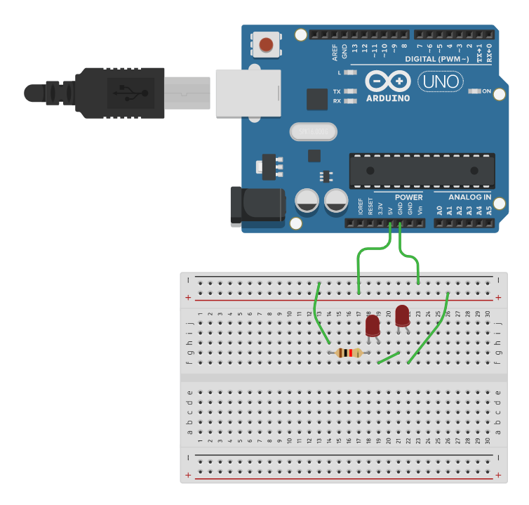
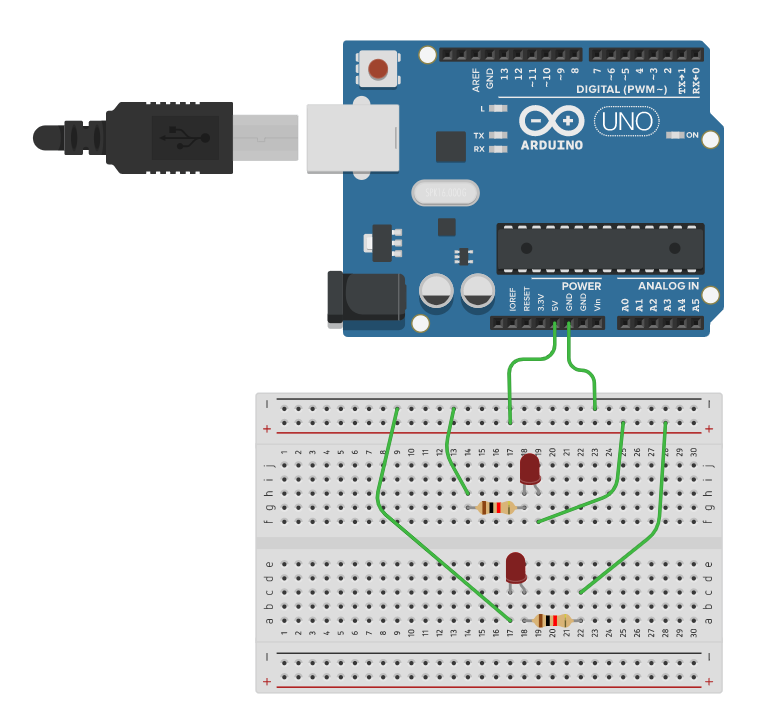

**Bloque 1:**

Antes de nada hay que recordar cómo funciona una placa de conexiones (**breadboard** en inglés) como la de abajo. En la imagen se puede ver qué pines (agujeros) están conectados entre sí. Por tanto, cuando se deseen unir los terminales de dos componentes estos se deberán insertar en pines pertenecientes a la misma línea.

* * *

**Ejercicio 1** **\[fácil\]**

Conectar los componentes del circuito y responder a las preguntas:

*   ¿Qué tipo de componente se esta utilizando? ¿Cuál es su símbolo eléctrico?
*   ¿Qué ocurre si se intercambian las conexiones del motor (conectando el cable negro a 3,3V y el rojo a GND)?

* * *

**Ejercicio** **2** **\[fácil\]**

Conectar los componentes del circuito y responder a las preguntas:

*   ¿Qué tipo de componentes se están utilizando? ¿Cuál es su símbolo eléctrico?
*   ¿Están conectados en serie o en paralelo?
*   En ese tipo de conexión la intensidad / voltaje es igual en ambos componentes (redondear la palabra correcta).

* * *

**Ejercicio** **3:** **\[fácil\]**

Conectar los componentes del circuito y responder a las preguntas:

*   ¿Están conectados en serie o en paralelo?
*   En ese tipo de conexión la intensidad / voltaje es igual en ambos componentes (redondear la palabra correcta).

* * *

**Ejercicio 4:** **\[fácil\]**

Conectar los componentes del circuito y responder a las preguntas:

*   ¿Qué ocurre si se emplean los terminales de la izquierda y de la derecha del interruptor en vez de usar el del centro? Explicar por qué.

* * *

**Ejercicio** **5:** **\[fácil\]**

Conectar los componentes del circuito y responder a las preguntas:

*   ¿Qué componente se está empleando para variar el brillo de la bombilla? ¿Cuál es su símbolo eléctrico?
*   Es posible modificar el programa para que el brillo de la bombilla aumente cuando el cursor se gira hacia la derecha?

* * *

**Ejercicio** **6:** **\[fácil\]**

Conectar los componentes del circuito y responder a las preguntas:

*   ¿Cuál es la función de la resistencia? ¿Cuál es su símbolo eléctrico?
*   A qué polo (positivo – 3,3V o negativo – GND) hay que conectar el terminal más largo del LED para que este conduzca corriente y se ilumine?
*   ¿Existe alguna diferencia entre conectar la resistencia antes o después del LED?

* * *

****Ejercicio**** **7:** **\[fácil\]**

Conectar los componentes del circuito y dibujar su esquema eléctrico.

* * *

**Ejercicio** **8:** **\[fácil\]**

Conectar los componentes del circuito y dibujar su esquema eléctrico.

* * *