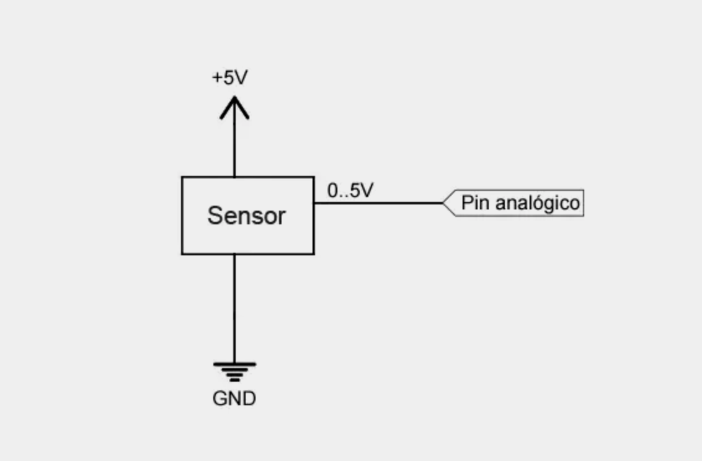
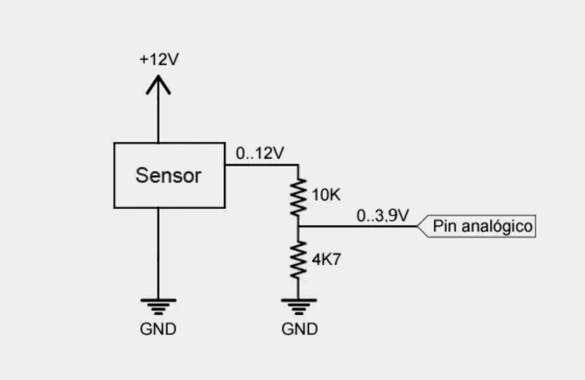

Entradas analógicas en Arduino

- [Entradas analógicas en Arduino](#entradas-analógicas-en-arduino)
  - [¿Qué es una entrada analógica?](#qué-es-una-entrada-analógica)
  - [Precisión de la medición](#precisión-de-la-medición)
    - [Precisión relativa](#precisión-relativa)
    - [Referencia de tensión analógica (aref)](#referencia-de-tensión-analógica-aref)
  - [Conexión de entradas analógicas en Arduino](#conexión-de-entradas-analógicas-en-arduino)
  - [Código en Arduino](#código-en-arduino)
  - [Frecuencia de muestreo](#frecuencia-de-muestreo)
  - [Lectura de valores mayores de 5V](#lectura-de-valores-mayores-de-5v)
    


Entradas analógicas en Arduino
==============================

En entradas anteriores hemos visto cómo emplear las [entradas digitales](/entradas-digitales-en-arduino/) de nuestro Arduino. En esta entrada vamos a ver las _**entradas analógicas**_, su funcionamiento y características.

Las entradas analógicas funcionan de una forma similar a las entradas digitales, por lo que en la práctica el montaje y código final son muy similares.

Sin embargo, internamente, **en muchos aspectos son radicalmente distintos**. Por lo que para entender correctamente su uso y funcionalidad es necesario veamos un mínimo de teoría.

¿Qué es una entrada analógica?
------------------------------

Las entradas analógicas trabajan con señales analógicas. Así que antes tenemos que ver **qué es una señal analógica** _(y sus diferencias con las señales digitales)_.

Una señal analógica es una magnitud que **puede tomar cualquier valor dentro de un intervalo –Vcc y + Vcc**. Por ejemplo, una señal analógica de tensión entre 0V y 5V podría valer 2,72V, o 3.41V _(o cualquier otro valor con cualquier número de decimales)_.

Por contra, recordemos que una señal digital de tensión teórica únicamente podía registrar dos valores, que denominamos `LOW` y `HIGH` _(en el ejemplo, 0V o 5V)_.

Por norma general en los autómatas **las entradas analógicas son más escasas, más lentas y más caras** que las entradas digitales. En el caso de Arduino uno disponemos de un número variable de entradas analógicas, que en el caso de Arduino Uno y Mini Pro son 6, y en el Arduino Mega son 16.

Este es un número más que respetable de entradas analógicas, que rivaliza o supera a autómatas tradicionales de coste muy superior _(las entradas analógicas suelen ser caras)_.

Es importante entender que en el mundo real cualquier señal de tensión, que podemos medir, va a ser siempre analógica. Un valor digital es un concepto, una abstracción.

Como vimos al explicar las entradas digitales, una entrada digital es un proceso de transformación a digital. Para ello se atribuye un valor `HIGH` a las medidas que superen un valor umbral, y `LOW` a lo que quedan por debajo.

Pues bien, las entradas analógicas **proporcionan una medición codificada en forma de un número digital** _(por ejemplo de 0 a 255)_.

Es decir, la medición que proporciona una entrada analógica también es un valor digital, **por lo que igualmente es una abstracción**. Esto nos lleva al concepto de precisión de la medición 👇.

Precisión de la medición
------------------------

Para entender la precisión de una entrada analógica es necesario entender cómo funciona un _**conversor analógico digital (ADC)**_, que es su componente fundamental. **Un ADC es un dispositivo que convierte una medición analógica en una medición digital codificada con un número N de bits**.

Existen muchas formas de construir un ADC, pero lo importante es entender que en realidad no medimos el valor analógico con todos sus decimales, sino que lo “clasificamos” dentro de 2^N niveles, que definen 2^N-1 intervalos.

**El ancho de este intervalo medido en mV es la precisión de la señal**. Cuanto mayor sea el número de bits, mayor será el número de intervalos, menor será el ancho del intervalo, y por tanto mejor la precisión de la medición.

En el caso de Arduino Uno, Mini Pro, y Mega, las entradas analógicas disponen de 10 bits de resolución, lo que proporciona 1024 niveles digitales, lo que a 5V **supone una precisión de la medición de +-2,44mV**. Arduino Due tiene una resolución de 12bits, 4096 niveles digitales, lo que supone una precisión de 0,61 mV.

### Precisión relativa

Hasta ahora hemos supuesto un autómata alimentado entre 0V y 5V, que mide una señal analógica de tensión entre 0V a 5V. En este caso, con un ADC de 10 bit tenemos una precisión de 4,88mV, **lo que supone una precisión relativa respecto a la señal de entrada de 0,1% (1/1024)**.

Sin embargo, supongamos que medimos una señal que varía entre 0V y 1V. En este caso, con el mismo ADC de 10 bit tendríamos la misma precisión absoluta de 4,88mV, pero una menor precisión relativa respecto a la señal, que caería hasta 0,5%.

Es decir, **si realizamos una medición a una señal que varía en un límite inferior a Vcc estamos perdiendo precisión relativa**. Esto es la consecuencia de no aprovechar todo el rango de la medición, por lo que en realidad el ADC se comporta como si tuviera un número inferior de bits.

### Referencia de tensión analógica (aref)

Para resolver esta situación Arduino permite cambiar la tensión tomada como referencia por el conversor analógico digital. El valor de la referencia se cambia con la función AnalogRef, y los valores posibles son:

*   `DEFAULT`: Valor por defecto, correspondiente con Vcc (5V o 3.3V, según modelos)
*   `INTERNAL`: Corresponde a 1.1V (en Atmega 168 y 328)
*   `EXTERNAL`: Voltaje aplicado de forma externa en el pin Vref (siempre entre 0 y Vcc)
*   `INTERNAL1V1` y `INTERNAL2V56`, correspondientes a 1.1V y 2.56V (sólo en Mega)

En el caso de usar la referencia de tensión externa (`EXTERNAL`), si sabemos con total seguridad que una señal no va a superar de un cierto valor de tensión, por ejemplo 0.7V, **podemos proporcionar este valor como referencia a través del Pin Aref**. La medición se realizará tomando esta tensión como referencia en lugar de Vcc, por lo que recuperamos toda la precisión relativa.

Si modificamos la tensión de referencia, debemos definir el modo mediante la función AnalogRef **antes de realizar cualquier lectura analógica**.

En caso de introducir un valor de tensión en el pin Aref **no debemos superar este valor en las entradas analógico**. Además, en ningún caso superaremos **la tensión de alimentación de Arduino**. De lo contrario podríamos dañar los pines analógicos.

Conexión de entradas analógicas en Arduino
------------------------------------------

Supongamos que dispongamos un sensor analógico que proporciona una señal analógica entre 0V a 5V. El esquema de conexión es similar al que empleamos para realizar la lectura digital.



Código en Arduino
-----------------

El código para realizar la lectura es realmente sencillo, y similar al que vimos para las entradas digitales. Simplemente realizamos la lectura mediante AnalogRead() y almacenamos el valor devuelto.
```c
    const int sensorPin = A0;    // seleccionar la entrada para el sensor
    int sensorValue;     // variable que almacena el valor raw (0 a 1023)
    
    void setup()
    {
      Serial.begin(9600);
    }
    
    void loop() 
    {
      sensorValue = analogRead(sensorPin);   // realizar la lectura
    
      //mandar mensaje a puerto serie en función del valor leido
      if (sensorValue > 512) 
      {
        Serial.println("Mayor que 2,5V");
      }
      else 
      {
        Serial.println("Menor que 2,5V");
      }
      delay(1000);
    }
```

El valor devuelto por la función AnalogRead() se codifica como un número entero 0 a 1023. En caso de querer convertir este valor en un valor de tensión podemos usar la siguiente variación:
```c
    const int sensorPin = A0;   // seleccionar la entrada para el sensor
    int sensorValue;      // variable que almacena el valor raw (0 a 1023)
    float value;        // variable que almacena el voltaje (0.0 a 5.0)
    
    void setup() 
    {
      Serial.begin(9600);
    }
    
    void loop() 
    {
      sensorValue = analogRead(sensorPin);        // realizar la lectura
      value = fmap(sensorValue, 0, 1023, 0.0, 5.0);   // cambiar escala a 0.0 - 5.0
    
      Serial.println(value);              // mostrar el valor por serial
      delay(1000);
    }
    
    // cambio de escala entre floats
    float fmap(float x, float in_min, float in_max, float out_min, float out_max)
    {
      return (x - in_min) * (out_max - out_min) / (in_max - in_min) + out_min;
    }
```

Sin embargo tener en cuenta que las operaciones en coma flotante (con decimales) son mucho más lentas que con enteros por lo que **intentar evitar tener que realizar esta conversión** y trabajar siempre que sea posible con números enteros.

Frecuencia de muestreo
----------------------

Con el código empleado **la frecuencia de muestreo es aproximadamente 9600 Hz**, es decir, unos 100 micro segundos para la medición.

En comparación, la función digitalRead tiene una frecuencia de 15000Hz, unos 66 micro segundos por medición, levemente más rápido.

Peeero… mediante otros códigos la lectura analógica puede aumentarse hasta aproximadamente 1,5 Mhz, o 660 nano segundos por entrada.

Mientras que _(jugueteando)_ las entradas digitales pueden acelerarse hasta casi 15 Mhz, 66 nano segundos, leyendo todas las entradas de forma simultánea.

Por lo tanto, vemos que realmente **las entradas digitales pueden ser mucho más rápidas que las analógicas**.

Lectura de valores mayores de 5V
--------------------------------

En caso de necesitar leer una entrada de nivel de tensión superior, por ejemplo de 12V, debemos realizar una adaptación de tensión. La forma mejor de realizar la adaptación es emplear un simple divisor de tensión.



Con esta configuración el pin digital de Arduino recibirá una tensión que varía entre 0 a 3,84V por lo que, como hemos explicado, estaríamos perdiendo precisión relativa. Una opción sería ajustar las resistencias para que los límites estén lo más cercanos posible a 0 y 5V, o usar otro divisor de tensión para alimentar el pin Aref.

Los valores de las resistencias a emplear dependen del voltaje que queremos leer, y de la impedancia del sensor.

En general, deben cumplir las siguientes condiciones:

*   Convertir la señal en un rango inferior pero similar a la tensión de alimentación.
*   Ser muy superiores a la impedancia equivalente del dispositivo a medir.
*   Despreciables respecto a la impedancia de la entrada Arduino.
*   Limitar la corriente que circula por ellas para minimizar pérdidas.
*   Ser capaces de disipar la potencia que van a soportar.

Podéis ayudaros de la [calculadora de divisores de tensión](/calculadora-divisor-de-tension/) para calcular valores de resistencia que cumplan estos requisitos.

**No empleéis este sistema para leer tensiones superiores a 35V, o para dispositivos de corriente alterna** sin estar muy seguros de lo que estáis haciendo. Es muy posible que las resistencias no aguanten.

En la siguiente entrada veremos cómo emplear las entradas analógicas para [leer el estado de un potenciómetro](/lectura-de-un-potenciometro-con-arduino/) o el [valor de una resistencia variable](/lectura-de-una-resistencia-variable-con-arduino/), algo habitual a la hora de leer sensores cuya lectura se realiza a través de la medición de su resistencia.

