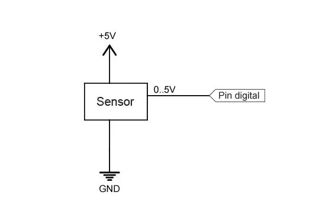

Entradas digitales en Arduino

- [Entradas digitales en Arduino](#entradas-digitales-en-arduino)
  - [¿Qué es una entrada digital?](#qué-es-una-entrada-digital)
  - [Entradas digitales en Arduino](#entradas-digitales-en-arduino-1)
  - [Conexión de entradas digitales](#conexión-de-entradas-digitales)
  - [Código en Arduino](#código-en-arduino)
  - [Lectura de valores mayores de 5V](#lectura-de-valores-mayores-de-5v)
    


Entradas digitales en Arduino
=============================

Una de las funciones más interesantes _(si no la más)_ de Arduino y en general de todos los autómatas **es su capacidad de interacción con el mundo físico**.

Podemos, por ejemplo, realizar mediciones de tensión, obtener lecturas de gran variedad de [sensores](/tag/sensores/), encender dispositivos o controlar [motores](/tag/motores/) y [actuadores](/tag/actuadores/).

Esta interacción se lleva a cabo en gran parte mediante el **uso de las entradas y salidas tanto digitales como analógicas**. En las siguientes entradas aprenderemos a usar estas funciones.

Vamos a empezar por las _**entradas digitales**_, porque son las más sencillas _(aunque en su momento veremos que el resto de funciones no resultan mucho más complicadas)_.

Aunque estamos empleando Arduino como plataforma es importante remarcar que **la mayoría de conceptos son aplicables a cualquier autómata general**. Al final veremos el código y montaje en Arduino, pero antes veremos brevemente un poco de teoría general.

¿Qué es una entrada digital?
----------------------------

Una señal digital es una **variación de voltaje entre -Vcc a +Vcc sin pasar por los valores intermedios** _(por ejemplo, 0 y 5V)_.

Por lo tanto, una señal digital dispone solo de dos estados,

*   Al valor _**inferior -Vcc**_ le asociamos un valor lógico `LOW` o `0` lógico
*   Al valor _**superior +Vcc**_ le asociamos `HIGH` o `1` lógico.

Por supuesto en el mundo físico las señales de tensión realmente son continuas. No existe una señal que “mágicamente pasa de una tensión a otra”.

El proceso de lectura digital **es un proceso de discretización**. Convertimos una medición analógica _(el valor de la tensión que medimos)_ en una señal digital _(“ficticia”)_.

Hacer esta conversión no es muy dificil. Una entrada digital **compara la medición real con un valor de tensión umbral**.

*   Si el valor medido es superior a la tensión umbral se devuelve `HIGH`
*   SI el valor mededido es inferior, devuelve `LOW`.

El valor de la tensión umbral varía de un autómata a otro, e incluso no tiene porque permanecer constante a lo largo del tiempo. Pero, en general, lo normal es que **la tensión umbral es cercana al punto medio entre -Vcc y +Vcc**.

No obstante **debemos evitar medir tensiones cerca de la tensión umbral** porque pueden provocar mediciones incorrectas.

Entradas digitales en Arduino
-----------------------------

En Arduino las entradas y salidas digitales comparten PIN. Por este motivo se denominan I/O digitales _(input / output)_.

Esto significa que el mismo pin puede ejecutar funciones tanto de entrada como de salida aunque, lógicamente, **no de forma simultánea**. Es necesario configurar un pin I/O como entrada o salida _(en nuestro programa)_.

Arduino dispone de un número diferente de I/O digitales en función del modelo, cómo vimos en la entrada [¿Qué es Arduino? ¿Qué modelo comprar?](/que-es-arduino-que-modelo-comprar/). Por ejemplo, Arduino UNO dispone de 16 I/O digitales y Arduino MEGA de 54.

En Arduino **los valores de alimentación habituales son 0V y 5V**. En este caso la tensión umbral será muy cercana a 2’5V. Por tanto:

*   Si medimos una tensión con un valor intermedio entre 0 a 2’5V Arduino devolverá una lectura `LOW`
*   Si medimos un valor entre 2’5V y 5V, devolvera `HIGH`.

**Nunca introducir una tensión fuera del rango 0V a 5V en una entrada digital o analógica** o podemos dañar el pin correspondiente y dejarlo permanentemente inutilizado.

Conexión de entradas digitales
------------------------------

Supongamos que queremos emplear Arduino para conectarlo con un sensor, o cualquier otro dispositivo, **que dispone de una salida de tensión ininterrumpida entre 0V a 5V**.

De momento no consideramos la posibilidad de que la entrada digital quede totalmente desconectada, algo que trataremos en la siguiente entrada “Lectura de un pulsador con Arduino”.

Podemos realizar la lectura del valor de tensión en el sensor con un esquema como el siguiente.


La lectura dará un valor:

*   `HIGH` si el valor de tensión es superior a la tensión umbral _(2.5V)_
*   `LOW` si el valor de tensión es inferior

Código en Arduino
-----------------

El código para realizar la lectura es realmente sencillo. Simplemente tenemos que configurar un I/O digital como entrada con pinMode() y realizar la lectura con digitalRead().
```c
    int pin = 2;
    int value = 0;
    
    void setup() {
      Serial.begin(9600);   //iniciar puerto serie
      pinMode(pin, INPUT);  //definir pin como entrada
    }
    
    void loop(){
      value = digitalRead(pin);  //lectura digital de pin
    
      //mandar mensaje a puerto serie en función del valor leido
      if (value == `HIGH`) {
          Serial.println("Encendido");
      }
      else {
          Serial.println("Apagado");
      }
      delay(1000);
    }
```
[Pruébalo online](/simulador-arduino/index.html?data=3691_entradas-digitales-en-arduino_0)

Los pines configurados como entradas están en estado de alta impedancia, es decir, se comportan como resistencias de muy elevado valor (del orden de 100 megaohmnios). Por tanto, por ellos circula una intensidad despreciable.

En realidad los pines de Arduino (Atmega) se inician por defecto como entrada, por lo que no sería estrictamente necesario configurarlos como entrada, aunque resulta una práctica conveniente.

Lectura de valores mayores de 5V
--------------------------------

Hemos comentado que bajo ningún concepto debemos introducir un voltaje fuera del rango 0 a 5V en un pin de Arduino o nos arriesgamos a dañarlo permanentemente.

Si queremos medir un nivel de tensión superior a los límites de alimentación la forma más conveniente **es emplear un simple divisor de tensión**.

Por ejemplo, para leer una señal digital entre 0 a 12V podemos emplear un esquema como el siguiente.



Con esta configuración el pin digital de Arduino recibirá una tensión que varía entre 0 a 3,84V, suficiente para hacer disparar la tensión umbral, y por debajo del límite de alimentación.

Los valores de las resistencias a emplear **dependen del voltaje que queremos leer**, y de la impedancia del sensor.

En general, deben cumplir las siguientes condiciones

*   Proporcionar un voltaje superior a la tensión umbral
*   Ser muy superiores a la impedancia equivalente del dispositivo a medir.
*   Ser despreciables respecto a la impedancia de la entrada Arduino.
*   Limitar la corriente que circula por ellas para minimizar pérdidas.
*   Ser capaces de disipar la potencia que van a soportar.

Podéis ayudaros de la [calculadora de divisores de tensión](/calculadora-divisor-de-tension/) para calcular valores de resistencia que cumplan estos requisitos.

En la siguiente entrada veremos cómo emplear la entrada digital para [leer el estado de un pulsador](/leer-un-pulsador-con-arduino/).

**No empleéis este sistema para leer tensiones superiores a 35V, o para dispositivos de corriente alterna** sin estar muy seguros de lo que estáis haciendo. Es muy posible que las resistencias no aguanten.

