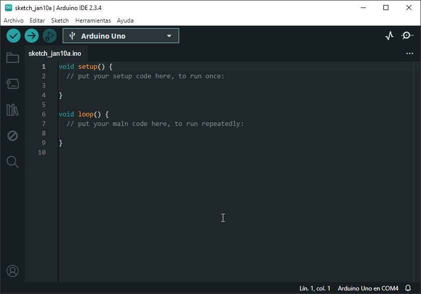
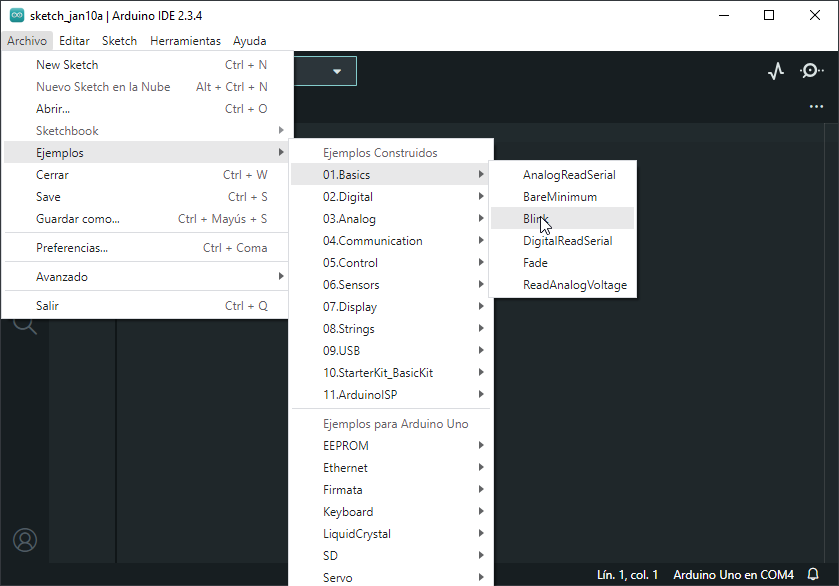
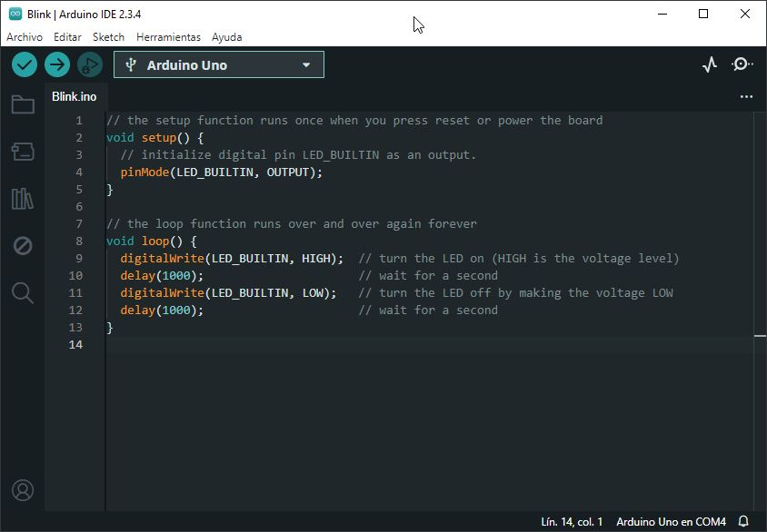

En esta entrada vamos a hacer nuestro primer programa en Arduino. Asumimos que tenemos una placa Arduino UNO o similar,  y el IDE estándar de Arduino correctamente instalado.

Preparar la conexión
--------------------

En primer lugar, **conectamos nuestra placa Arduino mediante un cable USB A-B**, del tipo que se emplean habitualmente para conectar impresoras. De momento no hace falta la conexión de alimentación o cable adicional, para realizar la programación es suficiente únicamente con el USB.

A continuación abrimos el entorno IDE de Arduino. Seleccionamos el modelo de placa que estemos empleando.



Seleccionamos el puerto de comunicación al que esta conectado.


*   En **Windows** será algo tipo COM1, COM3…
*   En **Linux** será del estilo /dev/ttyACM0

Ya tenemos la conexión configurada y lista para realizar la carga de nuestro primer programa.

Estructura básica de programa
-----------------------------

En el IDE de Arduino estándar los programas tienen siempre la siguiente estructura
```c
    //Zona DECLARACIONES
    
    void setup()
    {
      // Zona funcion SETUP
    }
    
    void loop()
    {
      // Zona funcion LOOP
    }
```
Donde cada parte tiene la siguiente función:

*   _**Zona declaraciones:**_ En esta parte se declaran variables, funciones, objetos, y estructuras.
*   _**Funcion setup:**_ Esta función se ejecuta cada vez que se enciende la placa de Arduino, o se pulsa la tecla Reset. Realiza funciones de inicialización de periféricos, comunicaciones, variables, etc.
*   _**Funcion loop:**_ Esta función se ejecuta continuamente. Realiza el grueso de tareas del autómata.

Esta configuración _(una función de setup y un bucle que se ejecuta continuamente)_ es habitual en la programación de automatismos, siendo la única que permite el IDE estándar de Arduino. Otras configuraciones son posibles mediante el empleo de otros IDE.

Cargando un ejemplo
-------------------

Para probar el funcionamiento de nuestro montaje vamos a emplear uno de los ejemplos incluidos en el IDE de Arduino.



Seleccionamos el ejemplo Basics / Blink, y aparecerá un código similar al siguiente.
```c
    const int pinLED= 13;    //asignar variable led como 13
    
    void setup()
    {
      pinMode(pinLED, OUTPUT);     //definir pin 13 como salida  
    }
    
    void loop() {
      digitalWrite(pinLED, HIGH);   // encender LED
      delay(1000);                  // esperar un segundo
      digitalWrite(pinLED, LOW);    // apagar LED
      delay(1000);                  // esperar un segundo
    }
```
Este ejemplo enciende y apaga un LED cada segundo. El LED empleado está integrado en muchas de las placas de Arduino _(UNO, MEGA, etc)_ **conectado físicamente al PIN 13**.

La función de cada linea está comentada a la derecha, pero por ahora no nos vamos a preocupar ahora del significado _(ya veremos estos aspectos más adelante)_.

Se puede aprender mucho leyendo los ejemplos, es muy recomendable echar un vistazo a todos.

Finalmente, pulsamos en el botón remarcado para compilar y enviar la programación a nuestra placa Arduino. Tras unos segundos, el IDE compilará el programa y la pantalla debería ser similar a la siguiente.



Tras unos parpadeos, la placa empezará a ejecutar el programa, **encendiendo y apagando el LED** _(estamos de acuerdo en que no es muy espectacular que digamos)_.

Pero lo importante es que si habéis llegado hasta aquí **significa que todo funciona y está bien configurado**, y a partir de aquí estáis listos para empezar a jugar 🎉.

No os olvidéis del PIN 13 a la hora de realizar vuestros programas. Resulta de gran ayuda a la hora de debuggear de vuestros programas.

Alimentación externa
--------------------

Una vez hemos programado nuestra placa es momento de quitar el cable USB y **realizar una alimentación externa**, para que Arduino funcione sin un ordenador.

Arduino UNO y MEGA **pueden ser alimentados mediante dos medios.** El origen de la alimentación se selecciona automáticamente.

### Alimentación regulada a 5V mediante el puerto USB

Podemos conectar un transformador, una batería exterior de 5V, o cualquier otra fuente 5V mediante un conector USB.

Esta entrada debe estar regulada en alimentación, es decir, **debe ser estable, constante y fija a 5V** _(ya que Arduino no realiza la supervisión del voltaje introducido a través de esta entrada)_

### Alimentación mediante el conector Vin

Existe un PIN denominado Vin, por el que podemos alimentar Arduino. Debemos suministrar una tensión de entre 6 a 20 voltios, aunque **lo ideal es entre 7 a 12 voltios**. Por ejemplo, podemos

*   Conectar un transformador
*   Una pila de 9V
*   Una agrupación de 4 o 6 pilas de 1.5V

**Evitar voltajes superiores a 12 voltios durante un tiempo prolongado**. Pueden sobrecalentar los reguladores de voltaje y dañar la placa.

Si conectamos nuestra alimentación externa a nuestra placa Arduino veremos que ejecutan la programación que hemos realizado, por supuesto **sin la necesidad de un ordenador conectado**.

