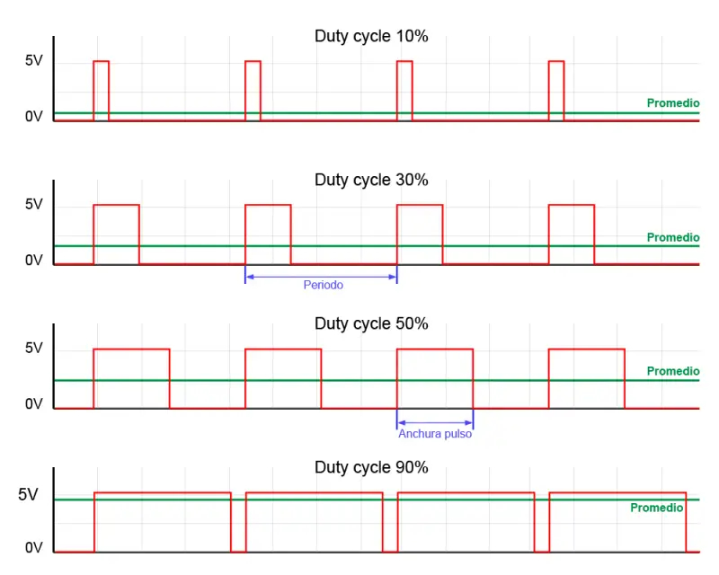
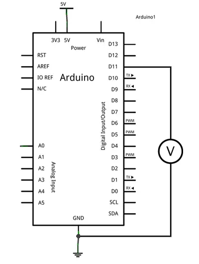

Salidas analógicas PWM en Arduino

- [Salidas analógicas PWM en Arduino](#salidas-analógicas-pwm-en-arduino)
  - [¿Cómo funciona una salida analógica?](#cómo-funciona-una-salida-analógica)
  - [PWM no es una señal analógica](#pwm-no-es-una-señal-analógica)
  - [Salidas analógicas en Arduino](#salidas-analógicas-en-arduino)
  - [Los Timer en PWM por hardware](#los-timer-en-pwm-por-hardware)
    - [Asociación de timers y PWM](#asociación-de-timers-y-pwm)
    - [Frecuencia del PWM](#frecuencia-del-pwm)
  - [Incompatibilidades](#incompatibilidades)
  - [Esquema de montaje](#esquema-de-montaje)
  - [Ejemplo de código](#ejemplo-de-código)
    


Salidas analógicas PWM en Arduino
=================================

En tutoriales anteriores hemos visto cómo usar las [entradas digitales](/entradas-digitales-en-arduino/) y las [entradas analógicas](/entradas-analogicas-en-arduino/) para recibir señales del mundo. También hemos visto como interactuar con el entorno mediante las [salidas digitales](/salidas-digitales-en-arduino/).

Sin embargo, en ocasiones no será suficiente con una señal digital (ON/OFF), si no que necesitaremos proporcionar un valor analógico de tensión. \*\*(por ejemplo, para regular la intensidad de iluminación de un LED, o variar la velocidad de un motor DC)\*.

En esta entrada vamos a ver cómo _**utilizar una salida PWM para emular una señal analógica**_ de tensión desde Arduino.

¿Cómo funciona una salida analógica?
------------------------------------

Las salidas analógicas son algo más complicadas que las digitales _(como ya pasaba con las entradas analógicas y digitales)_.

Lo primero que tenemos que entender es que la mayoría de automatismos _(y Arduino no es una excepción)_ **no son capaces de proporcionar una auténtica salida analógica**. Ni siquiera pueden suministrar una salida analógica discretizada _(es decir, a saltos)_ de tensión.

Lo único que pueden proporcionar _**son salidas digitales de -Vcc o Vcc**_. _(por ejemplo, 0V y 5V)_

Para salvar esta limitación y simular una salida analógica la mayoría de los automatismos emplean un “truco”, que consiste en **activar una salida digital durante un tiempo y mantenerla apagada durante el resto**.

El promedio de la tensión de salida, a lo largo del tiempo, será igual al valor analógico deseado.

> Decir que una salida PWM es una salida analógica, es como decir que te den martillazos en la cabeza es, de media, la misma presión que si te dan un masaje

Existe más de una forma de hacer esta aproximación. Una de las más sencillas, y por ello muy empleada en automatización, **es la modulación de ancho de pulso (PWM)**.

En esta modulación se mantiene constante la frecuencia _(es decir, el tiempo entre disparo de pulsos)_, mientras que se hace variar la anchura del pulso.



La proporción de tiempo que está encendida la señal, respecto al total del ciclo, se denomina `Duty cycle`. Generalmente se expresa en tanto por ciento.

Es inmediato deducir que la señal promedio es el producto de la tensión máxima y el DutyCycle, según la siguiente expresión.

De forma similar, tenemos que

PWM no es una señal analógica
-----------------------------

Es importante recordar en todo momento que _**en una salida PWM el valor de tensión realmente es Vcc**_ _(lo que os he dicho antes de los martillazos en la cabeza)_.

Por ejemplo, si estamos alimentando un dispositivo que necesita 3V, y usamos una pulsada, en realidad estaremos suministrando 5V durante un 60% del tiempo y 0V durante el 40%.

Pero si el dispositivo, por ejemplo, soporta como máximo 3V, **podemos dañarlo si lo alimentamos mediante un PWM**.

Una señal pulsada **es suficiente para emular una señal analógica** en muchas aplicaciones. Por ejemplo, podemos variar la intensidad luminosa en un LED mediante un PWM. El LED realmente se enciende y apaga varias veces por segundo, pero este parpadeo es tan rápido que el ojo no lo aprecia. El efecto global percibido es que el LED brilla con menor intensidad.

Otro ejemplo, al variar la velocidad de un motor DC con un PWM. En la mayoría de los casos la inercia del motor se encargará de que el efecto del PWM sea despreciable. No obstante, en función de la frecuencia podemos notar vibraciones o ruidos, en cuyo caso deberemos variar la frecuencia del PWM.

Por otro lado, **debemos tener en cuenta los efectos que supone la rápida conexión y desconexión** de la señal pulsada puede suponer en el dispositivo alimentado. Por ejemplo, en el caso de cargas inductivas _(motores, relés, o electroimanes)_ la desconexión supondrá la generación de voltaje inducido que puede dañar la salida digital o el propio dispositivo, por lo que será necesario disponer de las protecciones oportunas.

En cuanto a transistores, en general, los de tipo BJT resultan apropiados para funcionar como amplificación de señales PWM. Esto no suele ser así en los transistores MOS, donde los efectos capacitivos del mismo, unidos a la limitación de corriente de las salidas digitales, frecuentemente harán que necesitemos un driver de amplificación previo para evitar que el transistor trabaje en zona activa.

Usar de forma inadecuada una señal PWM puede dañar al dispositivo alimentado, si no soporta la tensión Vcc aplicada.

Salidas analógicas en Arduino
-----------------------------

Arduino implementa por hardware salidas PWM en varios de sus pines, que aparecen identificados en la placa con el símbolo `~` junto al número del pin.

*   En Arduino Uno, Mini y Nano, disponemos de 6 salidas PWM de 8bits en los pines 3, 5, 6, 9, 10 y 11
*   En Arduino Mega disponemos de 15 salidas PWM de 8bis en los pines 2 a 13 y 44 a 46
*   Arduino Due cuenta con 13 salidas PWM de 8bits en los pins 2 a 13. Además, esta placa incorpora dos salidas analógicas discretizadas (DAC) con resolución de 12bits (4096 niveles)

También podemos emular por software señales PWM, pero con la carga de trabajo adicional que ello supone para el procesador.

Una resolución de 8bits en una salida PWM significa que tenemos 256 niveles. Es decir, indicamos el Duty cycle mediante un número de 0 a 255.

Los Timer en PWM por hardware
-----------------------------

Las funciones PWM por hardware **emplean los Timer para generar la onda de salida**. Cada Timer da servicio a 2 o 3 salidas PWM. Para ello dispone de un registro de comparación por cada salida. Cuando el tiempo alcanza el valor del registro de comparación, la salida invierte su valor.

Cada salida conectada a un mismo temporizador **comparte la misma frecuencia**, aunque pueden tener distintos Duty cycles, dependiendo del valor de su registro de comparación.

### Asociación de timers y PWM

En el caso de Arduino Uno, Mini y Nano

*   El Timer0 controla las salidas PWM 5 y 6.
*   El Timer1 controla las salidas PWM 9 y 10.
*   El Timer2 controla las salidas PWM 3 y 11.

Mientras que en Arduino Mega

*   El Timer0 controla las salidas PWM 4 y 13.
*   El Timer1 controla las salidas PWM 11 y 12.
*   El Timer2 controla las salidas PWM 9 y 10.
*   El Timer3 controla las salidas PWM 2, 3 y 5.
*   El Timer4 controla las salidas PWM 6, 7 y 8.
*   El Timer5 controla las salidas PWM 44, 45 y 46.

### Frecuencia del PWM

La frecuencia de cada PWM depende de las características del temporizador al que está conectado, y de un registro de preescalado, que divide el tiempo por un número entero.

La frecuencia de los PWM se puede modificar cambiando el preescalado de los Timer correspondientes.

Arduino Uno, Mini y Nano disponen de tres temporizadores.

*   Timer0, con una frecuencia de 62500Hz, y preescalados de 1, 8, 64, 256 y 1024.
*   Timer1, con una frecuencia de 31250Hz, y preescalados de 1, 8, 64, 256, y 1024.
*   Timer2, con una frecuencia de 31250Hz, y preescalados de 1, 8, 32, 64, 128, 256, y 1024.

Arduino Mega añade tres temporizadores más

*   Timer3, 4 y 5, con una frecuencia de 31250Hz, y preescalados de 1, 8, 64, 256, and 1024.

Por tan, la frecuencia estándar para las salidas PWM en Arduino Uno, Mini y Nano es de 490Hz para todos los pines, excepto para el 5 y 6 cuya frecuencia es de 980Hz

En cuanto a Arduino Mega, la frecuencia estándar es de 490Hz para todos los pines, excepto para el 4 y 13 cuya frecuencia es de 980Hz

Incompatibilidades
------------------

El uso de los Timer no es exclusivo de las salidas PWM, si no que es compartido con otras funciones. Emplear funciones que requieren el uso de estos Timer supondrá que **no podremos emplear de forma simultánea alguno de los pines PWM**.

A continuación alguna de las incompatibilidades más frecuentes

**Servo**

La librería servo hace un uso intensivo de temporizadores por lo que, mientras la estemos usando, no podremos usar algunas de las salidas PWM.

En el caso de Arduino Uno, Mini y Nano, la librería servo usa el Timer 1, por lo que no podremos usar los pines 9 y 10 mientras usemos un servo.

En el caso de Arduino Mega, dependerá de la cantidad de servos que empleemos.

*   Si usamos menos de 12 servos, usa el Timer 5, por lo que perderemos los pin 44, 45 y 46.
*   Para 24 servos, usa los Timer 1 y 5, por lo que perderemos los pin 11, 12, 44, 45 y 45.
*   Para 36 servos, usa los Timer 1,3 y 5, perdiendo los pin 2, 3, 5, 11, 12, 44, 45, 46.
*   Para 48 servos, usa los Timer 1, 3, 4 y 5, perdiendo todos los pin PWM.

**Comunicación SPI**

En Arduino Uno, Mini y Nano, el pin 11 se emplea también para la función MOSI de la [comunicación SPI](/arduino-spi/). Por lo tanto, no podremos usar ambas funciones de forma simultánea en este pin. Arduino Mega no tiene este problema, ya que figuran en pines distintos.

**Función Tone**
La función Tone emplea el Timer 2, por lo que no podremos usar los pines 3 y 11, y en Arduino mega los pines 9 y 10.

Esquema de montaje
------------------

Para este tutorial no es necesario ningún montaje. Sin embargo, podemos verificar el correcto funcionamiento de las salidas analógicas simplemente midiendo con un polímetro la tensión entre la salida digital y GND.



Ejemplo de código
-----------------

El código necesario para encender una salida PWM es muy sencillo gracias a las bibliotecas de Arduino, que configuran por defecto las salidas de PWM en la función Setup, ocultando la dificultad de manipulación de los Timer.

Así, en en el ejemplo mas básico, simplemente definimos el pin PWM que queremos emplear, y usamos la función analogWrite para escribir el valor del Duty Cycle, medido de 0 a 255.

El siguiente código incrementa progresivamente el valor de una señal analógica desde 0 a 255. Al alcanzar el valor máximo el contador pasará a 0, por lo que el ciclo volverá a iniciarse.
```c
    const int analogOutPin = 5; // Analog output pin
    
    byte outputValue = 0;        // valor del PWM
    
    void setup() {
    }
    
    void loop() {
      analogWrite(analogOutPin, outputValue);
      delay(10);
      outputValue++;
    }
```


Para visualizar el código anterior podemos emplear un voltímetro o un LED colocado en el pin 11. Sin embargo, podemos modificar el código anterior con un pequeño truco, para traspasar el valor del PWM a otra señal, y así visualizarlo en el LED integrado en la placa en el pin 13.

No os centréis en la parte de interrupciones, si no sólo en la función Loop(). El resto del código es un poco complejo para esta entrada. Simplemente quedaros con que es un truco para mostrar un PWM en el LED integrado, y así hacer más fácil nuestras pruebas.
```c
    const int analogOutPin = 11; // Analog output pin that the LED is attached to
    byte outputValue = 0;  
    
    void setup()
    {  
      bitSet(DDRB, 5);      // LED pin (13)
      bitSet(PCICR, PCIE0);       // enable pin change interrupts on bank 0  
      bitSet(PCMSK0, PCINT3);     // enable PCINT3 (PB3) pin change interrupt 
    }
    
    void loop() 
    {
      analogWrite(analogOutPin, outputValue); 
      delay(10);
      outputValue++;
    }  
    
    ISR(PCINT0_vect)
    {
      if(bitRead(PINB, 3))
      { 
        bitSet(PORTB, 5);   // LED on 
      }
      else
      { 
        bitClear(PORTB, 5); // LED off  
      } 
    } 
```


Finalmente, si juntamos el código anterior con lo que vimos en comunicación por [puerto serie](/arduino-puerto-serie/) podemos hacer un programa que reciba un dígito de 0 a 9, y varíe la intensidad del LED integrado en la placa.
```c
    const int analogOutPin = 11;
    byte outputValue = 0;  
    
    void setup()
    {  
       Serial.begin(9600);         // Iniciar puerto serie
       pinMode(ledPIN , OUTPUT); 
    
       bitSet(DDRB, 5);      // LED pin (13)
       bitSet(PCICR, PCIE0);       // enable pin change interrupts on bank 0  
       bitSet(PCMSK0, PCINT3);     // enable PCINT3 (PB3) pin change interrupt 
    }
    
    void loop() 
    {
       if (Serial.available()>0)  // Si hay datos disponibles
       {
          outputValue = Serial.read();  // Leemos la opción
          if(outputValue >= '0' && outputValue <= '9')
          {
             outputValue -= '0';    // Restamos '0' para convertir a un número
             outputValue *= 25;    // Multiplicamos x25 para pasar a una escala 0 a 250
             analogWrite(ledPIN , outputValue);
          }
       }
    }  
    
    ISR(PCINT0_vect)
    {
       if(bitRead(PINB, 3))
       { 
          bitSet(PORTB, 5);   // LED on 
       }
       else
       { 
          bitClear(PORTB, 5); // LED off  
       } 
    } 
```
