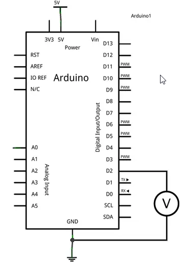

Salidas digitales en Arduino

- [Salidas digitales en Arduino](#salidas-digitales-en-arduino)
  - [Qué es una salida digital](#qué-es-una-salida-digital)
  - [Intensidad máxima de una salida digital](#intensidad-máxima-de-una-salida-digital)
  - [Conexión salida digital](#conexión-salida-digital)
  - [Código](#código)
    


Salidas digitales en Arduino
============================

En la entrada anterior hemos visto cómo usar las [entradas digitales](/entradas-digitales/) para recibir señales del mundo. Sin embargo, si solo pudiéramos realizar lecturas los automatismos no tendrían mucha utilidad _(al menos, tendrían mucha menos de la que tienen)_.

Ahora vamos a aprender a _**emplear las salidas de Arduino para poder realizar acciones en el mundo**_. Vamos a empezar por las salidas digitales, dado que son más sencillas que las analógicas.

Qué es una salida digital
-------------------------

Recordaremos que **una señal digital puede variar únicamente entre dos valores**, que denominamos -Vcc y +Vcc _(por ejemplo, 0 y 5V)_.

Una salida digital es un dispositivo que permite **variar su tensión a uno de estos dos valores mediante programación**. Por tanto, podemos usarlas para realizar acciones con el entorno.

En Arduino, en general, los voltajes -Vcc y +Vcc corresponden con 0V (GND) y 5V. Sin embargo, algunos modelos de Arduino operan a 3.3V, como por ejemplo algunos Mini, Nano, y las placas basadas en procesadores ARM como Arduino Due.

**Todos los pines digitales de Arduino pueden actuar como salidas digitales** _(por ello se denominan I/O, input y output)_.

Es menos conocidos que todos **los pines analógicos también pueden usarse como entradas y salidas digitales**.

El número exacto de salidas digitales depende del modelo de placa que estemos usando, como vimos en la entrada [¿Qué es Arduino? ¿Qué modelo comprar?](/que-es-arduino-que-modelo-comprar/).

En resumen,

*   **Arduino Uno y Nano** tienen 22 pines que podemos usar como salidas digitales
*   **Arduino Mini** tiene 20 salidas digitales
*   **Arduiino Mega** tiene hasta 70 salidas digitales

Esto son cifras más que respetables, superiores a la mayoría de automatismos de tipo industrial.

Intensidad máxima de una salida digital
---------------------------------------

En general las salidas digitales de autómatas _**no están pensadas para proporcionar potencia**_, si no para interactuar con electrónica u otros autómatas.

La intensidad máxima que puede dar un pin es de 40 mA, si bien **el valor recomendado es de 20mA**. Además hay restricciones adicionales en cuanto a la potencia, como que

*   La suma total de todas las salidas debe ser inferior a 300 mA
*   Además, no pueden superar 150 mA por puerto.

Esta potencia es suficiente para encender un led, un pequeño servomotor de 9g, o encender algún sensor, pero **no es suficiente para alimentar cargas mayores**.

Si queremos mover una carga superior, como un motor de corriente continua, un servo, o incluso un rele, **tendremos que emplear una etapa de amplificación** _(como un transistor BJT, MOSFET)_.

**No es conveniente forzar los límites de potencia de forma prolongada** ya que la placa podría calentarse y dañarse. El límite de 20 mA por salida significa que, para un voltaje de 5V, la resistencia del dispositivo que queramos alimentar no debe ser inferior a 200 ohmnios.

Como norma general, salvo que sepamos lo que estamos haciendo, siempre que vayamos a conectar un dispositivo a cualquier salida **lo haremos a través de una resistencia de al menos 300 ohmnios**.

Conexión salida digital
-----------------------

Para este tutorial no es necesario ningún montaje. Sin embargo, podemos verificar el correcto funcionamiento de las salidas digitales simplemente midiendo con un polímetro la tensión entre la salida digital y GND.



Código
------

El código para encender es similar al que vimos en el tutorial [Nuestro primer programa en Arduino](/nuestro-primer-programa-en-arduino/). En realidad es exactamente igual, cambiando el 13 por el pin de la salida que queramos activar. Recordaremos que el pin 13 es un pin especial, que está conectado con el led integrado en la placa.

Así el siguiente código, que es una modificación del archivo de ejemplo Blink, enciende y apaga una salida digital.
```c
    const int pin = 2;
     
    void setup() {
      Serial.begin(9600);    //iniciar puerto serie
      pinMode(pin, OUTPUT);  //definir pin como salida
    }
     
    void loop(){
      digitalWrite(pin, HIGH);   // poner el Pin en HIGH
      delay(1000);               // esperar un segundo
      digitalWrite(pin, LOW);    // poner el Pin en LOW
      delay(1000);               // esperar un segundo
    }
```


El siguiente código, que vimos en la entrada del [puerto serie de Arduino](/arduino-puerto-serie/), recibe un caracter a través del puerto serie para encender o apagar una señal digital desde el ordenador.

A través del puerto serie enviamos un caracter. Si escribimos 0 la salida se apaga, y si escribimos 1 se enciende.
```c
    const int pin = 2;
    int option;
    
    void setup(){
      Serial.begin(9600);
      pinMode(pin, OUTPUT); 
    }
     
    void loop(){
      //si existe información pendiente
      if (Serial.available()>0){
        //leeemos la opcion
        char option = Serial.read();
        if (option == '0' )  //si el valor es 0
        {
             digitalWrite(pin, LOW);  //apagamos el pin
        }
        else if (option == '1' )
        {
             digitalWrite(pin, HIGH);  //encendemos el pin
        }
        delay(200);
      }
    }
```


Hasta aquí los aspectos básicos de las salidas digitales en Arduino. En futuras entradas veremos las salidas analógicas, y profundizaremos en aspectos más avanzados de las salidas digitales.
