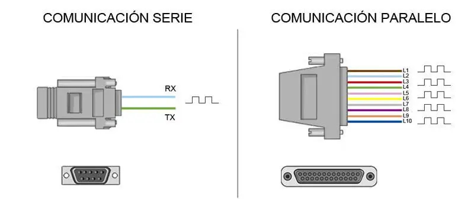
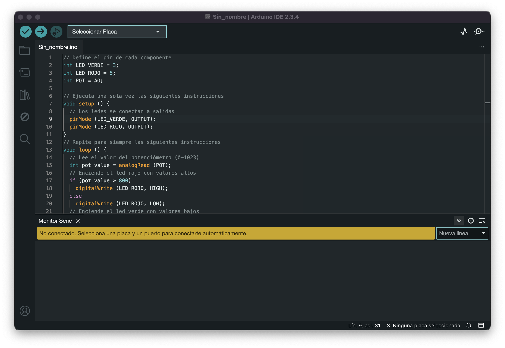

Comunicación de Arduino con puerto serie

- [Comunicación de Arduino con puerto serie](#comunicación-de-arduino-con-puerto-serie)
  - [¿Qué es el puerto serie?](#qué-es-el-puerto-serie)
  - [Arduino y el puerto serie](#arduino-y-el-puerto-serie)
  - [Conexión del Arduino con un ordenador](#conexión-del-arduino-con-un-ordenador)
  - [Códigos de ejemplo](#códigos-de-ejemplo)
    - [Recibir información desde el Arduino](#recibir-información-desde-el-arduino)
    - [Enviar información al Arduino](#enviar-información-al-arduino)
    - [Enviar valores numéricos](#enviar-valores-numéricos)
    


Comunicación de Arduino con puerto serie
========================================

En esta entrada aprenderemos el funcionamiento básico de los puertos serie en Arduino. Los puertos serie **son la forma principal de comunicar una placa Arduino con un ordenador**\* o con otro microcontrolador.

Gracias al puerto serie podemos, por ejemplo, mover el ratón o simular la escritura de un usuario en el teclado, enviar correos con alertas, controlar un robot realizando los cálculos en el ordenador, encender o apagar un dispositivo desde una página Web a través de Internet, o desde una aplicación móvil a través de [Bluetooth](/conectar-arduino-por-bluetooth-con-los-modulos-hc-05-o-hc-06/).

¡Existen un sinfin de posibilidades en las que se requiere el empleo del puerto serie!

Por tanto **el puerto serie es un componente fundamental** de una gran cantidad de proyectos de Arduino, y es uno de los elementos básicos que debemos aprender para poder sacar todo el potencial de Arduino.

Al final de la entrada os pongo varios códigos de ejemplo, pero antes conviene explicar brevemente algo de teoría sobre qué es un puerto serie, y algunos términos que necesitaremos para entender correctamente el funcionamiento del puerto serie.

Puedes consultar el resto de tutoriales sobre el puerto de serie en Arduino, ([recibir números](/enviar-recibir-numeros-puerto-serie-arduino/), [textos](/cadenas-de-texto-puerto-serie-arduino/), [arrays separados por coma](/arduino-array-separado-comas/), [bytes](/arduino-bytes-puerto-serie/), y muchos más) en la categoría [**puerto serie Arduino**](/tag/puerto-serie/)

¿Qué es el puerto serie?
------------------------

Un puerto es el nombre genérico con que denominamos a los interfaces, físicos o virtuales, que **permiten la comunicación entre dos ordenadores o dispositivos**.

Un puerto serie envía la información mediante una secuencia de bits. Para ello se necesitan al menos dos conectores para realizar la comunicación de datos, _**RX (recepción)**_ y _**TX (transmisión)**_ _(no obstante, pueden existir otros conductores para referencia de tensión, sincronismo de reloj, etc)_.

Por el contrario, un puerto paralelo enviaría la información mediante múltiples canales de forma simultánea. Para ello **necesitan un número superior de conductores de comunicación**, que varían en función del tipo de puerto _(igualmente existe la posibilidad de conductores adicionales además de los de comunicación)_.



Históricamente ambos tipos de puertos han convivido en los ordenadores, empleándose los puertos paralelos en aquellas aplicaciones que requerían la transmisión de mayores volúmenes de datos

Sin embargo, a medida que los procesadores se hicieron más rápidos **los puertos de serie fueron desplazando progresivamente a los puertos paralelos** en la mayoría de aplicaciones.

Un ordenador convencional dispone de varios puertos de serie. Los más conocidos son el popular USB _(Universal Serial Port)_ y el ya casi olvidado RS-232 _(el de los antiguos ratones)_.

Sin embargo, dentro del ámbito de la informática y automatización **existen una gran cantidad adicional de tipos de puertos serie**, como por ejemplo el RS-485, I2C, SPI, Serial Ata, Pcie Express, Ethernet o FireWire, entre otros.

En ocasiones **veréis referirse a los puertos de serie como UART**. La UART _(universally asynchronous receiver/transmitter)_ es una unidad que incorporan ciertos procesadores, encargada de realiza la conversión de los datos a una secuencia de bits y transmitirlos o recibirlos a una velocidad determinada.

Por otro lado, **también podéis oír el término TTL** _(transistor-transistor logic)_. Esto significa que la comunicación se realiza mediante variaciones en la señal entre 0V y Vcc _(donde Vcc suele ser 3.3V o 5V)_.

Por el contrario, otros sistemas de transmisión emplean variaciones de voltaje de -Vcc a +Vcc _(por ejemplo, los puertos RS-232 típicamente varían entre -13V a 13V)_.

Antes de conectar dos sistemas **debemos comprobar que los voltajes empleados son compatibles**. En caso de no serlo, necesitaremos un subsistema que adapte los niveles de la señal, o podemos dañar alguno de los dispositivos.

Arduino y el puerto serie
-------------------------

Prácticamente todas **las placas Arduino disponen al menos de una unidad UART**. Las placas Arduino UNO y Mini Pro disponen de una unidad UART que operan a nivel TTL 0V / 5V, por lo que son directamente compatibles con la conexión USB. Por su parte, Arduino Mega y Arduino Due disponen de 4 unidades UART TTL 0V / 5V.

**Los puertos serie están físicamente unidos a distintos pines** de la placa Arduino. Lógicamente, mientras usamos los puertos de serie no podemos usar como entradas o salidas digitales los pines asociados con el puerto serie en uso.


**Muchos modelos de placas Arduino disponen de un conector USB o Micro USB** conectado a uno de los puertos de serie, lo que simplifica el proceso de conexión con un ordenador. Sin embargo algunas placas, como por ejemplo la Mini Pro, prescinden de este conector por lo que la única forma de conectarse a las mismas es directamente a través de los pines correspondientes.

No debemos acostumbrarnos a usar el puerto serie **si realmente no necesitamos comunicar con el ordenador**. Las librerías empleadas para el uso de puerto serie ocupan un tamaño considerable, y sólo debemos emplearlas si realmente las necesitamos. Además, supone inhabilitar de forma innecesaria los pines digitales asociados.

Conexión del Arduino con un ordenador
-------------------------------------

Para realizar la conexión mediante puerto serie únicamente es necesario conectar nuestra placa Arduino empleando el mismo puerto que empleamos para programarlo. A continuación **abrimos el IDE Standard de Arduino y hacemos click en el “Monitor Serial” como se indica en la imagen.**



El monitor de puerto serie es una pequeña utilidad integrada dentro de IDE Standard que **nos permite enviar y recibir fácilmente información a través del puerto serie**. Su uso es muy sencillo, y dispone de dos zonas, una que muestra los datos recibidos, y otra para enviarlos. Estas zonas se muestran en la siguiente imagen.

Pese a su sencillez este monitor de puerto serie es suficiente para los ejemplos de esta entrada, y resulta muy útil para realizar test o experimentos rápidos.

Códigos de ejemplo
------------------

### Recibir información desde el Arduino

En este primer código vamos a recibir el valor de un contador enviado desde la placa Arduino. Este valor se incrementa cada segundo. Podemos observar como se reciben los valores desde del monitor serial.
```c
    int cont=0;
    
    void setup(){
      //iniciamos el puerto serie
      Serial.begin(9600);
    }
    
    void loop(){
      //Imprimimos el valor del contador
      Serial.print("Contador: ");
      Serial.println(cont);
      
      //incrementamos el contador y esperamos un segundo
      cont++;
      delay(1000);
    }
```


### Enviar información al Arduino

En este ejemplo empleamos el puerto serie para encender o apagar el LED integrado en la placa Arduino. Para ello enviamos un carácter a la placa Arduino, empleando el monitor serial. En caso de enviar ‘a’ la placa Arduino apaga el LED, y en caso de enviar ‘b’ lo enciende.
```c
    int option;
    int led = 13;
    
    void setup(){
      Serial.begin(9600);
      pinMode(led, OUTPUT); 
    }
    
    void loop(){
      //si existe datos disponibles los leemos
      if (Serial.available()>0){
        //leemos la opcion enviada
        option=Serial.read();
        if(option=='a') {
          digitalWrite(led, LOW);
          Serial.println("OFF");
        }
        if(option=='b') {
          digitalWrite(led, HIGH);
          Serial.println("ON");
        }
      }
    }
```


### Enviar valores numéricos

Por último, en este ejemplo enviamos un número entre 1 a 9 a través del monitor serial, y la placa Ardunino hace parpadear el LED integrado el número de veces indicado. El código es similar al anterior, pero se hace notar que al enviarse los datos caracteres ASCII, debemos restar el valor ‘0’ al dato recibido para recuperar el valor numérico enviado.
```c
    int option;
    int led = 13;
    
    void setup(){
      Serial.begin(9600);
      pinMode(led, OUTPUT); 
    }
    
    void loop(){
      //si existe información pendiente
      if (Serial.available()>0){
        //leeemos la opcion
        char option = Serial.read();
        //si la opcion esta entre '1' y '9'
        if (option >= '1' && option <= '9')
        {
          //restamos el valor '0' para obtener el numeroenviado
          option -= '0';
          for(int i=0;i<option;i++){
             digitalWrite(led, HIGH);
             delay(100);
             digitalWrite(led, LOW);
             delay(200);
          }
        }
      }
    }
```


