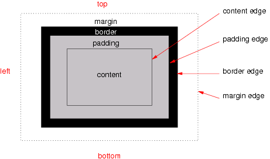
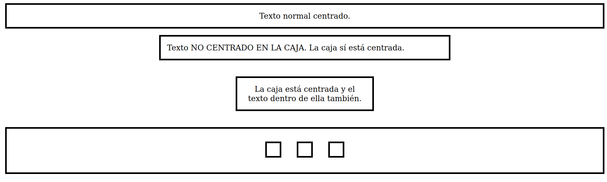
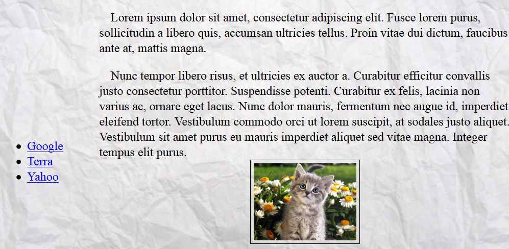
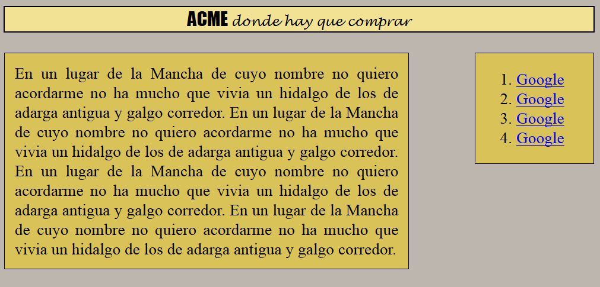
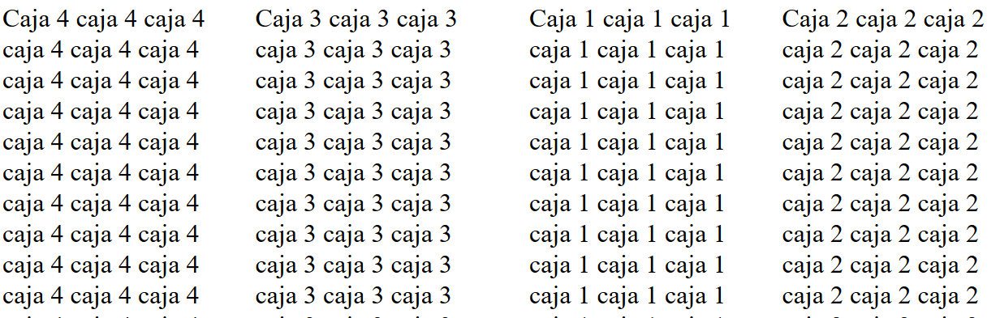
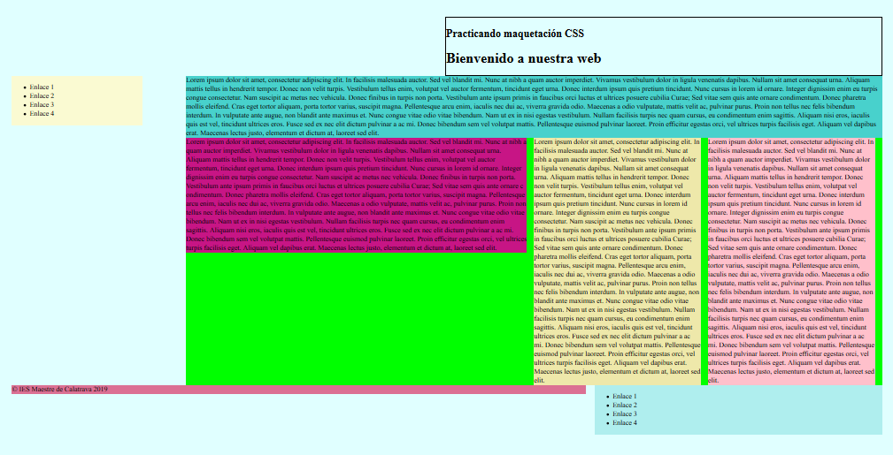
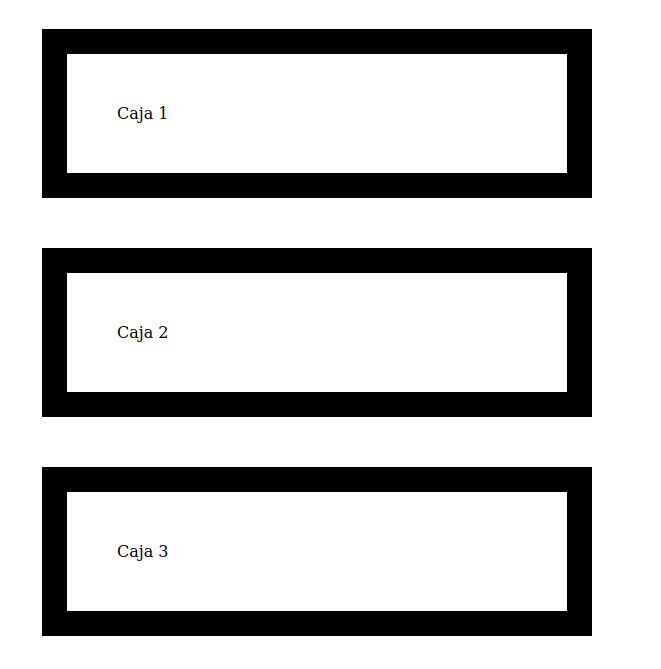

Introducción a CSS
===================================

Introducción
-----------------------------------------------------

El lenguaje CSS permite cambiar el aspecto de páginas web utilizando enlaces a archivos de hojas de estilo. Si todos los HTML de un portal web cargan el mismo archivo CSS se puede cambiar todo un conjunto de HTML’s modificando un solo CSS. A menudo se dice que un CSS es una «hoja de estilo».

Hay tres mecanismos básicos para añadir CSS a un HTML

1. Usar CSS en las etiquetas HTML del cuerpo de la página.

2. Usar CSS en la cabecera del HTML.

3. Usar CSS cargando un archivo externo.

En el primer caso se haría de esta manera:

```html
<p style="background-color:red">
Este párrafo lleva fondo rojo
</p>
````

En el segundo caso haríamos algo como esto.

```html
<html>
    <head>
        <style type="text/css">
            p{
                background-color: red;
            }
        </style>
    </head>
    <body>
        <p>Todos los párrafos van en rojo</p>
    </body>
</html>
```

En el tercero haríamos esto:

```html
<html>
    <head>
        <link type="text/css" href="estilo.css" rel="stylesheet">
    </head>
    <body>
        <p>Todos los párrafos van en rojo</p>
    </body>
</html>
```

Debe recordarse lo siguiente:

* Escribir CSS para cada etiqueta es **MUY POCO PRÁCTICO** y difícil de cambiar en el futuro.
* Si hay definiciones contradictorias prevalece siempre el CSS de la etiqueta, despues el del estilo de la cabecera y despues el del archivo externo.
* Lo habitual es definirlo todo en estilos externos.

Recordatorio: el modelo DOM
-------------------------------------

Se debe recordar que

* Un elemento es todo lo contenido entre una etiqueta de apertura y una de cierre.
* Un documento HTML (y uno XML, se hablará de ello en el futuro) se representa en forma de árbol.
* Se dice que los nodos del árbol tienen «relaciones de parentesco» y por tanto diremos que «un nodo es hermano de otro» o que «un nodo es padre o hijo de otro nodo».

Sintaxis
---------------------------------------------

CSS funciona mediante reglas, de las cuales se muestra un ejemplo a continuación.

```css
h1, h3 {
    background-color: blue;
    color: white;
}
```

En las reglas tenemos tres cosas:

1. Los selectores. En este caso queremos modificar como van a quedar todos los `<h1>` y `<h3>`
    
2.  Las propiedades. En el ejemplo se pretende cambiar el color de fondo y el color de las letras.
    
3.  Los valores. En este caso se pone el valor `blue` para la propiedad `background-color` y el valor `white` para la propiedad `color`
    
En el siguiente CSS se muestran los principales selectores.

```css
h1{ /*Selecciona TODOS los h1 y les pone fondo azul*/
    background-color: blue;
}
h1, h2{ /*Selecciona TODOS LOS H1 Y TODOS LOS H2 y les pone fondo azul*/
    background-color: blue;
}
h1.titular{ /*Selecciona TODOS LOS H1 con el class "titular"*/
    background-color: blue;
}
h1#titulonoticia{ /*Selecciona SOLO UN H1, el que tenga el id indicado*/
    background-color: blue;
}

/* Selecciona todos los elementos li que sean hijos de un ul*/
ul>li {
    background-color: blue;
}

/* Selecciona los párrafos que vayan justo detrás de un div*/
div + p{
    background-color: blue;
}

/* Selecciona todos los elementos li que estén dentro de algun ul,
INCLUSO AUNQUE NO SEAN HIJOS DIRECTOS, sino "nietos", "bisnietos"...*/
ul li {
    background-color: blue;
}

/* Esto es una "pseudo-clase" selecciona los enlaces no visitados
y los pone con fondo azul*/
a:link{
    background-color: blue;
}

/* Pone en fondo rojo los enlaces ya visitados*/
a:visited{
    background-color: blue;
}
```

### Un fichero para hacer pruebas con selectores

```html
<!DOCTYPE html>
<html>
    <head>
        <meta charset="utf-8">
    </head>
    <body>
        <div class="noticia1">
            <p class="introduccion">
                Soy la introducción de la noticia
            </p>
            <p>Párrafo 2 de la noticia 2</p>
            <p id="nucleonoticia1">Párrafo 3 de la noticia 2</p>
            <p>Párrafo 4 de la noticia 2</p>
            <p>
                Párrafo 5 de la noticia 2. Aquí desgloso
                algunos elementos importantes.
                <ul class="listaimportantes">
                    <li>Elemento 1</li>
                    <li>Elemento 2</li>
                    <li>Elemento 3</li>
                </ul>
                Además ocurre que

                <ol>
                    <li>Razón 1</li>
                    <li>Razón 2</li>
                    <li>Razón 3</li>
                </ol>
            </p>
        </div><!--Fin de la noticia 2-->
        <div class="noticia2">
                <p class="introduccion">
                    Soy la introducción de la noticia 2
                </p>
                <p>Párrafo 2 de la noticia 2</p>
                <p id="nucleonoticia2">Párrafo 3 de la noticia 2</p>
                <p>Párrafo 4 de la noticia 2</p>
                <p>
                    Párrafo 5 de la noticia 2. Aquí desgloso
                    algunos elementos importantes.
                    <ol class="listaimportantes">
                        <li>Elemento 1</li>
                        <li>Elemento 2</li>
                        <li>Elemento 3</li>
                    </ol>
                    Además ocurre que

                    <ol>
                        <li>Razón 1</li>
                        <li>Razón 2</li>
                        <li>Razón 3</li>
                    </ol>
                </p>
            </div><!--Fin de la noticia 2-->
    </body>
</html>
```

Los atributos `class` e `id`
--------------------------------
A menudo tendremos que hacer ambios en un grupo de elementos, pero a veces no serán todos los elementos de una misma clase. Por ejemplo, puede que queramos cambiar un elemento en concreto. Para poder hacer cambios _a un solo elemento_ tendremos que haber puesto el atributo `id` como muestra el ejemplo siguiente:

```html
<h1>Encabezamiento</h1>
.... texto ...

<h1 id="noticia_del_dia">Otro encabezamiento</h1>
.... texto ...

<h1>Y otro más</h1>
.... texto ...
```

Si luego desde CSS queremos modificar solo el encabezamiento con la noticia del dia deberemos hacer esto

```css
h1#noticia_del_dia{
    font-weight: bold;
}
```

Obsérvese que hemos usado la almohadillas (#) para decir «queremos seleccionar el h1 cuyo id es noticia_del_dia» y ponerlo en negrita. Debe señalarse que es importante que en el HTML **NO DEBE HABER DOS ELEMENTOS CON EL MISMO ID**

Si en vez de uno queremos aplicar un cambio a **un conjunto de elementos** deberemos ir al HTML y ponerles a todos ellos un atributo `class` con el mismo valor en todos ellos. Por ejemplo:

```html
<h1 class="titular_economia">Encabezamiento</h1>
.... texto ...

<h1>Otro encabezamiento</h1>
.... texto ...

<h1 class="titular_economia">Y otro más</h1>
.... texto ...
```

Con este HTML podemos crear un CSS como este que cambia solo los `h1` cuyo `class` tiene el valor `titular_economia`

```css
h1.titular_economia{
    font-weight: bold;
}
```

Se puede poner el mismo `class` a distintos elementos, por ejemplo así

```html
<h1 class="titular_economia">Encabezamiento</h1>
.... texto ...

<h1>Otro encabezamiento</h1>
.... texto ...

<h2 class="titular_economia">Y otro más</h2>
.... texto ...
```

Y luego usar un CSS como este:

```css
h1.titular_economia, h2.titular_economia{
    font-weight: bold;
}
```

Este último CSS **se puede resumir**

```css
.titular_economia{
    font-weight: bold;
}
```

Esta regla dice «seleccionar todos los elementos cuyo class sea titular_economia» y ponerlos en negrita. Estos mecanismos de resumen son muy útiles y facilitan mucho la tarea del diseñador CSS.

Pseudo-clases
-------------------------------------------------------

Como ya se ha indicado selecciona elementos en algún estado especial. Hay muchas pero algunas de las principales son:

* `p:hover` : selector que se aplica cuando se pasa el ratón por encima del párrafo.
* `p:first-of-type` : selector que se aplica al primero de los párrafos.
* `p:first-child` : selector que se aplica un párrafo si es el primero de los hijos.
* `p:last-child` : selector que se aplica al último párrafo ignorando al resto de hermanos.
* `p:nth-child(4)` : selector que se aplica sobre el cuarto párrafo.
* `p:nth-child(even)` : selector que se aplica a párrafos impares.
* `p:nth-child(odd)` : selector que se aplica a párrafos pares.
* `a:active` : selector para enlaces que están siendo pulsados.
* `a:visited` : selector para enlaces ya visitados.
* `a:active` : selector para enlaces que están siendo pulsados.
* `input:checked` : selector para controles (radios, checkboxes) que estén marcados.

Fondos e imágenes
--------------------------

Las principales propiedades son:

* La propiedad `background-image` permite cargar una imagen de fondo: P. ej: `background-image: url("../img/low-res/cork-board.png");`
* La propiedad `background-repeat` permite controlar como se repite la imagen, puede tomar los valores `no-repeat` , `repeat-x` y `repeat-y` .
* La propiedad `background-position` controla donde se posicionará la imagen, puede tomar varios valores como `top` , `bottom` , `left`, `right` y `center`, así como combinaciones. Por ejemplo `top center` o `bottom right` .
* La propiedad `background-size` permite controlar el ancho y el alto. Se hablará más sobre las medidas en otro apartado de los apuntes.
* La propiedad `background-attachment` puede ponerse a `fixed` para controlar como hace «scroll» la imagen.

Bordes
---------

Se pueden configurar los bordes de cualquier elementos usando algunas propiedades básicas:

* `border-style`: permite cambiar distintos estilos de borde como `solid`, `double`, `dashed`, `dotted`, `inset`, `outset`. Por ejemplo podemos cambiar un borde con `border-style: double;`
* `border-color` permite cambiar el color del borde. Se pueden usar colores usando cualquier mecanismo CSS (nombre de color, valor `rgb`, color en hexadecimal, etc…).
* `border-width` permite cambiar la anchura del borde.

Los bordes pueden cambiarse individualmente y, por ejemplo, añadir un borde solo a la parte de abajo con estas variantes:

* `border-bottom-style`
* `border-bottom-color`
* `border-bottom-width`

Pudiendo reemplazar `bottom` con otras posiciones como `top`, `left` o `right`.

Aparte de eso se puede usar la propiedad `border-radius: 2px` para aplicar un redondeo en las esquinas de los bordes.

Texto
---------------------------------------

Podemos modificar el alineamiento usando la propiedad `text-align` . Esta propiedad puede tomar distintos valores en función de la posición que queramos que adopten los márgenes del texto.

* `text-align: left;`
* `text-align: right;`
* `text-align: center;`
* `text-align: justify;`

Se pueden cambiar los tipos de letra usando `font-family` , pero ¡cuidado!, es posible que no todos los usuarios tengan los mismos tipos de letra que tenemos en nuestro equipo. Existen servicios como «Google Fonts» que ofrece fuentes de libre distribución de una manera muy cómoda (solo hay que añadir una etiqueta <link> en todos los HTML y una propiedad `font-family` a nuestro CSS).

Los textos pueden llevar diversas decoraciones especificadas con la propiedad `text-decoration`. Por ejemplo :

* `text-decoration: underline;` para subrayar.
* `text-decoration: line-through;` para tachar.
* `text-decoration: none;` que elimina cualquier decoración (es útil para quitar el subrayado de los enlaces.

Se puede modificar el espacio entre letras usando `letter-spacing:2px` (usar con cuidado), modificar el espacio entre palabras con `word-spacing` o modificar el espacio entre líneas con `line-height` .

Se pueden añadir sombras a los textos usando `text-shadow`. Esta propiedad implica indicar siempre tres cosas : desplazamiento de la sombra en horizonta, desplazamiento en vertical y color. Así, por ejemplo si usamos `text-shadow:2px 3px blue` apreciaremos una sombra azul en un texto.

Es posible convertir las mayúsculas o minúsculas de un texto con CSS como `text-transform: uppercase` , `text-transform: lowercase` o `text-transform: capitalize` (esto último muy usado en el mundo anglosajón).

Border externos 
-------------------------

Son distintos e independientes de los bordes. Se utilizan para destacar aún más un elementos. Son complejos de usar porque **no pertenecen al elemento y no forman parte de sus medidas, así que es fácil hacer que se solapen con otro elemento sin querer.**

Funcionan de manera parecida a los bordes. Todo «outline» tiene un estilo, un grosor y un color que se especifican con:

* `outline-style` que puede ser `solid` , `dotted` , etc…
* `outline-width` que puede ir en medidas o en valores como `thin` , `medium` o `thick`
* `outline-color`
* Existe una última propiedad que permite añadir un espacio extra entre nuestro `outline` y nuestro `border` . Esta propiedad se llama `outline-offset`

Tablas
-------------

Se pueden modificar muchas propiedades de las tablas:

* Se pueden poner bordes a elementos `table` y `td` con cosas como `border: solid 1px black`.
* Por definición, cada elemento tiene su propio borde. Si queremos que se unan usaremos `border-collapse: collapse`
* Se pueden cambiar propiedades filas pares o impares con `tr:nth-child(even)` o `tr:nth-child(odd)`
* Se puede cambiar un elemento _solo cuando el ratón pase por encima de él con_ cosas como `tr:hover{background-color:red;}`

El modelo de cajas
------------------------

En CSS **todo es una caja** y el navegador va colocando las distintas «cajas» en la página web. Las cajas tienen:

* Un margen asociado que las separa de otras cajas.
* Un borde.
* Un espacio interno llamado «padding»
* Un contenido


El modelo de cajas CSS (imagen tomada de la web del W3C)

* Algunos elementos **no generan una línea nueva** sino que se mantienen dentro de la misma línea. Como por ejemplo `<b>`, `<span>` o ``. A estos elementos se les llama _elementos inline_ y no se les puede cambiar la altura o la anchura. Si intentamos cambiar altura o anchura el navegador ignorará el cambio.
* Otros elementos **generan su propia línea antes y despues.** Esta línea puede ser más alta o menos pero forma su propio bloque o línea. Ejemplo de estas etiquetas son `<div>` , `<p>` o `<ul>.`

Podemos conseguir que un inline se porte como un block o viceverse usando el CSS siguiente:

* Bloque: `display: block;`
* Inline: `display: inline;`
* Existe tambien un `display:inline-block.` Estos elementos se portan como inlines y no generan línea nueva pero _sí pueden cambiar de anchura o altura._

En el siguiente HTML tenemos un ejemplo de como se comportan estas propiedades:

```html
<!DOCTYPE html>
<html>
  <head>
    <title>Página HTML básica</title>
    <meta charset="utf-8">
    <style>
        b, i{
            border: solid 1px black;
        }
        b{
            width: 400px;
        }
        i{
            display: inline-block;
            width: 400px;
        }
    </style>
  </head>
  <body>
  <p>
    Texto en <b>negrita que no acepta cambios de altura o anchura</b>. 
    <i>Esto texto en cursiva va en un 
    inline y cambia de anchura al ponerlo como inline-block.
    </i>
  </p>
  </body>
</html>
```

Posicionamiento
-----------------------

Para posicionar los elementos se suelen utilizar dos etiquetas que no hacen nada especial, salvo actuar de contenedores. Las etiquetas `<span> y <div>.`

* `<span>` se usa para no romper el flujo, es decir en principio todo va en la misma línea
* `<div> `sí rompe el flujo, por lo que va a una línea distinta

En cualquier etiqueta puede ocurrir que deseemos que el estilo no se aplique a todos los elementos o que queramos que se aplique a unos cuantos (pero no a todos). En ese caso, recordemos que se deben utilizar los atributos `class` e `id`

* El `class` es un atributo que puede llevar el mismo valor en muchos elementos HTML y que nos permitirá despues seleccionarlos a todos.
* El `id` es un atributo que debe tener distinto valor en todos los casos, no se puede repetir.

Para posicionar correctamente un span o un div, se deben tener en cuenta varias cosas:

* Todos deberían llevar un id o un class (o las dos cosas)
  * El posicionamiento tiene varias posibilidades:
  * `fixed`: la caja va en cierta posición y no se mueve de allí
  * `absolute`: la caja va en cierta posición inicial y puede desaparecer al hacer scroll.
  * `relative`: podemos indicar una posición para indicar el desplazamiento relativo con respecto a la posición que le correspondería según el navegador
  * `static`: dar permiso al navegador para que coloque la caja donde corresponda
  * `float`: mover la caja a cierta posición permitiendo que otras cajas floten a su alrededor
  
### Un caso especial: la propiedad `position:sticky`

Esta propiedad se usa a menudo para crear «barras de menús». Esta propiedad:

* Siempre debe tener unas coordenadas `top:10px` , `left:10px` , `bottom:20px` y/o `right:35px` (las medidas pueden cambiar)
* Convierte al elemento en «semifijo». Se desplaza hasta llegar a la posición mínima de _scroll_ y despues se queda `fixed`.

Se muestra un ejemplo de HTML:

```html
<body>
    <div id="caja1">Sticky</div>
    <div id="caja2">
        Texto o contenido muy largos...
    </div>
</body>
```

Si probamos este CSS observaremos como se comporta.

```css
div{
    border: solid 5px black;
    margin: 20px auto;
    padding: 20px;
    width: 75%;
}

#caja1{
    position: sticky;
    top:0px;
    left:0px;
    /*No es obligatorio el color
    de fondo, pero si no lo ponemos la
    caja se verá transparente*/
    background-color: white;
}
```

### Centrado de elementos

En líneas generales, usaremos poco las propiedades anteriores. Hoy en día una de las cuestiones principales que da problemas en el posicionamiento es el **centrado de elementos.** En realidad es bastante sencillo de hacer:

* Centrar un elemento siempre implica centrarlo **con respecto al elemento padre.**
* Si un elemento se comporta como `display:inline` el elemento padre deberá llevar `text-align:center`
* Si un elemento se comporta como `display:block` basta con poner `margin:auto` o `margin: 40px auto` (esto asignará por ejemplo 40px por arriba y por abajo y calculará automáticamente el espacio a los lados). También tendremos que poner anchura al elemento.
* Si un elemento se comporta como `display:inline-block` debemos poner anchura al elemento y su elemento padre debe llevar la propiedad `text-align:center` .

A continuación se muestra un archivo HTML para hacer la prueba:

```html
<!DOCTYPE html>
<html>
  <head>
    <title>Página HTML básica</title>
    <meta charset="utf-8">
  </head>
  <body>
    <div id="caja1">Texto normal centrado.</div>
    <div id="caja2">
        Texto NO CENTRADO EN LA CAJA. 
        La caja sí está centrada.
    </div>
    <div id="caja3">
        La caja está centrada y el texto dentro 
        de ella también.
    </div>
    <!-- Ponemos algunas subcajas vacías que 
     se portan como inline-block -->
     <div id="caja4">
        <div id="caja41"></div>
        <div id="caja42"></div>
        <div id="caja43"></div>
     </div>
  </body>
</html>
```

Y aquí vemos un posible CSS

```css
div{
    font-size: x-large;
    border : solid 5px black;
    padding: 20px;
    margin : 20px;
}
#caja1{
    text-align: center;
}
#caja2{
    width:45%;
    margin: 20px auto;
}
#caja3{
    text-align: center;
    /*Solo por probar, cambiamos la anchura y además
    aumentamos un poco el margen*/
    width:20%;
    margin: 50px auto;
}
#caja4{
    text-align: center;
}
#caja41, #caja42, #caja43{
    display: inline-block;
}
```

Y vemos el resultado:



Prácticas de centrado de elementos
El centrado vertical es menos habitual pero es fácil de hacer:

* Podemos dejar el mismo `padding` por arriba o por abajo.
* Podemos hacer que el contenedor padre se porte como una tabla usando `display: table;` y que el hijo se comporte como una celda usando `display: table-cell` poniendo también `vertical-align: middle;`
* 
### Ejercicio propuesto

Crea una página con la siguiente estructura.

* En la parte superior debe haber dos cajas. Una de ellas, a la izquierda, ocupa el 33% y contiene el lema. La otra, a la derecha, contiene enlaces y ocupa el 66%.
* En la parte central 3 cajas. La de la izquierda contiene publicidad y ocupa el 25%. La central tiene el contenido y ocupa el 50%, la de la derecha tiene más publicidad y ocupa el 25%.
* En la parte de abajo hay una barra **que no se mueve nunca** y que ocupa el 100%. Contiene el mensaje de copyright de la empresa.

Un posible HTML sería el siguiente:

```html
<!DOCTYPE html>
<html>
<head>
    <link rel="stylesheet"
          type="text/css"
          href="estilo.css">
    <meta charset="utf-8">
    <title>Page Title</title>
</head>
<body>
<div id="lema">
    Lema...
</div>
<div id="enlaces">
    Enlaces....
</div>
<div id="publi1">
    Publicidad
</div>
<div id="contenido">
    Contenido...
</div>
<div id="publi2">
    Publicidad...
</div>
<div id="copyright">
    &copy; IES Maestre...
</div>
</body>
</html>
```

Y un posible CSS sería este:

```css
h1#bienvenida{
  color: rgb(66, 66, 220);
  font-family: "Comic Sans MS";
}

p{
  background-color: rgb(240, 250, 230);
  margin-left:15%;
  margin-right: 15%;
  padding:5em;
  font-weight: bold;
  font-style: italic;
  text-align: justify;
}

tr.par{
  background-color: rgb(180, 180, 180);
}

tr.impar{
  background-color: rgb(220,220, 220);
}
```

### Ejercicio propuesto (II)

Crear una página con la siguiente estructura:

* En la parte izquierda hay una barra de enlaces. Ocupa el 25% y está **fija**.
* En la zona superior hay una capa con el lema de la empresa. Ocupa el 75% y no se debe ver tapada por los enlaces.
* En la zona central hay dos capas. Una de ellas es el contenido y ocupa aproximadamente el 50%. A su lado hay una capa con publicidad que ocupa el 20%.
* En la zona inferior hay una capa con el copyright de la empresa. Ocupa el 50% y se ve junto al margen derecho de la página.

Un posible HTML sería el siguiente:

```html
<!DOCTYPE html>
<html>
<head>
  <link rel="stylesheet"
  type="text/css" href="estilo.css">
    <meta charset="utf-8">
    <title>Ejercicio</title>
</head>

<body>
<div id="enlaces">
Enlaces enlaces 
</div>

<div id="lema">
Progresando con el tiempo,
mejorando con la experiencia
</div>

<div id="contenedor_central">
<div id="contenido">
Texto principal de la página
</div>
<div id="publi">
Publicidad publicidad
</div>
</div>

<div id="copyright">
&copy; IES Maestre 2016
</div>
</body>
</html>
```

Y un posible CSS sería este:

```css
div#enlaces{
  position: fixed;
  top:0px;
  left:0px;
  width:20%;
}
div#lema{
 float:right;
  width:70%;
}
div#contenedor_central{
  float:right;
  width:75%;
  margin-right: 0px;
}
div#contenido{
  font-family: Helvetica; 
  float:left;
  width: 62%;
}
div#publi{
  margin-right: 0px;
  float:right;
  width:32%;
}
div#copyright{
  float:right;
  width: 50%;
}
```

### Ejercicio de maquetación

Crear una página con la siguiente estructura:

* En el margen izquierdo debe aparecer una barra de enlaces que ocupe el 20 o 25% de la anchura de la página y no debe desaparecer aunque el usuario se mueva.
* En el margen derecho debe aparecer una caja con el texto y resto de información de interés que debe ocupar el 80 o 75% de la página y el texto se mueve cuando el usuario se mueve.
* Aplicar bordes y efectos visuales a ambas cajas para intentar que el efecto final sea estéticamente aceptable.



Resultado final

#### HTML

```html
    <div id="enlaces">
    <ul>
        <li>
            <a href="http://www.google.es">
                Google
            </a>
        </li>
        <li>
            <a href="http://www.terra.es">
                Terra
            </a>
        </li>
        <li>
            <a href="http://www.yahoo.es">
                Yahoo
            </a>
        </li>
    </ul>
</div>
<div id="contenido">

<p>
            Nunc tempor libero risus, et ultricies ex auctor a. Curabitur efficitur convallis justo consectetur porttitor. Suspendisse potenti. Curabitur ex felis, lacinia non varius ac, ornare eget lacus. Nunc dolor mauris, fermentum nec augue id, imperdiet eleifend tortor. Vestibulum commodo orci ut lorem suscipit, at sodales justo aliquet. Vestibulum sit amet purus eu mauris imperdiet aliquet sed vitae magna. Integer tempus elit purus ...

            
    </p>
    </div>
```

#### CSS

```css
body{
        background-image:
                url("textura.jpg");
        background-attachment: fixed;
}

div#enlaces{
        position: fixed;
        top:40%;
        left:0px;
        width:17%;
}

div#contenido{
        width: 80%;
        position: absolute;
        top:0px;
        right: 0px;
}

/* Todos los párrafos llevan
 * un pequeño sangrado extra
 * de 15 px en la primera línea*/
p{
        text-indent: 15px;
}

img{
        width: 25%;
        border: solid black 1px;
        padding: 4px;
        display: block;
        margin-left: auto;
        margin-right: auto;
}
```

### Ejercicio 2 de maquetación

Conseguir una página como esta



### HTML

```html
<div id="contenedorglobal">
        <div id="cabecera">
                <span id="marcacabecera">
                        ACME
                </span>
                <span id="lemacabecera">
                        donde hay que comprar
                </span>
        </div> <!--Fin de la cabecera-->
        <div id="cuerpo">
                En un lugar de la Mancha ...
        </div>
        <div id="enlaces">
                <ol>
                        <li>
                                <a href="google.es">
                                        Google
                                </a>
                        </li>
                        <li>
                                <a href="google.es">
                                        Google
                                </a>
                        </li>
                        <li>
                                <a href="google.es">
                                        Google
                                </a>
                        </li>
                        <li>
                                <a href="google.es">
                                        Google
                                </a>
                        </li>
                </ol>
        </div>
</div>
```

### CSS

```css
#cabecera{
        text-align: center;
        background-color:
                rgb(242,227,148)
}
#marcacabecera{
        font-size: larger;
        font-family: "Impact";
}
#lemacabecera{
        font-style: italic;
        font-size: smaller;
        font-family: "Lucida Handwriting";
}

div#cuerpo, div#enlaces{
        background-color:
                rgb(217,195,89);

}

div#cuerpo{
        width:65%;
        float:left;
        margin-top: 20px;
        padding:10px;
        text-align: justify;

}
div#enlaces{
        width: 20%;
        float:right;
        margin-top:20px;
}

div{
        border-width: 1px;
        border-style: solid;
        border-color: black;
        background-color:
                rgb(230,230, 230);
}

div#contenedorglobal{
        background-color:
                rgb(188,182,175);
}
```

### Ejercicio: barra de herramientas

Crear una página con dos cajas diferenciadas. Una de ellas, que ocupará el 30% de la página contendrá enlaces a diferentes sitios web. La caja no se moverá aunque el usuario haga scroll. Por otro lado, la otra caja ocupará el 70% de la página y habrá que llenarla de texto para poder desplazarse por él y comprobar que la caja de enlaces no se mueve.

El HTML sería algo así:

```html
<!DOCTYPE html>
<html>
<head>
        <link rel="stylesheet" href="solucion1.css" type="text/css"/>
        <title>Ejercicio 1</title>
</head>
<body>
<div id="enlaces">
        <ul>
                <li>
                        <a href="http://cocacola.com">CocaCola</a>
                </li>
                <li>
                        <a href="http://google.com">Google</a>
                </li>
                <li>
                        <a href="http://terra.es">Terra</a>
                </li>

        </ul>
</div>
<div id="contenido">
        En un lugar de la Mancha..
        En ...
</div>
</body>
</html>
```

### Ejercicio: ampliación

Ampliar el ejemplo anterior para hacer que el contenido solo ocupe el 50% y añadir una barra de publicidad fija en el centro vertical que ocupe el 20%.

El HTML sería

```html
<!DOCTYPE html>
<html>
<head>
        <link rel="stylesheet" href="solucion2.css" type="text/css"/>
        <title>Ejercicio 1</title>
</head>
<body>
<div id="enlaces">
        <ul>
                <li>
                        <a href="http://cocacola.com">CocaCola</a>
                </li>
                <li>
                        <a href="http://google.com">Google</a>
                </li>
                <li>
                        <a href="http://terra.es">Terra</a>
                </li>

        </ul>
</div>
<div id="publi">
        <ul>
                <li>
                        <a href="http://iesmaestredecalatrava.es">IES</a>
                </li>
        </ul>
</div>
<div id="contenido">
        En un lugar de la Mancha.. (repetido)
</div>

</body>
</html>
```

### Ejercicio

Crear una estructura de página con una cabecera que ocupe el 100% de la página, con texto centrado y algunos enlaces. A continuación un bloque de contenido que ocupe el 70% y a su izquierda un bloque de publicidad que ocupe el 30%. Debe haber un pie de página con el copyright que ocupe el 100% de la página, con el texto centrado y que no se mueva cuando el usuario desplace el texto.

El HTML sería

```html
<!DOCTYPE html>

<html>
<head>
        <link href="solucion4.css" rel="stylesheet" type="text/css">
        <title>Ejercicio</title>
</head>

<body>

<header id="cabecera">
        <a href="http://google.es">Google</a>
        <a href="http://terra.es">Terra</a>
</header>
<section id="contenido">
        Texto texto texto ...

</section>
<aside id="publi">
        <a href="http://cocacola.es">Beba Coca-Cola</a>
</aside>
<footer>
        &copy; Pepe Perez, IES Maestre 2013-2014
</footer>
</body>
</html>
```

Posicionamiento float

En el posicionamiento `float` solo indicaremos la anchura de una caja. El resto de los elementos se encajará automáticamente en el espacio restante dejado por dicha caja.

Deben recordarse algunas cosas:

* Un elemento `float` lo que hace es _dar permiso a otros elementos_ para que ocupen el espacio que le ha sobrado.
* Cuando se usan varios elementos `float` es posible que otros elementos tengan que hacer `clear:both;` para asegurarnos de que dejen de aprovechar el espacio sobrante.
* Es muy frecuente que haya que «crear contenedores extra» para conseguir colocar cajas utilizando elementos `float`.

Por ejemplo, supongamos el siguiente HTML:

```html
<div id="caja1">
    Texto...
</div>
<div id="caja2">
    Texto...
</div>
<div id="caja3">
    Texto...
</div>
<div id="caja4">
    Texto...
</div>
```

Y supongamos que se necesita que las cuatro cajas queden colocadas verticalmente en pantalla y siguiendo el orden «caja4», «caja3», «caja1» y «caja2». Una posible solución sería crear dos contenedores extra de la manera siguiente:

```html 
<div id="contenedor1">
    <div id="caja1">
        Texto...
    </div>
    <div id="caja2">
        Texto...
    </div>
</div> <!--Fin del contenedor1-->
<div id="contenedor2">
    <div id="caja3">
        Texto...
    </div>
    <div id="caja4">
        Texto...
    </div>
</div> <!--Fin del contenedor2-->
```

Y ahora haríamos lo siguiente:

* El contenedor 1 flotará hacia la derecha. Dentro de él la caja 1 flotará a la izquierda y la caja 2 flotará a la derecha.
* El contenedor 2 flotará hacia la izquierda. Dentro de él la caja 4 flotará hacia la izquierda y la caja 3 hacia la derecha.

Probemos el siguiente CSS:

```css
#contenedor{
    float:right;
    width:48%;
}
#contenedor2{
    float:left;
    width:48%;
}
#caja1, #caja4{
    float:left;
    width:48%;
}
#caja2, #caja3{
    float:right;
    width:48%;
}
```

El resultado será:



Cuatro cajas manipuladas con `float`

### Ejercicio de maquetación con floats (I)

Crear una página con una cabecera que ocupe el 100%, que tenga el texto centrado y una zona debajo que tenga 3 partes: contenido (60%), enlaces_relacionados (20%) y publicidad(20% restante). Crear un pie de página con una anchura del 100%.

### Ejercicio de maquetación con floats (II)

Dado el HTML siguiente:

```html
<!DOCTYPE html>
<html>
    <head>
        <title>Ejemplo de maquetación</title>
        <meta charset="utf-8">
        <meta name="viewport" content="width=device-width, initial-scale=1.0">
        <link type="text/css" href="estilo2.css" rel="stylesheet">
    </head>
    <body>
        <header>
        <h2>Practicando maquetación CSS</h2>
        <h1>Bienvenido a nuestra web</h1>
        </header>
        <section id="navegacion">
        <ul>
            <li>Enlace 1</li>
            <li>Enlace 2</li>
            <li>Enlace 3</li>
            <li>Enlace 4</li>
        </ul>
        </section>
        <section id="contenido">
        <div id="caja1">
                Lorem ipsum dolor sit amet, consectetur adipiscing elit. In facilisis malesuada auctor. Sed vel blandit mi. Nunc at nibh a quam auctor imperdiet. Vivamus vestibulum dolor in ligula venenatis dapibus. Nullam sit amet consequat urna. Aliquam mattis tellus in hendrerit tempor. Donec non velit turpis. Vestibulum tellus enim, volutpat vel auctor fermentum, tincidunt eget urna. Donec interdum ipsum quis pretium tincidunt. Nunc cursus in lorem id ornare. Integer dignissim enim eu turpis congue consectetur. Nam suscipit ac metus nec vehicula. Donec finibus in turpis non porta. Vestibulum ante ipsum primis in faucibus orci luctus et ultrices posuere cubilia Curae; Sed vitae sem quis ante ornare condimentum.

                Donec pharetra mollis eleifend. Cras eget tortor aliquam, porta tortor varius, suscipit magna. Pellentesque arcu enim, iaculis nec dui ac, viverra gravida odio. Maecenas a odio vulputate, mattis velit ac, pulvinar purus. Proin non tellus nec felis bibendum interdum. In vulputate ante augue, non blandit ante maximus et. Nunc congue vitae odio vitae bibendum. Nam ut ex in nisi egestas vestibulum. Nullam facilisis turpis nec quam cursus, eu condimentum enim sagittis. Aliquam nisi eros, iaculis quis est vel, tincidunt ultrices eros. Fusce sed ex nec elit dictum pulvinar a ac mi. Donec bibendum sem vel volutpat mattis. Pellentesque euismod pulvinar laoreet. Proin efficitur egestas orci, vel ultrices turpis facilisis eget. Aliquam vel dapibus erat. Maecenas lectus justo, elementum et dictum at, laoreet sed elit.
        </div>
        <div id="caja2">
                Lorem ipsum dolor sit amet, consectetur adipiscing elit. In facilisis malesuada auctor. Sed vel blandit mi. Nunc at nibh a quam auctor imperdiet. Vivamus vestibulum dolor in ligula venenatis dapibus. Nullam sit amet consequat urna. Aliquam mattis tellus in hendrerit tempor. Donec non velit turpis. Vestibulum tellus enim, volutpat vel auctor fermentum, tincidunt eget urna. Donec interdum ipsum quis pretium tincidunt. Nunc cursus in lorem id ornare. Integer dignissim enim eu turpis congue consectetur. Nam suscipit ac metus nec vehicula. Donec finibus in turpis non porta. Vestibulum ante ipsum primis in faucibus orci luctus et ultrices posuere cubilia Curae; Sed vitae sem quis ante ornare c    ondimentum.

                Donec pharetra mollis eleifend. Cras eget tortor aliquam, porta tortor varius, suscipit magna. Pellentesque arcu enim, iaculis nec dui ac, viverra gravida odio. Maecenas a odio vulputate, mattis velit ac, pulvinar purus. Proin non tellus nec felis bibendum interdum. In vulputate ante augue, non blandit ante maximus et. Nunc congue vitae odio vitae bibendum. Nam ut ex in nisi egestas vestibulum. Nullam facilisis turpis nec quam cursus, eu condimentum enim sagittis. Aliquam nisi eros, iaculis quis est vel, tincidunt ultrices eros. Fusce sed ex nec elit dictum pulvinar a ac mi. Donec bibendum sem vel volutpat mattis. Pellentesque euismod pulvinar laoreet. Proin efficitur egestas orci, vel ultrices turpis facilisis eget. Aliquam vel dapibus erat. Maecenas lectus justo, elementum et dictum at, laoreet sed elit.
        </div>
        <div id="caja3">
                Lorem ipsum dolor sit amet, consectetur adipiscing elit. In facilisis malesuada auctor. Sed vel blandit mi. Nunc at nibh a quam auctor imperdiet. Vivamus vestibulum dolor in ligula venenatis dapibus. Nullam sit amet consequat urna. Aliquam mattis tellus in hendrerit tempor. Donec non velit turpis. Vestibulum tellus enim, volutpat vel auctor fermentum, tincidunt eget urna. Donec interdum ipsum quis pretium tincidunt. Nunc cursus in lorem id ornare. Integer dignissim enim eu turpis congue consectetur. Nam suscipit ac metus nec vehicula. Donec finibus in turpis non porta. Vestibulum ante ipsum primis in faucibus orci luctus et ultrices posuere cubilia Curae; Sed vitae sem quis ante ornare condimentum.

                Donec pharetra mollis eleifend. Cras eget tortor aliquam, porta tortor varius, suscipit magna. Pellentesque arcu enim, iaculis nec dui ac, viverra gravida odio. Maecenas a odio vulputate, mattis velit ac, pulvinar purus. Proin non tellus nec felis bibendum interdum. In vulputate ante augue, non blandit ante maximus et. Nunc congue vitae odio vitae bibendum. Nam ut ex in nisi egestas vestibulum. Nullam facilisis turpis nec quam cursus, eu condimentum enim sagittis. Aliquam nisi eros, iaculis quis est vel, tincidunt ultrices eros. Fusce sed ex nec elit dictum pulvinar a ac mi. Donec bibendum sem vel volutpat mattis. Pellentesque euismod pulvinar laoreet. Proin efficitur egestas orci, vel ultrices turpis facilisis eget. Aliquam vel dapibus erat. Maecenas lectus justo, elementum et dictum at, laoreet sed elit.
        </div>
        <div id="caja4">
                Lorem ipsum dolor sit amet, consectetur adipiscing elit. In facilisis malesuada auctor. Sed vel blandit mi. Nunc at nibh a quam auctor imperdiet. Vivamus vestibulum dolor in ligula venenatis dapibus. Nullam sit amet consequat urna. Aliquam mattis tellus in hendrerit tempor. Donec non velit turpis. Vestibulum tellus enim, volutpat vel auctor fermentum, tincidunt eget urna. Donec interdum ipsum quis pretium tincidunt. Nunc cursus in lorem id ornare. Integer dignissim enim eu turpis congue consectetur. Nam suscipit ac metus nec vehicula. Donec finibus in turpis non porta. Vestibulum ante ipsum primis in faucibus orci luctus et ultrices posuere cubilia Curae; Sed vitae sem quis ante ornare condimentum.

                Donec pharetra mollis eleifend. Cras eget tortor aliquam, porta tortor varius, suscipit magna. Pellentesque arcu enim, iaculis nec dui ac, viverra gravida odio. Maecenas a odio vulputate, mattis velit ac, pulvinar purus. Proin non tellus nec felis bibendum interdum. In vulputate ante augue, non blandit ante maximus et. Nunc congue vitae odio vitae bibendum. Nam ut ex in nisi egestas vestibulum. Nullam facilisis turpis nec quam cursus, eu condimentum enim sagittis. Aliquam nisi eros, iaculis quis est vel, tincidunt ultrices eros. Fusce sed ex nec elit dictum pulvinar a ac mi. Donec bibendum sem vel volutpat mattis. Pellentesque euismod pulvinar laoreet. Proin efficitur egestas orci, vel ultrices turpis facilisis eget. Aliquam vel dapibus erat. Maecenas lectus justo, elementum et dictum at, laoreet sed elit.
        </div>
        </section>
        <section id="publicidad">
                <ul>
                    <li>Enlace 1</li>
                    <li>Enlace 2</li>
                    <li>Enlace 3</li>
                    <li>Enlace 4</li>
                </ul>
        </section>
        <section id="copyright">
            &copy; IES Maestre de Calatrava 2019
        </section>
    </body>
</html>
```

Conseguir que quede maquetado de la siguiente manera usando adecuadamente los elementos float. Se debe tener en cuenta lo siguientes

* La cabecera ocupa un 50% y está desplazada a la derecha.
* La navegación ocupa un 15% y está desplazada a la izquierda.
* El contenido ocupa un 80%.
* La caja 1 ocupa el 100%.
* La caja 2 un 50%, la caja3 un 25% y la caja 4 un 25%.
* La publicidad ocupa un 33% y está desplazada a la derecha.
* El copyright ocupa un 66% y está desplazado a la izquierda.
* Puede ser útil cambiar el color de las cajas para distinguir unas de otras, pero no es obligatorio.
* Se recomienda no ocupar nunca el 100% de la anchura de un contenedor.



**Resultado final**

Una posible solución sería esta:

```css 
body{
    background-color: lightcyan;
    margin:2%;
}
header{
    width: 50%;
    margin-left: auto;
    border:solid 1px black;
}
section#navegacion{
    float:left;
    width:15%;
    background-color: lightgoldenrodyellow;
}

#contenido{
    width:80%;
    float:right;
    background-color: lime;
}
#caja1{
    background-color: mediumturquoise;
}
#caja2{
    background-color: mediumvioletred;
    float:left; width:49%;
}
#caja3{
    background-color: palegoldenrod;
    float:left; width:24%;
    margin-left:1%;margin-right:1%;
}
#caja4{
    background-color:pink;
    float:left; width:24%;
}

#publicidad{
    float:right;width:33%; clear:both;
    background-color: paleturquoise;
}
#copyright{
    float:left; width:66%;
    background-color: palevioletred;
}
```

Gestión de espacios
-------------------------------------------------------------------

En CSS se puede controlar el espacio interno y externo por medio de las propiedades `padding-` y `margin-` pudiendo usar `margin-top` o `padding-left`. Las cuatro posiciones son `top`, `bottom`, `left` y `right`

Colores
-------------------------------------------

Los colores en CSS se pueden especificar de varias maneras:

* Por nombre: `red`, `yellow`, `green`
* Mediante `rgb(rojo, verde, azul`, donde entre comas se pone la cantidad de cada color de 0 a 255. Así, `rgb(0,0,0)` es negro y `rgb(255,255,255)` es blanco.
* Se puede usar directamente la nomenclatura hexadecimal #ffffff. Donde cada dos letras se indica un número hexadecimal de 00 a ff, que indica respectivamente la cantidad de color rojo, verde o azul.
* Desde hace poco se pueden indicar también con `hsl(num, num, num)`

Se pueden encontrar en Internet listas de colores denominados «seguros» (buscando por «web safe colors») que indican nombres de color que se ven igual en los distintos navegadores.

Tipografías
---------------------------------------------------

En tipografía se habla de dos términos distintos: el «typeface» y la «font».

* Hay tipos «Serif», que llevan «rabito».
* Hay tipos «Sans-serif» que no lo llevan
* Hay tipos monoespaciados

Lo más relevante, es que cuando usamos `font-family: "Arial";`, el navegador puede decidir poner otro tipo de letra de la misma familia.

Se pueden indicar varios tipos de letra por orden de preferencia.

Google Fonts permite el «embebido» de fuentes de manera muy segura.

Alineación del texto
---------------------------------------------------------------------

Se puede usar la propiedad `text-align: left` para modificar la alineación del texto, usando `left`, `center`, `right` o `justify`

Decoración del texto
---------------------------------------------------------------------

Se pueden usar otras propiedades para cambiar el aspecto del texto como estas:

* `text-decoration: underline`
* `text-decoration: overline`
* `text-decoration: line-through`

### Medidas

Normalmente, lo más seguro es usar medidas en forma de porcentajes, pero hay otras

* `margin: 1cm`
* `margin: 1in`: esta y la anterior son más útiles cuando creamos hojas de estilo enfocadas a que la página quede bien cuando se imprima.
* `margin: 1px`: muy dependiente de la resolución
* `margin: 1%`: es la más apropiada al modificar elementos div en pantalla.
* `margin: 1em`: equivale aproximadamente a la anchura de una letra «m».

### El tamaño de las cajas y el `box-sizing`

Cuando se diseñan cajas siempre surge una duda al añadir bordes:

> Si uso una caja con un borde de 25 px y pongo que la anchura de la caja es 200 px, ¿qué ocurrirá? ¿La caja medirá 200px de ancho + 25 px por la izquierda + 25 px por la derecha dando un total de 250? ¿O cuando pongo que la anchura debe ser 200px el navegador entenderá que me refiero a la anchura total?

La respuesta correcta es la primera: si indicamos una anchura de 200px _el navegador asume que nos referimos a la anchura del contenido._ Así que si despues añadimos un borde _la caja medirá más de los 200px que teníamos pensado._

Sin embargo, si queremos que el navegador asuma que width significa _«haz este elemento de esta anchura y no te excedas. Si pongo bordes, reduce el tamaño del contenido»_ podemos usar la propiedad `box-sizing.`

* Si usamos `box-sizing: content-box` entonces `width` se refiere a la anchura del contenido, por lo que añadir bordes no pasaremos de la anchura escrita.
* Si usamos `box-sizing: border-box` entonces `width` se refiere a la anchura del contenido _sin importar si hay bordes o no._

Examinemos este fichero HTML

```html
<!DOCTYPE html>
<html>
  <head>
    <title>Página HTML básica</title>
    <link type="text/css" href="estilo.css" rel="stylesheet">
    <meta charset="utf-8">
  </head>
  <body>
  <div id="caja1"> Caja 1 </div>
  <div id="caja2"> Caja 2 </div>
  <div id="caja3"> Caja 3 </div>
  </body>
</html>
```

Y usemos este CSS:

```css
#caja1, #caja2, #caja3{
    border:  solid 25px black;
    padding: 50px;
    margin:  50px;
    width:   400px;
}
```

Las tres cajas se mostrarán iguales. Todas ellas tienen una anchura de 400px de contenido+ 25 de borde por la izquierda + 50 de padding izquierdo + 50 de padding derecho + 25 de borde por la derecha, es decir **que en realidad miden 600px** (el margen NO se incluye, solo se usa para separar unas cajas de otras).

