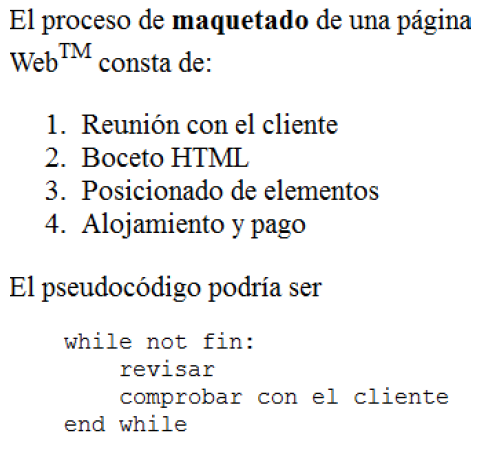
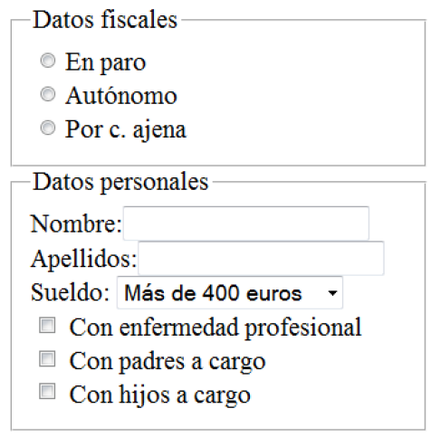
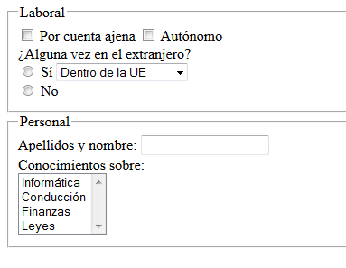

HTML5
=======================================

Introducción
-----------------------------------------------------

Es la última revisión del estándar HTML. Se incluyen algunas etiquetas nuevas cuyo significado se comentará a continuación.

Etiquetas estructurales
---------------------------------------------------------------------------

Crean la estructura para el resto de la página:,

* `doctype`: identifica el estándar.
* todo documento debe ir entre las marcas `<html>` y `</html>`.
* Todo html tiene dos partes: head y body. El primero incluye otros elementos estructurales como `<title>` que indica el título de dicha página. Dentro del body se incluye el contenido real de la página.
* Dentro del body pueden incluirse otras etiquetas que estructuran el contenido de la página:

  * La etiqueta `<section>` permite marcar contenido de una página relacionado con un tema concreto.

  * `<article>` es una unidad de contenido sobre un tema específico el cual puede ser independiente de otros «artículos".

  * `<header>` se utiliza para indicar cual es la cabecera de un artículo o sección.
  
  *  `<footer>` permite definir un «pie de página", normalmente con indicación de derechos de autor, fecha o datos similares.

  * `<address>` se usa para marcar información de contacto.

  * `<aside>` se usa para definir contenido con «una relación vaga con el resto de la página" (definición tomada del estándar).

  * `<hgroup>` permite agrupar un conjunto de encabezados y marcarlos como pertenecientes al mismo contenido.  

* `<h1>`, `<h2>`, `<h3>`, `<h4>`, `<h5>` y `<h6>` establecen encabezados: trozos de texto que identifican la importancia del siguiente trozo de texto.
* Cualquier etiqueta puede ir comentada. Los comentarios no se muestran, son solo de interés para el programador en un futuro. Un comentario se abre con `<!--` y se cierra con `-->`

* La etiqueta `<a>` permite construir enlaces.

* La etiqueta `<nav>` se utilizará para crear barras de navegación.

* La etiqueta `<aside>` se utiliza para indicar información relacionada con el artículo o texto pero que no tiene porque ser parte del mismo. El ejemplo más común es utilizarlo para publicidad relacionada o texto del tipo «artículos relacionados con este".

* Las etiquetas `<script>` y `<noscript>` se utilizan para marcar pequeños programas o la ausencia de ellos.

* El elemento `<main>` indica **el contenido principal de una página**

* La etiqueta `<div>` permite crear «divisiones" en el documento y nos serán muy útiles cuando hagamos posicionamiento. Una etiqueta muy similar, pero con un comportamiento distinto es `<span>` que permite dividir trozos de texto en un párrafo.

* La etiqueta `<details>` junto con la etiqueta `<summary>` permite crear controles que ofrecen al usuario la posibilidad de «ampliar información" a voluntad.

```html
<body>
    <details>
        <summary>HTML5</summary>
        <p>Es la última revisión del lenguaje</p>
    </details>
</body>
````

* La etiqueta `<hr>` produce una línea horizontal.

Etiquetas para definir metadatos
----------------------------------------

* En líneas generales, los metadatos más importantes se definen con la etiqueta `<meta>`. Para el correcto visionado de los símbolos de nuestra página usaremos el atributo `charset="...."`

* La etiqueta `<base>` define la URL raíz de toda la página. Permite cambiar fácilmente las URL de los enlaces de una página.

* Esta etiqueta permite «intentar conseguir" que se vea bien una página antigua que no se pensó para dispositivos móviles: `<meta name="viewport" content="width=device-width, initial-scale=1">`

* Podemos instruir a los buscadores sobre como tratar a nuestra página en cuanto a si indexarla o no y en cuanto a seguir los enlaces que ponemos (o no) con `<meta name="robots" contents="index, follow">` o `<meta name="robots" contents="noindex, follow">` o `<meta name="robots" contents="index, nofollow">`

* Las etiquetas siguientes permiten insertar código CSS :`<style>` y `</style>`. Las veremos en profundidad en el tema sobre CSS.

* Podemos insertar una descripción de nuestra página con `<meta name="description" content="Descripción">`

* Podemos insertar un icono con `<link rel="icon" sizes="192x192" href="/ruta/icon.png">`

Etiquetas de formato
---------------------------------------------------------------------

Para el formateo elemental de textos se utilizan varias etiquetas:

* `<b>` Formatea el texto en “negrita”.
* `<i>` Lo pone en “itálica” (cursiva).
* `<u>` Subraya el texto.
* Las diversas etiquetas se pueden meter unas dentro de otras para obtener efectos como “cursiva, y negrita” o “subrayado y cursiva”, sin embargo las etiquetas deben cerrarse en el orden inverso al que se abrieron.
* `<sup>` y `<sub>` fabrican respectivamente superíndices y subíndices.
* `<em>` se utiliza para enfatizar un texto.
* `<p>` Se utiliza para marcar el comienzo y el fin de un párrafo.
* La etiqueta `br` se utiliza para hacer una ruptura en el flujo del texto. Se escribe en forma abreviada `<br/>`

> Nota

Una de las grandes preguntas es si escribir la etiqueta `<br/>` o `<br>`. La respuesta corta es que da igual. La respuesta larga es que el W3C permite que _«aquellos elementos que nunca lleven nada dentro pueden indistintamente escribirse de manera autocerrada o simplemente sin cerrar"_. Así, en la cabecera podremos poner cosas como `<meta...>` o `<meta... />`

* La etiqueta `<abbr>` permite usar abreviaturas. Ejemplo: `El <abbr title="World Wide Web Consortiun>W3C</abbr>` .
* La etiqueta `<acronym>` se ha llegado a usar pero está **obsoleta** .
* La etiqueta `<blockqoute>` se usa para indicar citas largas, por ejemplo.

```html
<blockquote>
        <p>En un lugar de la Mancha de cuyo nombre...</p>
</blockquote>
```

* La etiqueta `<cite>` permite indicar una cita breve, como en `<p> Es habitual decir <cite>Alea jact est</cite></p>`
* La etiqueta `<del>` permite mostrar texto tachado.
* La etiqueta `<dfn>` permite mostrar una definición. Los navegadores suelen mostrar esta etiqueta igual que `<abbr>` .
* La etiqueta `<ins>` permite indicar texto que haya sido insertado a posteriori. Suele mostrarse en cursiva.
* La etiqueta `<mark>` permite destacar texto de una manera muy llamativa.
* La etiqueta `<output>` es como el control de un formulario pero se introdujo para recalcar que contiene el resultado de un cálculo.
* La etiqueta `<samp>` está pensada para muestras (samples) de programas o resultado de ejecuciones.
* La etiqueta `<tt>` imita los teletipos (estilo máquina de escribir).
* La etiqueta `<wbr>` está pensada para ayudar al navegador a decidir donde «romper" una palabra y poner el guión.

Gestión de espacios
-------------------

Los navegadores web manejan el espacio de una forma un poco especial:

* Si se pone uno o varios espacios en blanco o si se pulsa la tecla ENTER muchas veces el navegador mostrará _un solo espacio en blanco_
* Para poner un espacio en blanco horizontal se puede usar la entidad `&nbsp;`.
* Para hacer un salto de línea se puede usar la etiqueta `<br/>` (esta etiqueta no lleva asociada una etiqueta de cierra, es _autocerrada_)
* Se puede indicar el comienzo y el final de un párrafo con `<p>` y `</p>`.

Una pregunta habitual es «¿Cuando se debe usar `<p>` y cuando `<br/>?`. La respuesta es «depende". Una posible respuesta es que si se escriben varios párrafos relacionados es bastante habitual separarlos con `<br/>` mientras que si se ponen varios párrafos que hablan de distintas cosas es habitual usar `<p>` con cada uno de ellos, sin embargo no hay una respuesta universal.

Entidades
----------

Las entidades HTML permiten escribir determinados símbolos especiales que podrían confundir al navegador, así como otros símbolos que no aparecen directamente en los teclados:

* &lt; y &gt; representan los símbolos < y >.
* &copy; -> &copy;
* &trade;  -> &trade;
* &reg;  -> &reg;
* &euro; -> &euro; y &yen; -> &yen;
* &amp; -> &amp;


Texto preformateado
-------------------------------------------------------------------

Algunas marcas, como `<pre>` permiten obligar al navegador a que respete los espacios en blanco tal y como aparecen en la página original.

Si se desea indicar que algo debe ser teclado por el usuario se usa la marca `<kbd>`.

Si se desea indicar que algo es una variable se puede usar la marca `<var>`.

La etiqueta `<code>` permite indicar que un determinado es código en un lenguaje de programación.

Listas
-----------------------------------------

Es una secuencia de elementos relacionados en torno a un mismo concepto Para abrir una lista de elementos se utilizan dos posibles marcas:

* `<ol>` Para crear una lista ordenada (numerada)
* `<ul>` Para crear una lista desordenada (no numerada)

Una vez creadas hay que etiquetar cada elemento de la lista con la etiqueta `<li>`.

En un plano distinto se pueden encontrar las **listas de definiciones**. Con estos elementos se puede especificar una secuencia de términos para los cuales proporcionamos una definición. Su estructura es la siguiente:

* `<dl>` y `</dl>` marcan el inicio y el final de la lista de definiciones. Dentro de estas etiquetas pondremos las dos siguientes.
* `<dt>` y `</dt>` especifican el _término_ que vamos a definir.
* `<dd>` y `</dd>` indican la definición asociada al término anterior.

Ejemplo:

```html
<dl>
    <dt>Etiqueta</dt>
    <dd>Todo lo contenido...</dd>
    <dt>Elemento</dt>
    <dd>
            Se define así a todo el árbol
            de nodos comprendido
            entre dos etiquetas
            de apertura y cierre.
    </dd>
</dl>
```

### Ejercicio

Comprueba que el siguiente código HTML crea unas listas dentro de otras. Prueba a crear listas desordenadas dentro de listas desordenadas.

```html
<body>

Antes de programar
<ol>
    <li>
        Instalar JDK
        <ol>
            <li>Ir a oracle.com</li>
            <li>Buscar JDK</li>
            <li>Aceptar licencia</li>
            <li>Descargar</li>
            <li>
                Ejecutar setup.exe
                <ol>
                    <li>
                         Ejecutar como admin
                    </li>
                    <li>>/li>
                </ol>
            </li>
        </ol>
    </li>
    <li>Modificar variables de entorno</li>
    <li>Asignar más memoria</li>
    <li>Reiniciar</li>
</ol>
Prerrequisitos
<ul>
    <li>Comprobar RAM</li>
    <li>Comprobar disco</li>
    <li>Comprobar arranque</li>
</ul>
</body>
```

Tablas
-----------------------------------------

Una tabla muestra un conjunto de elementos relacionados en forma de matriz. No deberían usarse para maquetar la posición de los elementos. Todo el contenido de la tabla debe ir entre las etiquetas `<table>` y `</table>`. Las tablas se construyen de izquierda a derecha (por columnas) y de arriba a abajo (filas).

Una tabla puede tener una cabecera, un cuerpo y un pie, especificados por `<thead>`, `<tbody>` y `<tfoot>`. La primera etiqueta dentro de `<tbody>`, solo puede ser `<tr>`.

 **Cuidado al crear tablas, todo dato, o subtablas debe ir dentro de `<td>`, es absolutamente obligatorio**

Para ser exactos una tabla puede llevar estas etiquetas:

* `caption`: permite asociar a una tabla un texto.
* `colgroup` :permite asociar información a columnas usando dentro la etiqueta `<col>` .
* `thead`: dentro de ella a su vez pondremos una fila (`<tr>`) con celdas en las que la etiqueta es `<th>`
* `tbody`: utiliza las filas y columnas normales.
* `tfooter`: también usa `<tr>` y `<td>` de la forma habitual, sin embargo permite describir mejor el contenido de la tabla. Se utiliza para celdas con los valores acumulados o similares.


### Un ejemplo de tabla

Se desea crear una tabla que represente los datos del medallero de unas olimpiadas y que se muestre de forma parecida a lo que muestra la figura:

| País | Oro | Plata | Bronce |
| --- | --- | --- | --- |
| USA | 110 | 115 | 99  |
| Total | 219 | 247 | 206 |

```html
<table border="1">
<thead>
    <tr>
        <th>País</th>
        <th>Oro</th>
        <th>Plata</th>
        <th>Bronce</th>
    </tr>
</thead>
<tbody>
    <tr>
        <td>USA</td>
        <td>110</td>
        <td>115</td>
        <td>99</td>
    </tr>
</tbody>
<tfoot>
    <tr>
        <td>Total</td>
        <td>219</td>
        <td>247</td>
        <td>206</td>
    </tr>
</tfoot>
</table>
```

Formularios
---------------------------------------------------

Un formulario permite que el usuario interactúe con la página por medio de una serie de controles

### Campo de texto

Permite crear una zona donde el usuario puede escribir y se muestra un ejemplo a continuación. Tiene algunos atributos que se usan muy a menudo:

* `type` indica el tipo de control
* `name` será el nombre de la variable en JS (no lo usaremos por ahora)
* `id` permitirá procesar el control de JS (no se usará por ahora)
* `value` permite indicar un valor por defecto
* `size` indica la anchura por defecto

```html
<input type="text" name="nombre_usuario" id="id_nombre" value="Escriba su nombre aqui">
```

Un campo de texto puede llevar asociada una etiqueta `label` que indique al navegador que texto va con ese campo. Esto es de utilidad para programas lectores de páginas y en general para gente con discapacidad.

```html
<label for="d_nombre">Nombre de usuario</label>
<input type="text" name="nombre_usuario" id="id_nombre" value="Escriba su nombre aqui">
```

Si el type de este elemento se sustituye por `password` se obtiene un control igual, pero que reemplaza el texto por símbolos que ocultan el texto.

Es posible ofrecer un conjunto de posibles opciones para un campo de texto usando un control llamado `<datalist>`. Así, supongamos que pedimos el idioma al usuario pero deseamos ofrecer la posibilidad de autocompletar mostrando algunos idiomas comunes. Se puede usar este código:

```html
<br/>
Introduzca su idioma:<input type="text" id="idiomascomunes">
<datalist id="idiomas">
        <option value="Inglés"></option>
        <option value="Alemán"></option>
        <option value="Español"></option>
        <option value="Francés"></option>
</datalist>
```

### Campo email

Si sabemos con seguridad que en un campo se va a introducir el email se puede usar este código:

```html
<br/>
Introduzca su email:<input type="email" name="sexo">
```

El navegador hará **automáticamente** la comprobación de que lo que introduce el usuario es realmente un email.

### Selector único (radio-button)

Permite elegir una sola opción de entre muchas, se necesita usar un `input` de tipo `radio`.

```html
<br/>
<input type="radio" name="sexo">Masculino
<br/>
<input type="radio" name="sexo">Femenino
```

Si se desea que un control de tipo `checkbox` o `radio` aparezca marcado por defecto se debe añadir el atributo `multiple="multiple"`.

### Selector múltiple

Permite elegir múltiples combinaciones de opciones. El nombre del control utilizará los corchetes para crear un vector que se procesará desde Javascript.

```html
<br/>
<input type="checkbox" name="medios[]">
Coche
<br/>
<input type="checkbox" name="medios[]">
Moto
<br/>
<input type="checkbox" name="medios[]">
Bici
```

### Lista desplegable

Permite elegir valores de una lista.

```html
<select name="provincia">
    <option value="AB">Albacete</option>
    <option value="CR">Ciudad R.</option>
    <option value="CU">Cuenca</option>
</select>
```

Se debe recordar que el texto que ven los usuarios es lo que va entre las etiquetas option. El valor que comprobarán los programadores es lo que va en value En una lista desplegable se pueden elegir muchos valores usando el atributo `multiple`.

Si se desea que una opción (o varias si usamos el selector múltiple) aparezca marcada se debe usar `selected="selected"`.

### Textareas

Permiten introducir textos muy largos:

```html
<textarea rows="10" cols="15">
    Valor por defecto
</textarea>
```

Otros elementos HTML: contenido embebido y multimedia
---------------------------------------------------------

En HTML existen otras etiquetas que permiten insertar contenido dentro del HTML que no tiene por qué ser HTML

### Contenido embebido en general

Podemos usar la etiqueta `object` para insertar contenido de otro tipo, como archivos de vídeo, de audio, documentos PDF etc… Así, por ejemplo, el siguiente HTML inserta una imagen (cosa que en realidad ya se podía hacer con la etiqueta `img`)

```html
<object data=
"low_res.png" width="550px" height="150px">Imagen </object>
```

El problema principal con la etiqueta `object` es que su soporte dentro de los navegadores es menos amplio que el de las etiquetas que veremos ahora. Sin embargo, su versatilidad es mayor.

La etiqueta `audio` permite insertar audios dentro del documento, ofreciendo además un interfaz de control del audio con los elementos típicos: reproducción, parada, control de volumen, etc…

```html
<audio controls="controls" src="media/cancion.mp3">
```

Su navegador no ofrece soporte para audios embebidos `</audio>`

La etiqueta `video` funciona de manera similar a `audio` permitiendo insertar en este caso vídeos dentro de una página.

```html
<video controls="controls" src="videos/video.mp4">
```

Su navegador no ofrece soporte para vídeos embebidos. `</video>`

Ejercicios tipo examen
-------------------------

### Enunciado

_Crea una página HTML que produzca este resultado_

[](_images/maqueta1.png)

### Solución

### Enunciado

_Crea un formulario como este donde haya 3 opciones en la lista desplegable: "Más de 400", "Menos de 400", "Variables"_



### Solución

El HTML siguiente produce el resultado que nos piden

```html
<!DOCTYPE html>
<html>
<head>
    <meta charset="utf-8">
    <title>Formulario fiscal</title>
</head>
<body>

<form>
   <fieldset>
    <legend>
        Datos fiscales
    </legend>
    <input type="checkbox" id="enparo"
        name="sit_laboral">
    <label for="enparo">En paro</label>
    <br/>
    <input type="checkbox" id="autonomo"
        name="sit_laboral">
    <label for="autonomo">Autónomo</label>
    <br/>
    <input type="checkbox" id="c_ajena"
        name="sit_laboral">
    <label for="c_ajena">Por c.ajena</label>
    <br/>
   </fieldset>
   <fieldset>
     <legend>Datos personales</legend>
     <label for="nombre">Nombre</label>
     <input type="text" id="nombre">
     <br/>
     <label for="apellidos">Apellidos</label>
     <input type="text" id="apellidos">
     <br/>
     <label for="sueldo">Sueldo</label>
     <select id="sueldo"></select>
       <option>Más de 400 euros</option>
       <option>Menos de 400 euros</option>
       <option>Variable</option>
     </select>
     <br/>
     <input type="checkbox" id="con_ep">
     <label for="con_ep">
         Con enfermedad profesional
     </label> <br/>
     <input type="checkbox" id="con_padres">
     <label for="con_padres">
         Con padres a cargo
     </label> <br/>
     <input type="checkbox" id="con_hijos">
     <label for="con_hijos">
         Con hijos a cargo
     </label> <br/>
   </fieldset>   
</form>
</body>
</html>
```


### Enunciado

_Crea un formulario como este_



```html
<form>
        <fieldset>
                <legend>
                        Laboral
                </legend>
                <input type="checkbox"
                           name="contratos[]"
                           id="ajena">
                Por cuenta ajena
                <input type="checkbox"
                           name="contratos[]"
                           id="autonomo">
                Autónomo
                <br/>
                ¿Alguna vez en el extranjero?
                <br/>
                <input type="radio"
                           name="en_extranjero"
                           id="si_en_extranjero">
                Sí

                <select name="lugar">
                        <option id="en_ue">
                                Dentro de la UE
                        </option>
                        <option id="en_asia">
                                En Asia
                        </option>
                        <option id="en_hispanoamerica">
                                En Hispanoamérica
                        </option>
                        <option id="en_eeuu">
                                En EE.UU
                        </option>
                        <option id="en_otro">
                                En otro
                        </option>
                </select>
                <br/>
                <input type="radio"
                           name="en_extranjero"
                           id="no_en_extranjero">
                No
        </fieldset>
        <fieldset>
                <legend>
                        Personal
                </legend>
                Apellidos y nombre:
                <input type="text"
                           id="ap_nombre">
                <br/>
                Conocimientos sobre:<br/>
                <select name="cono" multiple>
                        <option id="informatica">
                                Informática
                        </option>
                        <option id="conduccion">
                                Conducción
                        </option>
                        <option id="finanzas">
                                Finanzas
                        </option>
                        <option id="leyes">
                                Leyes
                        </option>
                </select>
        </fieldset>
</form>
```
