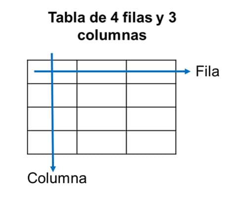

Creación de tablas en HTML
--------------------------

Para crear tablas en HTML debemos saber que una tabla es una **estructura formada por filas y columnas**  donde las filas son las distribuciones **horizontales** y las columnas son las distribuciones **verticales**. Para construir una tabla crearemos dichas filas y columnas mediante etiquetas que aprenderemos en adelante. Para crear e insertar una tabla en HTML, haremos uso de las etiquetas. Por ejemplo, en la siguiente imagen podemos observar una tabla con 4 filas y 3 columnas.



Diferencia entre las filas y columnas de una tabla en HTML

En HTML, la estructura de una tabla se crea con etiquetas, la etiqueta  **`<table>` indica que es un elemento de tabla**, dentro de ella tenemos otra **etiqueta `<tr>`**, esta representa las filas de una tabla y finalmente, dentro de cada fila esta la **etiqueta `<td>`** que representa las columnas que generan las celdas de cada fila.

### Etiqueta `<table>`

Para crear y definir una tabla en HTML, simplemente empleamos la **etiqueta `<table>`**:

```html
<table>
    
</table>
```

### Etiqueta `<tr>`

Para crear una fila dentro de una tabla ( `<table>` ) empleamos la etiqueta `<tr>` ; si deseamos varias filas, entonces crearemos varias etiquetas `<tr>` con su respectiva etiqueta de cierre. Veamos un **ejemplo de una tabla con 3 filas.** Por cada `<tr>` se crea una fila dentro de la tabla.

```html
<table>
    <tr>
    </tr>
    
    <tr>
    </tr>
    
    <tr>
    </tr>
</table> 
```

### Etiqueta `<td>`

La etiqueta `<td>` va contenida dentro de `<tr>`. Por cada `<td>` se crea una columna dentro de la fila `<tr>`.

La etiqueta `<td>` prácticamente actúa como contenedor, dentro de ella irán los contenidos de tabla, puede ir texto, imágenes, e incluso más tablas y otros elementos HTML...

Veamos el ejemplo:

```html
<table> 
    <tr> 
        <td> Primero </td>
        <td> Segundo </td>
        <td> Tercero </td>
    </tr>
</table>
```

Resumiendo: **dentro de las tablas `<table>` van las filas `<tr>`** y **dentro de las filas van las columnas `<td>`** , además, dentro de las tablas pueden ir varias filas y dentro de las filas pueden ir varias columnas como veremos más adelante.

**Resultado:**

[https://codepen.io/dgmx/pen/KwgzEMj](https://codepen.io/dgmx/pen/KwgzEMj)  
Tabla de una fila y tres columnas sin estilo

Como podemos observar, **el resultado es una tabla de una fila y tres columnas** , sin embargo a simple vista no parece ser una tabla, y para mejorar el aspecto emplearemos a continuación el atributo `border` .

### Atributo border

Cuando creamos una tabla, por defecto no tiene ningún borde.

Para ponerle borde a la tabla **utilizamos el atributo `border`** y en su valor la dimensión de ese borde.

Como ejemplo veamos la misma tabla anterior pero en este caso le ponemos borde de 1px:

```html
<table border="1px"> 
    <tr> 
        <td> Primero </td>
        <td> Segundo </td>
        <td> Tercero </td>
    </tr>
</table>
```

**Resultado:**

[https://codepen.io/dgmx/pen/ogzxVzw](https://codepen.io/dgmx/pen/ogzxVzw)  
Tabla html con borde de 1px

Ahora el resultado ya tiene un borde, por defecto, veremos que cada celda o elemento tiene su propio borde.

### Ejemplo de tablas en HTML

El ejemplo a continuación es una tabla de 4 filas y 5 columnas con un borde de 1px:

```html
<table border="1px">
    <tr>
        <td> elemento a </td>
        <td> elemento b </td>
        <td> elemento c </td>
        <td> elemento d </td>
        <td> elemento e </td>
    </tr>

    <tr>
        <td> lemento A </td>
        <td> lemento B </td>
        <td> lemento C </td>
        <td> lemento D </td>
        <td> lemento E </td>
    </tr>

    <tr>
        <td> emento AA </td>
        <td> emento BB </td>
        <td> emento CC </td>
        <td> emento DD </td>
        <td> emento EE </td>
    </tr>

    <tr>
        <td> mento AAA </td>
        <td> mento BBB </td>
        <td> mento CCC </td>
        <td> mento DDD </td>
        <td> mento EEE </td>
    </tr>
</table>
```

**Resultado:**

[https://codepen.io/dgmx/pen/LERNaby](https://codepen.io/dgmx/pen/LERNaby)  
Imagen de una tabla normal hecha en HTML

### Etiqueta <th>

Utilizaremos `<th>` para poner encabezado a la tabla en su primera fila.

Cada elemento `<th>` será el encabezado de una columna, veamos un ejemplo y como se ve:

```html
<table border="1px">
    <tr>
        <th> Lunes </th>
        <th> Martes </th>
        <th> Miércoles </th>
        <th> Jueves </th>
        <th> Viernes </th>
    </tr>
    <tr>
        <td> Matemática  </td>
        <td> Ciencias </td>
        <td> Matemática </td>
        <td> Sociales </td>
        <td> Arte </td>
    </tr>
    <tr>
        <td> Inglés </td>
        <td> Comunicación </td>
        <td> Biologia </td>
        <td> Historia </td>
        <td> Física </td>
    </tr>
    <tr>
        <td> Computación </td>
        <td> Historia </td>
        <td> Economia </td>
        <td> Química </td>
        <td> Redacción </td>
    </tr>
</table>
```

**Resultado:**

<table border="1px">
<tr>
 <th> Lunes </th>
 <th> Martes </th>
 <th> Miércoles </th>
 <th> Jueves </th>
 <th> Viernes </th>
</tr>

<tr>
 <td> Matemática  </td>
 <td> Ciencias </td>
 <td> Matemática </td>
 <td> Sociales </td>
 <td> Arte </td>
</tr>

<tr>
 <td> Inglés </td>
 <td> Comunicación </td>
 <td> Biologia </td>
 <td> Historia </td>
 <td> Física </td>
</tr>

<tr>
 <td> Computación </td>
 <td> Historia </td>
 <td> Economia </td>
 <td> Química </td>
 <td> Redacción </td>
</tr>
</table>

[https://codepen.io/dgmx/pen/YPGqgNY](https://codepen.io/dgmx/pen/YPGqgNY)  
Imagen con tabla html con encabezado en sus columnas.

Como podemos notar, los elementos dentro de las etiquetas de encabezado de tabla `<th>` se resaltan, de tal manera que poseen un significado semántico.

A continuación aprenderemos a combinar filas y columnas, algo que será de mucha utilidad.

Atributo colspan y rowspan
--------------------------

En muchas ocasiones es necesario **combinar celdas de una tabla** , como verás, algunas veces es necesario combinar **celdas de una misma fila** y en otras **celdas de una misma columna** , todo ello aprenderemos a continuación, es muy sencillo:

### Combinar filas en tablas HTML

Para combinar celdas de distintas filas en una tabla HTML **emplearemos el atributo `rowspan`** dentro del elemento `<td>` desde donde se extenderá la combinación y en su valor colocaremos el número de filas que serán combinadas, recuerda que las filas están unas sobre otras; veamos un ejemplo:

```html
<table border="1">
    <tr>
        <td rowspan="2"> Oso </td>
        <td> León </td>
        <td> Tigre </td>
    </tr>
    <tr>
        <td> Cebra </td>
        <td rowspan="3"> Panda </td>
    </tr>
    <tr>
        <td> Loro </td>
        <td> Pato </td>
    </tr>
    <tr>
        <td> Buo </td>
        <td> Águila </td>
    </tr>
</table> 
```

**Resultado:**

<table border="1">
<tr>
 <td rowspan="2"> Oso </td>
 <td> León </td>
 <td> Tigre </td>
</tr>
    
<tr>
 <td> Cebra </td>
 <td rowspan="3"> Panda </td>
</tr>
    
<tr>
 <td> Loro </td>
 <td> Pato </td>
</tr>
    
<tr>
 <td> Buo </td>
 <td> Águila </td>
</tr>

</table> 

[https://codepen.io/dgmx/pen/emdZXGJ](https://codepen.io/dgmx/pen/emdZXGJ)  
Imagen de tabla HTML con filas combinadas

Observa como la celda oso desplaza una fila más, es decir ocupa dos celdas en la misma columna, esto ocurre por el valor de `2` colocada para la propiedad `ROWSPAN`. Por otro lado, la celda Panda ocupa 3 celdas por su valor 3.

En fin, `ROWSPAN` sirve para combinar celdas en filas distintas y en la misma columna.

### Combinar columnas de tablas en HTML

Ahora aprenderemos a combinar elementos de la misma fila y **de diferentes columnas** , es bastante sencillo, simplemente **emplearemos el atributo `COLSPAN`** en el elemento desde donde se hará la combinación, a partir de ahí se combinará el número de celdas especificada en el valor del atributo `colspan` ; veamos el ejemplo:

```html
<table border="1">
    <tr>
        <td > Rojo </td>
        <td colspan="2"> Verde </td>
    </tr>
    <tr>
        <td> Café </td>
        <td> Marrón </td>
        <td> Tinto </td>
    </tr>
    <tr>
        <td colspan="3"> Naranja </td>
    </tr>
    <tr>
        <td colspan="2"> Blanco </td>
        <td> Negro </td>
    </tr>
</table> 
```

**Resultado:**
<table border="1">
<tr>
 <td > Rojo </td>
 <td colspan="2"> Verde </td>
</tr>
    
<tr>
 <td> Café </td>
 <td> Marrón </td>
 <td> Tinto </td>
</tr>
    
<tr>
 <td colspan="3"> Naranja </td>
</tr>
    
<tr>
 <td colspan="2"> Blanco </td>
 <td> Negro </td>
</tr>

</table>

[https://codepen.io/dgmx/pen/KwgzEyP](https://codepen.io/dgmx/pen/KwgzEyP)  
 Imagen con atributo COLSPAN aplicado a tablas

Como podemos observar, en la primera fila se combinan dos celdas a partir de la celda verde; en la tercera fila se combina tres celdas a partir de la celda naranja y en la cuarta fila se combina dos filas a partir de la celda blanco.

A continuación conozcamos las algunas etiquetas que definen la estructura de una tabla en HTML.

### Etiquetas <thead>, <tbody> y <tfood> para tablas

Estas etiquetas sirven para identificar la cabecera, el cuerpo y el pie de la tabla, en algunas ocasiones necesitamos definir cuál será la cabecera de nuestra tabla, el cuerpo y el pie de tabla.

Además de proporcionar a los elementos de un significado para los navegadores, estas etiquetas pueden ser útiles para dar estilo a nuestras tablas, veamos un ejemplo:

```html
<table border="1px">
    <thead bgcolor="red">
        <tr>
            <td> PAQUETES </td>
            <td> Paquete 1  </td>
            <td> Paquete 2 </td>
            <td> Paquete 3 </td>
            <td> Paquete 4 </td>
            <td> Paquete 5 </td>
        </tr>
    </thead>
        
    <tbody bgcolor="yellow">
        <tr>
            <td rowspan="3"> CURSOS  </td>
            <td> Matemática  </td>
            <td> Ciencias </td>
            <td> Matemática </td>
            <td> Sociales </td>
            <td> Arte </td>
        </tr>

        <tr>
            <td> Inglés </td>
            <td> Comunicación </td>
            <td> Biologia </td>
            <td> Historia </td>
            <td> Física </td>
        </tr>

        <tr>
            <td> Computación </td>
            <td> Historia </td>
            <td> Economia </td>
            <td> Química </td>
            <td> Redacción </td>
        </tr>
    </tbody>
    <tfoot bgcolor="blue">
        <tr>
            <td> PRECIOS  </td>
            <td> 10 € </td>
            <td> 20 € </td>
            <td> 30 € </td>
            <td> 40 € </td>
            <td> 50 € </td>
        </tr>
    </tfoot>
</table>

```

**Resultado:**

[https://codepen.io/dgmx/pen/KwgzEZK](https://codepen.io/dgmx/pen/KwgzEZK)  
Imagen de una tabla HTML con sus tres componentes

### Atributo bgcolor para color de tabla

Se puede utilizar **el atributo `bgcolor`** como lo hicimos en el ejemplo anterior para colocar un color de fondo a un elemento, de esa manera podemos poner color a cada elemento de una tabla html.

### La propiedad border-collapse

Esta parte ya corresponde a la parte de `CSS` para tablas pero lo veremos a modo de ejemplo. Cada celda tiene su propio borde, para evitar eso usamos la propiedad para tablas border-collapse, su valor será collapse; de esta manera los bordes colapsan en uno solo. Veamos un ejemplo. Dicha propiedad la declararemos dentro de un atributo style.

```html
<table border="1px" style="border-collapse:collapse;"> 
    <tr> 
        <td> Primero </td>
        <td> Segundo </td>
        <td> Tercero </td>
    </tr>
</table>
```

Asi se verán los bordes: 
<table border="1px" style="border-collapse:collapse;"> 
    <tr> 
        <td> Primero </td>
        <td> Segundo </td>
        <td> Tercero </td>
    </tr>
</table>

Esto es un ejemplo aislado, pues estamos utilizando CSS en HTML.

Ejemplo completo de tablas en HTML
----------------------------------

Con todo lo aprendido, ahora crearemos una tabla completa con código HTML, en este ejemplo haremos un horario de cursos, veamos:

```html
<table border="1px" width ="80%" height ="300px" style="border-collapse:collapse; text-align:center;">
    <thead bgcolor="#88b1f7" height ="40px">
        <tr>
            <td colspan="6"> MI HORARIO DE CLASES </td>
        </tr>
    </thead>
    <tbody bgcolor="#88f79b">
        <tr bgcolor="#4585f5">
            <td> Hora  </td>
            <td> LUNES  </td>
            <td> MARTES </td>
            <td> MIERCOLES </td>
            <td> JUEVES </td>
            <td> VIERNES </td>
        </tr>
        <tr>
            <td> 7 - 9 am </td>
            <td> Física </td>
            <td> Geografía  </td>
            <td> Historia </td>
            <td> Cálculo </td>
            <td> Cívica </td>
        </tr>
        <tr>
            <td> 9 - 11 am </td>
            <td> Comunicación </td>
            <td> Biologia </td>
            <td> Matemática </td>
            <td> Física </td>
            <td> Química </td>
        </tr>
        <tr>
            <td> 11 - 1 am</td>
            <td colspan="5"> DESCANSO </td>
        </tr>
        <tr>
            <td> 3 - 5 pm</td>
            <td> Historia </td>
            <td> Arte </td>
            <td> Música </td>
            <td> Tecnología </td>
            <td> Física </td>
        </tr>
        <tr>
            <td> 5 - 7 pm</td>
            <td> Inglés </td>
            <td> Economia </td>
            <td> Química </td>
            <td> Redacción </td>
            <td> Música </td>
        </tr>
    </tbody>
    <tfoot bgcolor="#88b1f7">
        <tr>
            <td colspan="6"> Horario verano del 5to B  </td>
        </tr>
    </tfoot>
</table>

```
  
**Resultado:**

[https://codepen.io/dgmx/pen/myrPopj](https://codepen.io/dgmx/pen/myrPopj)

**Tabla con CSS externo:**

[https://codepen.io/dgmx/pen/jEMqJzN](https://codepen.io/dgmx/pen/jEMqJzN)