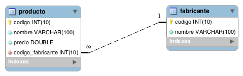
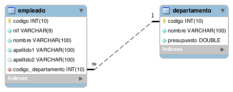
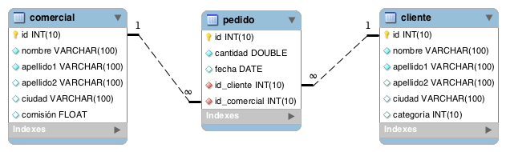
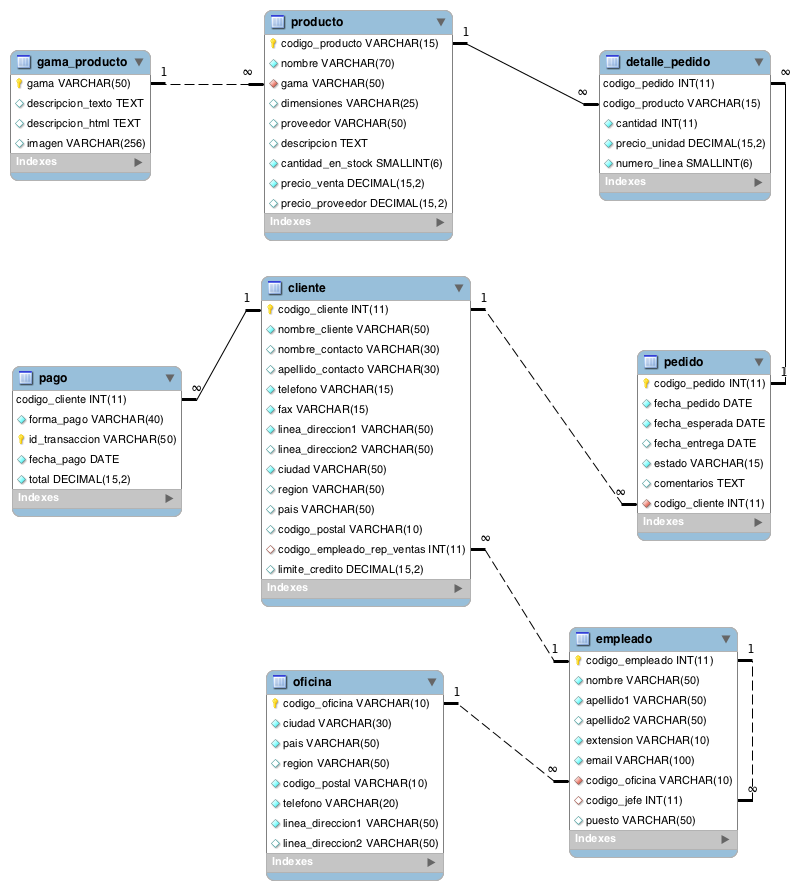
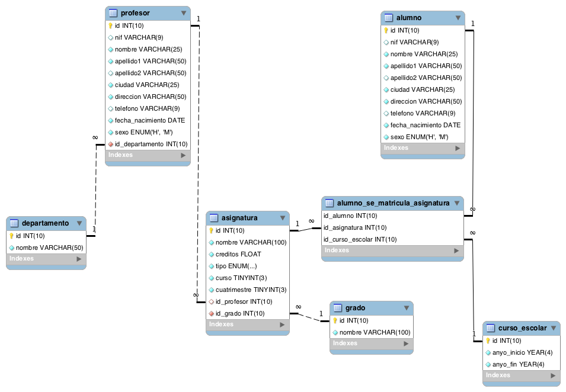
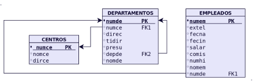

# Prácticas SQL 
Repositorio dedicado a la resolución de ejercicios SQL con MariaDB

Los ejercicios fueron obtenidos desde la página del gran [José Juan Sanchez](https://josejuansanchez.org/bd/ejercicios-consultas-sql/index.html).

La misma cuenta con múltiples bases de datos y ejercicios.

## Ejercicios

### Base de datos N° 1 - Tienda de informática

[Ir a los ejercicios de Tienda Informática](informatica.md)

### Base de datos N° 2 - Gestión de empleados

[Ir a los ejercicios de Gestión de Empleados](empleados.md)

### Base de datos N° 3 - Gestión de ventas

[Ir a los ejercicios de Gestión de Ventas](ventas.md)

### Base de datos N° 4 - Jardinería

[Ir a los ejercicios de Jardinería](jardineria.md)

### Base de datos N° 5 - Universidad

[Ir a los ejercicios de Universidad](universidad.md)

### Base de datos N° 6 - Gestión de Centros

[Ir a los ejercicios de Gestión de Centros](gestion_centros.md)

### Base de datos N° 7 - Gestión de Departamentos

[Ir a los ejercicios de Gestión de Centros](departamentos.md)

### Base de datos N° 8 - Tienda de Ropa

[Ir a los ejercicios de GTienda de Ropa](ropatienda.md)

#### Repositorio de MariaDB SQL completo con ejercicios y scripts:

[Github Repositorio](https://github.com/dgmx/Bases-de-DATOS)