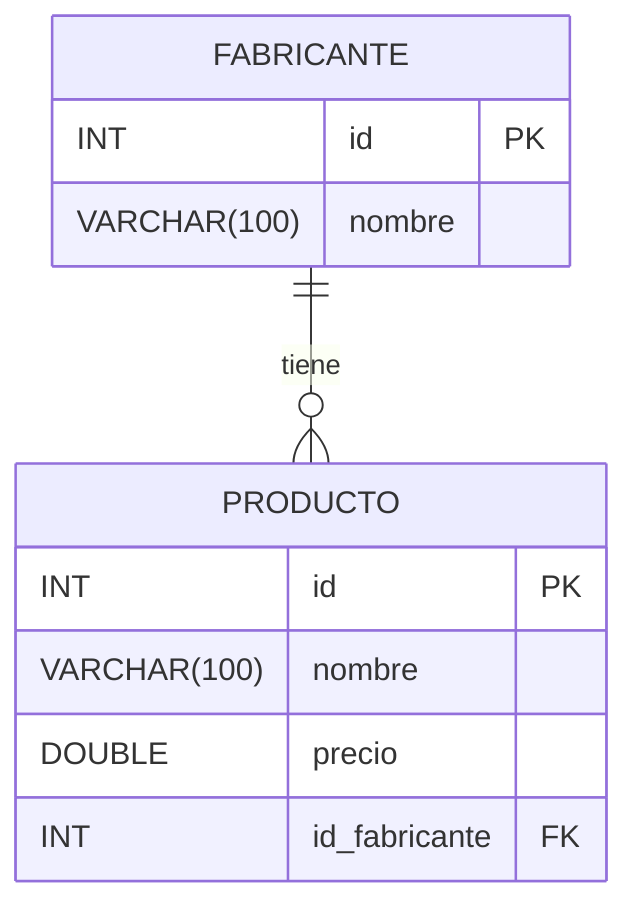

# Ejercicio. Tienda informática
## Modelo Relacional




`FABRICANTE` tiene una **clave primaria** `id`.  
`PRODUCTO` también tiene una **clave primaria** `id` y una **clave foránea** `id_fabricante` que referencia `FABRICANTE(id)`.  
La relación indica que un `FABRICANTE` puede tener múltiples `PRODUCTOS`, pero cada `PRODUCTO` pertenece a un único `FABRICANTE`.


```sql
DROP DATABASE IF EXISTS tienda;
CREATE DATABASE tienda CHARACTER SET utf8mb4;
USE tienda;

CREATE TABLE fabricante (
  id INT UNSIGNED AUTO_INCREMENT PRIMARY KEY,
  nombre VARCHAR(100) NOT NULL
);

CREATE TABLE producto (
  id INT UNSIGNED AUTO_INCREMENT PRIMARY KEY,
  nombre VARCHAR(100) NOT NULL,
  precio DOUBLE NOT NULL,
  id_fabricante INT UNSIGNED NOT NULL,
  FOREIGN KEY (id_fabricante) REFERENCES fabricante(id)
);

INSERT INTO fabricante VALUES(1, 'Asus');
INSERT INTO fabricante VALUES(2, 'Lenovo');
INSERT INTO fabricante VALUES(3, 'Hewlett-Packard');
INSERT INTO fabricante VALUES(4, 'Samsung');
INSERT INTO fabricante VALUES(5, 'Seagate');
INSERT INTO fabricante VALUES(6, 'Crucial');
INSERT INTO fabricante VALUES(7, 'Gigabyte');
INSERT INTO fabricante VALUES(8, 'Huawei');
INSERT INTO fabricante VALUES(9, 'Xiaomi');

INSERT INTO producto VALUES(1, 'Disco duro SATA3 1TB', 86.99, 5);
INSERT INTO producto VALUES(2, 'Memoria RAM DDR4 8GB', 120, 6);
INSERT INTO producto VALUES(3, 'Disco SSD 1 TB', 150.99, 4);
INSERT INTO producto VALUES(4, 'GeForce GTX 1050Ti', 185, 7);
INSERT INTO producto VALUES(5, 'GeForce GTX 1080 Xtreme', 755, 6);
INSERT INTO producto VALUES(6, 'Monitor 24 LED Full HD', 202, 1);
INSERT INTO producto VALUES(7, 'Monitor 27 LED Full HD', 245.99, 1);
INSERT INTO producto VALUES(8, 'Portátil Yoga 520', 559, 2);
INSERT INTO producto VALUES(9, 'Portátil Ideapd 320', 444, 2);
INSERT INTO producto VALUES(10, 'Impresora HP Deskjet 3720', 59.99, 3);
INSERT INTO producto VALUES(11, 'Impresora HP Laserjet Pro M26nw', 180, 3);
```


## Consultas sobre una tabla

1. Lista el nombre de todos los productos que hay en la tabla producto.
    ::: details Mostrar solución {close}
    
    ```sql
    SELECT nombre 
    FROM producto;
    ```
    
    :::

2. Lista los nombres y los precios de todos los productos de la tabla producto.
    ::: details Mostrar solución {close}
    
    ```sql
    SELECT nombre, precio 
    FROM producto;
    ```
    
    :::

3. Lista todas las columnas de la tabla producto.
    ::: details Mostrar solución {close}
    
    ```sql
    SELECT * 
    FROM producto;
    ```
    
    :::

4. Lista el nombre de los productos, el precio en euros y el precio en dólares estadounidenses (USD).
    ::: details Mostrar solución {close}
    
    ```sql
    SELECT nombre, precio AS PrecioEuros, TRUNCATE(precio * 1.10, 2) AS PrecioDolar
    FROM producto;
    ```
    
    :::

5. Lista el nombre de los productos, el precio en euros y el precio en dólares estadounidenses (USD). Utiliza los siguientes alias para las columnas: nombre de producto, euros, dólares.
    ::: details Mostrar solución {close}
    
    ```sql
    SELECT nombre AS 'nombre de producto', precio AS 'euros', TRUNCATE(precio * 1.10, 2) AS 'dólares'
    FROM producto;
    ```
    
    :::

6. Lista los nombres y los precios de todos los productos de la tabla producto, convirtiendo los nombres a mayúscula.
    ::: details Mostrar solución {close}
    
    ```sql
    SELECT UPPER(nombre), precio
    FROM producto;
    ```
    
    :::

7. Lista los nombres y los precios de todos los productos de la tabla producto, convirtiendo los nombres a minúscula.
    ::: details Mostrar solución {close}
    
    ```sql
    SELECT LOWER(nombre), precio
    FROM producto;
    ```
    
    :::

8. Lista el nombre de todos los fabricantes en una columna, y en otra columna obtenga en mayúsculas los dos primeros caracteres del nombre del fabricante.
    ::: details Mostrar solución {close}
    
    ```sql
    SELECT f.nombre, UPPER(SUBSTR(f.nombre, 1, 2)) AS 'Nombre 2'
    FROM fabricante f;
    ```
    
    :::

9. Lista los nombres y los precios de todos los productos de la tabla producto, redondeando el valor del precio.
    ::: details Mostrar solución {close}
    
    ```sql
    SELECT nombre, ROUND(precio) AS 'Precio'
    FROM producto;
    ```
    
    :::

10. Lista los nombres y los precios de todos los productos de la tabla producto, truncando el valor del precio para mostrarlo sin ninguna cifra decimal.
    ::: details Mostrar solución {close}
    
    ```sql
    SELECT nombre, TRUNCATE(precio, 0) AS 'Precio'
    FROM producto;
    ```
    
    :::

11. Lista el código de los fabricantes que tienen productos en la tabla producto.
    ::: details Mostrar solución {close}
    
    ```sql
    SELECT DISTINCT id_fabricante
    FROM producto;
    ```
    
    :::

12. Lista el código de los fabricantes que tienen productos en la tabla producto, eliminando los códigos que aparecen repetidos.
    ::: details Mostrar solución {close}
    
    ```sql
    SELECT DISTINCT p.id_fabricante
    FROM producto p;
    ```
    
    :::

13. Lista los nombres de los fabricantes ordenados de forma ascendente.
    ::: details Mostrar solución {close}
    
    ```sql
    SELECT nombre
    FROM fabricante
    ORDER BY nombre ASC;
    ```
    
    :::

14. Lista los nombres de los fabricantes ordenados de forma descendente.
    ::: details Mostrar solución {close}
    
    ```sql
    SELECT nombre
    FROM fabricante
    ORDER BY nombre DESC;
    ```
    
    :::

15. Lista los nombres de los productos ordenados en primer lugar por el nombre de forma ascendente y en segundo lugar por el precio de forma descendente.
    ::: details Mostrar solución {close}
    
    ```sql
    SELECT nombre
    FROM producto
    ORDER BY nombre ASC, precio DESC;
    ```
    
    :::

16. Devuelve una lista con las 5 primeras filas de la tabla fabricante.
    ::: details Mostrar solución {close}
    
    ```sql
    SELECT *
    FROM fabricante
    LIMIT 5;
    ```
    
    :::

17. Devuelve una lista con 2 filas a partir de la cuarta fila de la tabla fabricante. La cuarta fila también se debe incluir en la respuesta.
    ::: details Mostrar solución {close}
    
    ```sql
    SELECT *
    FROM fabricante
    LIMIT 3, 2;
    ```
    
    :::

18. Lista el nombre y el precio del producto más barato. (Utilice solamente las cláusulas ORDER BY y LIMIT)
    ::: details Mostrar solución {close}
    
    ```sql
    SELECT nombre, precio
    FROM producto
    ORDER BY precio ASC
    LIMIT 1;
    ```
    
    :::

19. Lista el nombre y el precio del producto más caro. (Utilice solamente las cláusulas ORDER BY y LIMIT)
    ::: details Mostrar solución {close}
    
    ```sql
    SELECT nombre, precio
    FROM producto
    ORDER BY precio DESC
    LIMIT 1;
    ```
    
    :::

20. Lista el nombre de todos los productos del fabricante cuyo código de fabricante es igual a 2.
    ::: details Mostrar solución {close}
    
    ```sql
    SELECT nombre
    FROM producto
    WHERE id_fabricante = 2;
    ```
    
    :::

21. Lista el nombre de los productos que tienen un precio menor o igual a 120€.
    ::: details Mostrar solución {close}
    
    ```sql
    SELECT nombre
    FROM producto
    WHERE precio <= 120;
    ```
    
    :::

22. Lista el nombre de los productos que tienen un precio mayor o igual a 400€.
    ::: details Mostrar solución {close}
    
    ```sql
    SELECT nombre
    FROM producto
    WHERE precio >= 400;
    ```
    
    :::

23. Lista el nombre de los productos que no tienen un precio mayor o igual a 400€.
    ::: details Mostrar solución {close}
    
    ```sql
    SELECT nombre
    FROM producto
    WHERE NOT (precio >= 400);
    ```
    
    :::

24. Lista todos los productos que tengan un precio entre 80€ y 300€. Sin utilizar el operador BETWEEN.
    ::: details Mostrar solución {close}
    
    ```sql
    SELECT nombre
    FROM producto
    WHERE precio >= 80 AND precio <= 300;
    ```
    
    :::

25. Lista todos los productos que tengan un precio entre 60€ y 200€. Utilizando el operador BETWEEN.
    ::: details Mostrar solución {close}
    
    ```sql
    SELECT nombre
    FROM producto
    WHERE precio BETWEEN 60 AND 200;
    ```
    
    :::

26. Lista todos los productos que tengan un precio mayor que 200€ y que el código de fabricante sea igual a 6.
    ::: details Mostrar solución {close}
    
    ```sql
    SELECT p.nombre
    FROM producto p
    WHERE p.precio > 200 AND p.id_fabricante = 6;
    ```
    
    :::

27. Lista todos los productos donde el código de fabricante sea 1, 3 o 5. Sin utilizar el operador IN.
    ::: details Mostrar solución {close}
    
    ```sql
    SELECT p.nombre
    FROM producto p
    WHERE p.id_fabricante = 1 OR p.id_fabricante = 3 OR p.id_fabricante = 5;
    ```
    
    :::

28. Lista todos los productos donde el código de fabricante sea 1, 3 o 5. Utilizando el operador IN.
    ::: details Mostrar solución {close}
    
    ```sql
    SELECT p.nombre
    FROM producto p
    WHERE p.id_fabricante IN (1, 3, 5);
    ```
    
    :::

29. Lista el nombre y el precio de los productos en céntimos (Habrá que multiplicar por 100 el valor del precio). Cree un alias para la columna que contiene el precio que se llame céntimos.
    ::: details Mostrar solución {close}
    
    ```sql
    SELECT nombre, (precio * 100) AS Céntimos
    FROM producto;
    ```
    
    :::

30. Lista los nombres de los fabricantes cuyo nombre empiece por la letra S.
    ::: details Mostrar solución {close}
    
    ```sql
    SELECT nombre
    FROM fabricante
    WHERE nombre LIKE "s%";
    ```
    
    :::

31. Lista los nombres de los fabricantes cuyo nombre termine por la vocal e.
    ::: details Mostrar solución {close}
    
    ```sql
    SELECT nombre
    FROM fabricante
    WHERE nombre LIKE "%e";
    ```
    
    :::

32. Lista los nombres de los fabricantes cuyo nombre contenga el carácter w.
    ::: details Mostrar solución {close}
    
    ```sql
    SELECT nombre
    FROM fabricante
    WHERE nombre LIKE "%w%";
    ```
    
    :::

33. Lista los nombres de los fabricantes cuyo nombre sea de 4 caracteres.
    ::: details Mostrar solución {close}
    
    ```sql
    SELECT nombre
    FROM fabricante
    WHERE LENGTH(nombre) = 4;
    ```
    
    :::

34. Devuelve una lista con el nombre de todos los productos que contienen la cadena Portátil en el nombre.
    ::: details Mostrar solución {close}
    
    ```sql
    SELECT nombre
    FROM producto
    WHERE nombre LIKE "%Portátil%";
    ```
    
    :::

35. Devuelve una lista con el nombre de todos los productos que contienen la cadena Monitor en el nombre y tienen un precio inferior a 215 €.
    ::: details Mostrar solución {close}
    
    ```sql
    SELECT nombre
    FROM producto
    WHERE nombre LIKE "%Monitor%" AND precio < 215;
    ```
    
    :::

36. Lista el nombre y el precio de todos los productos que tengan un precio mayor o igual a 180€. Ordene el resultado en primer lugar por el precio (en orden descendente) y en segundo lugar por el nombre (en orden ascendente).
    ::: details Mostrar solución {close}
    
    ```sql
    SELECT nombre, precio
    FROM producto
    WHERE precio >= 180
    ORDER BY precio DESC, nombre ASC;
    ```
    
    :::

## Consultas multitabla (Composición interna)

1. Devuelve una lista con el nombre del producto, precio y nombre de fabricante de todos los productos de la base de datos.
    ::: details Mostrar solución {close}
    
    ```sql
    SELECT p.nombre AS 'Nombre producto', p.precio, f.nombre AS 'Nombre Fabricante'
    FROM producto p INNER JOIN fabricante f ON p.id_fabricante = f.id;
    ```
    
    :::

2. Devuelve una lista con el nombre del producto, precio y nombre de fabricante de todos los productos de la base de datos. Ordene el resultado por el nombre del fabricante, por orden alfabético.
    ::: details Mostrar solución {close}
    
    ```sql
    SELECT p.nombre AS 'Nombre producto', p.precio, f.nombre AS 'Nombre Fabricante'
    FROM producto p INNER JOIN fabricante f ON p.id_fabricante = f.id
    ORDER BY f.nombre ASC;
    ```
    
    :::

3. Devuelve una lista con el código del producto, nombre del producto, código del fabricante y nombre del fabricante, de todos los productos de la base de datos.
    ::: details Mostrar solución {close}
    
    ```sql
    SELECT p.id AS 'Código producto', p.nombre AS 'Nombre producto', f.id AS 'Código Fabricante', f.nombre AS 'Nombre Fabricante'
    FROM producto p INNER JOIN fabricante f ON p.id_fabricante = f.id;
    ```
    
    :::

4. Devuelve el nombre del producto, su precio y el nombre de su fabricante, del producto más barato.
    ::: details Mostrar solución {close}
    
    ```sql
    SELECT p.nombre AS 'Nombre producto', p.precio, f.nombre AS 'Nombre Fabricante'
    FROM producto p INNER JOIN fabricante f ON p.id_fabricante = f.id
    ORDER BY p.precio ASC
    LIMIT 1;
    ```
    
    :::

5. Devuelve el nombre del producto, su precio y el nombre de su fabricante, del producto más caro.
    ::: details Mostrar solución {close}
    
    ```sql
    SELECT p.nombre AS 'Nombre producto', p.precio, f.nombre AS 'Nombre Fabricante'
    FROM producto p INNER JOIN fabricante f ON p.id_fabricante = f.id
    ORDER BY p.precio DESC
    LIMIT 1;
    ```
    
    :::

6. Devuelve una lista de todos los productos del fabricante Lenovo.
    ::: details Mostrar solución {close}
    
    ```sql
    SELECT p.nombre
    FROM producto p INNER JOIN fabricante f ON p.id_fabricante = f.id
    WHERE f.nombre = 'Lenovo';
    ```
    
    :::

7. Devuelve una lista de todos los productos del fabricante Crucial que tengan un precio mayor que 200€.
    ::: details Mostrar solución {close}
    
    ```sql
    SELECT p.nombre
    FROM producto p INNER JOIN fabricante f ON p.id_fabricante = f.id
    WHERE f.nombre = 'Crucial' AND p.precio > 200;
    ```
    
    :::

8. Devuelve un listado con todos los productos de los fabricantes Asus, Hewlett-Packard y Seagate. Sin utilizar el operador IN.
    ::: details Mostrar solución {close}
    
    ```sql
    SELECT p.nombre
    FROM producto p INNER JOIN fabricante f ON p.id_fabricante = f.id
    WHERE f.nombre = 'Asus' OR f.nombre = 'Hewlett-Packard' OR f.nombre = 'Seagate';
    ```
    
    :::

9. Devuelve un listado con todos los productos de los fabricantes Asus, Hewlett-Packard y Seagate. Utilizando el operador IN.
    ::: details Mostrar solución {close}
    
    ```sql
    SELECT p.nombre
    FROM producto p INNER JOIN fabricante f ON p.id_fabricante = f.id
    WHERE f.nombre IN ('Asus', 'Hewlett-Packard', 'Seagate');
    ```
    
    :::

10. Devuelve un listado con el nombre y el precio de todos los productos de los fabricantes cuyo nombre termine por la vocal e.
    ::: details Mostrar solución {close}
    
    ```sql
    SELECT p.nombre, p.precio
    FROM producto p INNER JOIN fabricante f ON p.id_fabricante = f.id
    WHERE f.nombre LIKE '%e';
    ```
    
    :::

11. Devuelve un listado con el nombre y el precio de todos los productos cuyo nombre de fabricante contenga el carácter w en su nombre.
    ::: details Mostrar solución {close}
    
    ```sql
    SELECT p.nombre, p.precio
    FROM producto p INNER JOIN fabricante f ON p.id_fabricante = f.id
    WHERE f.nombre LIKE '%w%';
    ```
    
    :::

12. Devuelve un listado con el nombre de producto, precio y nombre de fabricante, de todos los productos que tengan un precio mayor o igual a 180€. Ordene el resultado en primer lugar por el precio (en orden descendente) y en segundo lugar por el nombre (en orden ascendente)
    ::: details Mostrar solución {close}
    
    ```sql
    SELECT p.nombre, p.precio, f.nombre
    FROM producto p INNER JOIN fabricante f ON p.id_fabricante = f.id
    WHERE p.precio >= 180
    ORDER BY p.precio DESC, p.nombre ASC;
    ```
    
    :::

13. Devuelve un listado con el código y el nombre de fabricante, solamente de aquellos fabricantes que tienen productos asociados en la base de datos.
    ::: details Mostrar solución {close}
    
    ```sql
    SELECT DISTINCT f.id, f.nombre
    FROM fabricante f INNER JOIN producto p ON p.id_fabricante = f.id;
    ```
    
    :::

## Consultas multitabla (Composición externa)

Resuelva todas las consultas utilizando las cláusulas LEFT JOIN y RIGHT JOIN.

1. Devuelva un listado de todos los fabricantes que existen en la base de datos, junto con los productos que tiene cada uno de ellos. El listado deberá mostrar también aquellos fabricantes que no tienen productos asociados.
    ::: details Mostrar solución {close}
    
    ```sql
    SELECT f.nombre, p.nombre
    FROM fabricante f LEFT JOIN producto p ON p.id_fabricante = f.id;
    ```
    
    :::

2. Devuelva un listado donde sólo aparezcan aquellos fabricantes que no tienen ningún producto asociado.
    ::: details Mostrar solución {close}
    
    ```sql
    SELECT f.nombre
    FROM fabricante f LEFT JOIN producto p ON p.id_fabricante = f.id
    WHERE p.id_fabricante IS NULL;
    ```
    
    :::

## Consultas resumen

1. Calcula el número total de productos que hay en la tabla productos.
    ::: details Mostrar solución {close}
    
    ```sql
    SELECT COUNT(*) AS 'Cantidad de productos'
    FROM producto;
    ```
    
    :::

2. Calcula el número total de fabricantes que hay en la tabla fabricante.
    ::: details Mostrar solución {close}
    
    ```sql
    SELECT COUNT(*) AS 'Cantidad de fabricantes'
    FROM fabricante;
    ```
    
    :::

3. Calcula el número de valores distintos de código de fabricante aparecen en la tabla productos.
    ::: details Mostrar solución {close}
    
    ```sql
    SELECT COUNT(DISTINCT id_fabricante)
    FROM producto;
    ```
    
    :::

4. Calcula la media del precio de todos los productos.
    ::: details Mostrar solución {close}
    
    ```sql
    SELECT AVG(precio) AS Promedio
    FROM producto;
    ```
    
    :::

5. Calcula el precio más barato de todos los productos.
    ::: details Mostrar solución {close}
    
    ```sql
    SELECT MIN(precio) AS 'Precio mas barato'
    FROM producto;
    ```
    
    :::

6. Calcula el precio más caro de todos los productos.
    ::: details Mostrar solución {close}
    
    ```sql
    SELECT MAX(precio) AS 'Precio mas caro'
    FROM producto;
    ```
    
    :::

7. Lista el nombre y el precio del producto más barato.
    ::: details Mostrar solución {close}
    
    ```sql
    SELECT nombre, precio
    FROM producto
    ORDER BY precio ASC
    LIMIT 1;
    ```
    
    :::

8. Lista el nombre y el precio del producto más caro.
    ::: details Mostrar solución {close}
    
    ```sql
    SELECT nombre, precio
    FROM producto
    ORDER BY precio DESC
    LIMIT 1;
    ```
    
    :::

9. Calcula la suma de los precios de todos los productos.
    ::: details Mostrar solución {close}
    
    ```sql
    SELECT SUM(precio) AS 'Suma total'
    FROM producto;
    ```
    
    :::

10. Calcula el número de productos que tiene el fabricante Asus.
    ::: details Mostrar solución {close}
    
    ```sql
    SELECT COUNT(*) AS 'Cantidad de productos ASUS'
    FROM producto p INNER JOIN fabricante f ON p.id_fabricante = f.id
    WHERE f.nombre = 'Asus';
    ```
    
    :::

11. Calcula la media del precio de todos los productos del fabricante Asus.
    ::: details Mostrar solución {close}
    
    ```sql
    SELECT AVG(p.precio) AS 'Promedio de precio - ASUS'
    FROM producto p INNER JOIN fabricante f ON p.id_fabricante = f.id
    WHERE f.nombre = 'Asus';
    ```
    
    :::

12. Calcula el precio más barato de todos los productos del fabricante Asus.
    ::: details Mostrar solución {close}
    
    ```sql
    SELECT MIN(p.precio) AS 'Precio mas barato - ASUS'
    FROM producto p INNER JOIN fabricante f ON p.id_fabricante = f.id
    WHERE f.nombre = 'Asus';
    ```
    
    :::

13. Calcula el precio más caro de todos los productos del fabricante Asus.
    ::: details Mostrar solución {close}
    
    ```sql
    SELECT MAX(p.precio) AS 'Precio mas caro - ASUS'
    FROM producto p INNER JOIN fabricante f ON p.id_fabricante = f.id
    WHERE f.nombre = 'Asus';
    ```
    
    :::

14. Calcula la suma de todos los productos del fabricante Asus.
    ::: details Mostrar solución {close}
    
    ```sql
    SELECT SUM(p.precio) AS 'Suma precios - ASUS'
    FROM producto p INNER JOIN fabricante f ON p.id_fabricante = f.id
    WHERE f.nombre = 'Asus';
    ```
    
    :::

15. Muestra el precio máximo, precio mínimo, precio medio y el número total de productos que tiene el fabricante Crucial.
    ::: details Mostrar solución {close}
    
    ```sql
    SELECT MAX(p.precio) AS Máximo, MIN(p.precio) AS Mínimo, AVG(p.precio) AS Promedio, COUNT(*) AS 'Cantidad de productos'
    FROM producto p INNER JOIN fabricante f ON p.id_fabricante = f.id
    WHERE f.nombre = 'Crucial';
    ```
    
    :::

16. Muestra el número total de productos que tiene cada uno de los fabricantes. El listado también debe incluir los fabricantes que no tienen ningún producto. El resultado mostrará dos columnas, una con el nombre del fabricante y otra con el número de productos que tiene. Ordene el resultado descendentemente por el número de productos.
    ::: details Mostrar solución {close}
    
    ```sql
    SELECT f.nombre, COUNT(p.id) AS num_prod
    FROM fabricante f
    LEFT JOIN producto p ON f.id = p.id_fabricante
    GROUP BY f.nombre
    ORDER BY num_prod DESC;
    ```
    
    :::

17. Muestra el precio máximo, precio mínimo y precio medio de los productos de cada uno de los fabricantes. El resultado mostrará el nombre del fabricante junto con los datos que se solicitan.
    ::: details Mostrar solución {close}
    
    ```sql
    SELECT f.nombre AS FABRICANTE, MAX(p.precio) AS MAX, MIN(p.precio) AS MIN, AVG(p.precio) AS AVG
    FROM producto p
    INNER JOIN fabricante f ON f.id = p.id_fabricante
    GROUP BY f.nombre
    ORDER BY AVG;
    ```
    
    :::

18. Muestra el precio máximo, precio mínimo, precio medio y el número total de productos de los fabricantes que tienen un precio medio superior a 200€. No es necesario mostrar el nombre del fabricante, con el código del fabricante es suficiente.
    ::: details Mostrar solución {close}
    
    ```sql
    SELECT p.id_fabricante AS Fabricante, MAX(p.precio) AS MAX, MIN(p.precio) AS MIN, AVG(p.precio) AS AVG, COUNT(p.id_fabricante) AS 'Cantidad'
    FROM producto p
    GROUP BY p.id_fabricante
    HAVING AVG > 200;
    ```
    
    :::

19. Muestra el nombre de cada fabricante, junto con el precio máximo, precio mínimo, precio medio y el número total de productos de los fabricantes que tienen un precio medio superior a 200€. Es necesario mostrar el nombre del fabricante.
    ::: details Mostrar solución {close}
    
    ```sql
    SELECT f.nombre, MAX(p.precio) AS Máximo, MIN(p.precio) AS Mínimo, AVG(p.precio) AS Promedio, COUNT(p.id_fabricante) AS Cantidad
    FROM producto p INNER JOIN fabricante f ON p.id_fabricante = f.id
    GROUP BY f.id
    HAVING Promedio > 200;
    ```
    
    :::

20. Calcula el número de productos que tienen un precio mayor o igual a 180€.
    ::: details Mostrar solución {close}
    
    ```sql
    SELECT COUNT(*) AS 'Cantidad de productos con Precio >= 180€'
    FROM producto
    WHERE precio >= 180;
    ```
    
    :::

21. Calcula el número de productos que tiene cada fabricante con un precio mayor o igual a 180€.
    ::: details Mostrar solución {close}
    
    ```sql
    SELECT f.nombre, COUNT(p.nombre) AS 'Cantidad'
    FROM producto p INNER JOIN fabricante f ON p.id_fabricante = f.id
    WHERE p.precio >= 180
    GROUP BY f.nombre;
    ```
    
    :::

22. Lista el precio medio los productos de cada fabricante, mostrando solamente el código del fabricante.
    ::: details Mostrar solución {close}
    
    ```sql
    SELECT p.id_fabricante, AVG(p.precio) AS 'Promedio'
    FROM producto p
    GROUP BY p.id_fabricante;
    ```
    
    :::

23. Lista el precio medio de los productos de cada fabricante, mostrando solamente el nombre del fabricante.
    ::: details Mostrar solución {close}
    
    ```sql
    SELECT f.nombre, AVG(p.precio) AS 'Promedio'
    FROM producto p INNER JOIN fabricante f ON p.id_fabricante = f.id
    GROUP BY f.nombre;
    ```
    
    :::

24. Lista los nombres de los fabricantes cuyos productos tienen un precio medio mayor o igual a 150€.
    ::: details Mostrar solución {close}
    
    ```sql
    SELECT f.nombre, AVG(p.precio) AS 'Promedio'
    FROM producto p INNER JOIN fabricante f ON p.id_fabricante = f.id
    GROUP BY f.nombre
    HAVING Promedio >= 150;
    ```
    
    :::

25. Devuelve un listado con los nombres de los fabricantes que tienen 2 o más productos.
    ::: details Mostrar solución {close}
    
    ```sql
    SELECT f.nombre, COUNT(p.id_fabricante) AS 'Cantidad'
    FROM producto p INNER JOIN fabricante f ON p.id_fabricante = f.id
    GROUP BY f.nombre
    HAVING Cantidad >= 2;
    ```
    
    :::

26. Devuelve un listado con los nombres de los fabricantes y el número de productos que tiene cada uno con un precio superior o igual a 220 €. No es necesario mostrar el nombre de los fabricantes que no tienen productos que cumplan la condición.
    ::: details Mostrar solución {close}
    
    ```sql
    SELECT f.nombre, COUNT(p.id_fabricante) AS 'Cantidad'
    FROM producto p INNER JOIN fabricante f ON p.id_fabricante = f.id
    WHERE p.precio >= 220
    GROUP BY f.nombre;
    ```
    
    :::

27. Devuelve un listado con los nombres de los fabricantes y el número de productos que tiene cada uno con un precio superior o igual a 220 €. El listado debe mostrar el nombre de todos los fabricantes, es decir, si hay algún fabricante que no tiene productos con un precio superior o igual a 220€ deberá aparecer en el listado con un valor igual a 0 en el número de productos.
    ::: details Mostrar solución {close}
    
    ```sql
    SELECT f.nombre, COUNT(p.id) AS Cantidad
    FROM fabricante f
    LEFT JOIN producto p ON p.id_fabricante = f.id AND p.precio >= 220
    GROUP BY f.nombre;
    ```
    
    :::

28. Devuelve un listado con los nombres de los fabricantes donde la suma del precio de todos sus productos es superior a 1000 €.
    ::: details Mostrar solución {close}
    
    ```sql
    SELECT f.nombre, SUM(p.precio) AS 'Suma'
    FROM producto p INNER JOIN fabricante f ON p.id_fabricante = f.id
    GROUP BY f.nombre
    HAVING Suma > 1000;
    ```
    
    :::

29. Devuelve un listado con el nombre del producto más caro que tiene cada fabricante. El resultado debe tener tres columnas: nombre del producto, precio y nombre del fabricante. El resultado tiene que estar ordenado alfabéticamente de menor a mayor por el nombre del fabricante.
    ::: details Mostrar solución {close}
    
    ```sql
    SELECT p.nombre, p.precio, f.nombre
    FROM producto p INNER JOIN fabricante f ON p.id_fabricante = f.id
    WHERE p.precio = (
        SELECT MAX(p2.precio)
        FROM producto p2
        WHERE p2.id_fabricante = f.id
    )
    ORDER BY f.nombre ASC;
    ```
    
    :::

## Subconsultas

### Con operadores básicos de comparación

1. Devuelve todos los productos del fabricante Lenovo. (Sin utilizar INNER JOIN).
    ::: details Mostrar solución {close}
    
    ```sql
    SELECT p.nombre
    FROM producto p
    WHERE p.id_fabricante = (SELECT f.id
                             FROM fabricante f
                             WHERE f.nombre = 'Lenovo');
    ```
    
    :::

2. Devuelve todos los datos de los productos que tienen el mismo precio que el producto más caro del fabricante Lenovo. (Sin utilizar INNER JOIN).
    ::: details Mostrar solución {close}
    
    ```sql
    SELECT *
    FROM producto p
    WHERE p.precio = (SELECT MAX(p.precio)
                      FROM fabricante f, producto p
                      WHERE f.id = p.id_fabricante AND f.nombre = 'Lenovo');
    ```
    
    :::

3. Lista el nombre del producto más caro del fabricante Lenovo.
    ::: details Mostrar solución {close}
    
    ```sql
    SELECT nombre
    FROM producto p
    WHERE p.precio = (SELECT MAX(p.precio)
                      FROM fabricante f, producto p
                      WHERE p.id_fabricante = f.id AND f.nombre = 'Lenovo');
    ```
    
    :::

4. Lista el nombre del producto más barato del fabricante Hewlett-Packard.
    ::: details Mostrar solución {close}
    
    ```sql
    SELECT nombre
    FROM producto p
    WHERE p.precio = (SELECT MIN(p.precio)
                      FROM fabricante f, producto p
                      WHERE f.id = p.id_fabricante AND f.nombre = 'Hewlett-Packard');
    ```
    
    :::

5. Devuelve todos los productos de la base de datos que tienen un precio mayor o igual al producto más caro del fabricante Lenovo.
    ::: details Mostrar solución {close}
    
    ```sql
    SELECT nombre
    FROM producto p
    WHERE p.precio >= (SELECT MAX(p.precio)
                       FROM fabricante f, producto p
                       WHERE p.id_fabricante = f.id AND f.nombre = 'Lenovo');
    ```
    
    :::

6. Lista todos los productos del fabricante Asus que tienen un precio superior al precio medio de todos sus productos.
    ::: details Mostrar solución {close}
    
    ```sql
    SELECT nombre
    FROM producto p
    WHERE p.precio > (SELECT AVG(p.precio)
                      FROM fabricante f, producto p
                      WHERE p.id_fabricante = f.id AND f.nombre = 'Asus');
    ```
    
    :::

### Subconsultas con ALL y ANY

1. Devuelve el producto más caro que existe en la tabla producto sin hacer uso de MAX, ORDER BY ni LIMIT.
    ::: details Mostrar solución {close}
    
    ```sql
    SELECT p.nombre
    FROM producto p
    WHERE p.precio >= ALL(SELECT p2.precio
                          FROM producto p2);
    ```
    
    :::

2. Devuelve el producto más barato que existe en la tabla producto sin hacer uso de MIN, ORDER BY ni LIMIT.
    ::: details Mostrar solución {close}
    
    ```sql
    SELECT p.nombre
    FROM producto p
    WHERE p.precio <= ALL(SELECT p2.precio
                          FROM producto p2);
    ```
    
    :::

3. Devuelve los nombres de los fabricantes que tienen productos asociados. (Utilizando ALL o ANY).
    ::: details Mostrar solución {close}
    
    ```sql
    SELECT f.nombre
    FROM fabricante f
    WHERE f.id = ANY (SELECT p2.id_fabricante
                      FROM producto p2);
    ```
    
    :::

4. Devuelve los nombres de los fabricantes que no tienen productos asociados. (Utilizando ALL o ANY).
    ::: details Mostrar solución {close}
    
    ```sql
    SELECT f.nombre
    FROM fabricante f
    WHERE f.id <> ALL (SELECT p2.id_fabricante
                       FROM producto p2);
    ```
    
    :::

### Subconsultas con IN y NOT IN

1. Devuelve los nombres de los fabricantes que tienen productos asociados. (Utilizando IN o NOT IN).
    ::: details Mostrar solución {close}
    
    ```sql
    SELECT f.nombre
    FROM fabricante f
    WHERE f.id IN (SELECT p.id_fabricante
                   FROM producto p);
    ```
    
    :::

2. Devuelve los nombres de los fabricantes que no tienen productos asociados. (Utilizando IN o NOT IN).
    ::: details Mostrar solución {close}
    
    ```sql
    SELECT f.nombre
    FROM fabricante f
    WHERE f.id NOT IN (SELECT p.id_fabricante
                       FROM producto p);
    ```
    
    :::

### Subconsultas con EXISTS y NOT EXISTS

1. Devuelve los nombres de los fabricantes que tienen productos asociados. (Utilizando EXISTS o NOT EXISTS).
    ::: details Mostrar solución {close}
    
    ```sql
    SELECT f.nombre
    FROM fabricante f
    WHERE EXISTS (SELECT 1
                  FROM producto p
                  WHERE p.id_fabricante = f.id);
    ```
    
    :::

2. Devuelve los nombres de los fabricantes que no tienen productos asociados. (Utilizando EXISTS o NOT EXISTS).
    ::: details Mostrar solución {close}
    
    ```sql
    SELECT f.nombre
    FROM fabricante f
    WHERE NOT EXISTS (SELECT 1
                      FROM producto p
                      WHERE p.id_fabricante = f.id);
    ```
    
    :::

### Subconsultas correlacionadas

1. Lista el nombre de cada fabricante con el nombre y el precio de su producto más caro.
    ::: details Mostrar solución {close}
    
    ```sql
    SELECT f.nombre, p.nombre, p.precio
    FROM producto p INNER JOIN fabricante f ON p.id_fabricante = f.id
    WHERE p.precio = (
        SELECT MAX(p2.precio)
        FROM producto p2
        WHERE p2.id_fabricante = f.id
    );
    ```
    
    :::

2. Devuelve un listado de todos los productos que tienen un precio mayor o igual a la media de todos los productos de su mismo fabricante.
    ::: details Mostrar solución {close}
    
    ```sql
    SELECT p.nombre, p.precio
    FROM producto p
    WHERE p.precio >= (SELECT AVG(p2.precio)
                       FROM producto p2
                       WHERE p2.id_fabricante = p.id_fabricante);
    ```
    
    :::

3. Lista el nombre del producto más caro del fabricante Lenovo.
    ::: details Mostrar solución {close}
    
    ```sql
    SELECT p.nombre
    FROM fabricante f INNER JOIN producto p ON p.id_fabricante = f.id
    WHERE f.nombre = 'Lenovo'
      AND p.precio = (SELECT MAX(p2.precio)
                      FROM producto p2
                      WHERE p2.id_fabricante = f.id);
    ```
    
    :::

### Subconsultas (En la cláusula HAVING)

1. Devuelve un listado con todos los nombres de los fabricantes que tienen el mismo número de productos que el fabricante Lenovo.
    ::: details Mostrar solución {close}
    
    ```sql
    SELECT f.nombre
    FROM fabricante f INNER JOIN producto p ON p.id_fabricante = f.id
    GROUP BY f.nombre
    HAVING COUNT(p.id_fabricante) = (SELECT COUNT(*)
                                     FROM producto p INNER JOIN fabricante f ON p.id_fabricante = f.id
                                     WHERE f.nombre = 'Lenovo');
    ```
    
    :::
