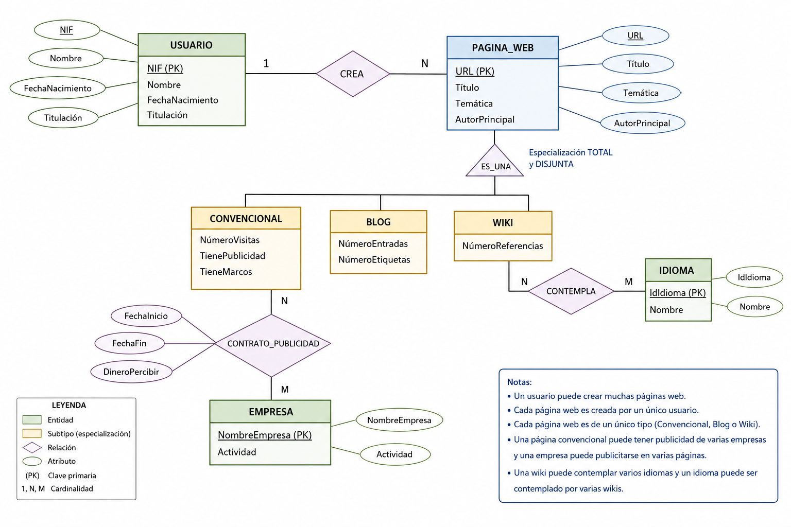

# Oposiciones SAI Andalucía 2008

Se quiere diseñar una base de datos que controle para cada usuario (NIF, nombre, fecha de nacimiento y titulación), cada una de las páginas web que ha creado. 

Sobre cada página web se desea almacenar su url, título, temática, autor principal y tipo de páginas web. A su vez, cada tipo de página web puede ser: 
- Convencional (en tal caso almacenaremos el número de visitas, si tiene publicidad y si tiene marcos). 
- Blog, en este caso se almacenará el número de entradas y el número de etiquetas. 
- Wiki, almacenando el número de referencias y los idiomas que contempla. 

Asimismo, se quiere saber el nombre de cada empresa de la que tiene publicidad, almacenando el nombre de la empresa, su actividad, la fecha de comienzo de inicio y de fin de contrato, así como el dinero a percibir por ese contrato de publicidad. 

**Se pide:** 

a) El diagrama E-R.
b) Pasarlo a tablas
c) Pasarlo a 3FN y su grafo relacional.

## Soluciones 
## Entidades y atributos

```
┌─────────────────────────────┐
│         USUARIO             │
├─────────────────────────────┤
│ NIF (Clave Primaria)        │
│ Nombre                      │
│ Fecha_Nacimiento            │
│ Titulación                  │
└─────────────────────────────┘
        │
        │ 1
        │
        │ crea
        │
        │ N
        ▼
┌──────────────────────────────────────────────────┐
│                  PÁGINA_WEB                      │
├──────────────────────────────────────────────────┤
│ URL (Clave Primaria)                             │
│ Título                                           │
│ Temática                                         │
│ Autor_Principal                                  │
└──────────────────────────────────────────────────┘
        │
        │ 1
        │
        │ es_un
        │
        │ (ISA) Total, Disjunta
        │
        ┌──────┼──────────────────┐
        │      │                  │
        ▼      ▼                  ▼
┌────────────┐ ┌────────────┐ ┌────────────┐
│CONVENCIONAL│ │    BLOG    │ │    WIKI    │
├────────────┤ ├────────────┤ ├────────────┤
│Núm_Visitas │ │Núm_Entradas│ │Núm_Refs    │
│Publicidad  │ │Núm_Etiquetas││Idiomas     │
│Marcos      │ │            │ │            │
└────────────┘ └────────────┘ └────────────┘

        ▲
        │
        │ N
        │
        │ tiene_publicidad (M:N)
        │
        │ M
        │
┌─────────────────────────────┐
│          EMPRESA            │
├─────────────────────────────┤
│ Nombre (Clave Primaria)     │
│ Actividad                   │
└─────────────────────────────┘
```

## Relación publicidad (M:N entre PÁGINA_WEB y EMPRESA)

```
PÁGINA_WEB ────N──── tiene_publicidad ────M──── EMPRESA
                         │
                         ├─ Fecha_Inicio
                         ├─ Fecha_Fin
                         └─ Dinero_Percibir
```

## Notas del modelo

- **ISA total y disjunta**: Toda página web es exactamente uno de los tres subtipos (Convencional, Blog, Wiki).
- **Herencia**: URL es clave primaria de PÁGINA_WEB y también lo es en cada subtipo (herencia de clave).
- La relación `tiene_publicidad` entre PÁGINA_WEB y EMPRESA es M:N con atributos propios (fechas del contrato y dinero), lo que podría convertirse en una entidad intermedia **CONTRATO** en el modelo lógico.


## Modelo Entidad Relación:




## Tablas

```sql
-- TABLAS DEL MODELO RELACIONAL

CREATE TABLE USUARIO (
    NIF              VARCHAR(15)    PRIMARY KEY,
    Nombre           VARCHAR(100)   NOT NULL,
    Fecha_Nacimiento DATE           NOT NULL,
    Titulacion       VARCHAR(100)
);

CREATE TABLE PAGINA_WEB (
    URL             VARCHAR(500)   PRIMARY KEY,
    Titulo          VARCHAR(200)   NOT NULL,
    Tematica        VARCHAR(100),
    Autor_Principal VARCHAR(100),
    NIF_Usuario     VARCHAR(15)    NOT NULL,
    FOREIGN KEY (NIF_Usuario) REFERENCES USUARIO(NIF)
);

CREATE TABLE CONVENCIONAL (
    URL         VARCHAR(500) PRIMARY KEY,
    Num_Visitas INTEGER      NOT NULL,
    Publicidad  BOOLEAN      NOT NULL,
    Marcos      BOOLEAN      NOT NULL,
    FOREIGN KEY (URL) REFERENCES PAGINA_WEB(URL) ON DELETE CASCADE
);

CREATE TABLE BLOG (
    URL           VARCHAR(500) PRIMARY KEY,
    Num_Entradas  INTEGER      NOT NULL,
    Num_Etiquetas INTEGER      NOT NULL,
    FOREIGN KEY (URL) REFERENCES PAGINA_WEB(URL) ON DELETE CASCADE
);

CREATE TABLE WIKI (
    URL         VARCHAR(500) PRIMARY KEY,
    Num_Refs    INTEGER      NOT NULL,
    Idiomas     VARCHAR(500) NOT NULL,
    FOREIGN KEY (URL) REFERENCES PAGINA_WEB(URL) ON DELETE CASCADE
);

CREATE TABLE EMPRESA (
    Nombre    VARCHAR(200) PRIMARY KEY,
    Actividad VARCHAR(200)
);

CREATE TABLE CONTRATO_PUBLICIDAD (
    URL          VARCHAR(500)   NOT NULL,
    Empresa      VARCHAR(200)   NOT NULL,
    Fecha_Inicio DATE           NOT NULL,
    Fecha_Fin    DATE,
    Dinero       DECIMAL(12,2)  NOT NULL,
    PRIMARY KEY (URL, Empresa),
    FOREIGN KEY (URL)     REFERENCES PAGINA_WEB(URL),
    FOREIGN KEY (Empresa) REFERENCES EMPRESA(Nombre)
);
```


# 3FN y Grafo Relacional

Cada rectángulo es una relación. La clave primaria está subrayada. Las flechas indican dependencias referenciales (FK → PK).

```
┌──────────────────────────────┐
│          USUARIO             │
├──────────────────────────────┤
│  NIF   ←──────────┐          │
│  Nombre           │          │
│  Fecha_Nacimiento │          │
│  Titulacion       │          │
└──────────────────┼───────────┘
                   │ FK
                   │
                   ▼
┌──────────────────────────────┐
│        PAGINA_WEB            │
├──────────────────────────────┤
│  URL                         │
│  Titulo                      │
│  Tematica                    │
│  Autor_Principal             │
│  NIF_Usuario ────────────────┘
└───┬───┬───┬──────────────────┘
    │   │   │
    │   │   │  FK (herencia ISA)
    │   │   │
    ▼   ▼   ▼
┌─────────┐ ┌─────────┐ ┌─────────┐
│CONVENC. │ │  BLOG   │ │  WIKI   │
├─────────┤ ├─────────┤ ├─────────┤
│  URL ───┼─┼─ URL ───┼─┼─ URL ───┤
│N_Visitas│ │N_Entrad.│ │N_Refs   │
│Publicid.│ │N_Etiquet│ └────┬────┘
│Marcos   │ │         │      │ FK
└─────────┘ └─────────┘      │
                              ▼
                    ┌──────────────────┐
                    │  IDIOMA_WIKI     │
                    ├──────────────────┤
                    │  URL ←───────────┘
                    │  Idioma          │
                    └──────────────────┘

    ┌──────────────────────────────┐
    │         EMPRESA              │
    ├──────────────────────────────┤
    │  Nombre   ←──────────┐       │
    │  Actividad           │       │
    └──────────────────────┼───────┘
                           │ FK
                           │
┌──────────────────────────┼───────┐
│    CONTRATO_PUBLICIDAD   │       │
├──────────────────────────┤       │
│  URL ────────────────────┤       │
│  Empresa ────────────────┘       │
│  Fecha_Inicio                    │
│  Fecha_Fin                       │
│  Dinero                          │
└──────────────────────────────────┘
```

## Dependencias funcionales

| Relación | Dependencias funcionales |
|---|---|
| USUARIO | NIF → Nombre, Fecha_Nacimiento, Titulacion |
| PAGINA_WEB | URL → Titulo, Tematica, Autor_Principal, NIF_Usuario |
| CONVENCIONAL | URL → Num_Visitas, Publicidad, Marcos |
| BLOG | URL → Num_Entradas, Num_Etiquetas |
| WIKI | URL → Num_Refs |
| IDIOMA_WIKI | (URL, Idioma) → (sin atributos no clave) |
| EMPRESA | Nombre → Actividad |
| CONTRATO_PUBLICIDAD | (URL, Empresa) → Fecha_Inicio, Fecha_Fin, Dinero |

## Justificación 3FN

1. **1FN**: Atributos atómicos. El único atributo multivalorado (`Idiomas`) se ha extraído a la tabla `IDIOMA_WIKI`.
2. **2FN**: No hay dependencias parciales (todas las tablas tienen clave simple o compuesta con atributos que dependen de la clave completa).
3. **3FN**: No hay dependencias transitivas (ningún atributo no clave depende de otro atributo no clave).


```sql
-- ESQUEMA EN 3FN (Forma Normal de Tercer Grado)

CREATE TABLE USUARIO (
    NIF              VARCHAR(15)    PRIMARY KEY,
    Nombre           VARCHAR(100)   NOT NULL,
    Fecha_Nacimiento DATE           NOT NULL,
    Titulacion       VARCHAR(100)
);

CREATE TABLE PAGINA_WEB (
    URL             VARCHAR(500)   PRIMARY KEY,
    Titulo          VARCHAR(200)   NOT NULL,
    Tematica        VARCHAR(100),
    Autor_Principal VARCHAR(100),
    NIF_Usuario     VARCHAR(15)    NOT NULL,
    FOREIGN KEY (NIF_Usuario) REFERENCES USUARIO(NIF)
);

CREATE TABLE CONVENCIONAL (
    URL         VARCHAR(500) PRIMARY KEY,
    Num_Visitas INTEGER      NOT NULL,
    Publicidad  BOOLEAN      NOT NULL,
    Marcos      BOOLEAN      NOT NULL,
    FOREIGN KEY (URL) REFERENCES PAGINA_WEB(URL) ON DELETE CASCADE
);

CREATE TABLE BLOG (
    URL           VARCHAR(500) PRIMARY KEY,
    Num_Entradas  INTEGER      NOT NULL,
    Num_Etiquetas INTEGER      NOT NULL,
    FOREIGN KEY (URL) REFERENCES PAGINA_WEB(URL) ON DELETE CASCADE
);

CREATE TABLE WIKI (
    URL      VARCHAR(500) PRIMARY KEY,
    Num_Refs INTEGER      NOT NULL,
    FOREIGN KEY (URL) REFERENCES PAGINA_WEB(URL) ON DELETE CASCADE
);

-- Normalización: el atributo multivalorado Idiomas pasa a tabla aparte (1FN → 3FN)
CREATE TABLE IDIOMA_WIKI (
    URL    VARCHAR(500)  NOT NULL,
    Idioma VARCHAR(100)  NOT NULL,
    PRIMARY KEY (URL, Idioma),
    FOREIGN KEY (URL) REFERENCES WIKI(URL) ON DELETE CASCADE
);

CREATE TABLE EMPRESA (
    Nombre    VARCHAR(200) PRIMARY KEY,
    Actividad VARCHAR(200)
);

CREATE TABLE CONTRATO_PUBLICIDAD (
    URL          VARCHAR(500)   NOT NULL,
    Empresa      VARCHAR(200)   NOT NULL,
    Fecha_Inicio DATE           NOT NULL,
    Fecha_Fin    DATE,
    Dinero       DECIMAL(12,2)  NOT NULL,
    PRIMARY KEY (URL, Empresa),
    FOREIGN KEY (URL)     REFERENCES PAGINA_WEB(URL),
    FOREIGN KEY (Empresa) REFERENCES EMPRESA(Nombre)
);
```