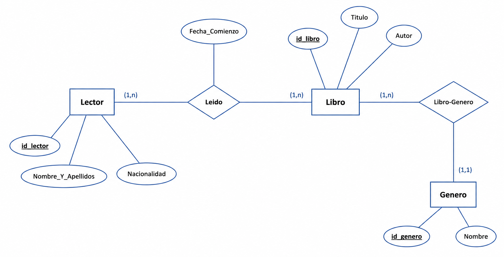
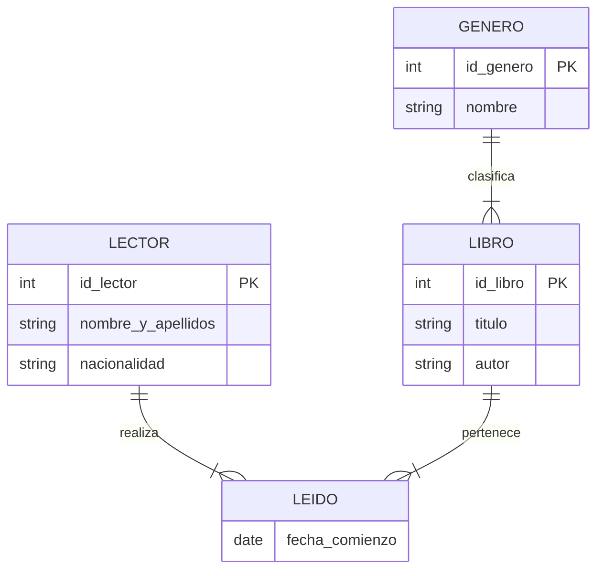

# PES INFORMÁTICA ANDALUCÍA 2025
## EJERCICIO 1: BASES DE DATOS (Total: 2.5 puntos).

Observe el siguiente diagrama entidad/relación:



### Modelo Mermaid




Tenga en cuenta las siguientes definiciones y restricciones:
- `id_Lector`: Entero.
- `Nombre_Y_Apellidos`: Cadena de 50 caracteres. No puede estar vacío.
- `Nacionalidad`: Cadena de 20 caracteres. No puede estar vacío.
- `Fecha_Comienzo`: Fecha. No puede estar vacío. Representa la fecha en que un lector comienza a leer un determinado libro.
- `id_Libro`: Entero.
- `Título`: Cadena de 40 caracteres. No puede estar vacío.
- `Autor`: Cadena de 40 caracteres. No puede estar vacío.
- `id_Genero`: Entero.
- `Nombre`: Cadena de 40 caracteres. No puede estar vacío.

## EJERCICIO 1.1. CREACIÓN DE TABLAS (1.25 puntos).

Detalle las sentencias SQL necesarias para crear las tablas de la base de datos que implemente el modelo anterior en tercera forma normal.

**Paso a tablas:**
- Lector(`id_Lector, Nombre_Y_Apellidos, Nacionalidad`)
- Leido(`id_Lector, id_Libro, Fecha_Comienzo`)
- Libro(`id_Libro, Título, Autor, id_Genero`)
- Genero(`id_Genero, Nombre`).  

### DDL

```sql
CREATE TABLE Genero (
    id_Genero INT UNSIGNED AUTO_INCREMENT PRIMARY KEY,
    Nombre VARCHAR(40) NOT NULL
);
CREATE TABLE Lector (
    id_Lector INT UNSIGNED AUTO_INCREMENT PRIMARY KEY,
    Nombre_Y_Apellidos VARCHAR(50) NOT NULL,
    Nacionalidad VARCHAR(20) NOT NULL
);
CREATE TABLE Libro (
    id_Libro INT UNSIGNED AUTO_INCREMENT PRIMARY KEY,
    Titulo VARCHAR(40) NOT NULL,
    Autor VARCHAR(40) NOT NULL,
    id_Genero INT UNSIGNED NOT NULL,
    FOREIGN KEY (id_Genero) REFERENCES Genero(id_Genero)
);
CREATE TABLE Leido (
    id_Lector INT UNSIGNED NOT NULL,
    id_Libro INT UNSIGNED NOT NULL,
    Fecha_Comienzo DATE NOT NULL,
    PRIMARY KEY (id_Lector, id_Libro),
    FOREIGN KEY (id_Lector) REFERENCES Lector(id_Lector)
        ON DELETE CASCADE,
    FOREIGN KEY (id_Libro) REFERENCES Libro(id_Libro)
        ON DELETE CASCADE
);
```


## EJERCICIO 1.2. CONSULTA (1.25 puntos).
Dadas las tablas que ha realizado en el apartado anterior, detalle las sentencias SQL necesarias para realizar la siguiente consulta:

Todos los libros de género ‘Terror’ que se leyeron en 2024 por lectores italianos (Nacionalidad = ‘Italia’) con las cantidades de lecturas acumuladas en dicho período. Se considerarán leídos en 2024 todos los libros que se comenzaron a leer entre el 1 de enero y el 31 de diciembre de 2024.

Debe aparecer una línea por cada libro que cumpla dicho requisito, sin repeticiones. Cada línea contendrá los siguientes campos: Título, Autor y Total_Lecturas

### DML

```sql
SELECT l.Titulo, l.Autor, COUNT(*) AS Total_Lecturas
FROM Leido ld
INNER JOIN Libro l ON ld.id_Libro = l.id_Libro
INNER JOIN Genero g ON l.id_Genero = g.id_Genero
INNER JOIN Lector le ON ld.id_Lector = le.id_Lector
WHERE g.Nombre = 'Terror'
  AND ld.Fecha_Comienzo BETWEEN '2024-01-01' AND '2024-12-31'
  AND le.Nacionalidad = 'Italia'
GROUP BY l.id_Libro;
```


### Inserts para pruebas

```sql
-- GÉNERO (20)
INSERT INTO Genero (id_Genero, Nombre) VALUES
(1, 'Terror'),
(2, 'Ciencia Ficción'),
(3, 'Fantasía'),
(4, 'Novela'),
(5, 'Policiaca'),
(6, 'Romántica'),
(7, 'Histórica'),
(8, 'Aventuras'),
(9, 'Drama'),
(10, 'Comedia'),
(11, 'Thriller'),
(12, 'Poesía'),
(13, 'Ensayo'),
(14, 'Biografía'),
(15, 'Infantil'),
(16, 'Juvenil'),
(17, 'Misterio'),
(18, 'Western'),
(19, 'Realismo Mágico'),
(20, 'Distopía');
-- LECTOR (20)
INSERT INTO Lector (id_Lector, Nombre_Y_Apellidos, Nacionalidad) VALUES
(1, 'Mario Rossi', 'Italia'),
(2, 'Luca Bianchi', 'Italia'),
(3, 'Giovanni Verdi', 'Italia'),
(4, 'Sofia Romano', 'Italia'),
(5, 'Francesco Marino', 'Italia'),
(6, 'Carlos García', 'España'),
(7, 'Marie Dupont', 'Francia'),
(8, 'John Smith', 'Estados Unidos'),
(9, 'Hans Müller', 'Alemania'),
(10, 'Ana Silva', 'Portugal'),
(11, 'Giuseppe Ferrara', 'Italia'),
(12, 'Elena Conti', 'Italia'),
(13, 'Pedro López', 'México'),
(14, 'Yuki Tanaka', 'Japón'),
(15, 'Olga Petrova', 'Rusia'),
(16, 'Liam O''Brien', 'Irlanda'),
(17, 'Ingrid Svensson', 'Suecia'),
(18, 'Pierre Dubois', 'Francia'),
(19, 'Antonio Ricci', 'Italia'),
(20, 'Maria Moretti', 'Italia');
-- LIBRO (20)
INSERT INTO Libro (id_Libro, Titulo, Autor, id_Genero) VALUES
(1,  'It',                        'Stephen King',        1),
(2,  'El Resplandor',             'Stephen King',        1),
(3,  'Drácula',                   'Bram Stoker',         1),
(4,  'Frankenstein',              'Mary Shelley',        1),
(5,  'El Exorcista',              'William Peter Blatty',1),
(6,  'La Casa Infernal',          'Richard Matheson',    1),
(7,  'Dune',                      'Frank Herbert',       2),
(8,  'Fundación',                 'Isaac Asimov',        2),
(9,  'El Señor de los Anillos',   'J.R.R. Tolkien',      3),
(10, 'Harry Potter y la Piedra Filosofal', 'J.K. Rowling',3),
(11, 'Cien Años de Soledad',      'Gabriel García Márquez', 19),
(12, 'Don Quijote',               'Miguel de Cervantes', 4),
(13, 'El Nombre de la Rosa',      'Umberto Eco',         7),
(14, 'Los Hombres que No Amaban a las Mujeres', 'Stieg Larsson', 11),
(15, 'El Código Da Vinci',        'Dan Brown',           11),
(16, 'La Sombra del Viento',      'Carlos Ruiz Zafón',   4),
(17, '1984',                      'George Orwell',       20),
(18, 'El Cuento de la Criada',    'Margaret Atwood',     20),
(19, 'La Ladrona de Libros',      'Markus Zusak',        4),
(20, 'Crimen y Castigo',          'Fiódor Dostoyevski',   9);
-- LEIDO (20)
INSERT INTO Leido (id_Lector, id_Libro, Fecha_Comienzo) VALUES
-- Italianos leyendo Terror en 2024 -> aparecen en el resultado
(1,  1,  '2024-03-15'),
(2,  3,  '2024-06-20'),
(2,  2,  '2024-08-10'),
(3,  5,  '2024-02-28'),
(4,  6,  '2024-11-05'),
(5,  1,  '2024-07-14'),
(11, 4,  '2024-09-01'),
(19, 2,  '2024-10-30'),
(20, 3,  '2024-04-18'),
-- No italianos leyendo Terror en 2024 -> NO aparecen
(6,  1,  '2024-05-10'),
(8,  5,  '2024-03-22'),
-- Italianos leyendo NO Terror en 2024 -> NO aparecen
(12, 14, '2024-04-25'),
(4,  13, '2024-05-30'),
-- Italianos leyendo Terror fuera de 2024 -> NO aparecen
(1,  2,  '2023-11-20'),
-- Relleno (varios)
(7,  7,  '2024-01-15'),
(9,  9,  '2024-12-01'),
(10, 17, '2024-02-14'),
(14, 18, '2024-07-07'),
(13, 12, '2024-10-01'),
(17, 11, '2024-08-12');
```