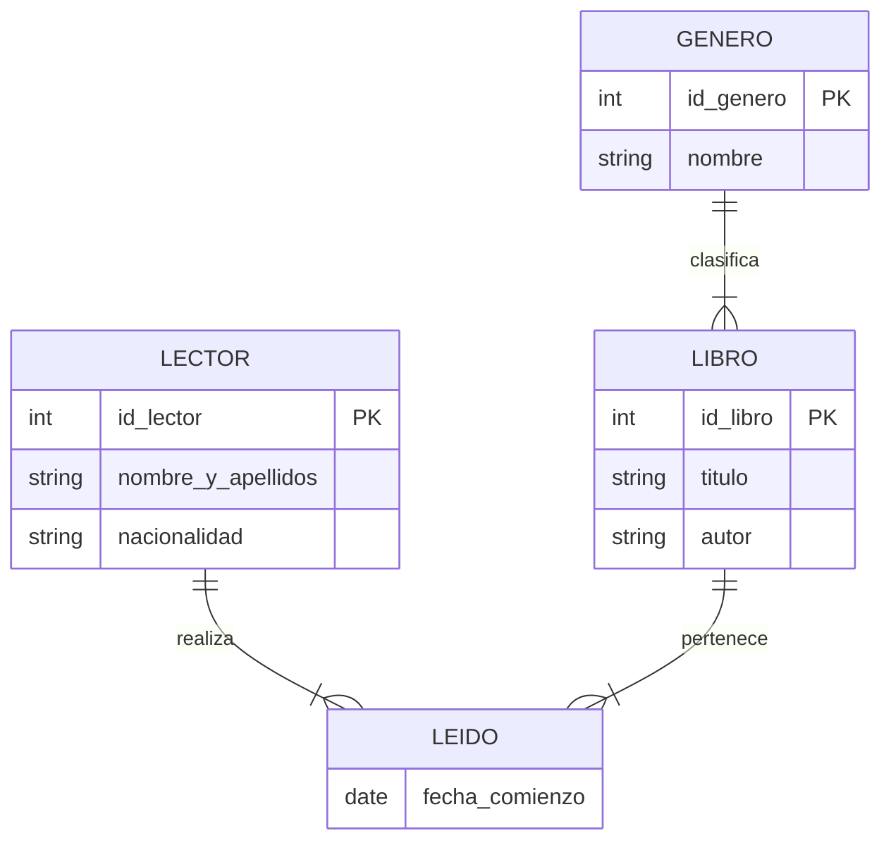

# PES INFORMÁTICA ANDALUCÍA 2025
## EJERCICIO 1: BASES DE DATOS (Total: 2.5 puntos).

Observe el siguiente diagrama entidad/relación:




Tenga en cuenta las siguientes definiciones y restricciones:
- id_Lector: Entero.
- Nombre_Y_Apellidos: Cadena de 50 caracteres. No puede estar vacío.
- Nacionalidad: Cadena de 20 caracteres. No puede estar vacío.
- Fecha_Comienzo: Fecha. No puede estar vacío. Representa la fecha en que un lector comienza a leer un determinado libro.
- id_Libro: Entero.
- Título: Cadena de 40 caracteres. No puede estar vacío.
- Autor: Cadena de 40 caracteres. No puede estar vacío.
- id_Genero: Entero.
- Nombre: Cadena de 40 caracteres. No puede estar vacío.


```sql
CREATE TABLE Genero (
    id_Genero INT UNSIGNED AUTO_INCREMENT PRIMARY KEY,
    Nombre VARCHAR(40) NOT NULL
);
CREATE TABLE Lector (
    id_Lector INT UNSIGNED AUTO_INCREMENT PRIMARY KEY,
    Nombre_Y_Apellidos VARCHAR(50) NOT NULL,
    Nacionalidad VARCHAR(20) NOT NULL
);
CREATE TABLE Libro (
    id_Libro INT UNSIGNED AUTO_INCREMENT PRIMARY KEY,
    Título VARCHAR(40) NOT NULL,
    Autor VARCHAR(40) NOT NULL,
    id_Genero INT UNSIGNED NOT NULL,
    FOREIGN KEY (id_Genero) REFERENCES Genero(id_Genero)
);
CREATE TABLE Leido (
    id_Lector INT UNSIGNED NOT NULL,
    id_Libro INT UNSIGNED NOT NULL,
    Fecha_Comienzo DATE NOT NULL,
    PRIMARY KEY (id_Lector, id_Libro),
    FOREIGN KEY (id_Lector) REFERENCES Lector(id_Lector)
        ON DELETE CASCADE,
    FOREIGN KEY (id_Libro) REFERENCES Libro(id_Libro)
        ON DELETE CASCADE
);
```


## EJERCICIO 1.2. CONSULTA (1.25 puntos).
Dadas las tablas que ha realizado en el apartado anterior, detalle las sentencias
SQL necesarias para realizar la siguiente consulta:

Todos los libros de género ‘Terror’ que se leyeron en 2024 por lectores italianos
(Nacionalidad = ‘Italia’) con las cantidades de lecturas acumuladas en dicho
período. Se considerarán leídos en 2024 todos los libros que se comenzaron a leer
entre el 1 de enero y el 31 de diciembre de 2024.

Debe aparecer una línea por cada libro que cumpla dicho requisito, sin
repeticiones. Cada línea contendrá los siguientes campos: Título, Autor y
Total_Lecturas


```sql
SELECT l.Titulo, l.Autor, COUNT(*) AS Total_Lecturas
FROM LEIDO ld
JOIN LIBRO l ON ld.id_Libro = l.id_Libro
JOIN GENERO g ON l.id_Genero = g.id_Genero
JOIN LECTOR le ON ld.id_Lector = le.id_Lector
WHERE g.Nombre = 'Terror'
  AND ld.Fecha_Comienzo BETWEEN '2024-01-01' AND '2024-12-31'
  AND le.Nacionalidad = 'Italia'
GROUP BY l.id_Libro;
```
