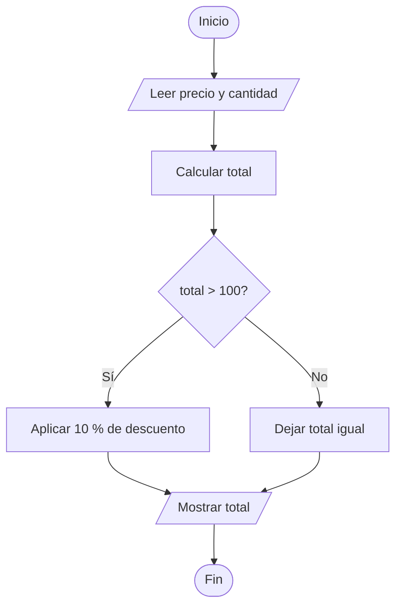

# TEMA 1: Fundamentos de programación

### Bloque B. Creación digital y pensamiento computacional | CDPC.1.A.1 y CDPC.1.A.2

> **Currículo LOMLOE - Andalucía** | Criterios: CDPC.1.A.1, CDPC.1.A.2

---

## 1. ¿Qué es programar?

**Programar** es escribir una secuencia de instrucciones que una máquina puede ejecutar para resolver un problema o producir un resultado. El programa es, por tanto, un **conjunto ordenado de instrucciones** que le indica al ordenador *qué* debe hacer paso a paso.

Programar no consiste en "hablar con el ordenador", sino en **descomponer un problema** en partes tan pequeñas que cada una sea evidente. A esa idea de partir el problema en subproblemas se le llama **descomposición** y es la primera de las mentes computacionales que trabajaremos en esta asignatura.

### 1.1. Conceptos básicos

- **Algoritmo**: descripción finita y no ambigua de una secuencia de pasos que resuelve un problema. Existe independientemente de quién lo ejecute: se puede escribir en papel, en una pizarra o en Python.
- **Código**: la materialización de ese algoritmo en un **lenguaje de programación** concreto. El código es lo que escribe la persona programadora; el algoritmo es la idea detrás.
- **Instrucción**: la unidad mínima de trabajo. Es una orden concreta que el ordenador entiende y ejecuta de una sola vez (por ejemplo: "asigna el valor 5 a la variable `edad`").
- **Secuenciación**: orden en que se ejecutan las instrucciones. En un programa secuencial las instrucciones se ejecutan **una detrás de otra, en el orden en que se escriben**. Más adelante veremos que ese orden se puede alterar con estructuras de control.
- **Intérprete**: programa que traduce y ejecuta el código línea a línea.
- **Compilador**: programa que traduce el código completo a un archivo ejecutable antes de ejecutarlo.

La relación entre ambos conceptos clave del criterio CDPC.1.A.2 es la siguiente:

| Algoritmo | Código |
|---|---|
| Es la **idea** o el plan | Es la **traducción** a un lenguaje |
| Independiente del lenguaje | Depende de un lenguaje concreto |
| Se escribe en lenguaje natural estructurado o pseudocódigo | Se escribe en Python, Java, C... |
| Sirve para comunicar la solución | Sirve para que la máquina la ejecute |

---

## 2. Lenguajes de programación

Un **lenguaje de programación** es un conjunto de reglas (sintaxis) y de palabras (semántica) que permiten escribir programas. Existen miles de lenguajes y se agrupan habitualmente por generaciones:

Se distinguen generaciones: **1GL** (lenguaje máquina), **2GL** (ensamblador: `MOV`, `ADD`), **3GL** (alto nivel: **Python**, Java, C) y **4GL/5GL** (cercanos al problema: SQL, Scratch).

Por su **paradigma**: **imperativo/estructurado** (C, Pascal, **Python**), **orientado a objetos** (Java, C#, Python), **funcional** (Haskell) y **declarativo** (SQL, Prolog), que describe *qué* se quiere sin indicar *cómo* obtenerlo.

### 2.1. Intérprete frente a compilador

| Aspecto | Compilador | Intérprete |
|---|---|---|
| Traducción | Todo el programa **de una vez**, genera un ejecutable | **Línea a línea**, en tiempo de ejecución |
| Velocidad del resultado | Muy rápida al ejecutar | Más lenta |
| Errores | Se detectan al compilar, antes de ejecutar | Se detectan **durante** la ejecución |
| Portabilidad | Hay que recompilar para cada sistema operativo | El mismo código funciona donde haya intérprete |
| Ejemplos | C, C++, Go | **Python**, JavaScript, Ruby |

Python es un lenguaje **interpretado**: el código fuente se traduce a un formato intermedio llamado *bytecode*, que a su vez ejecuta la **máquina virtual de Python (CPython)**. En la práctica, esto significa que no necesitamos compilar: escribimos, ejecutamos y vemos el resultado al instante, algo ideal para aprender.

---

## 3. Del problema al código: pseudocódigo y diagramas de flujo

Antes de escribir código conviene diseñar el algoritmo. Hay dos herramientas habituales.

### 3.1. Pseudocódigo

El **pseudocódigo** describe el algoritmo con un lenguaje natural (en nuestro caso, español) usando una estructura controlada: secuencia, alternancia e iteración. No tiene una sintaxis oficial única, pero sí convenciones muy extendidas.

```
INICIO
    LEER precio
    LEER cantidad
    total <- precio * cantidad
    SI total > 100 ENTONCES
        total <- total * 0.9   // descuento del 10 %
    FIN SI
    ESCRIBIR total
FIN
```

Las convenciones son `LEER`/`ESCRIBIR` para entrada y salida, `<-` para asignación, `SI ... ENTONCES ... FIN SI` para alternancia e iteraciones como `MIENTRAS ... HAGA`.

### 3.2. Diagramas de flujo

El **diagrama de flujo** (o grafo de flujo) representa el algoritmo con símbolos normalizados conectados por flechas:

- **Óvalo**: inicio y fin del algoritmo.
- **Rectángulo**: proceso o instrucción (cálculo, asignación).
- **Paralelogramo**: entrada/salida de datos.
- **Rombo**: decisión (condición que bifurca el flujo).
- **Flechas**: dirección del flujo de control.



---

## 4. Introducción a Python

### 4.1. ¿Por qué Python en esta asignatura?

**Python** (creado por Guido van Rossum en 1991) es el lenguaje que utilizaremos en la parte de programación de CDPC por varias razones:

- **Sintaxis limpia y cercana al inglés**: el código se lee casi como pseudocódigo.
- **Indentación obligatoria**: el bloque se define con espacios, lo que obliga a escribir código ordenado.
- **Lenguaje interpretado**: feedback inmediato al ejecutar.
- **Multiparadigma**: permite procedural, orientado a objetos y funcional.
- **Comunidad enorme** y librerías para todo: ciencia de datos, inteligencia artificial, automatización, gráficos.
- **Es el lenguaje que usará en 2º de Bachillerato** en la materia de Programación, así que la base es directamente reutilizable.

Un mismo programa ocupa en Python muy pocas líneas: `a = 3`, `b = 4` y `print("La suma es", a + b)` ya es un programa completo.

### 4.2. Entorno de trabajo

Para escribir y ejecutar Python necesitamos un **intérprete** y un editor. Las opciones que usaremos en el aula son:

| Entorno | Tipo | Ideal para |
|---|---|---|
| **IDLE** | Viene incluido con la instalación de Python | Primeros pasos, consola interactiva |
| **Thonny** | Editor ligero con depurador visual | Inicio en 1º, errores explicados paso a paso |
| **VS Code** | Editor profesional con extensión de Python | Trabajo cómodo, proyectos grandes, terminal integrada |
| **Google Colab / Jupyter** | Cuaderno en la nube | Trabajo colaborativo y análisis de datos |

Tres conceptos que conviene distinguir desde el principio:

- **Consola interactiva (REPL)**: escribimos una instrucción y Python la ejecuta al instante. Perfecta para probar.
- **Script**: archivo `.py` con varias instrucciones guardadas que se ejecutan de principio a fin.
- **Intérprete**: el programa (`python`, `python3`) que traduce y ejecuta nuestro código. Un script se lanza desde la terminal con `python3 mi_primer_programa.py`.

### 4.3. Primer programa: "Hola, mundo"

```python
# mi_primer_programa.py
# Saludo básico: introducción a la función print()
print("Hola, mundo")
print("Bienvenidos a Creación Digital y Pensamiento Computacional")
print(2 + 2)
```

Salida:

```
Hola, mundo
Bienvenidos a Creación Digital y Pensamiento Computacional
4
```

Cosas que ya hemos aprendido:

- Las líneas que empiezan por `#` son **comentarios**: el intérprete los ignora. Sirven para documentar.
- `print(...)` es una **función** integrada que muestra texto o valores por pantalla.
- Entre comillas simples o dobles se escribe un **texto literal** (*string*).

---

## 5. Variables y tipos de datos

Una **variable** es un nombre que hace referencia a un espacio de memoria donde guardamos un valor. En Python **no se declara el tipo**: el tipo se deduce del valor asignado.

```python
# Asignación de variables
nombre = "Lucía"        # str: cadena de texto
edad = 16               # int: entero
altura = 1.68           # float: decimal
es_alumno = True        # bool: booleano

print(nombre, edad, altura, es_alumno)
```

### 5.1. Tipos de datos básicos

| Tipo | Nombre | Ejemplo | Descripción |
|---|---|---|---|
| `int` | Entero | `-3`, `0`, `178` | Sin parte decimal |
| `float` | Decimal | `3.14`, `-0.5`, `2.0` | Con coma decimal |
| `str` | Cadena | `"Hola"`, `'2026'` | Texto entre comillas |
| `bool` | Booleano | `True`, `False` | Valor lógico: cierto o falso |

### 5.2. Funciones de conversión

```python
# Conversión entre tipos
edad_texto = "16"           # str
edad = int(edad_texto)      # str -> int
nota = float("7.5")         # str -> float
texto = str(2026)           # int -> str
flag = bool(0)              # int -> bool (0 es False)

print(type(edad))           # <class 'int'>
print(type(nota))           # <class 'float'>
```

::: warning Cuidado con las conversiones
`int("hola")` lanza un error de tipo. Solo se pueden convertir a número cadenas que **representen** un número.
:::

### 5.3. Reglas de nombres de variables

- Deben empezar por **letra** o guion bajo (`_`), nunca por número.
- Solo pueden contener letras, números y guion bajo.
- Son **sensibles a mayúsculas**: `Edad` y `edad` son dos variables distintas.
- No conviene usar nombres de funciones o palabras reservadas (`print`, `if`, `for`).

Convención recomendada en este curso: **snake_case** (`nombre_alumno`, `precio_final`).

---

## 6. Entrada y salida de datos

### 6.1. Salida: `print()`

```python
nombre, curso = "Diego", 1
print("Alumno:", nombre, "| Curso:", curso)
print("lunes", "martes", "miércoles", sep=" / ")   # sep cambia el separador
print("Contando:", end=" ")                        # end evita el salto de línea
print(1, 2, 3)
```

### 6.2. Entrada: `input()`

`input()` **siempre devuelve una cadena de texto**. Si necesitamos un número, hay que convertirlo explícitamente.

```python
# Programa: datos personales
nombre = input("¿Cómo te llamas? ")
edad = int(input("¿Qué edad tienes? "))
estatura = float(input("¿Cuánto mides en metros? "))

print("Hola,", nombre)
print("El año que viene tendrás", edad + 1, "años")
print("Tu estatura en centímetros es", estatura * 100)
```

---

## 7. Operadores

### 7.1. Operadores aritméticos

```python
a = 17
b = 5

print(a + b)    # 22  suma
print(a - b)    # 12  resta
print(a * b)    # 85  producto
print(a / b)    # 3.4 división real (siempre devuelve float)
print(a // b)   # 3   división entera (descarta el decimal)
print(a % b)    # 2   resto de la división
print(a ** 2)   # 289 potencia
```

> **Truco**: `a % b == 0` significa que `a` es múltiplo de `b`. Nos servirá para comprobar si un número es par (`n % 2 == 0`).

### 7.2. Operadores relacionales (comparación)

Devuelven siempre un valor booleano.

```python
x = 10
y = 20

print(x == y)   # False  igual que
print(x != y)   # True   distinto de
print(x > y)    # False  mayor que
print(x < y)    # True   menor que
print(x >= 10)  # True   mayor o igual que
print(x <= 9)   # False  menor o igual que
```

::: danger Error clásico
Usar `=` (asignación) donde se espera `==` (comparación). Recuerda: `=` guarda, `==` compara.
:::

### 7.3. Operadores lógicos

Combinan varias condiciones. Operan sobre valores booleanos con la **tabla de verdad** de la lógica booleana.

| `and` | `or` | `not` |
|---|---|---|
| `True and True` → `True` | `False or True` → `True` | `not True` → `False` |
| `True and False` → `False` | `False or False` → `False` | `not False` → `True` |

```python
edad = 17
dni_valido = True

puede_saltar = edad >= 16 and dni_valido   # and: ambas deben cumplirse
cerrado = False or False                   # or: basta con una
print(puede_saltar, cerrado, not cerrado)  # True False True

nota = 7.5
print(nota >= 5 and nota <= 10)            # True: combina operadores
```

### 7.4. Prioridad de operadores

De mayor a menor: paréntesis `( )`, potencia `**`, multiplicación y división `* / // %`, suma y resta `+ -`, relacionales `== != < > <= >=`, `not`, `and` y por último `or`.

Cuando haya duda, **usa paréntesis**: el código queda más legible y evita errores.

### 7.5. Operadores de asignación compuestos

```python
contador = 10
contador += 5    # contador = contador + 5  -> 15
contador -= 3    # 12
contador *= 2    # 24
contador //= 5   # 4
contador %= 3    # 1
```

---

## 8. Ejemplo práctico comentado: calculadora de notas

Un programa que integra los contenidos de este tema: entrada, variables, tipos, operadores y salida formateada.

```python
# calculadora_notas.py: integra entrada, variables, operadores y salida

# --- Entrada de datos ---
nombre = input("Nombre del alumno: ")
nota1 = float(input("Nota del primer trimestre: "))
nota2 = float(input("Nota del segundo trimestre: "))
nota3 = float(input("Nota del tercer trimestre: "))

# --- Proceso: media ponderada (30 %, 30 %, 40 %) ---
media = nota1 * 0.3 + nota2 * 0.3 + nota3 * 0.4
media = round(media, 2)

# --- Operadores relacionales y lógicos ---
suspenso = media < 5
matricula = media >= 9 and nota1 >= 9 and nota2 >= 9 and nota3 >= 9

# --- Salida de resultados ---
print("------------------------------")
print("Alumno:", nombre, "| Media:", media)

if suspenso:
    print("Resultado: SUSPENSO")
else:
    print("Resultado: APROBADO")

if matricula:
    print("¡Enhorabuena! Matrícula de honor")

# Múltiplos con el operador resto: bisiesto
anio = int(input("Introduce un año: "))
if anio % 4 == 0 and anio % 100 != 0 or anio % 400 == 0:
    print(anio, "es bisiesto")
```

::: info Sobre la indentación
Python define los bloques con la **indentación** (4 espacios por convención). Tras los dos puntos `:` de `if` y `else`, todo lo que esté indentado forma parte de ese bloque. Si la indentación es incorrecta, el intérprete lanza `IndentationError`.
:::

---

## Ejercicios

1. **Algoritmo en papel.** Describe en pseudocódigo el algoritmo para calcular el área de un triángulo (base × altura / 2) y dibuja su diagrama de flujo. Identifica claramente las fases de entrada, proceso y salida.

2. **Algoritmo frente a código.** Explica con tus propias palabras la diferencia entre *algoritmo* y *código*. Ilustra la respuesta escribiendo primero la descripción en pseudocódigo de un programa que pida dos números y muestre su cociente y su resto, y traduciéndola después a Python.

3. **Tipos y conversión.** Indica el tipo de dato que resulta de cada expresión y, si procede, su valor. Comprueba todas las respuestas ejecutándolas en la consola interactiva:

   ```python
   type(7)
   type("7")
   int("3.5")
   float("12")
   str(45) + " años"
   7 / 2
   7 // 2
   7 % 2
   ```

4. **Entrada de datos.** Escribe un programa que pida al usuario su nombre, su estatura en metros y su edad, y muestre un mensaje con la estatura convertida a centímetros, la edad doblada y el número de caracteres del nombre.

5. **Operadores relacionales y lógicos.** Sin ejecutar el código, anota el valor de `resultado` tras cada instrucción; después verifícalo:

   ```python
   a = 8
   b = 3
   resultado = a > b and b > 0
   resultado = a % 2 == 0 or b % 2 == 0
   resultado = not (a == b)
   resultado = a + b > 10 and a - b < 5
   ```

6. **Diseño de la calculadora.** Amplía el ejemplo de la calculadora de notas para que además muestre la diferencia entre la nota más alta y la más baja de las tres introduce, y compruebe si alguna nota queda fuera del rango 0–10 mostrando en tal caso un mensaje de aviso.
