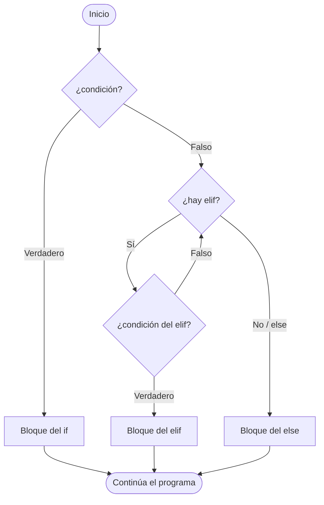

# TEMA 2: Estructuras de control

### Bloque B. Creación digital y pensamiento computacional | CDPC.1.A.3

> **Currículo LOMLOE - Andalucía** | Criterios: CDPC.1.A.3

---

## 1. ¿Qué son las estructuras de control?

Hasta ahora hemos escrito programas **secuenciales**: las instrucciones se ejecutan en el orden en que se escriben. Las **estructuras de control** permiten alterar ese orden, decidiendo qué instrucciones se ejecutan y cuántas veces.

Cualquier algoritmo se construye con solo tres estructuras básicas (teorema de Böhm-Jacopini):

1. **Secuencia**: una instrucción tras otra.
2. **Selección (alternancia)**: elegir entre caminos según una condición.
3. **Iteración (repetición)**: repetir un bloque mientras se cumpla una condición.

En el criterio **CDPC.1.A.3** trabajaremos las **selectivas** y las **iterativas**, y las clasificaremos como **finitas** (sabemos de antemano o por condición que terminan) o **infinitas** (que solo se detienen por una orden explícita o por un error).

---

## 2. Estructuras selectivas o condicionales

### 2.1. Sentencia `if` simple

La forma más básica: si la condición es cierta, se ejecuta el bloque.

```python
# if simple
edad = int(input("Introduce tu edad: "))

if edad >= 18:
    print("Eres mayor de edad")
    print("Ya puedes votar")
```

- La condición va entre paréntesis en el lenguaje natural; en Python se escribe directamente tras `if`.
- **Termina siempre en dos puntos** `:`.
- El bloque se indenta **4 espacios** respecto al `if`.

### 2.2. `if` / `else`

Cuando queremos cubrir los dos casos posibles.

```python
nota = float(input("Introduce la nota: "))

if nota >= 5:
    print("Aprobado")
else:
    print("Suspenso")
```

### 2.3. `if` / `elif` / `else`

Permite encadenar varias condiciones. Python evalúa las condiciones **de arriba abajo** y ejecuta **solo la primera que sea cierta**; si ninguna lo es, ejecuta el `else` (que es opcional).

```python
nota = float(input("Introduce la nota: "))

if nota < 0 or nota > 10:
    print("Error: la nota debe estar entre 0 y 10")
elif nota < 5:
    print("Suspenso")
elif nota < 7:
    print("Aprobado")
elif nota < 9:
    print("Notable")
else:
    print("Sobresaliente")
```

::: warning Orden importante
Si colocas `elif nota < 9` antes de `elif nota < 7`, una nota de 6,5 clasificaría como "Notable". El **orden de las condiciones cambia el resultado**: siempre de más restrictivo a más general.
:::

### 2.4. Diagrama de una sentencia `if`



### 2.5. Anidamiento de selectivas

Un `if` puede estar dentro de otro, lo que permite modelar decisiones que dependen de decisiones previas.

```python
edad = int(input("Edad: "))
tiene_licencia = input("¿Tiene tarjeta de transporte? (s/n): ") == "s"

if edad >= 18:
    if tiene_licencia:
        print("Puede conducir")
    else:
        print("Necesita sacarse el carnet")
else:
    print("Todavía no puede conducir")
```

### 2.6. Expresión condicional (ternario de Python)

Para decisiones breves en una sola línea: `estado = "mayor" if edad >= 18 else "menor"`.

---

## 3. Estructuras iterativas o bucles

Los **bucles** repiten un bloque de instrucciones. Python ofrece dos tipos: `while` y `for`.

### 3.1. Bucle `while`

Repite **mientras** una condición sea cierta. Es la estructura natural cuando **no sabemos cuántas repeticiones** faltan.

```python
# Cuenta regresiva
numero = 5
while numero > 0:
    print(numero)
    numero -= 1
print("¡Despegue!")
```

La salida muestra `5, 4, 3, 2, 1, ¡Despegue!`. Elementos imprescindibles de un `while`:

1. **Inicialización** de la variable control (`numero = 5`).
2. **Condición** de continuación (`numero > 0`).
3. **Actualización** dentro del bucle (`numero -= 1`). Si falta, el bucle **nunca termina**.

```python
# BUCLE INFINITO: falta la actualización de la variable
numero = 5
while numero > 0:
    print(numero)
    # numero -= 1   <- sin esta línea, se imprime 5 para siempre
```

### 3.2. Bucle `for` y `range()`

El `for` recorre una **secuencia** de valores. Es la estructura natural cuando **sí sabemos** cuántas repeticiones hay.

```python
# Recorrer una lista de nombres
nombres = ["Ana", "Luis", "Marta"]
for nombre in nombres:
    print("Hola,", nombre)

# Recorrer un rango de números con range()
for i in range(5):
    print(i)          # 0, 1, 2, 3, 4
```

La función `range()` admite hasta tres argumentos:

| Llamada | Valores generados | Nº de vueltas |
|---|---|---|
| `range(5)` | 0, 1, 2, 3, 4 | 5 |
| `range(2, 6)` | 2, 3, 4, 5 | 4 |
| `range(0, 10, 2)` | 0, 2, 4, 6, 8 | 5 |
| `range(1, 6)` | 1, 2, 3, 4, 5 | 5 |

> **Recordatorio**: `range(inicio, fin, paso)` incluye `inicio` pero **no** `fin`. El paso puede ser negativo para contar hacia atrás (`range(5, 0, -1)` → 5, 4, 3, 2, 1).

### 3.3. `while` frente a `for`

| Aspecto | `while` | `for` |
|---|---|---|
| Se usa cuando... | No se conoce el número de repeticiones | Se conoce el recorrido |
| Condición | Se evalúa en cada vuelta | Implícita en la secuencia |
| Riesgo | Bucle infinito si se olvida actualizar | Recorrido vacío si `range()` no genera valores |
| Ejemplo | Menú, adivinanza, validación | Tablas, contadores, recorrido de listas |

---

## 4. Estructuras finitas e infinitas

Una estructura iterativa es **finita** si está garantizado que terminará en un número finito de pasos, e **infinita** si puede quedarse ejecutándose indefinidamente.

### 4.1. ¿Cuándo es finito un bucle?

- Un `for` sobre una secuencia finita **siempre es finito**.
- Un `while` es finito **solo si su condición acaba siendo falsa**. Para ello:
  - La variable control debe **actualizarse** dentro del bucle.
  - La actualización debe **acercarse** a la condición de salida (si cuenta hacia arriba, el límite debe subir; si cuenta hacia abajo, el límite debe bajar).

```python
# FINITO: el contador avanza hacia la condición de salida
contador = 0
while contador < 10:
    contador += 1
print("Terminado")   # se alcanza tras 10 vueltas

# INFINTO: contador no se actualiza
contador = 0
while contador < 10:
    print(contador)   # contador siempre vale 0 -> bucle infinito
```

### 4.2. Rompiendo la repetición: `break` y `continue`

Dos sentencias que controlan el flujo **dentro** de un bucle:

- **`break`**: abandona el bucle **inmediatamente**.
- **`continue`**: salta a la siguiente vuelta, omitiendo lo que queda del bloque.

```python
# break: salir al encontrar un valor
for n in range(1, 100):
    if n % 7 == 0:
        print("Primo múltiplo de 7 encontrado:", n)
        break      # no seguimos buscando

# continue: omitir ciertos valores
for n in range(1, 11):
    if n % 2 == 0:
        continue   # salta al siguiente número
    print("Impar:", n)
```

::: tip `while True` y `break`
El patrón `while True:` crea a propósito un bucle infinito que **solo se detiene con `break`**. Muy usado en menús y juegos:

```python
while True:
    password = input("Introduce la contraseña: ")
    if password == "python":
        print("Acceso concedido")
        break
    print("Contraseña incorrecta, inténtalo de nuevo")
```
:::

### 4.3. Ejemplo: validar datos de entrada

La combinación `while` + `break` (o un `while` con condición directa) es la forma estándar de **validar** lo que introduce el usuario.

```python
# validacion.py: pide un número entre 0 y 100
numero = -1   # valor inicial que garantiza entrar en el bucle

while numero < 0 or numero > 100:
    numero = int(input("Introduce un número entre 0 y 100: "))
    if numero < 0 or numero > 100:
        print("Valor fuera de rango, repite.")

print("Número válido:", numero)
```

---

## 5. Bucles anidados y control de flujo

### 5.1. Bucles anidados

Un bucle dentro de otro. El bucle **interno completa todas sus vueltas** en cada vuelta del bucle **externo**. Si el externo hace `n` vueltas y el interno `m`, el total de iteraciones es `n × m`.

```python
# Tabla de multiplicar del 1 al 5
for i in range(1, 6):          # externo: 5 vueltas
    for j in range(1, 11):     # interno: 10 vueltas
        print(f"{i} x {j} = {i * j}")
    print("-" * 20)            # separador tras cada tabla
```

### 5.2. Ejemplo clásico: tablas de multiplicar

```python
# tablas.py
numero = int(input("¿Tabla de qué número quieres ver? "))

for i in range(1, 11):
    resultado = numero * i
    print(f"{numero} x {i:>2} = {resultado:>3}")
```

Para `numero = 7` la salida es ``7 x  1 =   7``, ``7 x  2 =  14``, ... hasta ``7 x 10 =  70``.

### 5.3. Ejemplo clásico: sumatoria

```python
# sumatoria.py: suma de los N primeros números
n = int(input("¿Hasta qué número sumamos? "))
suma = 0

for i in range(1, n + 1):
    suma += i      # suma = suma + i

print("La suma de 1 a", n, "es", suma)
```

Si `n = 100`, el resultado es `5050`. Fíjate en los tres elementos de todo bucle: la **inicialización** (`suma = 0` antes del bucle), el **recorrido** (`range(1, n + 1)`) y la **acumulación** (`suma += i`).

### 5.4. Ejemplo completo: juego de adivinanza

Integra `while`, `for`, condicionales, `break` y acumuladores.

```python
# adivinanza.py
# El programa elige un número y el usuario dispone de 6 intentos
import random

numero_secreto = random.randint(1, 50)
intentos = 0
max_intentos = 6
adivinado = False

print("He pensado un número entre 1 y 50. ¡Tienes 6 intentos!")

while not adivinado and intentos < max_intentos:
    intento = int(input("Intento " + str(intentos + 1) + ": "))
    intentos += 1

    if intento == numero_secreto:
        adivinado = True
        print("¡Correcto! Lo lograste en", intentos, "intentos")
    elif intento < numero_secreto:
        print("Muy bajo...")
    else:
        print("Muy alto...")

if not adivinado:
    print("Se acabaron los intentos. El número era", numero_secreto)
```

Variantes para ampliarlo: mostrar cuántos intentos quedan (`max_intentos - intentos`), añadir una pista con `abs(numero_secreto - intento)` y repetir la partida con un bucle externo `while True`.

---

## 6. Buenas prácticas al diseñar bucles

1. **Asegura la terminación**: comprueba que la condición del `while` llegará a ser falsa.
2. **Evita el código muerto**: tras un `break`, el resto del bloque de esa vuelta no se ejecuta.
3. **No abuses de `break`**: anidar muchos `if` con `break` dificulta la lectura; a veces un `while` con la condición correcta es mejor.
4. **Nombra bien las variables**: `contador`, `suma`, `indice` comunican mejor que `i2`.
5. **Comenta solo lo no obvio**: si el código necesita muchas explicaciones, probablemente convenga refactorizarlo.
6. **Pensar en estructura finita** es pensar en un **invariante**: algo que se mantiene cierto en cada vuelta (por ejemplo, "suma contiene la suma de los números ya recorridos").

---

## Ejercicios

1. **Clasificación de notas.** Escribe un programa que pida una nota entre 0 y 10 y muestre la calificación correspondiente: suspenso (< 5), aprobado (≥ 5 y < 7), notable (≥ 7 y < 9) y sobresaliente (≥ 9). Incluye control de errores si el dato está fuera de rango.

2. **Número par, impar o múltiplo de 3.** Utiliza el operador resto `%` en un bucle `for` que recorra 10 números introducidos por teclado y cuente cuántos son pares, cuántos impares y cuántos múltiplos de 3.

3. **Sumatoria con `while`.** Rehace el ejemplo de sumatoria usando un bucle `while` en lugar de `for`. Después amplíalo para que además calcule y muestre la media de los números introducidos y el mayor de ellos.

4. **Validación de usuario.** Un sistema pide un usuario y una contraseña. El usuario debe ser `alumno` y la contraseña `1234`. Permite un máximo de 3 intentos; si los agota, muestra "Cuenta bloqueada". Usa `while True` con `break`.

5. **Bucles anidados: patrón de asteriscos.** Escribe un programa que dibuje con `print("*", end="")` dos patrones de 5 filas usando bucles anidados. El primero: filas de cinco asteriscos (`*****`, `*****`, ...); el segundo: un triángulo (`*`, `**`, `***`, `****`, `*****`). Termina cada fila con `print()`. Añade una tercera variante que dibuje el triángulo invertido.

6. **Finito o infinito.** Analiza cada uno de los siguientes fragmentos y decide, **sin ejecutarlos**, si el bucle es finito o infinito. Justifica cada respuesta y comprueba después en Thonny:

   ```python
   # Fragmento A
   n = 10
   while n > 0:
       n = n + 1

   # Fragmento B
   n = 10
   while n > 0:
       n = n - 3

   # Fragmento C
   for i in range(0, 20, 5):
       print(i)

   # Fragmento D
   n = 100
   while n > 50:
       if n % 2 == 0:
           n = n // 2
       else:
           n = n - 1
   ```
