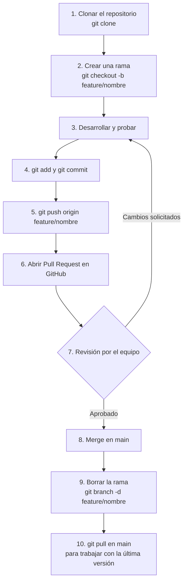

# TEMA 9: Trabajo colaborativo
### Bloque B. Creación digital y pensamiento computacional | CDPC.1.A.10

> **Currículo LOMLOE - Andalucía** | Criterios: CDPC.1.A.10

---

## 1. Por qué se programa en equipo

En la industria del software casi nadie programa en solitario. Los proyectos reales (aplicaciones, videojuegos, instalaciones) los realizan equipos que reparten tareas, revisan el código de los demás y mantienen el trabajo a lo largo de meses. Trabajar en equipo aporta:

- **Más puntos de vista:** una misma solución se puede abordar de varias formas; el debate mejora la decisión.
- **Revisión cruzada:** dos pares de ojos detectan errores (*bugs*) que una sola persona pasa por alto.
- **Especialización:** alguien se ocupa de la interfaz, otro de la lógica, otro de los recursos gráficos o sonoros.
- **Continuidad:** si una persona se ausenta, el proyecto no se paraliza porque el trabajo está documentado y compartido.
- **Aprendizaje:** se aprende leyendo código ajeno y explicando el propio.

También aparecen riesgos: conflictos de opinión, trabajo duplicado, la llamada **"tragedia de los comunes"** (unos trabajan mucho y otros poco) y el **messiah** o integrador que lo arregla todo la noche antes de la entrega. Las prácticas de este tema existen justo para evitarlos.

---

## 2. Habilidades blandas

Las **habilidades blandas** (*soft skills*) son las competencias personales y sociales que hacen funcionar al equipo. Junto a las técnicas, son las más valoradas en el mundo laboral.

### 2.1. Comunicación y escucha activa

- **Hablar con claridad:** explica qué necesitas, qué has hecho y qué problemas tienes, sin rodeos.
- **Escucha activa:** presta atención completa, parafrasea lo que entendiste ("O sea, ¿quieres que...?") y pregunta antes de asumir.
- **Comunicación asíncrona:** en un equipo distribuido no todos responden al instante; escribe mensajes completos y autoconclusivos.
- **Canales adecuados:** dudas rápidas → mensajería; decisiones → documento o hilo concreto; reuniones → solo si se necesita acordar en vivo.

### 2.2. Reparto de tareas

1. **Lista de tareas:** escribir todo lo que hay que hacer (diseño, código, pruebas, documentación, presentación).
2. **Estimación:** valorar el esfuerzo de cada tarea (a veces con una escala sencilla: S/M/L o story points).
3. **Asignación por responsabilidad:** cada tarea tiene **un responsable claro**; el "entre todos lo haremos" suele significar que nadie lo hará.
4. **Dependencias:** identificar qué tareas bloquean a otras y ordenar el trabajo en consecuencia.
5. **Puntos de sincronización:** acordar cuándo se integra el trabajo (p. ej. cada semana).

### 2.3. Gestión de conflictos

Los conflictos no son malos si se gestionan bien: surgen de las ideas, no de las personas.

- Ataca el **problema**, no a la persona: "este código falla con listas vacías" en lugar de "tú siempre haces esto".
- Busca **criterios objetivos** para decidir (rendimiento, legibilidad, plazo) en lugar de discusiones de gustos.
- Si hay empate, **acuerda una prueba** que decida: implementar ambas opciones y medir.
- Escala a tiempo: si dos personas no se ponen de acuerdo, pide opinión al resto del equipo o al docente.

### 2.4. Documentación

Documentar es dejar constancia de *qué* se hizo y *por qué*:

- **README** del proyecto: qué hace, cómo se ejecuta, quiénes participan.
- **Comentarios** en el código donde la lógica no es evidente.
- **Decisiones:** un archivo breve con las decisiones tomadas y su motivo (registro de decisiones).
- **Manual de uso** o guía de montaje si el proyecto es una instalación.

---

## 3. Buenas prácticas de código

### 3.1. Convención de nombres

| Mal ejemplo | Buen ejemplo | Regla |
|-------------|--------------|-------|
| `a`, `x1`, `temp` | `puntuacionJugador` | nombres que describen la intención |
| `MI_VARIABLE` | `puntuacionMaxima` | en Processing/Java se usa *camelCase* |
| `dibujar()` | `dibujarObstaculos()` | verbos para funciones |
| `datos2.csv` | `lecturas_sensor.csv` | separadores claros, sin espacios |

Regla práctica: si otro compañero no puede adivinar qué hace una variable leyendo su nombre, renómbrala.

### 3.2. Comentarios

- Comenta el **por qué**, no el **qué**: el código ya dice qué hace.
- Explica bloques complejos (algoritmos, fórmulas) con una frase encima.
- Actualiza o borra comentarios obsoletos: un comentario viejo es peor que no comentar.
- Todo el texto en español (o el idioma acordado por el equipo).

```java
// Umbral adaptativo: sube con el ruido de fondo para evitar falsos positivos
float umbral = ruidoFondo * 1.5 + 0.08;

// Esto NO aporta nada: suma 1 al contador
cont++;   // incrementa el contador
```

### 3.3. El README

Todo repositorio debe incluir un `README.md` con, al menos:

1. **Nombre y descripción** del proyecto (una frase).
2. **Requisitos** (Processing + librerías Video/Sound, versión).
3. **Cómo ejecutarlo** (abrir el `.pde` y pulsar ▶).
4. **Controles** del juego o de la interacción.
5. **Autores** y curso.
6. **Licencia** (ver apartado 7).
7. Capturas de pantalla o GIF del funcionamiento.

### 3.4. Estilo de código

- **Formato consistente:** misma indentación (4 espacios), llaves en la misma línea, espacios alrededor de los operadores.
- **Funciones cortas:** si un bloque supera una pantalla, probablemente conviene dividirlo.
- **Constantes con nombre claro:** `float VELOCIDAD_JUGADOR = 6;` en lugar de un número mágico repetido.
- **Sin código muerto:** borra lo que no se usa; el equipo lo mantendrá igualmente en el historial de Git.
- **Prueba antes de enviar:** un código que no compila no está "terminado".

---

## 4. Herramientas de comunicación y organización

| Herramienta | Para qué sirve | Ejemplos |
|-------------|----------------|----------|
| **Correo** | Comunicación formal, entrega, avisos a docentes | Gmail, Outlook |
| **Mensajería** | Dudas rápidas, coordinación diaria | Slack, Discord, Teams, Telegram |
| **Videollamada** | Reuniones, pair programming, revisiones | Google Meet, Jitsi, Zoom |
| **Tableros kanban** | Organizar el trabajo por estados | Trello, Notion, GitHub Projects |
| **Documentos compartidos** | Redactar a la vez (actas, guiones) | Google Docs, Notion, HedgeDoc |
| **Almacenamiento** | Recursos grandes (vídeos, audio) | Drive, Dropbox |
| **Control de versiones** | Código fuente | Git + GitHub (apartado 5) |

Un tablero kanban mínimo para un proyecto:

```text
| Por hacer | En curso | En revisión | Hecho |
|-----------|----------|-------------|-------|
| Niveles   | Sonido   | Menú inicio | Vídeo |
| README    | Colisión |             |      |
```

Normas útiles: **máximo 2-3 tareas "en curso" por persona**, tarjetas con responsable y fecha, y revisión del tablero al empezar cada sesión (reunión diaria de 5 minutos: ¿qué hice, qué haré, qué me bloquea?).

---

## 5. Control de versiones con Git y GitHub

### 5.1. Repositorio y commits

- **Repositorio:** carpeta del proyecto bajo el control de Git, con todo su historial.
- **Commit:** una instantánea del estado del proyecto con un **mensaje** que explica el cambio. Debe ser pequeño e independiente.
- **Remote (origin):** la copia del repositorio alojada en **GitHub** (o similar) con la que sincronizamos.

```bash
# inicializar un repositorio en la carpeta del proyecto
git init

# ver el estado: qué archivos están modificados o sin seguimiento
git status

# incluir cambios en la zona de preparación (staging)
git add sketch_principal.pde

# registrar el commit con un mensaje claro en imperativo
git commit -m "Añade movimiento del jugador con el teclado"

# conectar con el repositorio remoto de GitHub
git remote add origin https://github.com/USUARIO/proyecto-cdpc.git
git push -u origin main
```

Consejos de mensajes: qué cambia y por qué (`Corrige colisión con obstáculos pequeños`), no `cosas` ni `update`.

### 5.2. Ramas y merge

Una **rama** (*branch*) es una línea de desarrollo paralelo: puedes experimentar sin romper la versión estable (`main`). **Merge** es la unión de dos ramas cuando el trabajo está listo.

```bash
# crear y cambiar a la rama de una nueva característica
git checkout -b feature/puntuacion

# ... trabajar y guardar avances ...
git add .
git commit -m "Implementa puntuación y vidas"

# volver a main y traer la característica
git checkout main
git merge feature/puntuacion
```

### 5.3. Pull request e issues

- **Pull request (PR):** propuesta formal de fusionar una rama en `main`. El equipo **revisa** el código, comenta y sugiere cambios antes de aprobar.
- **Issues:** tickets para errores (*bug*), tareas o discusiones. Son el "tablero" del repositorio y documentan el trabajo.

```bash
# subir la rama de la característica al remoto para abrir la PR
git push origin feature/puntuacion
```

### 5.4. Flujo de trabajo *feature-branch*

Este es el flujo estándar que usaremos en clase:



Reglas del flujo:

- `main` siempre funciona: nadie hace *push* directo a `main`.
- Cada tarea o característica → **una rama** con nombre descriptivo (`feature/audio`, `fix/colision`).
- Antes de abrir la PR: pull de `main`, resuelve conflictos y comprueba que el sketch compila.
- Toda PR necesita **al menos una revisión** de un compañero.
- Los conflictos de merge se resuelven abriendo el archivo marcado con `<<<<<<<`, eligiendo el código correcto y borrando los marcadores.

```bash
# mantener main actualizado antes de empezar a trabajar
git checkout main
git pull origin main
```

---

## 6. Plataformas educativas: GitHub Classroom

**GitHub Classroom** permite al docente crear un aula virtual donde cada estudiante (o cada equipo) recibe automáticamente un **repositorio individual o grupal** a partir de una plantilla. Ventajas en el aula:

- Entrega automática: el *commit* en la rama indicada **es** la entrega con fecha y hora.
- El docente puede revisar el código, dejar comentarios línea a línea en la PR y ver la evolución del historial.
- Se fomenta el uso real de Git desde el primer día, con un entorno de error tolerable.
- Las **acciones de GitHub** (*Actions*) pueden comprobar de forma automática tareas sencillas (por ejemplo, que el código compile o que exista el README).

Alternativas equivalentes: GitLab Classroom, Bitbucket con scripts propios, o simplemente una carpeta compartida con entregas por correo para cursos sin acceso a estas plataformas.

---

## 7. Licencias y autoría

### 7.1. Plagio, citas y honestidad intelectual

- **Plagio:** presentar código, textos, imágenes o sonidos de otra persona (o de una IA) como propios sin citar la fuente. Es una falta académica y, si el trabajo se publica, un problema legal.
- **Citar correctamente:** indica autor, título y enlace de cualquier recurso externo (librería, tutorial, imagen, música). Un apartado **Créditos** en el README es suficiente.
- **Código ajeno:** copiar fragmentos pequeños con atribución es aceptable y habitual; copiar un proyecto completo y cambiar el nombre no lo es.
- **Trabajo con IA generativa:** si la norma del centro lo permite, declara qué partes se han generado y verifica que funcionan; la responsabilidad del código es tuya.
- **Uso de recursos:** respeta los derechos de autor de las imágenes, músicas y vídeos que uses; busca siempre material con licencia abierta o de uso educativo.

### 7.2. Licencias: el caso de la licencia MIT

Una **licencia** dice qué pueden hacer otras personas con tu trabajo. Sin licencia, por defecto todos los derechos están reservados. La **licencia MIT** es una de las más usadas en software: permisiva, corta y compatible con casi todo.

Permite libremente:

- **Usar** el software con cualquier fin.
- **Copiarlo y distribuirlo.**
- **Modificarlo** y publicar las versiones derivadas.

Únicas condiciones: incluir el **aviso de copyright** y la licencia original en cualquier copia. No exige publicar el código fuente de lo que construyas con él.

Texto de la licencia MIT (versión abreviada para incluir en el repositorio):

```text
MIT License

Copyright (c) 2026 Nombre del autor / Equipo X - 1º Bachillerato CDPC

Permission is hereby granted, free of charge, to any person obtaining a copy
of this software and associated documentation files (the "Software"), to deal
in the Software without restriction... [texto completo en LICENSE]
```

Otras licencias frecuentes: **GPL** (exige que los derivados sean también libres), **Apache 2.0** (como MIT más una cláusula de patentes), **CC BY-SA** (obra creativa con atribución y misma licencia, típica de Wikipedia) y **CC0** (dominio público). En los recursos gráficos o musicales de tus proyectos busca licencias **Creative Commons**.

---

## 8. Evaluación del trabajo en equipo

### 8.1. Rueda de evaluación por pares

La **evaluación por pares** reparte la calificación del trabajo en equipo: una parte es colectiva y otra depende de la valoración de los compañeros. Evita "gratuitos" (quien no aportó recibe la misma nota) y hace visible el reparto real del esfuerzo.

**Dinámica de la rueda (15-20 min):**

1. **Autoevaluación:** cada persona explica en 1 minuto qué ha aportado, qué le ha costado y qué mejoraríamos.
2. **Evidencias:** el equipo muestra el historial de Git (commits por persona), el tablero de tareas y el README.
3. **Valoración individual:** cada miembro puntúa a los demás en una rúbrica breve (comunicación, cumplimiento de tareas, calidad del código, actitud).
4. **Comentarios concretos:** aportación más valiosa de cada persona y una sugerencia de mejora, siempre con un hecho concreto detrás.
5. **Acuerdo final:** el equipo nombra un portavoz que resume conclusiones y se entrega la hoja de evaluación.

**Rúbrica resumida de evaluación por pares (ejemplo):**

| Criterio | 1 (Insuficiente) | 3 (Suficiente) | 5 (Sobresaliente) |
|----------|------------------|----------------|-------------------|
| Comunicación | Casi no responde a los mensajes | Responde cuando se le pide | Informa proactivamente y documenta decisiones |
| Reparto de tareas | Realiza menos de lo acordado | Cumple sus tareas | Ayuda a compañeros bloqueados |
| Calidad del código | Código sin revisar ni comentar | Legible y funcional | Sigue convenciones, comentado y probado |
| Actitud ante conflictos | Evita o agrava los desacuerdos | Participa en los acuerdos | Propone soluciones basadas en criterios |

---

## Ejercicios

1. **Práctica: primer repositorio.** Crea en GitHub un repositorio llamado `cdpc-proyecto-[apellido]` con un README que describa un mini-proyecto de la asignatura (juego, instalación o arte generativo). Clónalo localmente, realiza al menos tres commits con mensajes claros y sube los cambios. Incluye la licencia MIT.

2. **Práctica: flujo feature-branch.** Dentro del repositorio anterior, crea la rama `feature/primer-boceto`, añade un esqueleto de sketch de Processing (`setup()` y `draw()` con un dibujo básico), haz commit, sube la rama y abre un **pull request**. Pide a un compañero (o al docente) que lo revise y, tras sus comentarios, haz el merge en `main`.

3. **Práctica: issues y tablero.** Crea tres *issues* en tu repositorio (uno de error, dos de mejoras), asígnalos a un tablero de GitHub Projects con las columnas "Por hacer / En curso / Hecho" y muéstralos moviéndose a lo largo del trabajo.

4. Escribe el README completo de un proyecto real de la asignatura (puede ser el juego del Tema 8), con descripción, requisitos, controles, autores, licencia y créditos de recursos externos. Aplica las reglas de nombres de variables y comentarios vistas en este tema a al menos 30 líneas de código existente.

5. Diseña una rueda de evaluación por pares para tu equipo: redacta la rúbrica con 4 criterios, prepara la plantilla de la hoja de valoración (puntuación del 1 al 5 más comentarios) y explica cómo se repartirá la nota individual a partir de las valoraciones.

6. Analiza un caso de conflicto en un equipo de programación (inventado o real): describe la situación, aplica las técnicas de gestión de conflictos del apartado 2.3, acuerda un criterio objetivo de decisión y documenta la resolución en un archivo `decisiones.md` dentro de un repositorio de ejemplo.
