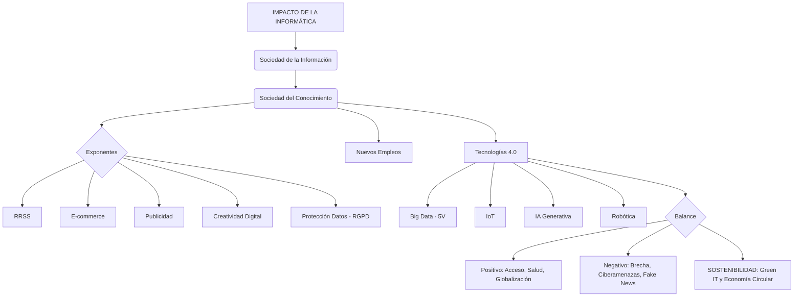

# TEMA 1: La Sociedad de la Información y el Ordenador
### Bloque A. La sociedad de la información y el ordenador | TICO.1.A.1

> **Currículo LOMLOE - Andalucía** | Criterios: TICO.1.A.1.1 a TICO.1.A.1.6

---

## 1. Impacto de la informática

La informática es la ciencia que estudia el tratamiento automático de la información mediante ordenadores. Su impacto ha sido transversal y ha dado lugar a la **Tercera Revolución Industrial** (Revolución Digital) y actualmente a la **Cuarta Revolución Industrial** (fusión de lo físico, digital y biológico).

**Hitos del ordenador como motor del cambio:**
*   1946 - ENIAC: primer ordenador de propósito general (30 toneladas).
*   1971 - Intel 4004: primer microprocesador.
*   1981 - IBM PC: popularización del ordenador personal.
*   1991 - World Wide Web (Tim Berners-Lee): Internet accesible.
*   2007 - iPhone: era del smartphone y la computación ubicua.

El ordenador ha pasado de ser una **máquina de cálculo** a ser una **máquina de comunicación, creación y control**, omnipresente y conectada.

---

## 2. La Sociedad de la Información y la Sociedad del Conocimiento (TICO.1.A.1.1)

### 2.1. Sociedad de la Información (SI)
Término popularizado por Daniel Bell (1973) y Manuel Castells. Sociedad donde la **generación, procesamiento y transmisión de información** se convierte en la principal fuente de productividad y poder.

**Características:**
*   Información abundante, inmediata y globalizada.
*   Infraestructura tecnológica como base (fibra, 5G, satélites).
*   Economía basada en servicios e información.

> **Lema SI:** *La información es poder. Tener acceso a la información.*

### 2.2. Sociedad del Conocimiento (SC)
Concepto impulsado por la UNESCO. Evolución crítica de la SI. No basta con acumular datos, es necesario transformarlos en **conocimiento útil, crítico y aplicable**.

**Características:**
*   Requiere **alfabetización digital** y pensamiento crítico.
*   Valora la educación, la innovación y la investigación (I+D+i).
*   Lucha contra la **infoxicación** (intoxicación por exceso de información) y las *fake news*.

> **Lema SC:** *Saber qué hacer con la información.*

| Criterio | Sociedad de la Información | Sociedad del Conocimiento |
| :--- | :--- | :--- |
| **Foco** | La tecnología | La persona |
| **Objetivo** | Conectar y transmitir | Comprender y crear |
| **Rol del ciudadano** | Consumidor | Prosumidor (produce y consume) |
| **Riesgo** | Brecha digital | Brecha cognitiva |

---

## 3. Ejemplos y exponentes (TICO.1.A.1.2)

### 3.1. Las Redes Sociales
Plataformas web donde los usuarios crean perfiles, generan contenido e interactúan en red.

*   **Horizontales:** Instagram, TikTok, X (Twitter), Facebook.
*   **Verticales/Profesionales:** LinkedIn, GitHub, Behance, ResearchGate.
*   **Conceptos clave:** Identidad digital, huella digital, viralidad, algoritmo de recomendación, burbuja de filtros y cámara de eco.

### 3.2. Comercio Electrónico (e-commerce)
Compra-venta de bienes y servicios a través de Internet.

*   **Modelos:** B2C (Amazon), B2B (Alibaba), C2C (Wallapop, Vinted), C2B.
*   **Tecnologías asociadas:** Pasarelas de pago (Bizum, PayPal), certificados SSL, logística inteligente.

### 3.3. Publicidad en Internet
Publicidad segmentada, interactiva y medible.

*   **Modelos:** SEO (posicionamiento orgánico), SEM (Google Ads), publicidad programática, marketing de afiliación e influencers.
*   **Modelo de negocio:** Economía de la atención. El usuario no paga con dinero, paga con sus datos y su atención (pago por clic - PPC).

### 3.4. Creatividad Digital
Democratización de las herramientas de creación.

*   **Ámbitos:** Diseño gráfico (Figma, Canva), fotografía, música (DAW), vídeo (Premiere, DaVinci), modelado 3D, videojuegos, arte generativo con IA.
*   **Licencias:** Copyright vs. Copyleft y **Creative Commons (CC)**.

### 3.5. Protección de Datos
El dato personal es el petróleo del siglo XXI.

*   **Normativa:** **RGPD (UE 2016/679)** y **LOPDGDD (Ley Orgánica 3/2018)** en España.
*   **Derechos ARCO-POL:** Acceso, Rectificación, Cancelación, Oposición, Portabilidad, Olvido y Limitación.
*   **Principios:** Consentimiento explícito, minimización de datos, transparencia y seguridad.
*   **Buenas prácticas:** Contraseñas robustas + 2FA, revisar permisos de apps, configurar privacidad, desconfiar del phishing.

---

## 4. Nuevos sectores laborales (TICO.1.A.1.3)

La automatización destruye tareas rutinarias pero crea nuevos empleos cualificados.

**Nuevos perfiles:**
*   **Datos e IA:** Data Analyst, Data Scientist, Ingeniero de Machine Learning, Prompt Engineer.
*   **Desarrollo:** Desarrollador Web/Móvil, DevOps, Experto en Ciberseguridad.
*   **Contenidos y Marketing:** Community Manager, SEO Specialist, Creador de Contenido, Growth Hacker.
*   **Emergentes:** Piloto de drones, Técnico en Impresión 3D, Especialista en IoT, Técnico de Robótica colaborativa.

**Nuevas formas de trabajo:**
*   **Teletrabajo** e híbrido.
*   **Gig Economy / Economía de plataformas:** Trabajo por encargo (Uber, Glovo, Upwork).
*   **Freelance y Nómada Digital.**

> **Competencia clave según DigComp (UE):** Pensamiento computacional, gestión de la información, comunicación, creación de contenido, seguridad y resolución de problemas.

---

## 5. Big Data, IoT, IA y Robótica (TICO.1.A.1.4)

Son los pilares de la Industria 4.0. Están interconectados.

### 5.1. Big Data
Conjuntos de datos de volumen, velocidad y variedad tan grandes que requieren técnicas específicas para ser capturados, almacenados y analizados.

**Las 5 V del Big Data:**
1.  **Volumen:** Terabytes, Petabytes (ej. 500 horas de vídeo/minuto en YouTube).
2.  **Velocidad:** Datos en tiempo real.
3.  **Variedad:** Estructurados (BBDD), no estructurados (vídeos, tuits) y semiestructurados.
4.  **Veracidad:** Calidad y fiabilidad del dato.
5.  **Valor:** Capacidad de convertir datos en decisiones.

*Ejemplo:* Sanidad predice brotes de gripe analizando búsquedas en Google.

### 5.2. Internet de las Cosas (IoT)
Red de objetos físicos con sensores, software y conectividad para intercambiar datos sin intervención humana.

*Ejemplo:* Hogar inteligente (termostato que aprende tus horarios), smart city (farolas que se encienden solo si detectan peatones), agricultura de precisión (sensores de humedad que riegan automáticamente).

### 5.3. Inteligencia Artificial (IA)
Rama de la informática que crea sistemas capaces de simular capacidades humanas: aprender, razonar, percibir y decidir.

*   **Machine Learning:** La máquina aprende de los datos.
*   **Deep Learning:** Redes neuronales profundas (reconocimiento de voz/imagen).
*   **IA Generativa:** Crea contenido nuevo (ChatGPT, Gemini, Claude, Midjourney, Stable Diffusion).

*Ejemplo:* Diagnóstico médico por imagen, asistentes virtuales, traductores automáticos.

### 5.4. Robótica
Diseño y construcción de máquinas capaces de interactuar con el entorno físico. La robótica actual se fusiona con la IA.

*   **Tipos:** Industrial (cadenas de montaje), de servicio (aspiradora Roomba), colaborativa (cobots), médica (Da Vinci), social.
*   *Ejemplo:* Almacenes de Amazon con 750.000 robots móviles.

> **Ciclo:** `IoT (genera datos) -> Big Data (almacena) -> IA (analiza y decide) -> Robótica (actúa)`

---

## 6. Aspectos positivos y negativos. Amenazas (TICO.1.A.1.5)

### 6.1. Aspectos Positivos
*   Acceso universal e inmediato al conocimiento (Wikipedia, MOOCs).
*   Avances en medicina (telemedicina, diagnóstico), educación y ciencia.
*   Comunicación global y colaboración sin fronteras.
*   Automatización de trabajos peligrosos o repetitivos.
*   Nuevos canales de participación democrática y emprendimiento.

### 6.2. Aspectos Negativos y Amenazas
*   **Brecha Digital:** Desigualdad por edad, renta, territorio o género. Tres niveles: acceso, uso y calidad de uso.
*   **Ciberseguridad:** Malware, ransomware, phishing, estafas, suplantación de identidad.
*   **Privacidad:** Vigilancia masiva, perfilado y monetización de datos sin consentimiento.
*   **Desinformación:** Fake news, deepfakes, cámaras de eco y polarización.
*   **Salud digital:** Adicción a pantallas, nomofobia, sedentarismo, ciberacoso (cyberbullying), grooming, sexting y problemas de autoestima.
*   **Impacto laboral:** Desempleo tecnológico y precariedad en la gig economy.
*   **Concentración de poder:** Dominio de las GAFAM (Google, Apple, Facebook/Meta, Amazon, Microsoft).

---

## 7. Sostenibilidad (TICO.1.A.1.6)

La nube no es etérea: consume recursos físicos.

### 7.1. Impactos Ambientales
*   **Residuos electrónicos (RAEE / e-waste):** 62 millones de toneladas en 2022 (ONU). Contienen plomo, mercurio, litio.
*   **Obsolescencia programada:** Diseño deliberado para acortar la vida útil. **Obsolescencia percibida:** Moda que hace que lo viejo parezca inútil.
*   **Huella de carbono digital:** Los centros de datos consumen ~1-1,5% de la electricidad mundial (más que algunos países). Enviar un email con adjunto: ~50g CO2. Una hora de streaming en HD: ~100g CO2. La minería de Bitcoin consume más que Argentina.

### 7.2. Soluciones: Green IT y Tecnología Sostenible
*   **Economía Circular y las 4R:** **Reducir** (comprar solo lo necesario), **Reutilizar** (mercado de segunda mano), **Reparar** (derecho a reparar - UE 2024), **Reciclar** (puntos limpios, SIGs como Ecolec).
*   **Eficiencia energética:** Algoritmos verdes, centros de datos con free cooling y energías renovables (Google, Meta ya son 100% renovables), modo oscuro/ahorro.
*   **Consumo responsable:** Alargar la vida del hardware (+1 año de uso reduce 30% su huella), comprar reacondicionado, borrar archivos/correos de la nube, imprimir solo si es necesario.
*   **ODS relacionados:** ODS 9 (Industria e innovación), ODS 12 (Producción y consumo responsables) y ODS 13 (Acción por el clima).

---

## 8. Mapa Conceptual

**Idea para recordar:** La tecnología no es buena ni mala, ni tampoco neutral (Melvin Kranzberg).

---
