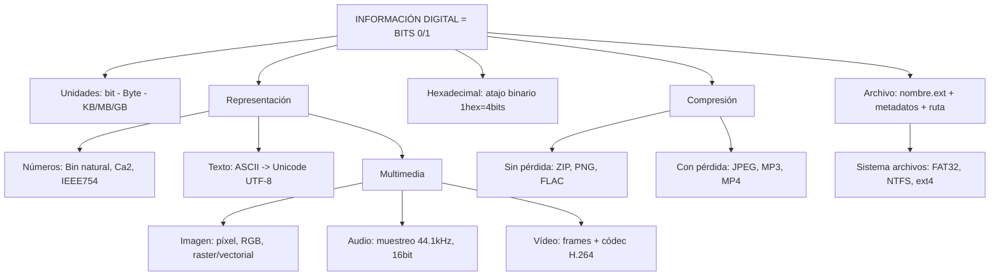

# TEMA 2: Información Digital
### Bloque A. La sociedad de la información y el ordenador | TICO.1.A.2

> **Currículo LOMLOE - Andalucía** | Criterios: TICO.1.A.2.1 a TICO.1.A.2.7

---

## 1. Almacenamiento, transmisión y tratamiento básico en binario (TICO.1.A.2.1)

Toda la información que maneja un ordenador (texto, foto, música) se reduce a dos estados físicos.

**¿Por qué binario?**
El hardware solo distingue dos niveles de tensión: 0 (apagado/bajo, 0V) y 1 (encendido/alto, 5V/3.3V). Es fiable, barato y poco sensible al ruido. Se basa en el **álgebra de Boole**.

*   **BIT (Binary Digit):** Unidad mínima. Vale 0 o 1.
*   **Señal analógica vs digital:** La analógica es continua (onda). La digital es discreta (escalones 0/1). Ventaja digital: se puede copiar sin perder calidad y corregir errores.
*   **Tratamiento:** Puertas lógicas (AND, OR, NOT) combinan bits. Un procesador es millones de transistores que operan con bits.
*   **Almacenamiento:** Cada bit se guarda físicamente (carga en memoria flash, orientación magnética en disco duro, hoyo en DVD).
*   **Transmisión:** Los bits viajan como pulsos eléctricos (cable), ondas de radio (WiFi) o luz (fibra). Protocolo TCP/IP los trocea en paquetes y verifica errores con bit de paridad o CRC.

> **Idea clave:** Digitalizar = convertir cualquier información en una secuencia de 0 y 1.

---

## 2. Unidades de información (TICO.1.A.2.2)

Un solo bit dice poco. Se agrupan.

**Byte:** Conjunto de 8 bits. Puede representar 2⁸ = 256 valores (0 a 255). Ej: una letra.

### Múltiplos: Dos sistemas que causan confusión

| Nombre | Símbolo | Valor SI (Decimal, base 10) | Valor IEC (Binario, base 2) | Uso común |
| :--- | :--- | :--- | :--- | :--- |
| Kilobyte | KB / KiB | 1 KB = 1.000 bytes | 1 KiB = 1.024 bytes | Fabricantes HDD usan KB |
| Megabyte | MB / MiB | 1 MB = 1.000 KB | 1 MiB = 1.024 KiB | RAM, USB usan MiB |
| Gigabyte | GB / GiB | 1 GB = 1.000 MB | 1 GiB = 1.024 MiB |  |
| Terabyte | TB / TiB | 1 TB = 1.000 GB | 1 TiB = 1.024 GiB |  |

*   **Norma IEC (1998):** KiB, MiB, GiB para potencias de 1024. Es la correcta para informática.
*   **Truco:** Windows te muestra GiB aunque ponga GB. Por eso un disco de "1 TB" (1.000.000.000.000 bytes) aparece como 931 GiB.

**Unidades de velocidad:** Se miden en **bits por segundo (bps)**, no bytes.
*   100 Mbps (megabits) = 12,5 MB/s. Importante para fibra (300 Mbps) vs descarga.

**Cálculo rápido:** ¿Cuántos libros de 1 MB caben en un USB de 16 GiB?
16 GiB = 16 x 1024 MiB = 16384 MB ≈ 16384 libros.

---

## 3. Representación de números y texto (TICO.1.A.2.3)

### 3.1. Números enteros

*   **Binario natural:** Ej: 13₁₀ = 1101₂ (8+4+0+1). Con *n* bits representamos 2ⁿ números (ej: 8 bits -> 0 a 255).
*   **Signo y magnitud:** 1 bit para signo (0=+,1=-) + resto magnitud. Poco usado por tener doble cero.
*   **Complemento a 2 (Ca2):** Sistema actual para negativos. Ventaja: una sola representación del 0 y resta = suma. Rango con 8 bits: -128 a +127.
    *   Ej: -3 con 4 bits -> 3=0011 -> invertir 1100 -> +1 = 1101.

*   **Números reales (coma flotante):** Norma **IEEE 754**. Ej: 32 bits = 1 signo + 8 exponente + 23 mantisa. Permite notación científica binaria. No todos los decimales son exactos (0.1 + 0.2 ≠ 0.3 exacto en binario -> error de redondeo).

### 3.2. Texto

El ordenador no entiende letras, solo números que representan letras (código).

*   **ASCII (1963):** 7 bits (128 caracteres) -> 0-127: inglés, números, símbolos. Insuficiente para ñ, tildes.
*   **ISO-8859-1 / Latin1:** 8 bits (256 caracteres) -> añade ñ, á, ç. Propio de Europa occidental.
*   **Unicode:** Estándar universal actual. >149.000 caracteres (todos los idiomas + emojis).
    *   **UTF-8:** Codificación más usada en web. Compatible con ASCII y usa 1 a 4 bytes por carácter. Ej: 'A'=1 byte (01000001), 'ñ'=2 bytes, '😀'=4 bytes.
    *   **UTF-16 / UTF-32:** Otras codificaciones.

> **Práctica:** La palabra "Hola" en ASCII es: 72 111 108 97 -> en binario `01001000 01101111 01101100 01100001`.

---

## 4. Representación de imágenes, audio y vídeo (TICO.1.A.2.4)

### 4.1. Imágenes

**a) Mapa de bits (raster):** La imagen es una matriz de **píxeles**.
*   **Resolución:** Nº píxeles (ej: 1920x1080 = 2M píxeles = 2 Megapíxeles).
*   **Profundidad de color (bpp):** Bits por píxel. 1 bit = B/N, 8 bits = 256 colores, 24 bits = 16,7 millones (True Color: 8R+8G+8B).
*   **Cálculo tamaño sin comprimir:** Ancho x Alto x bpp / 8. Ej: Foto 1920x1080x24 bits = 6,22 MB.
*   Formatos: BMP (sin comprimir), JPEG (con pérdida), PNG (sin pérdida, transparencia), GIF (256 colores, animado), WebP.

**b) Vectorial:** No guarda píxeles, guarda fórmulas matemáticas (puntos, curvas Bézier). Escalable sin perder calidad.
*   Formatos: SVG, AI, EPS. Ideal para logos e iconos.

### 4.2. Audio

El sonido analógico (onda) se digitaliza en 3 pasos:
1.  **Muestreo:** Medir la amplitud cada cierto tiempo. Frecuencia de muestreo (Hz). CD: 44.100 Hz (44.100 muestras/seg). Teorema de Nyquist: debe ser >2x frecuencia máxima audible.
2.  **Cuantificación:** Asignar un valor numérico a cada muestra (ej: 16 bits = 65.536 niveles).
3.  **Codificación:** Guardar los números en binario.

*   **Tamaño sin comprimir (WAV):** Frecuencia x bits x canales x segundos / 8.
    Ej: 1 min estéreo 44.1kHz/16bit = ~10 MB.
*   Formatos: WAV (sin comprimir), MP3/AAC (con pérdida), FLAC (sin pérdida).

### 4.3. Vídeo

Secuencia de imágenes (fotogramas/frames) + audio.
*   **Parámetros:** Resolución (FullHD, 4K), FPS (frames por segundo: 24 cine, 30/60 vídeo), códec (H.264, H.265/HEVC, AV1).
*   **Tamaño brutal sin comprimir:** 1 hora 1080p 30fps 24bpp ≈ 200 GB -> imprescindible comprimir (MP4).
*   Formatos contenedor: MP4, MKV, AVI, MOV (contienen vídeo+audio+subtítulos).

---

## 5. Sistema hexadecimal (TICO.1.A.2.5)

Sistema en base 16. 16 símbolos: `0-9, A=10, B=11, C=12, D=13, E=14, F=15`. Es un atajo para escribir binario.

**¿Por qué se usa?** 1 dígito hex = 4 bits (nibble). Es compacto y legible. Se usa para colores (#FF0000), direcciones MAC, memoria RAM, programación.

**Conversiones clave:**

| Decimal | Binario | Hex |
| :--- | :--- | :--- |
| 0 | 0000 | 0 |
| 10 | 1010 | A |
| 15 | 1111 | F |
| 26 | 0001 1010 | 1A |

**Método rápido:**
*   **Bin -> Hex:** Agrupa de 4 en 4 desde la derecha. Ej: `10101111₂` -> `1010 1111` -> `A F` -> `AF₁₆`.
*   **Hex -> Bin:** Cada dígito a 4 bits. Ej: `2C₁₆` -> `0010 1100₂`.
*   **Hex -> Dec:** Suma potencias de 16. Ej: `1A₁₆` = 1x16¹ + 10x16⁰ = 26₁₀.
*   **Prefijos:** En programación `0x` indica hex (`0xFF`), `#` en colores HTML.

---

## 6. Compresión (TICO.1.A.2.6)

Reduce el tamaño de los archivos para ahorrar almacenamiento y ancho de banda.

### 6.1. Sin pérdida (Lossless)
Se puede reconstruir el original bit a bit. Tasa ~2:1 a 3:1.
*   **Algoritmos:** Huffman, LZ77/LZ78 (base de ZIP), RLE.
*   **Usos:** ZIP, RAR, 7z, PNG, GIF, FLAC, documentos de texto.
*   Ideal para texto, programas, imágenes que no pueden perder detalle.

### 6.2. Con pérdida (Lossy)
Elimina información poco perceptible por el humano. Tasa 10:1 a 100:1. No se puede recuperar el original.
*   **Usos:** JPEG (fotos), MP3/AAC (audio), MP4/H.264 (vídeo).
*   Ideal para multimedia donde el ojo/oído no nota pequeñas pérdidas. Parámetro calidad vs tamaño.

> **Comparativa:** Foto RAW 20 MB -> PNG sin pérdida 12 MB -> JPEG calidad alta 4 MB -> JPEG calidad baja 800 KB (con artefactos).

---

## 7. Archivos (TICO.1.A.2.7)

**Archivo (file):** Conjunto de bits con nombre que almacena información de forma persistente. Abstracción que nos evita manejar sectores físicos del disco.

**Estructura:**
*   **Nombre + Extensión:** `vacaciones.jpg` -> nombre `vacaciones`, extensión `.jpg` indica formato/programa. Ej: `.txt`, `.pdf`, `.docx`, `.jpg`, `.mp3`, `.exe`, `.zip`. En Linux la extensión es orientativa, en Windows determina con qué se abre.
*   **Atributos/Metadatos:** Tamaño (bytes), fechas (creación/modificación), permisos (lectura/escritura/ejecución), propietario, oculto/solo lectura.
*   **Ruta (path):** Dirección jerárquica. Absoluta (`C:\Users\Ana\Docs\foto.jpg` o `/home/ana/docs/foto.jpg`) vs relativa (`../foto.jpg`). Carpetas/directorios forman un árbol.

**Sistema de archivos (Filesystem):** Cómo organiza el SO los archivos en el disco.
*   **FAT32:** Antiguo, máx 4GB por archivo, compatible con todo (USB).
*   **NTFS:** Windows actual, sin límite práctico, permisos, journaling.
*   **ext4:** Linux, journaling.
*   **APFS:** macOS.
*   Operaciones: crear, copiar, mover, borrar (a papelera), renombrar. Borrar no borra bits, solo marca el espacio como libre (por eso se puede recuperar).

**Tipos según contenido:**
*   Texto plano (.txt, .csv), Documento (.pdf, .odt), Imagen (.png), Audio (.mp3), Vídeo (.mp4), Ejecutable (.exe, .app), Comprimido (.zip).

---

## 8. Mapa Conceptual

---
