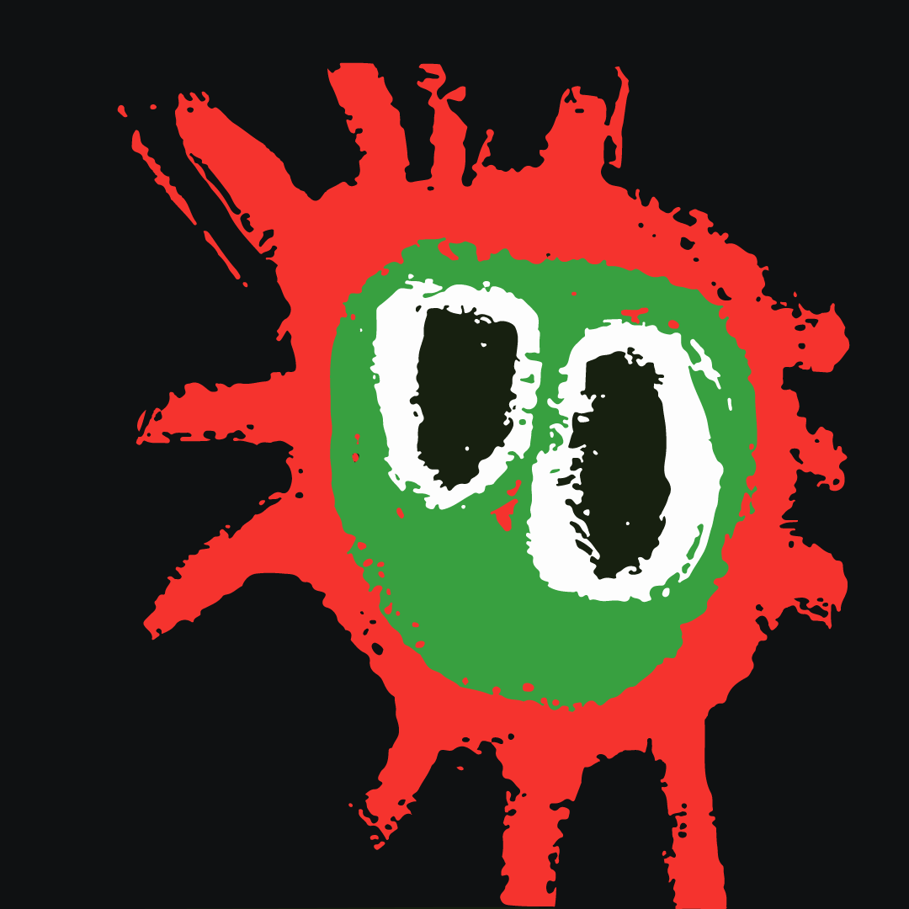

# Blog de Diego J. González

Bienvenidos a mi sitio web, en permanente construcción. 
:P

Este espacio recoge materiales sobre las asignatureas de programación y sistemas que se imparten en los ciclos formativos de grado superior ASIR, DAW, DAM y secundaria.

✉️ diego@diegojgonzalez.com

[Ir a Moodle TCM](https://dgmx.duckdns.org){: .btn }

