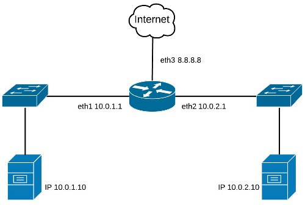

# Ejemplo de un Firewall de Red

Diagrama de Red:



## Fichero de reglas de Iptables
Recordamos que si no se especifica ninguna tabla en la regla, por defecto se aplican a la tabla filter.
```
#!/bin/bash

# Limpia las tablas de iptables
iptables -F
iptables -X
iptables -t nat -F
iptables -t nat -X
iptables -t mangle -F
iptables -t mangle -X
iptables -t filter -F
iptables -t filter -X

# Deniega todo el tráfico por defecto
iptables -P INPUT DROP
iptables -P FORWARD DROP
iptables -P OUTPUT DROP

# Permite el tráfico loopback
iptables -A INPUT -i lo -j ACCEPT
iptables -A OUTPUT -o lo -j ACCEPT

# Permite el reenvío de tráfico entre las redes internas eth1 y eth2
iptables -A INPUT -i eth1 -j ACCEPT
iptables -A INPUT -i eth2 -j ACCEPT
iptables -A FORWARD -i eth1 -j ACCEPT
iptables -A FORWARD -i eth2 -j ACCEPT
iptables -A OUTPUT -o eth1 -j ACCEPT
iptables -A OUTPUT -o eth2 -j ACCEPT

# Permite la salida de tráfico hacia la red pública eth3
iptables -A INPUT -i eth3 -m state --state ESTABLISHED,RELATED -j ACCEPT
iptables -A FORWARD -i eth3 -m state --state ESTABLISHED,RELATED -j ACCEPT
iptables -A OUTPUT -o eth3 -j ACCEPT

# Permite el tráfico NAT en la interfaz pública eth3 con IP dinámica
iptables -t nat -A POSTROUTING -s 10.0.1.0/24 -o eth3 -j MASQUERADE
iptables -t nat -A POSTROUTING -s 10.0.2.0/24 -o eth3 -j MASQUERADE

# Permite el tráfico NAT en la interfaz pública eth3 con IP estática
#iptables -t nat -A POSTROUTING -s 10.0.1.0/24 -o eth3 -j SNAT --to 8.8.8.8
#iptables -t nat -A POSTROUTING -s 10.0.2.0/24 -o eth3 -j SNAT --to 8.8.8.8

# Permite el protocolo ICMP de entrada en la red externa
iptables -A INPUT -i eth3 -p icmp -j ACCEPT

# Permite la conexión al puerto 22 de cualquier equipo de la red externa
iptables -A INPUT -i eth3 -p tcp --dport 22 -j ACCEPT

# Permite la conexión al puerto 22 desde una determinada dirección MAC 
iptables -A INPUT -i eth3 -p tcp --dport 22 -m mac --mac-source 00:0F:EA:91:04:07 -j ACCEPT

# Permite la conexión al puerto 22 desde direcciones MAC almacenadas en un fichero
for MAC in `cat fichero_direcciones_MAC`; do 
    iptables -A INPUT -i eth3 -p tcp --dport 22 -m mac --mac-source $MAC -j ACCEPT
done

# Deniega la conexión al puerto 22 a todos excepto una determinada dirección MAC
iptables -A INPUT -i eth3 -p tcp --port 22 -m mac ! --mac-source 3E:D7:88:A6:66:8E -j REJECT

# Permite la redirección del puerto 3389 al 3389 de un equipo de la red interna
iptables -t nat -A PREROUTING -i eth3 -p tcp --dport 3389 -j DNAT --to 10.0.1.10:3389
iptables -A FORWARD -i eth3 -p tcp -d 10.0.1.10 --dport 3389 -j ACCEPT

# Permite la redirección del puerto 3390 al 3389 de un equipo de la red interna
iptables -t nat -A PREROUTING -i eth3 -p tcp --dport 3390 -j DNAT --to 10.0.2.10:3389
iptables -A FORWARD -i eth3 -p tcp -d 10.0.2.10 --dport 3389 -j ACCEPT

# Permite la conexión al puerto 1194
# para establecer una conexión con OpenVPN y SSL/TLS en el mismo equipo
# Permite el tráfico por la red tun0
iptables -A INPUT -i eth3 -p udp --dport 1194 -j ACCEPT
iptables -A INPUT -i tun0 -j ACCEPT
iptables -A FORWARD -i tun0 -j ACCEPT
iptables -A OUTPUT -o tun0 -j ACCEPT

# Permite la redirección de los puertos y protocolos 
# para establecer una conexión VPN con PPTP hacia un equipo Windows
iptables -t nat -A PREROUTING -i eth3 -p tcp --dport 1723 -j DNAT --to 10.0.1.10:1723
iptables -A FORWARD -i eth3 -p tcp -d 10.0.1.10 --dport 1723 -j ACCEPT
iptables -t nat -A PREROUTING -i eth3 -p gre -j DNAT --to 10.0.1.10
iptables -A FORWARD -i eth3 -p gre -d 10.0.1.10 -j ACCEPT
```


## Listando las reglas de Iptables
Si queremos listar las reglas que tenemos actualmente aplicadas utilizaremos las siguientes opciones, donde -n hace que no se resuelvan las direcciones IP.
```
iptables -L
iptables -L -n
iptables -t nat -L -n
```

## Limpiando las reglas de Iptables
Si queremos eliminar todas las reglas del iptables, crearemos el fichero /etc/iptables-clean, al que debemos otorgarle permisos de ejecución:
```
chmod 700 /etc/iptables-clean

#!/bin/bash

echo "Limpiando reglas Iptables y permitiendo todo el tráfico..."
iptables -F
iptables -X
iptables -t nat -F
iptables -t nat -X
iptables -t mangle -F
iptables -t mangle -X
iptables -t filter -F
iptables -t filter -X
iptables -P INPUT ACCEPT
iptables -P FORWARD ACCEPT
iptables -P OUTPUT ACCEPT
```

Ejemplo extraido de [Ticarte](https://www.ticarte.com/)

 