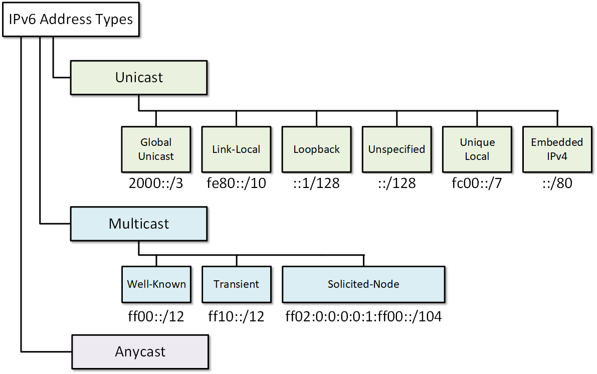

## Introducción a IP v6

`IPv6` significa **Protocolo de Internet versión 6** y es la versión más reciente del Protocolo de Internet utilizado para la comunicación de datos a través de internet. Es el sucesor del protocolo `IPv4`, que aún se utiliza ampliamente en la actualidad.

`IPv6` se desarrolló para superar la limitación de `IPv4`, que tiene un número limitado de direcciones disponibles. Con el crecimiento exponencial de dispositivos y usuarios conectados a internet, las direcciones `IPv4` se están agotando.

`IPv6` ofrece un espacio de direcciones de **128 bits** mucho mayor que el de **32 bits** de `IPv4` . Esto garantiza la disponibilidad de direcciones para el crecimiento futuro previsible de Internet.

`IPv6` también tiene mejoras en enrutamiento, configuración de red, seguridad y rendimiento respecto a `IPv4`.

### ¿Cómo funcionan las direcciones IPv6?

A continuación se ofrece una breve descripción general de cómo funcionan las direcciones IPv6:

   * Las direcciones IPv6 son de 128 bits, a diferencia de las de 32 bits utilizadas en IPv4. Esto proporciona un espacio de direcciones mucho mayor, lo que permite potencialmente billones de direcciones IP únicas.
   * La dirección IPv6 de 128 bits se representa típicamente como 8 grupos de 4 dígitos hexadecimales separados por dos puntos. Por ejemplo, `2001:0db8:85a3:0000:0000:8a2e:0370:7334`.
   * Los ceros iniciales en cada grupo se pueden omitir, y los grupos sucesivos de ceros se pueden reemplazar por dos puntos, de la siguiente manera: `2001:db8:85a3::8a2e:370:7334`
   * Las direcciones IPv6 se asignan en bloques, de forma similar al enrutamiento entre dominios sin clases (CIDR) de IPv4. La longitud del prefijo indica cuántos bits iniciales comunes comparten las direcciones del bloque.
   * IPv6 admite tanto direcciones unicast (para una única interfaz) como direcciones anycast (para un servicio proporcionado por múltiples interfaces).
   * Las direcciones de multidifusión permiten la transmisión de paquetes a múltiples interfaces. Comienzan con `ff00::/8`.
   * Las direcciones de enlace local se utilizan para la comunicación dentro de un segmento de red local y comienzan con `fe80::/10`.
   * IPv6 eliminó las direcciones de difusión. En su lugar, se utiliza una dirección de multidifusión local de enlace.
   * ICMPv6 (ICMP para IPv6) proporciona informes de errores y funciones de diagnóstico como ping, descubrimiento de vecinos, descubrimiento de enrutadores, etc.
   * Las conexiones IPv6 suelen utilizar IPsec para la seguridad de extremo a extremo en lugar de NAT. IPsec proporciona autenticación, integridad y confidencialidad.

En resumen, el mayor espacio de direcciones, el encabezado simplificado, la seguridad mejorada y las nuevas características hacen que IPv6 sea ideal para la Internet moderna.

Pero tanto IPv4 como IPv6 siguen utilizándose ampliamente hoy en día durante este período de transición.

### Diferencias clave entre IPv4 e IPv6

A continuación se muestra una comparación de algunas diferencias clave entre IPv4 e IPv6:   
| IPv4 |IPv6 | 
|----------|----------|
| Dirección de 32 bits    | Dirección de 128 bits  |
| Admite 340 billones de billones de billones de dispositivos | Admite 340 billones de billones de billones de dispositivos |
| Direccionamiento de red con clases complejas|Direccionamiento jerárquico simplificado|
|Priorización de tráfico limitado |Calidad de servicio incorporada|
|Seguridad básica con NAT |Seguridad de extremo a extremo con IPsec|
|Configuración manual del host|Configuración automática de direcciones|
|Opciones y extensiones limitadas |Opciones y extensiones flexibles|
|La fragmentación es procesada por el enrutador|	La fragmentación es de extremo a extremo|
|Redes basadas en transmisión |Redes de multidifusión|
| Suma de comprobación en cada capa de red| 	Suma de comprobación solo en la capa de transporte|
|Escalabilidad de enrutamiento limitada 	|Enrutamiento jerárquico para una mejor escalabilidad|

En resumen, IPv6 proporciona direccionamiento ampliado, enrutamiento mejorado, seguridad, rendimiento y gestión en comparación con IPv4.

### Tipos de direcciones IPv6

Hay varios tipos de direcciones IPv6 que se utilizan para diferentes propósitos:

* Unicast: Se dirige a una sola interfaz de red. Se utiliza para la mayoría de las comunicaciones.
* Multidifusión: identifica un grupo de interfaces de red. Se utiliza en comunicaciones de uno a muchos.
* Anycast: Identifica un grupo de interfaces. Se utiliza en comunicaciones de uno a la más cercana.
* Bucle invertido: Lo utiliza un nodo para enviarse paquetes a sí mismo. Equivalente a `127.0.0.1` de IPv4.
* Sin especificar: Indica la ausencia de una dirección. Equivalente a `0.0.0.0` de IPv4.
* Enlace local: Se utiliza para comunicaciones dentro de un segmento o enlace de red lógico. Se configura automáticamente localmente.
* Local único: Se utiliza como direcciones IP privadas en IPv4. No es enrutable en la internet global.

### Beneficios clave de IPv6

Estas son algunas de las principales ventajas que ofrece IPv6 sobre IPv4:

*  Espacio de direcciones prácticamente ilimitado para el crecimiento futuro.
*  Arquitectura de enrutamiento eficiente y escalable.
*  El enrutamiento más rápido parece deberse a un encabezado simplificado.
*  Capacidades de seguridad y privacidad IPsec integradas.
*  Autoconfiguración para asignar direcciones IP automáticamente.
*  Multidifusión nativa y anycast para habilitar nuevas aplicaciones.
*  Mejor soporte para dispositivos que se conectan directamente a Internet.
*  Flexibilidad para agregar opciones y extensiones personalizadas.
*  Capacidades para priorizar y gestionar diferentes tipos de tráfico.
*  Soporte para dispositivos móviles y movilidad.

### Tendencias de implementación y adopción de IPv6

Si bien IPv6 se estandarizó en la década de 1990, su adopción ha cobrado impulso en la última década:

* Tráfico IPv6: se estima que representará alrededor del 30 % del tráfico mundial de Internet en 2022. Principalmente proveniente de dispositivos móviles.
* Proveedores de servicios: La mayoría de los principales proveedores de servicios de internet han habilitado la conectividad IPv6. Sin embargo, muchos aún utilizan tecnologías de transición.
* Sitios web: aproximadamente el 30% de los 1000 sitios web principales de Alexa son accesibles a través de IPv6, lo que representa un aumento respecto de menos del 5% hace una década.
* Dispositivos y software: la mayoría de los equipos y software modernos son compatibles con IPv6. Los sistemas operativos móviles como Android e iOS son totalmente compatibles con IPv6.
* Mandatos gubernamentales – Muchos gobiernos han establecido cronogramas y objetivos para la adopción de IPv6 en sus países.

Por lo tanto, el uso de IPv6 está creciendo rápidamente a medida que se agotan las direcciones IPv4. Sin embargo, se espera que IPv4 coexista con IPv6 durante un largo período durante la transición.

### Mecanismos de transición de IPv6 a IPv4

Dado que IPv4 está tan ampliamente implementado, la transición no es instantánea. A continuación, se presentan algunas técnicas para una transición gradual:

* Implementación de doble pila: las redes ejecutan IPv4 e IPv6 juntos y transfieren el tráfico entre ellas.
* Tunelización: el tráfico IPv6 se encapsula dentro de paquetes IPv4 para enrutarlo a través de redes IPv4.
* Traducción: conversión entre direcciones IPv6 e IPv4 para compatibilidad.
* Reescritura de encabezados: los encabezados de paquetes IPv6 se modifican para que se parezcan a los paquetes IPv4.

Estos mecanismos permiten que Internet cambie progresivamente hacia IPv6 manteniendo al mismo tiempo la compatibilidad con la infraestructura IPv4 existente durante la transición.

Articulo traducido de https://callwave.com/ipv6/