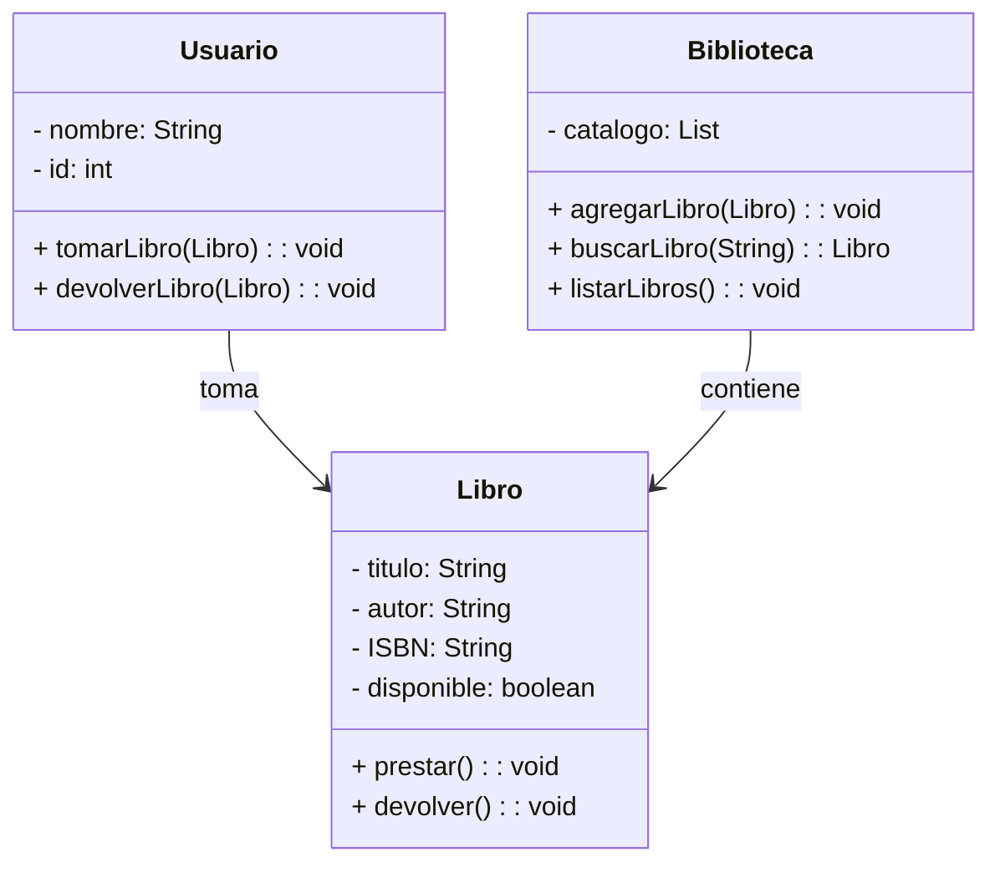
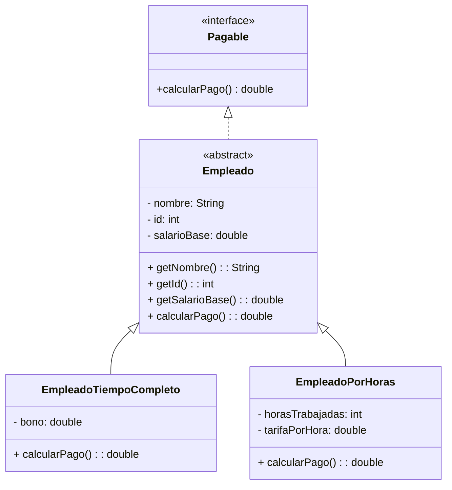

## Ejercicios usando modelado diagrama UML

**Actividad 1. Sistema de Gestión de Biblioteca**

Una biblioteca necesita un sistema para gestionar su catálogo de libros y el préstamo de estos a los usuarios.

El sistema debe permitir:

- Administrar libros, incluyendo su registro en el catálogo y su disponibilidad.
- Gestionar usuarios, permitiéndoles tomar prestados y devolver libros.
- Facilitar la búsqueda de libros dentro del catálogo.
- Cada libro debe tener un título, autor, ISBN y un estado que indique si está disponible o no. Los usuarios deben poder solicitar un libro siempre que esté disponible y devolverlo una vez finalizado el préstamo.

El sistema debe mantener un registro actualizado de los libros y su disponibilidad, asegurando un correcto seguimiento de los préstamos.

El diagrama de clases representa las entidades principales: Libro, Usuario y Biblioteca.

### Diagrama de Clases UML (Texto UML Notation)


---

### Relaciones entre Clases
- **Usuario** → *toma* → **Libro**  
- **Biblioteca** → *contiene* → **Libro**

## Implementación en Java

**Clase `Libro`**

```java
class Libro {
    private String titulo;
    private String autor;
    private String ISBN;
    private boolean disponible;

    public Libro(String titulo, String autor, String ISBN) {
        this.titulo = titulo;
        this.autor = autor;
        this.ISBN = ISBN;
        this.disponible = true;
    }

    public void prestar() {
        if (disponible) {
            disponible = false;
            System.out.println("Libro prestado: " + titulo);
        } else {
            System.out.println("El libro no está disponible.");
        }
    }

    public void devolver() {
        disponible = true;
        System.out.println("Libro devuelto: " + titulo);
    }

    public boolean estaDisponible() {
        return disponible;
    }

    public String getTitulo() {
        return titulo;
    }
}
```

**Clase `Usuario`**

```java
class Usuario {
    private String nombre;
    private int id;

    public Usuario(String nombre, int id) {
        this.nombre = nombre;
        this.id = id;
    }

    public void tomarLibro(Libro libro) {
        if (libro.estaDisponible()) {
            libro.prestar();
            System.out.println(nombre + " ha tomado el libro: " + libro.getTitulo());
        } else {
            System.out.println(nombre + " no pudo tomar el libro: " + libro.getTitulo());
        }
    }

    public void devolverLibro(Libro libro) {
        libro.devolver();
        System.out.println(nombre + " ha devuelto el libro: " + libro.getTitulo());
    }
}
```

**Clase `Biblioteca`**
```java
import java.util.ArrayList;
import java.util.List;

class Biblioteca {
    private List<Libro> catalogo;

    public Biblioteca() {
        this.catalogo = new ArrayList<>();
    }

    public void agregarLibro(Libro libro) {
        catalogo.add(libro);
        System.out.println("Libro agregado: " + libro.getTitulo());
    }

    public Libro buscarLibro(String titulo) {
        for (Libro libro : catalogo) {
            if (libro.getTitulo().equalsIgnoreCase(titulo)) {
                return libro;
            }
        }
        return null;
    }

    public void listarLibros() {
        System.out.println("Libros en la biblioteca:");
        for (Libro libro : catalogo) {
            System.out.println("- " + libro.getTitulo() + " (Disponible: " + libro.estaDisponible() + ")");
        }
    }
}
```

**Metodo `Main`**

```java
public class Main {
    public static void main(String[] args) {
        Biblioteca biblioteca = new Biblioteca();
        Libro libro1 = new Libro("1984", "George Orwell", "123456");
        Libro libro2 = new Libro("Cien años de soledad", "Gabriel García Márquez", "654321");

        biblioteca.agregarLibro(libro1);
        biblioteca.agregarLibro(libro2);
        biblioteca.listarLibros();

        Usuario usuario = new Usuario("Carlos", 1);
        usuario.tomarLibro(libro1);
        usuario.devolverLibro(libro1);

        biblioteca.listarLibros();
    }
}
```

**Salida Esperada**

```bash
Libro agregado: 1984
Libro agregado: Cien años de soledad
Libros en la biblioteca:
- 1984 (Disponible: true)
- Cien años de soledad (Disponible: true)
Libro prestado: 1984
Carlos ha tomado el libro: 1984
Libro devuelto: 1984
Carlos ha devuelto el libro: 1984
Libros en la biblioteca:
- 1984 (Disponible: true)
- Cien años de soledad (Disponible: true)
```

Este código sigue el modelo UML y muestra cómo interactúan las clases.


**Actividad 2. Sistema de Gestión de Empleados**

Una empresa necesita un sistema para gestionar el pago de sus empleados, considerando diferentes tipos de contratación.

El sistema debe permitir:

1. Administrar empleados, almacenando su información personal y tipo de contrato.
2. Calcular el pago de los empleados, según su modalidad de trabajo.

Los empleados pueden pertenecer a dos categorías:

- Empleados a tiempo completo, quienes reciben un salario base fijo más un bono.
- Empleados por horas, quienes reciben un pago basado en las horas trabajadas y una tarifa por hora.

El sistema debe garantizar que cada empleado pueda calcular su salario de manera adecuada, aplicando las reglas correspondientes a su tipo de contrato.

La clase empleado debe ser abstracta y debe implementar la interfaz Pagable que será un metodo abstracto que deben implementar las clases derivadas.

## Diagrama UML

El diagrama de clases representa los siguientes elementos:

1. Clase Abstracta `Empleado`: Contiene atributos y métodos comunes para todos los empleados.
2. Clases Derivadas `EmpleadoTiempoCompleto` y `EmpleadoPorHoras`: Heredan de `Empleado`.
3. Interfaz `Pagable`: Define el método `calcularPago()`, que deben implementar las clases derivadas.




## Implementación en Java

**Interfaz `Pagable`**

Define un contrato para calcular el pago de los empleados.
```java
interface Pagable {
    double calcularPago();
}
```

**Clase Abstracta `Empleado`**

Define atributos y métodos comunes.
```java
abstract class Empleado implements Pagable {
    protected String nombre;
    protected int id;
    protected double salarioBase;

    public Empleado(String nombre, int id, double salarioBase) {
        this.nombre = nombre;
        this.id = id;
        this.salarioBase = salarioBase;
    }

    public String getNombre() {
        return nombre;
    }

    public int getId() {
        return id;
    }

    public double getSalarioBase() {
        return salarioBase;
    }

    // Método abstracto que las subclases deben implementar
    public abstract double calcularPago();
}
```

**Clase `EmpleadoTiempoCompleto`**

Hereda de `Empleado` y calcula el pago con un bono adicional.
```java
class EmpleadoTiempoCompleto extends Empleado {
    private double bono;

    public EmpleadoTiempoCompleto(String nombre, int id, double salarioBase, double bono) {
        super(nombre, id, salarioBase);
        this.bono = bono;
    }

    @Override
    public double calcularPago() {
        return salarioBase + bono;
    }
}
```

**Clase `EmpleadoPorHoras`**

Hereda de `Empleado` y calcula el pago según horas trabajadas y tarifa por hora.
```java
class EmpleadoPorHoras extends Empleado {
    private int horasTrabajadas;
    private double tarifaPorHora;

    public EmpleadoPorHoras(String nombre, int id, double tarifaPorHora, int horasTrabajadas) {
        super(nombre, id, 0);
        this.horasTrabajadas = horasTrabajadas;
        this.tarifaPorHora = tarifaPorHora;
    }

    @Override
    public double calcularPago() {
        return horasTrabajadas * tarifaPorHora;
    }
}
```


**Clase `Empresa` (Ejemplo de Uso)**
Implementa el metodo `Main`

```java

public class Empresa {
    public static void main(String[] args) {
        EmpleadoTiempoCompleto emp1 = new EmpleadoTiempoCompleto("Carlos", 1, 2000, 500);
        EmpleadoPorHoras emp2 = new EmpleadoPorHoras("Ana", 2, 15, 160);

        System.out.println("Empleado: " + emp1.getNombre() + " - Pago: $" + emp1.calcularPago());
        System.out.println("Empleado: " + emp2.getNombre() + " - Pago: $" + emp2.calcularPago());
    }
}
```

**Salida esperada**
```bash
Empleado: Carlos - Pago: $2500.0
Empleado: Ana - Pago: $2400.0
```

Este modelo demuestra:

✔ Herencia: `EmpleadoTiempoCompleto` y `EpleadoPorHoras` heredan de `Empleado`.

✔ Clase Abstracta: `Empleado` define estructura base y un método abstracto `calcularPago()`.

✔ Interfaz: `Pagable` obliga a las clases a implementar `calcularPago()`.
