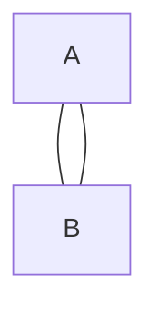
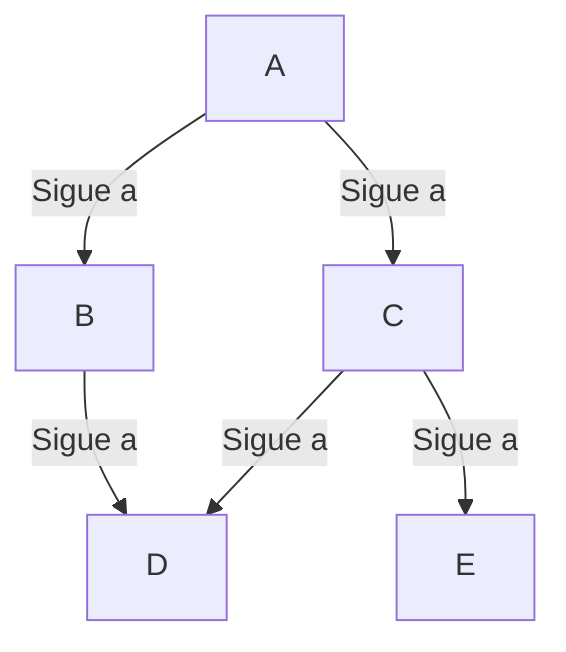

## Grafos

Un grafo es una estructura de datos que representa relaciones entre objetos mediante nodos (vértices) y conexiones (aristas o arcos). Dependiendo de la dirección de las conexiones, los grafos pueden ser no dirigidos o dirigidos.

### 📌 1. Grafo No Dirigido

Las conexiones entre nodos no tienen dirección.

Si existe una arista entre A y B, significa que se puede ir en ambas direcciones (A ↔ B).

**✅ Ejemplo:**

Representación de amistades en redes sociales (si A es amigo de B, entonces B es amigo de A).

**🔹 Usos comunes:**

- Redes sociales (amistades en Facebook).
- Redes de carreteras bidireccionales.
- Conexiones de computadoras en redes locales (LAN).

### 📌 2. Grafo Dirigido (Digrafo)

Las conexiones entre nodos tienen una dirección específica.
Si hay una arista de A a B, significa que se puede ir de A → B, pero no necesariamente de B → A.

Ejemplo: Relaciones de seguidores en Twitter (si A sigue a B, no significa que B siga a A).

**✅ Ejemplo:**

🔹 Usos comunes:

- Redes sociales (seguidores en Twitter, Instagram).
- Modelado de flujos de trabajo (tareas con dependencias).
- Grafos de páginas web (hipervínculos entre sitios).
