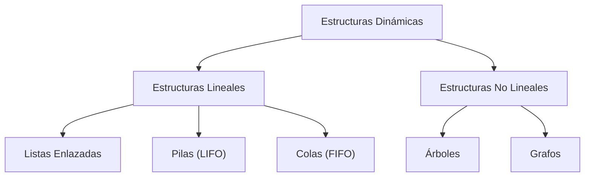
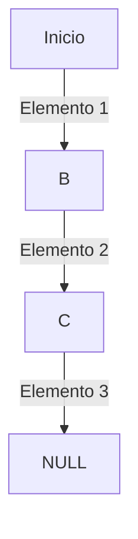
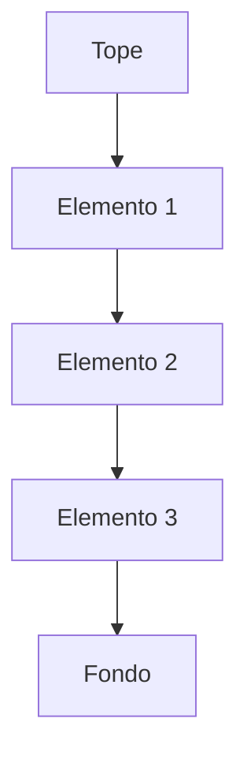
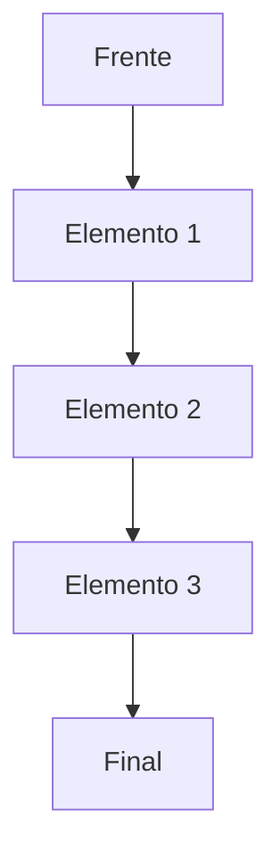
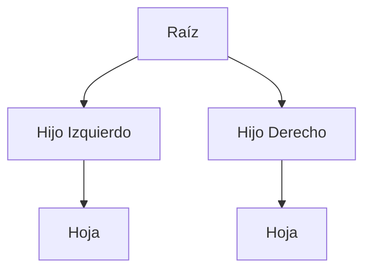

# Tema 12 Organización Lógica de los Datos. Estructuras de Datos Dinámicas

## 1. Introducción
- Importancia de la organización de datos en informática.
- Relación con la eficiencia del procesamiento de información.
- Relevancia en sistemas de análisis de datos y big data.

## 2. Organización Lógica de los Datos
### 2.1. Dato
- Objeto manipulable por un ordenador.
- Tipos:
  - **Básicos**: Enteros, reales, booleanos, caracteres.
  - **Definidos por el programador**: Estructuras personalizadas.

### 2.2. Estructuras de Datos
- Colección de datos organizados para su almacenamiento y manipulación.
- Clasificación según la gestión de memoria:
  - **Estáticas**: Tamaño fijo, definido en tiempo de compilación.
  - **Dinámicas**: Tamaño variable, asignado en tiempo de ejecución.

## 3. Estructuras Dinámicas

- Son estructuras de datos cuyo tamaño puede cambiar en tiempo de ejecución.
- Permiten optimizar el uso de memoria y mejorar la eficiencia en el manejo de datos.



### 3.1 Estructuras Lineales

#### 3.1. Listas Enlazadas

- Son nodos enlazados secuencialmente.
- Cada nodo contiene un valor y una referencia al siguiente nodo.

**Ejemplo en Java:**
```java
class Nodo {
    int valor;
    Nodo siguiente;

    Nodo(int valor) {
        this.valor = valor;
        this.siguiente = null;
    }
}
```

#### 3.1.2. Pilas (LIFO - Last In, First Out)

- Se insertan y eliminan elementos solo por el tope.

**Ejemplo en Java:**
```java
Stack<Integer> pila = new Stack<>();
pila.push(10);
pila.pop();
```

#### 3.1.3. Colas (FIFO - First In, First Out)

- Se insertan elementos al final y se eliminan del frente.

**Ejemplo en Java:**
```java
Queue<Integer> cola = new LinkedList<>();
cola.add(10);
cola.poll();
```

### 3.2 Estructuras No Lineales

#### 3.2.1. Árboles

- Estructura jerárquica con nodos padre e hijos.

**Ejemplo de recorrido en Java:**
```java
void inOrden(Nodo nodo) {
    if (nodo != null) {
        inOrden(nodo.izquierda);
        System.out.println(nodo.valor);
        inOrden(nodo.derecha);
    }
}
```
[Apendice Árboles](arboles_binarios.html).

#### 3.2.2. Grafos

- Representa conexiones entre nodos (vértices) con enlaces (aristas).

**Ejemplo de representación en Java:**
```java
class Grafo {
    Map<Integer, List<Integer>> adjList = new HashMap<>();
}
```

[Apendice Grafos](grafos.html).

## 4. Recursos y Herramientas Educativas
- [SoloLearn](https://www.sololearn.com)
- [VisuAlgo](https://visualgo.net)
- 
## 5. Aplicaciones en Contexto Escolar y Laboral
- **Escuela**: Enseñanza en ciclos formativos de informática.
- **Trabajo**:
  - Desarrollo de software.
  - Optimización del almacenamiento y acceso a datos.

## 6. Conclusión
- Las estructuras dinámicas optimizan la gestión de memoria.
- Son esenciales en la resolución de problemas complejos.
