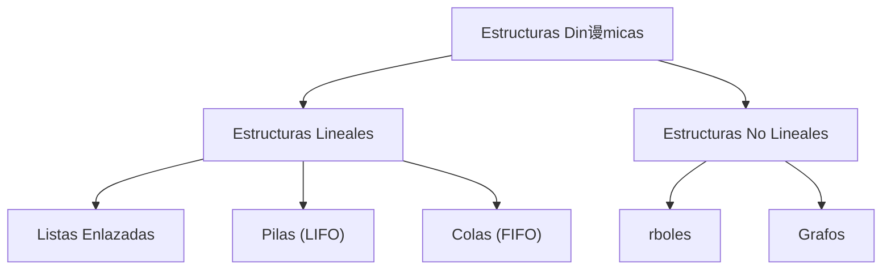
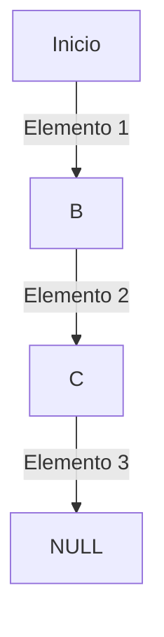
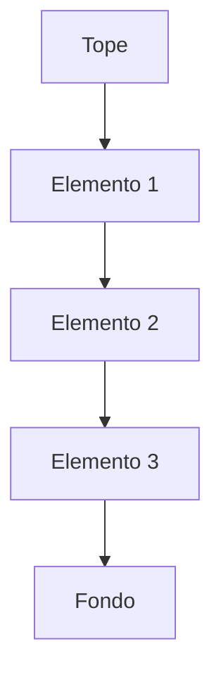
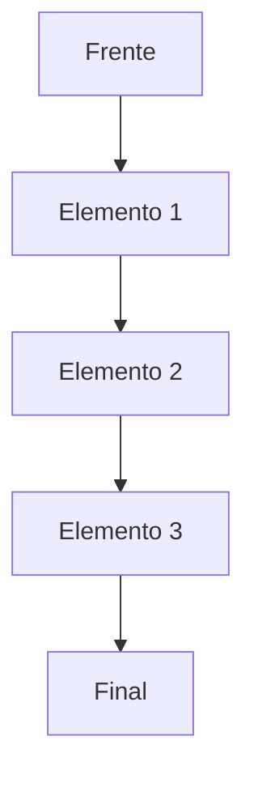
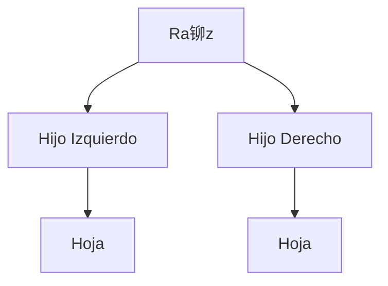
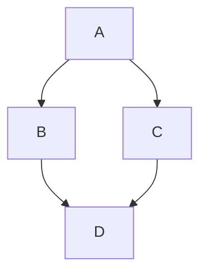

# Tema 12 Organizaci贸n L贸gica de los Datos. Estructuras de Datos Din谩micas

## 1. Introducci贸n
- Importancia de la organizaci贸n de datos en inform谩tica.
- Relaci贸n con la eficiencia del procesamiento de informaci贸n.
- Relevancia en sistemas de an谩lisis de datos y big data.

## 2. Organizaci贸n L贸gica de los Datos
### 2.1. Dato
- Objeto manipulable por un ordenador.
- Tipos:
  - **B谩sicos**: Enteros, reales, booleanos, caracteres.
  - **Definidos por el programador**: Estructuras personalizadas.

### 2.2. Estructuras de Datos
- Colecci贸n de datos organizados para su almacenamiento y manipulaci贸n.
- Clasificaci贸n seg煤n la gesti贸n de memoria:
  - **Est谩ticas**: Tama帽o fijo, definido en tiempo de compilaci贸n.
  - **Din谩micas**: Tama帽o variable, asignado en tiempo de ejecuci贸n.

## 3. Estructuras Din谩micas

- Son estructuras de datos cuyo tama帽o puede cambiar en tiempo de ejecuci贸n.
- Permiten optimizar el uso de memoria y mejorar la eficiencia en el manejo de datos.


```mermaid
graph TD
    A["Estructuras Din谩micas"] --> B["Estructuras Lineales"]
    A --> C["Estructuras No Lineales"]

    B --> B1["Listas Enlazadas"]
    B --> B2["Pilas (LIFO)"]
    B --> B3["Colas (FIFO)"]

    C --> C1["rboles"]
    C --> C2["Grafos"]

```

### 3.1 Estructuras Lineales

#### 3.1. Listas Enlazadas

```mermaid
graph TD
    A[Inicio] -->|Elemento 1| B
    B -->|Elemento 2| C
    C -->|Elemento 3| D[NULL]
```
- Son nodos enlazados secuencialmente.
- Cada nodo contiene un valor y una referencia al siguiente nodo.

**Ejemplo en Java:**
```java
class Nodo {
    int valor;
    Nodo siguiente;

    Nodo(int valor) {
        this.valor = valor;
        this.siguiente = null;
    }
}
```

#### 3.1.2. Pilas (LIFO - Last In, First Out)

```mermaid
graph TD
    A[Tope] --> B[Elemento 1]
    B --> C[Elemento 2]
    C --> D[Elemento 3]
    D --> E[Fondo]
```
- Se insertan y eliminan elementos solo por el tope.

**Ejemplo en Java:**
```java
Stack<Integer> pila = new Stack<>();
pila.push(10);
pila.pop();
```

#### 3.1.3. Colas (FIFO - First In, First Out)

```mermaid
graph TD
    A[Frente] --> B[Elemento 1]
    B --> C[Elemento 2]
    C --> D[Elemento 3]
    D --> E[Final]
```
- Se insertan elementos al final y se eliminan del frente.

**Ejemplo en Java:**
```java
Queue<Integer> cola = new LinkedList<>();
cola.add(10);
cola.poll();
```

### 3.2 Estructuras No Lineales

#### 3.2.1. rboles

```mermaid
graph TD
    A[Ra铆z] --> B[Hijo Izquierdo]
    A --> C[Hijo Derecho]
    B --> D[Hoja]
    C --> E[Hoja]
```
- Estructura jer谩rquica con nodos padre e hijos.

**Ejemplo de recorrido en Java:**
```java
void inOrden(Nodo nodo) {
    if (nodo != null) {
        inOrden(nodo.izquierda);
        System.out.println(nodo.valor);
        inOrden(nodo.derecha);
    }
}
```
[Apendice rboles](arboles_binarios.html).

#### 3.2.2. Grafos

```mermaid
graph TD
    A[A] --> B[B]
    A --> C[C]
    B --> D[D]
    C --> D
```
- Representa conexiones entre nodos (v茅rtices) con enlaces (aristas).

**Ejemplo de representaci贸n en Java:**
```java
class Grafo {
    Map<Integer, List<Integer>> adjList = new HashMap<>();
}
```

[Apendice Grafos](grafos.html).

## 4. Recursos y Herramientas Educativas
- [SoloLearn](https://www.sololearn.com)
- [VisuAlgo](https://visualgo.net)
  
## 5. Aplicaciones en Contexto Escolar y Laboral
- **Escuela**: Ense帽anza en ciclos formativos de inform谩tica.
- **Trabajo**:
  - Desarrollo de software.
  - Optimizaci贸n del almacenamiento y acceso a datos.

## 6. Conclusi贸n
- Las estructuras din谩micas optimizan la gesti贸n de memoria.
- Son esenciales en la resoluci贸n de problemas complejos.
