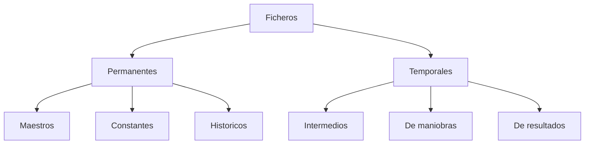
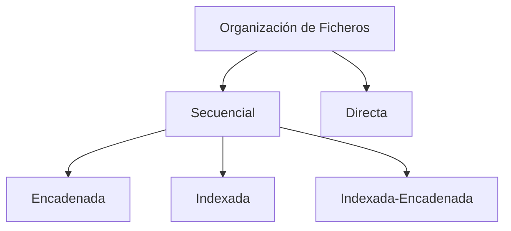

# Tema 13 - Ficheros. Tipos. Características. Organizaciones

## 1. Introducción
- Evolución del almacenamiento: De sistemas manuales a bases de datos y big data.
- Importancia en informática: Gestión eficiente de datos en sistemas y aplicaciones.

## 2. Ficheros
**2.1. Definición**: Conjunto de datos estructurados en registros y campos.

**2.2. Operaciones**: Creación, modificación, eliminación, inserción y consulta de registros.

## 3. Tipos de ficheros

**3.1. Ficheros permanentes**: Almacenan datos relevantes para la aplicación.
   - **Ficheros Maestros**: Contienen datos esenciales y actualizables.
   - **Ficheros Constantes**: Datos fijos usados para consultas.
   - **Ficheros Históricos**: Datos antiguos usados para reconstrucción de situaciones.

**3.2. Ficheros temporales**: Datos utilizados temporalmente por la aplicación.
   - **Intermedios**: Pasan datos entre aplicaciones.
   - **De maniobras**: Almacenan datos no retenidos en memoria principal.
   - **De resultados**: Generados para dispositivos de salida.

## 4. Características
- **Datos**: Información almacenada para extraer significado.
- **Campos**: Unidad mínima de información dentro de un registro.
- **Registros**: Conjunto de campos relacionados.
- **Fichero**: Conjunto de registros con propósito específico.
- **Base de datos**: Conjunto de ficheros accesibles por programas.

## 5. Organización de ficheros

**5.1. Secuencial**: Los registros se almacenan en orden consecutivo.

**5.2. Directa**: Los registros se acceden por su dirección, no por orden físico.

**5.3. Variantes de la organización secuencial**:
   - **Encadenada**: Cada registro apunta al siguiente.
   - **Indexada**: Se utilizan índices para mejorar el acceso.
   - **Indexada-encadenada**: Combinación de punteros e índices.

## 6. Parámetros de utilización
- **Capacidad**: Espacio ocupado por los registros en memoria.
- **Actividad**: Frecuencia de consultas y modificaciones.
- **Volatilidad**: Tasa de inserciones y eliminaciones.
- **Crecimiento**: Expansión del fichero con el tiempo.

## 7. Aplicaciones
- **Contexto escolar**: Uso en formación profesional y enseñanza de bases de datos.
- **Contexto laboral**: Gestión eficiente de información en investigación y docencia.

[Tema 13 Mapa Visual](tema13map.html).

