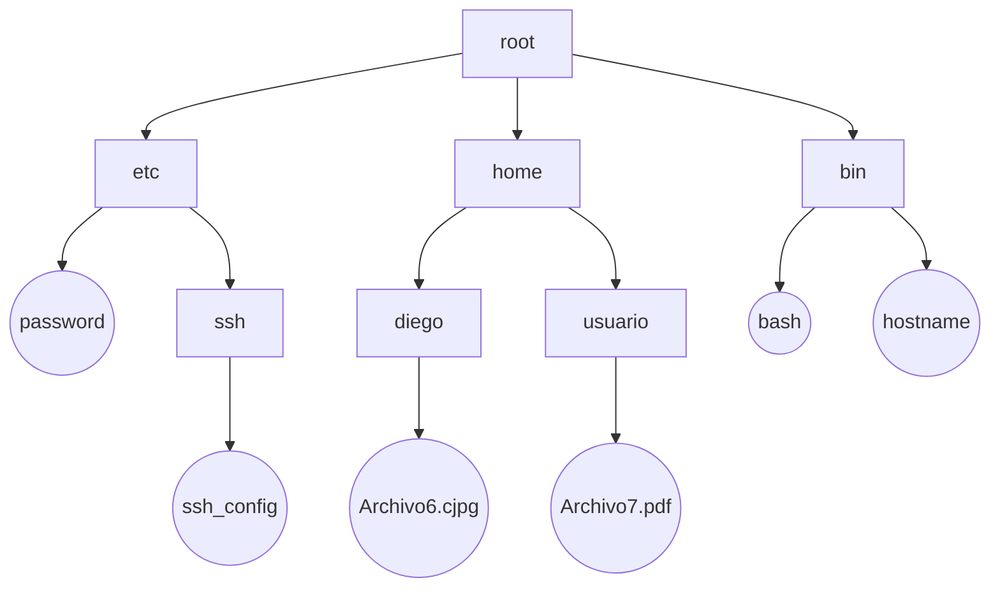

# Tema 19: Gestión de Archivos y Dispositivos en Sistemas Operativos

## 1. Introducción
- Relación con el temario oficial de informática
- Importancia del sistema operativo en la gestión de archivos y dispositivos
- Autores clave: Tanenbaum, Stallings, Prieto
- Aplicaciones en formación profesional (DAW, DAM, ASIR, SMR)

## 2. Archivos y Directorios
### a) Archivos
- Definición: Abstracción para almacenar información en disco
- Atributos:
  - Nombre
  - Fecha y hora de creación/modificación
  - Permisos
  - Propietario
  - Ubicación
- Datos: Contenido del archivo

### b) Directorios
- Organización jerárquica de archivos
- Estructura arbórea (archivos en hojas, subdirectorios en nodos intermedios)
- Métodos de rutas:
  - Absolutas: `/home/usuario/documento.txt`
  - Relativas: `documento.txt`

## 3. Gestión de Archivos y Dispositivos
- Implementación de sistemas de archivos:
  - FAT, NTFS, HFS, APFS, ext3, ext4
- Objetivos clave:
  - Optimización del rendimiento
  - Facilidad de actualización
  - Economía de almacenamiento
  - Seguridad y permisos
  - Control de concurrencia
- La gestión y administración de archivos vista desde dos puntos de vista:
  - Lógico: El archivo es una sucesión de registros lógicos
  - Físico: En relación al soporte fisico de almacenamiento.

### 3.1. Asignación de Espacio en Disco
- Métodos:
  - Lista de enlaces (FAT)
  - I-nodos (UNIX)
  - Árboles B+ (Bases de datos, sistemas modernos)

### 3.2. Gestión del Espacio Libre
- Mapa de bits: Uso eficiente de memoria
- Lista enlazada de bloques libres: Ahorro de espacio cuando el disco está lleno

### 3.3. Operaciones del Sistema de Archivos
- Crear
- Borrar
- Abrir
- Cerrar
- Leer
- Escribir
- Renombrar

### 3.4. Métodos de Acceso
- **Secuencial**: Lento, útil para cintas
- **Directo**: Rápido, utilizado en discos duros
- **Directo indexado**: Acceso optimizado para grandes volúmenes

## 4. Algoritmos de Planificación de Discos
### Ejemplo de peticiones:
- **FCFS** (First Come First Served)
- **SSTF** (Shortest Seek Time First)
- **SCAN** (recorrido en un sentido hasta el extremo, luego cambia)
- **C-SCAN** (igual que SCAN, pero sin atender solicitudes en el retorno)
- **LOOK** (como SCAN, pero sin llegar al extremo)

## 5. SSD (Solid State Drive)
- Diferencias con HDD:
  - Sin partes mecánicas
  - Acceso más rápido y menor latencia
  - Rendimiento de lectura y escritura asimétrico
- No requiere algoritmos de planificación de discos tradicionales

## 6. Aplicación al Contexto Escolar y Laboral
- **Escolar**: Formación en administración de sistemas y desarrollo de software
- **Laboral**: Mantenimiento y optimización de infraestructuras tecnológicas

## 7. Conclusión
- Importancia del sistema de archivos para la organización y acceso eficiente a la información
- Gestión de archivos y dispositivos como base fundamental en informática

## 8. Bibliografía
- Tanenbaum, Stallings, Silberschatz, Prieto
- Recursos en línea como Universidad de Granada

[Tema 19 Mapa Visual](tema19map.html).

