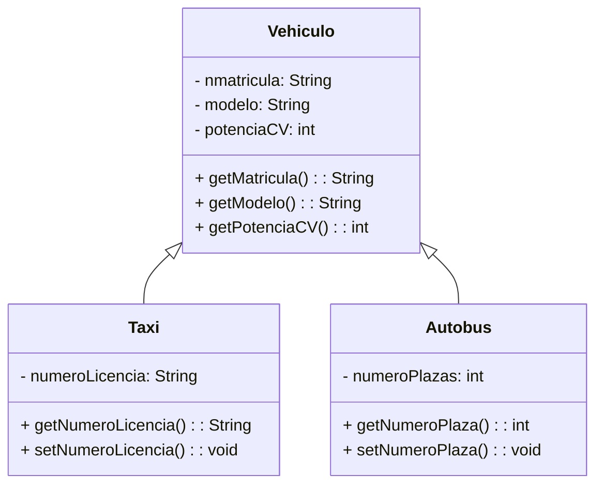

# Tema 27.Programación Orientada a Objetos. Objetos. Clases. Herencia. Polimorfismo

## 1. Introducción
- Bloque tematico "Algoritmos y Programación"
- Autores Prieto, Cox y Booch terminos como Lenguaje de programación y POO
- Importancia en el desarrollo tecnológico.
- Uso en ciclos formativos y desarrollo de software. DAM-DAW y CEDVyRV 

## 2. Conceptos Previos
- Algoritmos, lenguaje de programación
- Evolución de paradigmas: secuencial, procedimental, orientado a objetos.
- Lenguajes asociados: COBOL, C, Java, C++.

## 3. Programación Orientada a Objetos
Representación mas directa del mundo real en el código. Paradigma de objetos para modelar. Principios de los 90.
- **Definición**: Uso de objetos y clases en programación.
- **Técnicas**: Herencia, cohesión, abstracción, polimorfismo, acoplamiento, encapsulamiento.

La POO utiliza objetos que son instancias de clase, las clases se relacionan por medio de herencia.

### 3.1 Ventajas
- Mejor comprensión, modularidad, mantenimiento, seguridad, reutilización de código.

### 3.2 Características
- Abstracción, encapsulación, herencia, polimorfismo.

## 4. Objetos
Entidades con estado y comportamiento.
- **Estado**: Determinado por atributos.
- **Comportamiento**: Determinado por métodos.

## 5. Clases
Plantilla abstracta para crear objetos. Se pueden crear multiples objetos de una misma clase
- **Componentes**: Atributos y métodos.
Cuando se crea objeto a partir de una clase, es una instancia de esa clase.

## 6. Abstracción
- **Definición**: Simplificación de un objeto, enfocándose en características esenciales, evitando lo no esencial.

## 7. Encapsulación
- **Definición**: Ocultación de la implementación de un objeto.
- **Componentes**: Interfaz e implementación.

## 8. Herencia
- **Definición**: Creación de nuevas clases a partir de clases existentes.
- **Tipos**: Herencia simple (Java) y múltiple.(C++)
- **Ventajas**: Reutilización de código, consistencia, ocultación de información.

## 9. Polimorfismo
- **Definición**: Capacidad de métodos para actuar de manera diferente según el objeto.
- **Tipos**: Sobrecarga, herencia de clases.

## 10. Lenguajes
- **Puros**: Simula, SmallTalk, Eiffel, Java.
- **Mixtos**: C++, C#, Python, PHP.

## 11. Ranking de Lenguajes
- **Más utilizados**: Java, Python, C++, etc.

## 12. Recursos y Herramientas de Interés
- **Herramientas**: IDEs como Eclipse, NetBeans o IntelliJ IDEA
- **Plataformas educativas**: Sololearn.

## 13. Aplicación al Contexto Escolar y Laboral
- **Contexto escolar**: Uso de Java, Python, C++ en formación.
- **Contexto laboral**: Desarrollo de software, ciencia de datos, IA.

## 14. Conclusión
- **Resumen**: La POO permite una representación lógica del mundo real y facilita el desarrollo de software.

## 15. Bibliografía
Referencias a autores y fuentes relevantes en POO.
- Joyanes, L. (2020). Fundamentos de programación.
- Prieto, A. (2006). Introducción a la informática.
- Cox, Brad J. (1993) Programacion orientada a objetos. Ed Addison
- Hernández M. (2022). Estructuras de datos. Editoria Ra-Ma

[Mapa Visual](tema27map.html){: .btn .btn-blue }
[Generar PDF](tema27.pdf){: .btn .btn-purple }