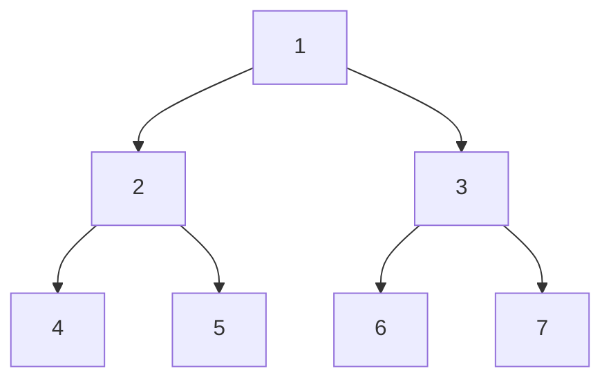
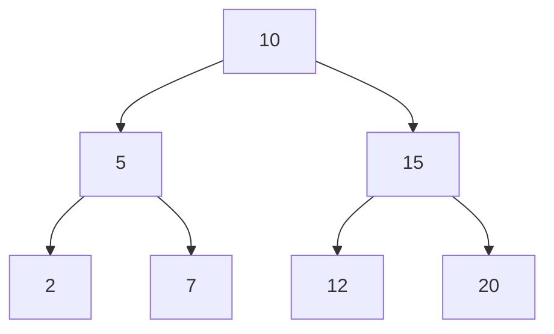
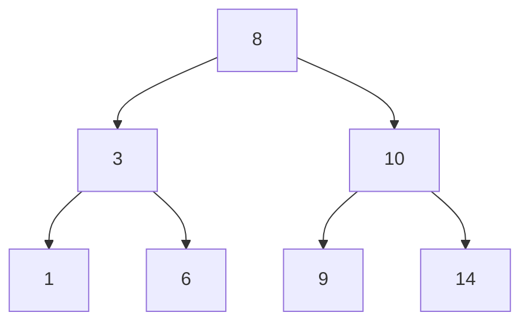
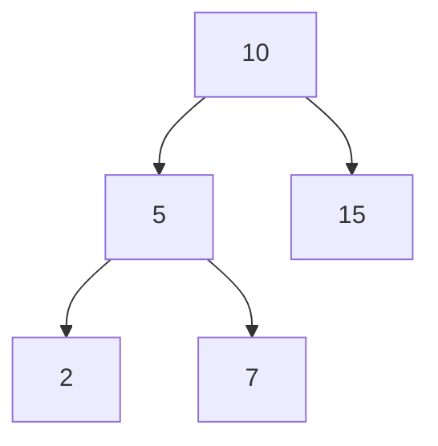
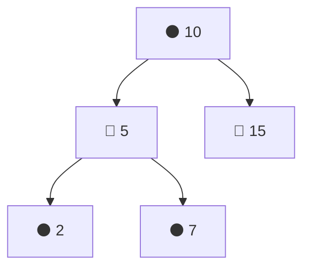

## Tipos de Árboles Binarios

### 1️⃣ Árbol Binario Completo

**📌 Definición:**

Todos los niveles del árbol están completamente llenos, excepto quizás el último nivel.
En el último nivel, los nodos están lo más a la izquierda posible.

**✅ Ejemplo:**

### 2️⃣ Árbol Binario Perfecto

**📌 Definición:**

Todos los nodos internos tienen exactamente dos hijos.
Todos los nodos hoja están en el mismo nivel.

**✅ Ejemplo:**

**📌 Características:**

Un árbol perfecto de altura `h` tiene `2^(h+1) - 1` nodos.

### 3️⃣ Árbol Binario Balanceado
**📌 Definición:**

Un árbol está balanceado si la diferencia de altura entre los subárboles izquierdo y derecho de cualquier nodo no es mayor que 1.

**✅ Ejemplo:**

**📌 Usos:**

- Mantiene tiempos eficientes de búsqueda, inserción y eliminación en `O(log n)`.

### 4️⃣ Árbol Binario de Búsqueda (BST - Binary Search Tree)
**📌 Definición:**

**Regla fundamental:**
El subárbol izquierdo solo contiene nodos con valores menores que el nodo raíz.
El subárbol derecho solo contiene nodos con valores mayores que la raíz.

**✅ Ejemplo:**

**📌 Usos:**

- Permite búsquedas rápidas `O(log n)` en promedio.
- Base de muchas estructuras de datos avanzadas.

### 5️⃣ Árbol AVL (Árbol Binario de Búsqueda Balanceado)
**📌 Definición:**

Variante del BST donde la diferencia de altura entre los subárboles izquierdo y derecho de cualquier nodo es como máximo 1.
Después de cada inserción o eliminación, se aplican rotaciones para mantener el equilibrio.

**✅ Ejemplo de Rotación Simple:**

**📌 Usos:**

- Operaciones de búsqueda, inserción y eliminación en `O(log n)`.

### 6️⃣ Árbol Rojo-Negro
**📌 Definición:**

Es un árbol binario de búsqueda balanceado con las siguientes reglas:
- Cada nodo es rojo 🔴 o negro ⚫.
- La raíz siempre es negra.
- Si un nodo es rojo, sus hijos deben ser negros (no puede haber dos nodos rojos consecutivos).
- Todo camino desde la raíz hasta una hoja debe contener el mismo número de nodos negros.
- 
**✅ Ejemplo:**

**📌 Usos:**

- Se usa en sistemas como el árbol de directorios de Linux y bases de datos.
- Todas las operaciones tienen un tiempo garantizado de O(log n).

**🚀 Conclusión**

Cada tipo de árbol binario tiene un propósito específico:
- ✅ **Completo** → Ideal para almacenamiento de datos.
- ✅ **Perfecto** → Ideal para operaciones de búsqueda y eliminación.
- ✅ **BST** → Ideal para búsquedas rápidas.
- ✅ **AVL** → Mantiene balance perfecto con costo en reequilibrio.
- ✅ **Rojo-Negro** → Uso en sistemas críticos donde el rendimiento es clave.