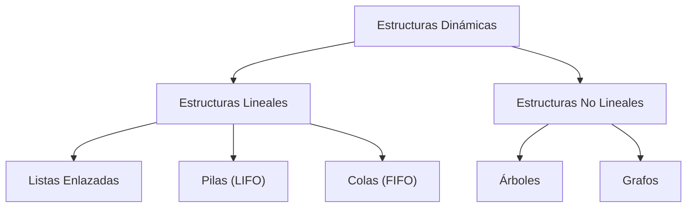
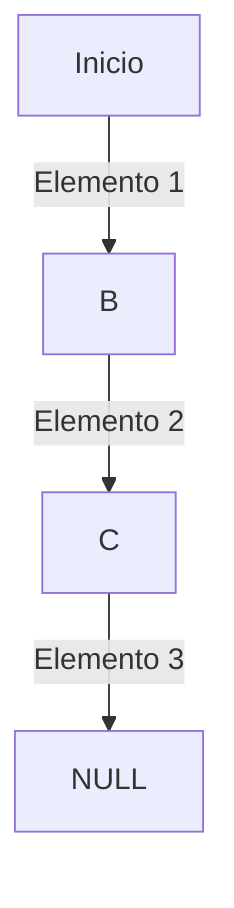
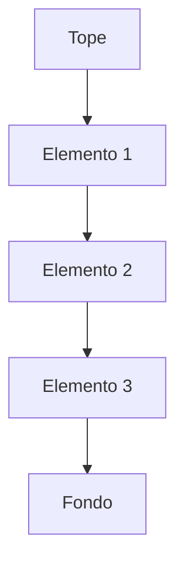
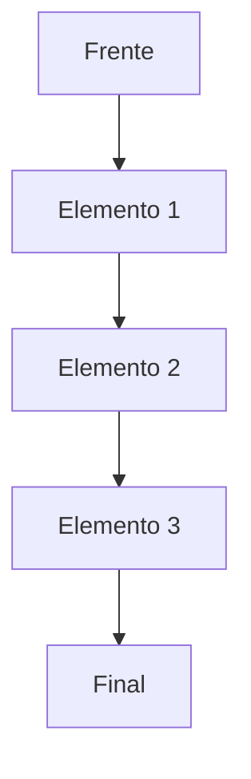
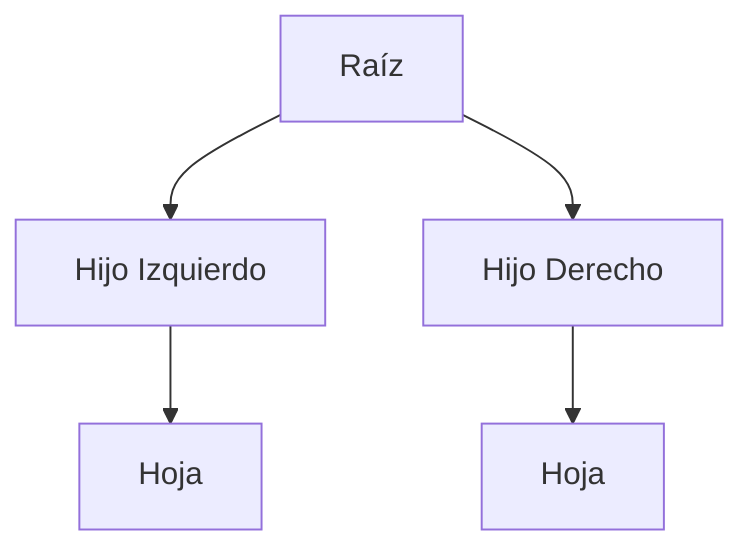
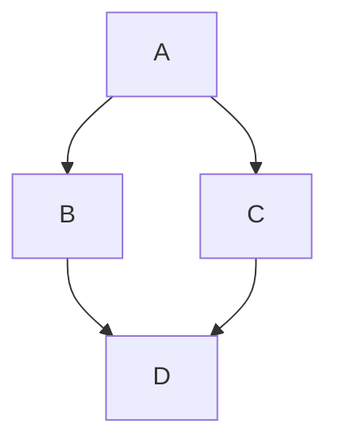
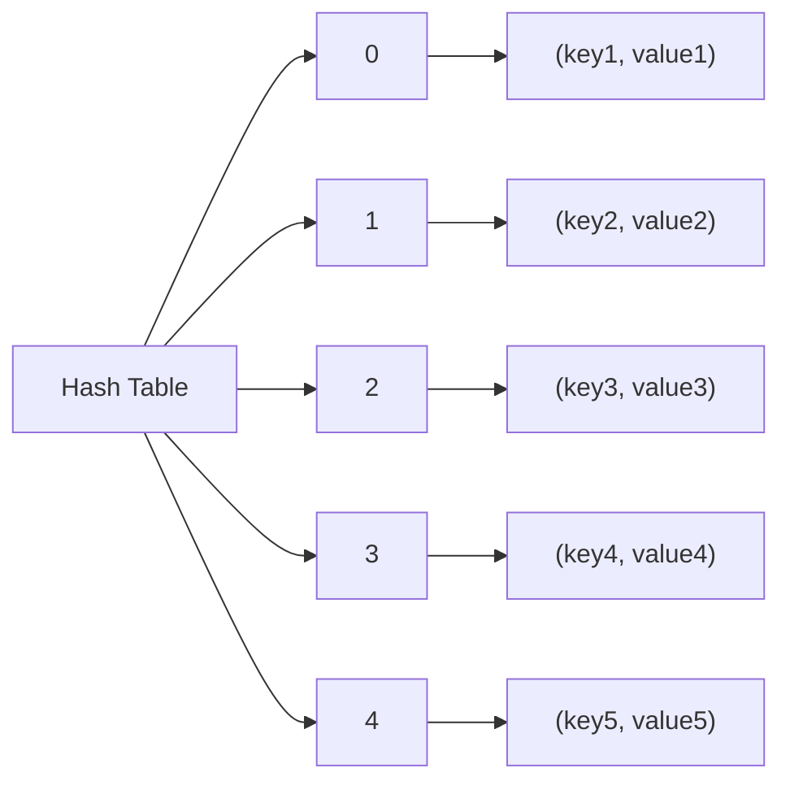
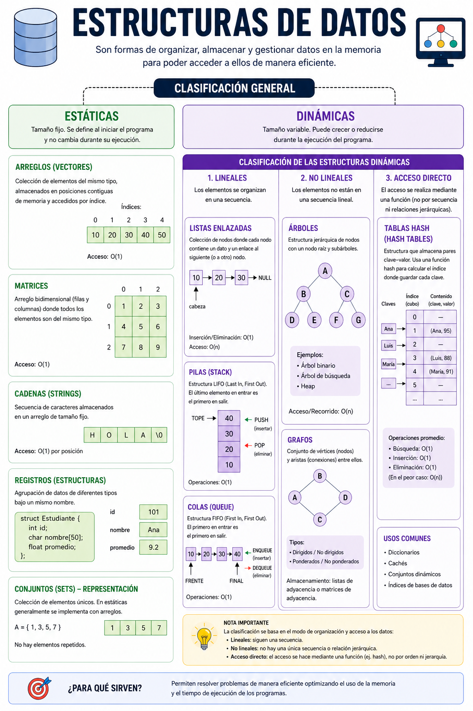

# Tema 12 Organización Lógica de los Datos. Estructuras de Datos Dinámicas

## 1. Introducción
- Importancia de la organización de datos en informática.
- Relación con la eficiencia del procesamiento de información.
- Relevancia en sistemas de análisis de datos y big data.

## 2. Organización Lógica de los Datos
### 2.1. Datos y variables

**Datos:** 
Son representaciones simbólicas de hechos, valores o información que pueden ser procesados por una computadora. Por sí solos no tienen significado hasta que se interpretan.

Características de los datos:
- Pueden ser numéricos, textuales, lógicos, etc.
- Son la base del procesamiento.
- Se almacenan y manipulan mediante estructuras de datos.

**Variables:**
Son espacios de memoria que se utilizan para almacenar datos durante la ejecución de un programa. Su valor puede cambiar a lo largo del tiempo.

Características de las variables:
- Tienen un nombre identificador.
- Almacenan un tipo de dato específico (entero, real, cadena, etc.).
- Su valor puede modificarse durante la ejecución.
- Ocupan un espacio en memoria.
- Permiten realizar cálculos 
- Facilitan la toma de decisiones.

### 2.2. Tipos de datos

Los tipos de datos son clasificaciones que indican qué tipo de valor puede almacenar una variable y qué operaciones se pueden realizar con ella.

Se clasifican en básicos, simples o primitivos y compuestos:

**Tipos de datos simples**.  
Son aquellos que almacenan un solo valor a la vez.   
Ejemplos:
- Numéricos: Entero (10) o Real (3.5)
- Carácter (char): 'A'
- Booleano (bool): true

Características:
- Representan datos básicos.
- Ocupan una sola posición de memoria.
- Son fáciles de manipular.

**Tipos de datos compuestos**.   
Son aquellos que pueden almacenar varios valores o estructuras de datos.   
Ejemplos:
- Arreglos (arrays)
- Listas
- Registros (struct)
- Cadenas de texto (strings, en muchos lenguajes)

Características:
- Agrupan varios datos simples.
- Permiten organizar información más compleja.
- Son más flexibles y potentes para estructuras grandes.

Dentro de los compuestos existen los llamados tipos definidos por el programador, que permiten la creación de tipos de datos que se adaptan a las necesidades de sus aplicaciones como las clases.

### 2.3. Tipado de datos

El tipado de datos se refiere a la forma en que un lenguaje de programación define, controla y maneja los tipos de datos que pueden usar las variables.

Clasificación del tipado de datos.  
**1. Tipado estático.**  
El tipo de dato de una variable se define en tiempo de compilación y no puede cambiar.   
Ejemplos de lenguajes: Java, C, C++
Características:
   - Requiere declarar el tipo de variable.
   - Detecta errores antes de ejecutar el programa.
   - Más control y eficiencia.    
  
**2. Tipado dinámico.**  
El tipo de dato se define en tiempo de ejecución y puede cambiar.   
Ejemplos de lenguajes: Python, JavaScript, PHP.  
Características:
   - No siempre es necesario declarar tipos.
   - Más flexible.
Los errores de tipo aparecen en ejecución.

**3. Tipado fuerte.**  
No permite mezclar tipos de datos sin conversión explícita.
Ejemplos: Python, Java.  
Características:
   - Estricto con las operaciones entre tipos.
   - Evita errores inesperados.
  
**4. Tipado débil.**  
Permite conversiones automáticas entre tipos de datos.   
Ejemplos: JavaScript, PHP.  
Características:
   - Más flexible, pero menos seguro.
   - Puede causar resultados inesperados.


El tipado de datos clasifica los lenguajes según cómo manejan los tipos de variables: pueden ser estáticos o dinámicos, y fuertes o débiles, dependiendo del nivel de control y flexibilidad que ofrecen.

Ademas, dependiendo si se declaran directamente o se infieren en tiempo de ejecución:

**Tipado explícito**
El programador declara directamente el tipo de dato de la variable.   
Ejemplo (Java):
```java
int numero = 10;
String nombre = "Ana";
````
Características:
- El tipo se especifica manualmente.
- Mayor control sobre el programa.
- Reduce ambigüedades.
- Más común en lenguajes de tipado estático.

**Inferencia de tipos**
El lenguaje deduce automáticamente el tipo de dato a partir del valor asignado.   
Ejemplos:
```java
// var en Java
var numero = 10;   // el compilador infiere que es int
```
```python
# Python
nombre = "Ana"     # Python infiere que es string
```
Características:
- No es necesario declarar el tipo.
- Código más corto y legible.
- Depende del valor asignado.
- Puede ocurrir en lenguajes estáticamente tipados con inferencia o dinámicos.

### 2.4. Estructuras de Datos
- Colección de datos organizados para su almacenamiento y manipulación.
- Clasificación según la gestión de memoria:
  - **Estáticas**: Tamaño fijo, definido en tiempo de compilación.
  - **Dinámicas**: Tamaño variable, asignado en tiempo de ejecución.

## 3. Estructuras Dinámicas

- Son estructuras de datos cuyo tamaño puede cambiar en tiempo de ejecución.
- Permiten optimizar el uso de memoria y mejorar la eficiencia en el manejo de datos.



### 3.1 Estructuras Lineales

#### 3.1. Listas Enlazadas

- Son nodos enlazados secuencialmente.
- Cada nodo contiene un valor y una referencia al siguiente nodo.

**Ejemplo en Java:**
```java
class Nodo {
    int valor;
    Nodo siguiente;

    Nodo(int valor) {
        this.valor = valor;
        this.siguiente = null;
    }
}
```

#### 3.1.2. Pilas (LIFO - Last In, First Out)

- Se insertan y eliminan elementos solo por el tope.

**Ejemplo en Java:**
```java
Stack<Integer> pila = new Stack<>();
pila.push(10);
pila.pop();
```

#### 3.1.3. Colas (FIFO - First In, First Out)

- Se insertan elementos al final y se eliminan del frente.

**Ejemplo en Java:**
```java
Queue<Integer> cola = new LinkedList<>();
cola.add(10);
cola.poll();
```

### 3.2 Estructuras No Lineales

#### 3.2.1. Árboles

- Estructura jerárquica con nodos padre e hijos.

**Ejemplo de recorrido en Java:**
```java
void inOrden(Nodo nodo) {
    if (nodo != null) {
        inOrden(nodo.izquierda);
        System.out.println(nodo.valor);
        inOrden(nodo.derecha);
    }
}
```
🚀[Apendice Árboles](arboles_binarios.md).

#### 3.2.2. Grafos

- Representa conexiones entre nodos (vértices) con enlaces (aristas).

**Ejemplo de representación en Java:**
```java
class Grafo {
    Map<Integer, List<Integer>> adjList = new HashMap<>();
}
```

🚀[Apendice Grafos](grafos.md).

#### 3.2.3 Tablas hash

Una tabla hash (o tabla de dispersión) es una estructura de datos dinámica no lineal que organiza la información en pares de clave-valor, permitiendo encontrar, insertar y eliminar datos de forma extremadamente rápida. Su gran ventaja es que, en promedio, estas operaciones toman un tiempo constante, lo que significa que la velocidad no depende de cuántos datos haya almacenados

El secreto de su eficiencia reside en tres componentes principales:
- Clave (Key): Es el identificador único usado para buscar un dato (por ejemplo, un nombre en una agenda).
- Función Hash: Es un algoritmo matemático que toma la clave y la transforma en un número entero. Este número sirve como el índice exacto de un arreglo donde se guardará el valor.
- Cubo o Ranura (Bucket/Slot): Es la posición física en la memoria (dentro de un array) donde se almacena el valor asociado a la clave. 



**Gestión de Colisiones**

A veces, dos claves diferentes pueden generar el mismo índice tras pasar por la función hash; esto se conoce como colisión. Existen dos métodos comunes para resolverlas:
- Encadenamiento (Chaining): Cada posición de la tabla contiene una lista enlazada con todos los elementos que tienen el mismo índice.
- Direccionamiento Abierto: Si una posición está ocupada, se busca la siguiente ranura libre mediante una secuencia de prueba.
  
**Ejemplos de uso común**

Estas estructuras son fundamentales en:
- Agendas telefónicas: Donde el nombre es la clave y el número es el valor.
- Sistemas de caché: Para recuperar datos web guardados rápidamente.
- Bases de datos: Para indexar información y acelerar las consultas.
- Diccionarios en programación: Como los tipos dict en Python o HashMap en Java.

Dependiendo de su implementación, esta estructura de datos puede ser estática o dinámica. Aunque su base interna suele ser un array (estático), la mayoría de los lenguajes de programación y bases de datos permiten que la tabla "crezca" o "se encoja" según sea necesario

**Hashing Estático:**
   
En este enfoque, el tamaño de la tabla (el número de "buckets" o cubos) se fija al principio y no cambia.   
- Limitación: Si los datos superan el tamaño inicial, ocurren muchas colisiones y el rendimiento cae drásticamente.   
- Uso: Se utiliza cuando se conoce de antemano el número exacto de elementos y estos no van a variar (como en un conjunto de palabras clave de un lenguaje de programación).

**Hashing Dinámico (Extendible)**

Es el modelo que usan los lenguajes modernos (como los diccionarios de Python o los HashMap de Java).   
- Redimensionamiento: Cuando la tabla se llena demasiado (supera un "factor de carga"), la estructura automáticamente crea un array más grande y reubica los elementos (rehashing).
- Ventaja: Permite que la estructura se adapte al volumen de información en tiempo de ejecución, optimizando el uso de la memoria y manteniendo la velocidad


## 4. Conclusión
Las estructuras dinámicas son fundamentales en programación porque permiten gestionar datos de manera flexible, adaptándose en tiempo de ejecución al crecimiento o reducción de la información, a diferencia de las estructuras estáticas.

Son especialmente útiles cuando no se conoce de antemano la cantidad de datos que se van a manejar, como en listas de elementos, colas, pilas o árboles en aplicaciones reales (gestión de procesos, bases de datos, grafos, etc.). 

Su principal ventaja es que optimizan el uso de memoria, ya que se asigna y libera espacio según sea necesario, evitando desperdicios o limitaciones fijas.

En conclusión, se utilizan porque aportan eficiencia, escalabilidad y flexibilidad en la gestión de datos, lo que las hace imprescindibles en sistemas donde los requisitos cambian dinámicamente.


