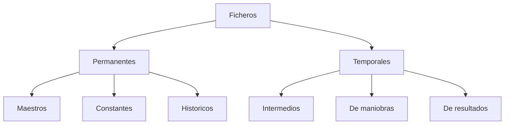
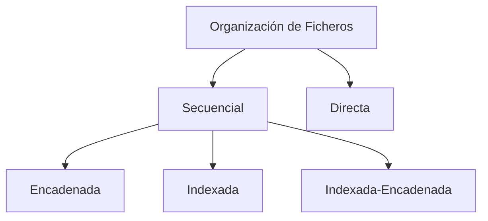

# Tema 13 - Ficheros. Tipos. Características. Organizaciones

## 1. Introducción
- Evolución del almacenamiento: De sistemas manuales a bases de datos y big data.
- Necesidad de informatizar. Datos estructurados, mayor velocidad de acceso y consulta.
- Importancia en informática: Gestión eficiente de datos en sistemas y aplicaciones.
- Datos estructurados (Relacionales) y no estructurados (NoSQL)
- Módulos de Bases de datos (DAM y DAW)

## 2. Ficheros
**2.1. Definición**: 
- Almacenamiento secundario para mantener la información de forma permanente
- La información contenida en los dispositivos de almacenamiento se estructura en unidades denominadas ficheros
- Ficheros conjuntos de datos estructurados en registros y campos.

**2.2. Operaciones**: 
- La vida del fichero comienza con la creación y termina al eliminarlo
- Las operaciones se realizan a nivel de registro por programas específicos:
  - Creación, modificación, eliminación, inserción y consulta de registros.

## 3. Tipos de ficheros

**3.1. Según su duracíon en el sistema**

**Ficheros permanentes**: 

Se almacenn de forma duradera en el sistema.
- Se conservan a largo plazo
- Almacenan datos relevantes para la aplicación.
- No se eliminan automaticamente
- Tres tipos:
   - **Ficheros Maestros**: Contienen datos esenciales y actualizables.
   - **Ficheros Constantes**: Datos fijos usados para consultas.
   - **Ficheros Históricos**: Datos antiguos usados para reconstrucción de situaciones.

**Ficheros temporales**: 

Su exsitencia en el sistema es limitada
- Datos utilizados temporalmente por la aplicación.
- Se eliminan automaticamente o manualmente después de usar
- Su conservación no es necesaria.
- Tres tipos
   - **Intermedios**: Pasan datos entre aplicaciones.
   - **De maniobras**: Almacenan datos no retenidos en memoria principal.
   - **De resultados**: Generados para dispositivos de salida.

**3.2. Según su contenido**

Esta clasificación atiende a la forma en que los ficheros almacenan y representan la información. 

**Ficheros de texto**

Almacenan los datos en formato legible para los humanos.   
Ejemplo: `.txt, .csv, .json, .xml, .cpp.`
- Se pueden editar con un editor de textos (nano, vi)
- Usan caracteres ASCII o Unicode
- Son fáciles de modificar

**Ficheros binarios**

Almacenan los datos en formato no legible (binario o lenguaje máquina).  
Ejemplos: `.exe, .dat, .pdf, .bin, .mp3`
- Son más eficientes
- Solo se pueden abrir por programas específicos
- Permiten manejar datos complejos: audio, imágenes, video, documentos, etc.

## 4. Características

Las características de los ficheros definen cómo se almacenan, organizan y gestionan dentro de un sistema.   
Principales características:
- Nombre: identificador del fichero dentro del sistema.
- Extensión: indica el tipo de fichero (`.txt, .jpg, .exe`).
- Tamaño: cantidad de espacio que ocupa en memoria.
- Ubicación (ruta): lugar donde está almacenado.
- Formato: estructura interna (texto o binario).
- Permisos: controlan quién puede leer, escribir o ejecutar el fichero.
- Fecha y hora: creación, modificación y último acceso.
- Propietario: usuario o sistema que lo creó o posee.
- Organización: forma en que se estructuran los datos (secuencial, indexada, etc.).

## 5. Organización de ficheros

La organización de ficheros se refiere a la forma en que los datos se estructuran y almacenan dentro de un fichero para facilitar su acceso y manejo.

**5.1. Secuencial**: 

Los registros se almacenan en orden consecutivo. 
Características:
- Acceso en orden (de principio a fin).
- Simple de implementar.
- Poco eficiente para búsquedas específicas.

**5.2. Directa**: 

Los registros se acceden por su dirección, no por orden físico.
Permite acceder a cualquier dato sin recorrer todo el fichero.   
Características:
- Acceso rápido a posiciones específicas.
- Usa direcciones o posiciones (índices).
- Más compleja de gestionar.

**5.3 Indexada**

Utiliza una estructura adicional (índice) para localizar los datos.   
Características:
- Acceso rápido mediante claves.
- Combina ventajas del acceso secuencial y directo.
- Requiere espacio extra para el índice.

La organización de ficheros determina cómo se almacenan y acceden los datos: secuencial (simple), directa (rápida) o indexada (más eficiente y estructurada).

[Tema 13 Mapa Visual](/oposdocs/mapasweb/tema13map.html).

