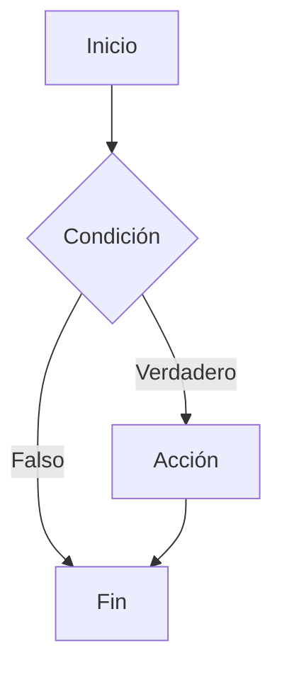
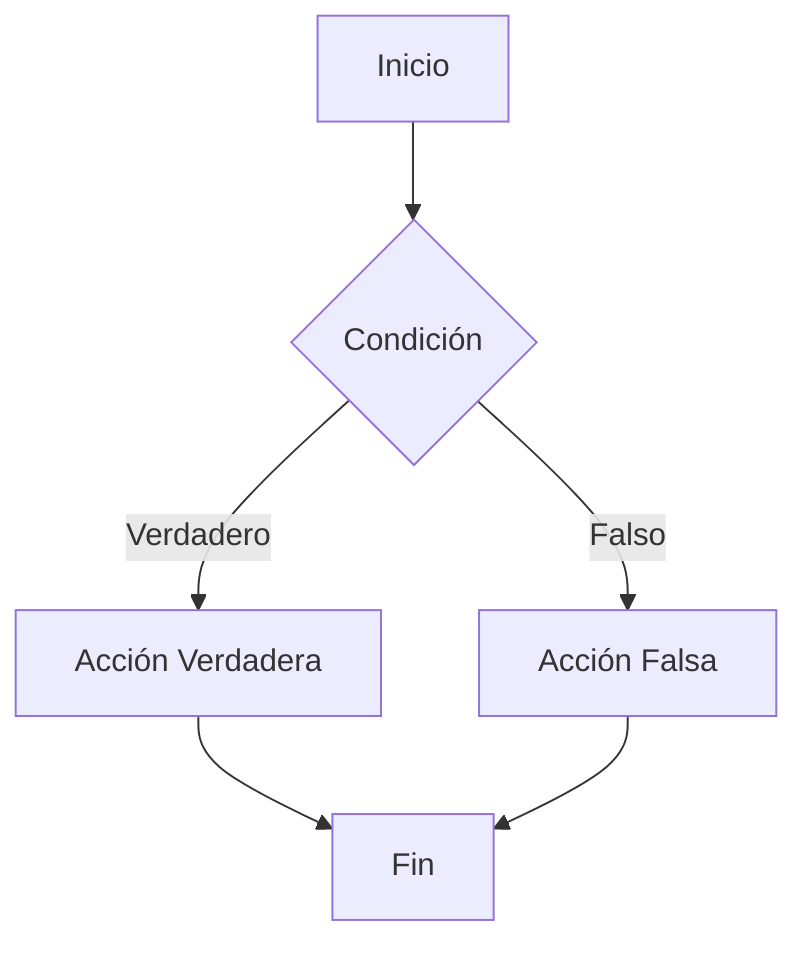
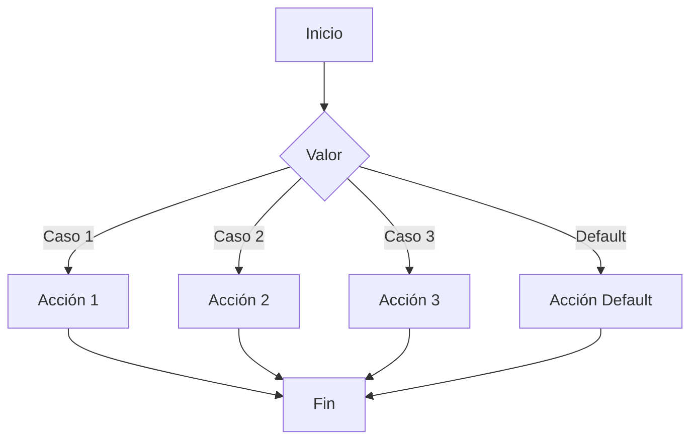

# TEMA 25. PROGRAMACIÓN ESTRUCTURADA.  ESTRUCTURAS BÁSICAS. FUNCIONES Y PROCEDIMIENTOS 

## 1. INTRODUCCIÓN 

El presente tema forma parte del temario oficial publicado en el BOE de 13 de febrero de 1996, donde se aprueba el temario de acceso a la especialidad de Informática / Sistemas y aplicaciones informáticas (indicar la especialidad a la que te presentas).

A su vez, el actual tema 25 se ubica dentro del bloque temático de "Algoritmos y Programación", como tercer tema del bloque. (párrafo para la especialidad de Informática).

A lo largo de este tema, a través de autores como Prieto y Joyanes, se van a introducir términos tan importantes como lenguaje de programación o programa propio.

El presente tema está dedicado al estudio de la técnica de programación estructurada, detallando las estructuras de control de flujo, así como la estructura y uso de las funciones y procedimientos. Con nociones de este tipo de programación se da lugar a distintos lenguajes de programación de manera que posteriormente, junto con otros tipos de lenguajes, se puedan desarrollar tecnologías que definen nuestra era, como la inteligencia artificial y la blockchain.

Estos lenguajes no solo permiten que nuestros dispositivos cotidianos, como ordenadores y smartphones, funcionen, sino que también son fundamentales para innovaciones que transforman sectores clave de la sociedad, de ahí su relevancia crítica en el avance tecnológico actual.

Lo expuesto anteriormente justifica la importancia del tema y es por ello que el estudio de los lenguajes de programación y la programación estructurada en concreto está presente dentro del currículo de la familia profesional de Informática y Comunicaciones. Concretamente se pueden ubicar dentro de los siguientes ciclos formativos:

- CFGS de Desarrollo de Aplicaciones Multiplataforma (Real Decreto 450/2010, Real Decreto 405/2023 y Orden/Decreto autonómico)
  - Módulo: Programación
- CFGS de Desarrollo de Aplicaciones Web (Real Decreto 686/2010, Real Decreto 405/2023 y Orden/Decreto autonómico)
  - Módulo: Programación

## 2. CONCEPTOS PREVIOS 

El reto de la informática es encontrar soluciones a problemas diarios de diferente tipo y complejidad. Las soluciones planteadas consisten en realizar una serie de tareas o instrucciones que conforman algoritmos, en un orden especificado y utilizando los recursos disponibles. Hoy se cuenta con ordenadores que realizan esta labor, pero se requiere que los algoritmos que ejecutan se traduzcan a un lenguaje especial, lo que se conoce como programación.

Un programa es un conjunto ordenado de instrucciones que se dan a la computadora indicándole las operaciones o tareas que se desea realice. Todo lo relativo a los símbolos y reglas para construir o redactar con ellos un programa se denomina lenguaje de programación (Prieto, 2006)

En sus inicios la programación clásica tenía como objetivo principal que el programa funcionase, no siendo el mantenimiento un aspecto importante. Esto generaba extensos programas desarrollados en bloque, sin orden ni estructura (código "espagueti"), lo que dificultaba enormemente su comprensión y mantenimiento.

La necesidad de reducir los costes asociados a las tareas de mantenimiento de las aplicaciones dio lugar a la aparición de nuevos paradigmas de programación que facilitasen las tareas de mantenimiento. Con este propósito, surgieron dos paradigmas de programación:

- **Programación estructurada**: técnica constructiva de programas basada en un conjunto de estructuras específicas que facilitan la modificación, reutilización y lectura del código.
- **Programación modular** consiste en la división de un problema complejo en varios problemas más sencillos.

Ambos paradigmas no son opuestos, sino que se complementan. De este modo, la programación modular tiende a dividir un programa en partes más pequeñas, llamadas módulos, y la programación estructurada se encarga de desarrollar estructuradamente cada una de estas partes, facilitando así su legibilidad y mantenimiento. Nos centraremos en este tema a desarrollar todo lo relativo a la programación estructurada.

## 3. PROGRAMACIÓN ESTRUCTURADA 

La programación estructurada consiste en un conjunto de técnicas que permiten desarrollar algoritmos más fáciles de escribir, leer y modificar.

Para que la programación sea estructurada los programas han de ser propios, y un programa se define como propio si cumple las siguientes características:

- Tiene un solo punto de entrada y un solo punto de salida
- Toda acción del algoritmo es accesible, por al menos un camino.
- No posee bucles infinitos

El teorema de Böhm y Jacopini (propuesto en 1966) dice que "Un programa propio puede ser escrito utilizando únicamente tres tipos de estructuras: secuencial, selectiva y repetitiva" (Joyanes, 2020)

## 4. ESTRUCTURAS BÁSICAS 

A estas estructuras se les denomina estructuras de control, y son las encargadas de controlar el orden en que las instrucciones de un programa se ejecutarán.

Pueden ser de tres tipos: secuenciales, selectivas y repetitivas.

En los siguientes apartados se incluye el diagrama de flujo (a) que representa cada tipo de estructura y su sintaxis en el lenguaje Java (b).

### 4.1. ESTRUCTURAS SECUENCIALES 

Las estructuras secuenciales se caracterizan porque se ejecuta una acción a continuación de otra y así sucesivamente (coincide con el orden físico en que están las instrucciones).

**Diagrama de flujo (a):**

```
ACCIÓN 1 → ACCIÓN 2 → ACCIÓN N
```

**Sintaxis Java (b):**

```java
sentencia1;
sentencia2;
….;
sentenciaN;
```

### 4.2. ESTRUCTURAS SELECTIVAS 

Las estructuras selectivas se caracterizan porque se ejecuta una acción u otras según se cumpla o no una determinada condición. Pueden ser de varios tipos: simples, dobles o múltiples.

#### A) ESTRUCTURA SIMPLE 

En una estructura selectiva simple se evalúa una expresión y si ésta es cierta se ejecuta una determinada acción o grupo de acciones. En caso de que la expresión sea falsa, no se ejecutan dicho grupo de acciones.

**Diagrama de flujo (a):**

```
           ┌──────┐
EXPRESIÓN →│ true │→ ACCIONES
           └──────┘
           ↓ false
```




**Sintaxis Java (b):**

```java
if(expresión) {
  sentencia1;
  sentencia2;
  ... ;
  sentenciaN;
}
```

#### B) ESTRUCTURA DOBLE 

En una estructura selectiva doble se evalúa una expresión y si一点儿 es cierta se ejecuta una determinada acción o grupo de acciones y si el resultado es falso se ejecuta otra acción o grupo de acciones diferentes.

**Diagrama de flujo (a):**

```
           ┌──────┐
EXPRESIÓN →│ true │→ ACCIÓN 1
           └──────┘
           ↓ false
          ACCIÓN 2
```



**Sintaxis Java (b):**

```java
if(expresión)
   sentencia1;
else
   sentencia2;
```

#### C) ESTRUCTURA MULTIPLE 

En una estructura selectiva múltiple se evalúa una expresión que puede tomar n valores distintos (por ejemplo 1, 2, …n) y según sea el valor que de como resultado se ejecuta una de las n acciones.

**Diagrama de flujo (a):**

```
           ┌──────┐
           │valor1│→ ACCIÓN 1
           └──────┘
           ┌──────┐
EXPRESIÓN →│valor2│→ ACCIÓN 2
           └──────┘
           …
           ┌──────┐
           │valorN│→ ACCIÓN N
           └──────┘
```



**Sintaxis Java (b):**

```java
switch(expresión)
{
  case valor1:
  sentencia1_1;
  …
  break;
  case valor2:
  sentencia2_1;
  …
  break;
  case valorN:
  sentenciaN_1;
  …
  break;
}
```

### 4.3. ESTRUCTURAS REPETITIVAS 

Las estructuras repetitivas se caracterizan porque se ejecutan las acciones del cuerpo del bucle mientras o hasta que se cumpla una determinada condición. Es común el uso de variables contador para controlar el bucle. Se distinguen 3 tipos de estructuras repetitivas a groso modo: mientras, repetir hasta y desde o para.

#### A) ESTRUCTURA MIENTRAS 

La estructura repetitiva mientras se caracteriza porque las acciones del cuerpo del bucle se ejecutan mientras la expresión sea verdadera.

Se interroga por la expresión al principio del cuerpo del bucle, por lo que dichas acciones se podrán ejecutar de 0 a N veces. Por tanto, una de las características fundamentales de esta estructura repetitiva radica en ser útil en aquellos casos en los que las instrucciones que forman el cuerpo del bucle podría ser necesario ejecutarlas o no.

**Diagrama de flujo (a):**

```
        ┌───────────────┐
        │   EXPRESIÓN   │
        └──────┬────────┘
              ↓ true
            ACCIONES ───────┐
              ↑             │
              └─────────────┘
              ↓ false
```

**Sintaxis Java (b):**

```java
while(expresión)
{
  sentencia1;
  ... ;
  sentenciaN;
}
```

#### B) ESTRUCTURA REPETIR HASTA 

La estructura repetir hasta se caracteriza porque las acciones del cuerpo del bucle se ejecutan como mínimo una vez y continúan ejecutándose hasta que la expresión sea cierta.

Se interroga por la condición al final del bucle, por lo que dichas acciones se podrán ejecutar de 1 a N veces.

**Diagrama de flujo (a):**

```
      ACCIONES ───────┐
              ↑       │
              │    ┌▼──────────────┐
              └────│   EXPRESIÓN   │
                   └──────┬────────┘
                         ↓ false
```

**Sintaxis Java (b):**

```java
do
  {
  sentencia1;
  ...;
  sentenciaN;
} while(!expresión);
```

#### C) ESTRUCTURA DESDE O PARA 

Este tipo de estructura se caracteriza porque se ejecuta un número determinado de veces y para ello utiliza una variable que controla las iteraciones del bucle.

Existen tres operaciones que se realizan en este tipo de estructura:

- **Inicialización**: Se inicializa la variable que controla el bucle.
- **Expresión**: Se evalúa la expresión y si es cierta se ejecuta el contenido del bucle.
- **Iteración**: Se actualiza el valor de la variable que controla el bucle.

**Diagrama de flujo (a):**

```
      INICIALIZACIÓN
              ↓
        ┌───────────────┐
        │   EXPRESIÓN   │
        └──────┬────────┘
              ↓ true
            ACCIONES ───────┐
              ↑             │
              │   ITERACIÓN │
              └─────────────┘
              ↓ false
```

**Sintaxis Java (b):**

```java
for (inicialización; expresión; iteración)
{
  sentencia1;
  ...;
  sentenciaN;
}
```

## 5. FUNCIONES Y PROCEDIMIENTOS 

La programación estructurada hace uso de la técnica de diseño descendente (top-down) también conocida como "divide y vencerás", en la cual, a partir de un problema general, éste puede dividirse en fragmentos o subproblemas más fáciles de resolver. (López L, 2004)

De este modo, el problema principal se soluciona por el correspondiente programa o algoritmo principal y la solución de los subproblemas mediante subprogramas, conocidos como funciones y procedimientos.

### 5.1. FUNCIONES 

Una función es un subprograma que toma cero, uno o más valores de entrada (parámetros) y devuelve un resultado asociado al nombre de la función.

De forma general, se puede decir que existen dos tipos de funciones: las funciones propias del lenguaje de programación y las funciones definidas por el usuario. Las funciones definidas por el usuario necesitan ser declaradas para posteriormente poder ser llamadas (invocadas) tantas veces como se desee.

#### 5.1.1 DECLARACIÓN 

La declaración de una función es el primer paso que hay que llevar a cabo antes de poder utilizar una función. Consta de 2 partes bien diferenciadas:

- **Cabecera**: Aquí se indica un conjunto de posibles modificadores, el tipo de valor retornado, el nombre de la función y una lista de parámetros indicando el tipo asociado. Los parámetros de la declaración de la función se denominan parámetros formales, y son nombres de variables que solo se utilizan dentro del cuerpo de la función.
- **Cuerpo de la función**: son las instrucciones a realizar por la función.

Ejemplo de declaración de una función en Java:

```java
// Función que calcula el factorial de un nº
public static int factorial(int n){
int fact=1;
     for(int i=1;i<=n;i++)
      fact=fact*i;
     return fact;
}
```

#### 5.1.2 INVOCACIÓN 

La llamada a una función se realiza con el nombre de la función y entre paréntesis los valores que son la lista de parámetros actuales, identificándose uno a uno y en el mismo orden con los parámetros formales. Una función puede ser llamada de la siguiente forma:

```java
nombre_funcion(lista parámetros actuales)
```

### 5.2 PROCEDIMIENTOS 

Un procedimiento es un subprograma que toma 0, 1 o más valores de entrada (parámetros) y no devuelve ningún resultado en el nombre del procedimiento. La entrada de datos al procedimiento, así como la devolución de resultados se realizan a través de los parámetros.

#### 5.2.1. DECLARACIÓN 

El proceso de declaración de un procedimiento es similar al de una función, excepto por el nombre del procedimiento, el cual no se encuentra asociado a ningún resultado.

Al igual que las funciones, la declaración de un procedimiento consta de 2 partes: cabecera y cuerpo. Su sintaxis en pseudocódigo es:

```pseudo
procedimiento nombre(parámetros formales){
 <instrucciones>
}
```

#### 5.2.2. INVOCACIÓN 

La llamada a un procedimiento se realiza de igual modo que la llamada a una función. Su sintaxis es:

```pseudo
nombre_procedimiento(lista parámetros actuales)
```

### 5.3. PASO DE PARÁMETROS  

Existe una correspondencia automática entre los parámetros formales y actuales cada vez que se llama a una función y/o procedimiento. Los parámetros actuales sustituirán y serán utilizados en lugar de los parámetros formales.

Existen 2 métodos para establecer el paso entre parámetros:

- **Paso por valor**: Los parámetros formales reciben una copia de los valores de los parámetros actuales. De modo que los cambios que se realicen dentro del subprograma no alterarán el valor que tenga desde el programa principal.
- **Paso por referencia**: en este método se envía al subprograma la dirección de memoria del parámetro actual y, por tanto, es una variable compartida pudiendo ser modificada directamente por el subprograma.

### 5.4. ÁMBITO DE UN IDENTIFICADOR 

Los identificadores u objetos (variables, constantes, etc.) se pueden clasificar según su ámbito. Se conoce como ámbito de un identificador a la parte del programa desde donde este puede ser identificado porque se conoce su existencia.

De este modo, se distinguen:

- **Identificadores locales**: son los definidos dentro de un subprograma y su ámbito es dicho subprograma, no siendo accesible fuera de él.
- **Identificadores globales**: son los definidos en el programa principal, por lo que su ámbito se extiende a todo el programa.

## 6. CONCLUSIÓN 

En el presente tema se ha presentado una visión global de la programación estructurada, la cual hace los programas más fáciles de escribir, leer y mantener, utilizando para ello las estructuras de control (secuenciales, selectivas y repetitivas), conseguyendo además minimizar el tamaño y complejidad de los programas mediante el uso de funciones y procedimientos.

Gracias a los conceptos de programación estructurada vistos en el tema podemos realizar programas que nos ayudan a resolver multitud de problemas y, gracias a ellos, hacernos más fácil nuestra vida cotidiana.

## 7. BIBLIOGRAFÍA 

- Joyanes, L. (2020). Fundamentos de programación. Algoritmos, estructuras de datos y objetos. Editorial McGraw-Hill
- Prieto, A. (2006). Introducción a la informática. Editorial McGraw-Hill
- López, L. (2004) Programación Estructurada. Un enfoque algorítmico. Editorial Alfaomega