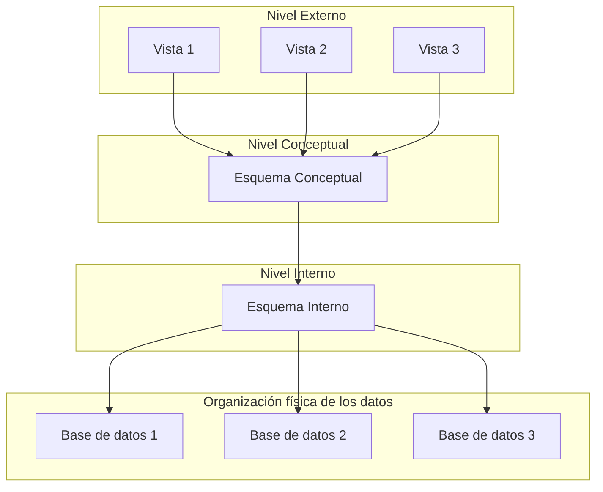

# Tema 34: Sistemas Gestores de Bases de Datos. Funciones. Componentes. Arquitecturas de referencia y operacionales. Tipos de sistemas.

## 1. Introducción
- BOE 13 FEB 1996. Bloque Tematico: Bases de Datos.  
- Definiciones de bases de datos, SGBDR
- Evolución desde los sistemas de gestión de archivos hasta las bases de datos
- Importancia en la actualidad
- Curriculo Familia Profesional

## 2. Sistemas Gestores de Bases de Datos (SGBD)

- **Base de datos**: Conjunto de datos almacenados en soporte informatico. Datos relacionados y estructurados. Persistentes. Usados por las empresas.
- **SGDBD**: Colección de programas para crear y mantener un base de datos. Facilita la definicion, construcción y manipulación.
  **Ventajas**
   - Visión abstracta de los datos (ocultan la complejidad de almacenamiento y mantenimiento)
   - Disminuyen redundancia e inconsistencia
   - Aseguran Integridad datos
   - Aumentan la seguridad y privacidad
   - Permiten compartir datos y accesos concurrentes
   - Copias de seguridad y mecanismos de recuperacion de datos

## 3. Funciones

  -  A) **Definicion**: Permite definir y describir los esquemoas de la Base de Datos. Lenguaje DDL
  -  B) **Manipulación**: Operaciones de gestion mediante Lenguaje DML: Consulta o actualizar los datos. 
     - Recuperar información: Consultas a la totalidad o selectivas
     - Actualizar: Inserción, modificación o borrado.
  -  C) **Control**: Lenguaje DCL, permisos de usuario, ademas de copia de seguridad, carga de ficheros, auditoria, configuracion...

## 4. Componentes
 Son los lenguajes de la BD, el diccionario de datos, el gestor de la BD, los usuarios y las herramientas de la BD.

### 4.1. **Lenguajes de base de datos**
- **DDL**: Simple para describir datos con facilidad y precisión
- **DCL**: Encargado del control y seguridad de los datos
- **DML**: Gestiona la informacion de la base de datos, permite recuperar, manipular, modificar y eliminar registros.
  
### 4.2. Diccionario de datos: 

Almacena informacion sobre la totalidad de los datos que forman la base de datos. Es una metabase de datos. Caracteristicas logicas y de las estructuras que almacenan los datos

### 4.3. Gestor de base de datos:
Proporciona interfaz entre los datos y los programas de aplicacion que los manejan. Es un interprete entre usuario y datos. Se encarga de: 
- Garantizar privacidad, integridad y seguridad de los datos
- Control de accesos concurrentes
- Interaccion con el sistema operativo.

### 4.4. Usuarios de la base de datos: 
Diferentes perfiles:
- **Administrador** de la base de datos: Administracion, seguridad, privacidad e integridad de la información:
- **Usuarios** de la base de datos:
   - Usuarios **tecnicos**: Programadores, operadores, mantenimiento
   - Usuarios **finales**. Interactuan con la BD con programas de aplicación

### 4.5. Herramientas de base de datos: 
Conjunto de aplicaciones que permiten a los administradores la gestion de la base de datos, privaciddad (gestion de usuarios y permisos), informes, formularios, interfaces gráficas,etc
  
## 5. Arquitecturas de Referencia y Operacionales

### 5.1. Arquitectura de referencia
(ANSI-SPARC). Separar los programas de aplicacion de la base de datos.

- **Nivel interno**: Nivel mas bajo de abstracción. Estructura fisica de los datos. Dispositivos de almacenamiento fisico. Usuarios Administradores
- **Nivel lógico**: Esquema conceptual. Detalla las entidades, atributos y relaciones. Integridad y confidencialidad. Usuarios Programadores
- **Nivel externo**: Describe las vistas para los usuarios, dependiendo del perfil. 

### 5.2. Arquitectura operacional.

Varian en relacion al SGBD.
- **Centralizada**: Sistema computacional único, sin interacción. Sistemas monousuario o BD en sistemas de alto rendimiento. Sin concurrencia ni sistemas de recuperación.
- **Cliente-servidor**: Cliente parte visible (formularios, informes, etc) y servidor donde se encuentran las estructuras de datos, consultas, control de concurrecia y recuperacion.
- **Paralela**: Sistemas multiprocesador y discos a traves de un red de alta velocidad
- **Distribuida**: Multiples computadores llamados nodos en diferentes lugares geográficos. Evitan cuellos de botella

## 6. Tipos de Sistemas

a) Según el modelo lógico
- **Jerárquico**. Jerarquía relación entre entidades padre-hijo. Nodos En desuso
- **En red**. Organiza la información en registro y enlaces. En respuesta a las limitaciones del anterior. 
- **Relacional**. Tablas bidimensionales (relaciones) Fila: Registro o tupla, Columna: Atributo.
- **Orientado a objetos**: relaciones entre objetos y atributos. Incluye herencia y tipos definidos. En auge.
- **Objeto-relacional**. Evolución del modelo relacional, incorporando conceptos orientados a objetos. Oracle, SQL Server

b) Según el número de usuarios
- **Monousuario**: Un usuario simultaneamente
- **Multiusuario**: Varios usuarios al mismo tiempo. La mayor parte de los SGDBD son de este tipo

c) Según su ubicación
- **Centralizadosv: BD y SGBD en el mismo equipo
- **Distribuidos**: BD y SGBD distribuidos en varios equipos conectados por red

d) Según licencia:
- **Comerciales**
   - Oracle
   - SQL Server
   - MySQL EE
   - DB2
   - Informix
- **Libres**
   - MySQL CE
   - PostgreSQL
   - SQLite
   - MariaDB

## 7. Conclusión
- Importancia de las bases de datos en la actualidad
- Evolución hacia bases de datos NoSQL y Big Data
- Factores clave en la elección de un SGBD

## 8. Bibliografía
- Date C.J (2000). *Introducción a los sistemas de bases de datos*. Editorial Addison-Wesley.
- Korth H. y Silberschatz (2002). *Fundamentos de bases de datos*. Editorial McGraw-Hill.
- De Miguel A, y Piattini M (1999). *Fundamentos y modelos de BBDD*. Editorial Ra-Ma.
- Núñez, R (2023). *Gestión de bases de datos*. Editorial Ra-Ma.
- Hueso L (2016). *Administración de sistemas gestores de bases de datos*. Editorial Ra-Ma.

- Sitios web oficiales de los distintos SGBD:
  - [Oracle](https://www.oracle.com/)
  - [MySQL](https://www.mysql.com/)
  - [MongoDB](https://www.mongodb.com/)
  - [MariaDB](https://mariadb.org/)

