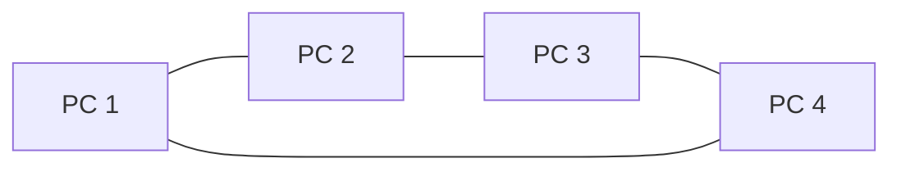
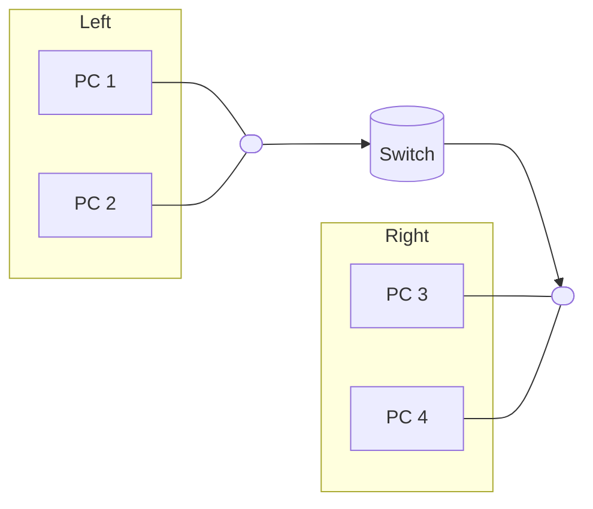

# TEMA 67. REDES DE ÁREA LOCAL. COMPONENTES . TOPOLOGÍAS. ESTÁNDARES. PROTOCOLOS.  

## ÍNDICE 
```bash
1. INTRODUCCIÓN Y JUSTIFICACIÓN
2. REDES DE ÁREA LOCAL
3. COMPONENTES
   3.1 DISPOSITIVOS DE RED
   3.2 ESTACIONES DE TRABAJO Y SERVIDORES
   3.3 MEDIOS DE TRANSMISIÓN
4. TOPOLOGÍAS
5. ESTÁNDARES
6. PROTOCOLOS
7. CONCLUSIÓN
8. BIBLIOGRAFÍA
```

---

## 1. INTRODUCCIÓN Y JUSTIFICACIÓN 
El presente tema forma parte del temario oficial publicado en el BOE de 13 de 
febrero de 1996, donde se aprueba el temario de acceso a la especialidad de 
Informática . 

A su vez, el actual tema 67 se ubica  dentro del bloque temático de redes , a 
continuación del tema  “Funciones y servicios en niveles sesión, presentación y 
aplicación Protocolos. Estándares ” 

A lo largo de este tema, a través de autores como  Stallings, Tanenbaum  y Prieto,  
se analizarán términos propios de las redes de área local, componentes, topologías, estándares o protocolos.

Las redes de área local , mediante los sistemas de cableado, equipos de 
interconexión y otros componentes, constituyen el esqueleto y aparato 
circulatorio de cualquier organización, de forma que permiten y simplifican el 
desarrollo de su actividad. 

Hoy en día es impensable la existencia de una 
organización o empresa que no contemple la instalación de una red que 
proporcione servicios de transporte de datos y servicios multimedia.  

Por este motivo, las redes de área local  requieren de una adecuada 
sistematización basada en el orden, planificación y profundo conocimiento de las 
tecnologías de la información y comunicación , para proporcionar a la 
organización una capacidad constante de absorción de la demanda cre ciente de 
nuevos servicios de información.  Equivocaciones originadas por una 
planificación poco previsora, la elección de componentes y materiales no 
adecuados, errores en la instalación, una mala administración o mantenimiento 
de la red, producen costes e levados y gastos adicionales a los presupuestados, 
e incluso  pueden  llegar a poner en peligro la propia existencia de una 
organización.  

Lo expuesto anteriormente justifica la importancia del tema y es por ello que el 
estudio de las redes de área local está presente dentro del currículo de la familia 
profesional de Informática y Comunicaciones. Concretamente se pueden ubicar 
dentro de los siguientes ciclos formativos:  


- **CFGM de Sistemas Microinformáticos y Redes** Real Decreto 1691/2007 
y Orden/Decreto autonómico
    - Módulo: Redes locales  
- **CFGS de Administración de Sistemas Informáticos en Red** Real Decreto 
1629/2009 y Orden/Decreto autonómico
    - Módulo: Planificación y administración de redes  
- **CFGS de Desarrollo de Aplicaciones Multiplataforma**  Real Decreto 
450/20 10, Real Decreto 405/2023 y Orden/Decreto autonómico 
    - Módulo: Sistemas informáticos  
- **CFGS de Desarrollo de Aplicaciones Web** Real Decreto 686/2010, Real 
Decreto 405/2023 y  Orden/Decreto autonómico 
    - Módulo: Sistemas informáticos  
 
## 2. REDES DE ÁREA LOCAL  
Las redes de área local, en adelante LAN, son sistemas de interconexión de dispositivos informáticos que abarca un área geográfica limitada y son de ámbito privado.

El propósito de las LAN es compartir información y permitir la comunicación entre los dispositivos interconectados. 

Son ampliamente utilizadas en entornos empresariales, educativos y domésticos.

Se basan en tecnologías como Ethernet o Wifi para establecer la comunicación entre los dispositivos conectados.

Los beneficios que se obtienen al disponer de una red de área local son:  
- Permiten compartir información.  
- Permiten compartir recursos, como impresoras, dispositivos de 
almacenamiento, etc.  
- Permiten mayor flexibilidad, ya que se permite el acceso a los recursos de 
la red desde diferentes nod os.  
- Permiten reducir costes . 
 
## 3. COMPONENTES  

Dentro de las LAN podemos destacar 3 categorías de componentes diferentes: dispositivos de red o de interconexión, equipos de red y medios de transmisión.

### 3.1 Dispositivos de red

Permiten la interconexión de los dispositivos de la red y expanden el área de conectividad, se clasifican en función de la capa del modelo OSI en la que operan.

- **Conmutadores**. Los llamados switches, son los componentes centrales de una LAN, operan en la capa 2 del modelo OSI, segmentando dominios de colisión. Su función es la de punto de interconexión centralizada de los dispositivos conectados. Proporcionan una comunicación eficiente en las LAN, además de implementar los protocolos de segmentación de red como VLAN o de control de bucles en enlaces redundantes.

- **Enrutadores** o routers, dirigen el tráfico entre diferentes redes, operan en la capa de red, capa 3 del modelo OSI permitiendo la comunicación entre la LAN y una red externa como Internet. Su función es la de puerta de enlace de la LAN y ademas implementa servicios como DHCP.

- **Puntos de acceso** Permite la conexión inalámbrica a la LAN, transmiten y reciben datos a través de ondas de radio. Evita la necesidad de cables para conectarse a la red. Nivel 2 del modelo OSI.

- **Tarjetas de red o NIC**. Interfaz que permite a los equipos informáticos conectares a redes Ethernet o wifi. Estándares Ethernet 1000BASE-T y wifi 802.11 en bandas de 2.4, 5 y 6 GHz. Operan en la capa 1 del modelo OSI.

- **Otros dispositivos de red**:
  - POE: Transmite la corriente eléctrica a través de la red eliminando la necesidad de enchufes, el dispositivo debe ser compatible y tener un puerto PoE
  - PLC: Transmite la señal de la red a través de la instalación eléctrica, pudiendo sacar una toma de red desde cualquier enchufe. Se necesitan al menos 2 módulos.

### 3.2 Estaciones de trabajo y servidores

- **Servidores**: Equipos informáticos que proporcionan servicios de red a las estaciones de trabajo. Estos incluyen: almacenamiento, gestión de archivos, servicios web, gestión de usuarios, bases de datos, etc. 

    Utilizan sistemas operativos de servidor como Windows Server o distribuciones Linux de servidor como Ubuntu Server o Red Hat Enterprise Server.

- **Estaciones de trabajo:** Ordenadores conectados a la red y que utilizan los usuarios para realizar sus funciones, generalmente proporcionadas por los servidores, como correo electrónico, uso de aplicaciones corporativas, navegar por la web, etc. 
  
    Utilizan sistemas operativos de escritorio como Windows 11, MacOS o Ubuntu Desktop

  
### 3.3  Medios de transmisión
- **Medios guiados**  
  - **Cable par trenzado** : el par trenzado es el medio guiado más económico 
y a la vez más usado (Stallings, 2017). Formado por cuatro pares de hilos 
trenzados de dos en dos para aumentar la potencia del cable y reducir las 
interferencias. Normalizado según el estándar TIA/EIA-568. Los cables se 
pueden clasificar en: UTP, FTP, STP dependiendo de la protección. Utilizan conectores  RJ-45.  
  - **Cable coaxial**: Un cable coaxial consiste en un alambre de cobre rígido 
como núcleo, rodeado por un material aislante. El aislante est á forrado de 
un conductor cilíndrico, que por lo general es una malla de tejido 
fuertemente trenzado. El conductor externo está cubierto con una funda 
protectora de plástico. (Tanenbaum, 2021).  
  - **Fibra óptica**: formado por un hilo muy fino de vidrio o plástico que transmite señales de luz. Ofrecen mucha más capacidad de transmisión y menor pérdida en comparación con el cobre, ideales para redes de alta velocidad y transporte a largas distancias. Seguridad intrínseca, interceptar la fibra produce pérdida de señal detectable.

- **Medios no guiados**
Los medios no guiados  utilizan ondas electromagnéticas para transmitir datos. Eliminan la necesidad de cableado permitiendo mayor movilidad y conectividad. Bandas Wifi 2.4, 5 y 6 GHz, última versión wifi 7 (802.11 be)
 
 
## 4. TOPOLOGÍAS  
Se entiende por topología de una red a la distribución en la que  se encuentran 
dispuestos los ordenadores que la  componen.  
 
A continuación, se detallan algunas de las topologías físicas básicas y 
tradicionales utilizadas para el despliegue de redes de área local: 
 
- **BUS**:  Todos los nodos que componen la red están unidos entre sí linealmente, uno a continuación del otro, a lo largo de un único medio de transmisión. Utilizada como topología física necesita incluir en ambos extremos del bus unos dispositivos 
llamados terminadores, los cuales evitan posibles rebotes de la señal.  El medio 
de transmisión típico de esta topología es el cable coaxial.  Presenta pocos 
problemas logísticos, puesto que no se acumula un gran número de cables en 
torno al nodo central.  Como inconvenientes: un fallo en una parte del cableado 
afecta a la red completa, y la localización de averías  es difícil , ya que estas 
pueden haberse producido en cualquier tramo del bus.  IEEE 802.4 Token Bus
 
 ```mermaid
graph LR
    B1([" "]) --- B2(["BUS"]) --- B3([" "]) --- B4([" "]) --- B5([" "])
    PC1[PC 1] --- B1
    PC2[PC 2] --- B2
    PC3[PC 3] --- B3
    PC4[PC 4] --- B4
```
 
- **ANILLO**: La topología en anillo consiste en conectar linealmente entre sí todos los ordenadores en un bucle cerrado. Esta conexión de realiza de manera que el flujo de datos tiene un único sentido alrededor del anillo. Las estaciones se 
conectan a la siguiente y el último al primero hasta cerrar el anillo
Esta topología fue la adoptada por IBM para su red Token Ring. Con el 
predominio de Ethernet en las redes LAN, Token Ring ha caído en desuso;  
IEEE 802.5


 

 
- **ESTRELLA**: Todas las estaciones se conectan a un nodo central, switch, que actúa como el centro  de la estrella y por donde pasa el tráfico para encaminarse a la estación destino.  
El mayor inconveniente de esta topología es que la máxima vulnerabilidad se 
encuentra precisamente en el nodo central, ya que si éste falla, toda la red cae.  
Por este motivo suele ser un dispositivo muy robusto para minimizar la 
probabilidad de fallo.  
En la actualidad, esta es una de las topologías físicas más utilizadas por los 
sistemas de cableado estructurado y la mayor parte de las redes de área local.  
 



- **ÁRBOL**  Una ampliación de la topología en estrella es la topología en árbol donde las redes en estrella se conectan entre sí. Se caracteriza por presentar una 
distribución jerárquica. La raíz suele ser un equipo con capacidad para gestionar 
el resto. También denominada estrella extendida
 
 
- **MALLA COMPLETA**: En esta topología cada estación se conecta mediante enlaces punto a punto con todas las demás. Como topología física es inviable en instalaciones con un número elevado de nodos, ya que exigiría la utilización de una interfaz de red por cada una de las estaciones a interconectar.  
 
 
- **HÍBRIDA** Se caracteriza porque no existe un patrón obvio de enlaces y nodos que la determine.  Se derivan de la unión de topologías "puras".  Puede ser una 
combinación de cualesquiera de las anteriores  topologías . 
 
 
## 5. ESTÁNDARES  

Los estándares en redes de área local (LAN) aseguran la compatibilidad, eficiencia y seguridad en la comunicación entre dispositivos de distintos fabricantes. 

Los estándares definen las especificaciones técnicas para 
componentes, topologías, protocolos y métodos de comunicación en la red, 
facilitando así su implementación y mantenimiento. 

En el contexto de redes LAN, algunos de los estándares más importantes han sido desarrollados por el IEEE  especialmente dentro de la familia IEEE 802 . 


- **IEEE 802.3  (Ethernet)** : Este es uno de los estándares de LAN más 
utilizados y especifica el método de transmisión de datos en redes 
cableadas. Define cómo los dispositivos pueden compartir el medio físico 
de la red, los tipos de cables (como UTP y fibra óptica) y las velocidades s 
de transmisión, que varían desde 10 Mbps hasta velocidades de 400 Gbps 
o más en versiones modernas.  

- **IEEE 802.11  (Wi-Fi)**: Este estándar cubre las redes inalámbricas de área 
local (WLAN) y permite la conexión de dispositivos móviles y fijos a través 
de ond as de radio. Con versiones como 802.11n, 802.11ac, y 802.11ax 
(Wi-Fi 6), las redes Wi -Fi han incrementado sus velocidades, capacidad y 
eficiencia, siendo esenciales en entornos domésticos y empresariales.  

- **IEEE 802.1Q  (VLAN)** : Este estándar especifica el etiquetado de VLAN 
(Virtual Local Area Network), permitiendo segmentar la red física en varias 
redes virtuales. Esto ayuda a mejorar la seguridad y el rendimiento, 
aislando el tráfico de distintos grupos dentro de una misma infraestructura 
de red. 

- **IEEE 802.1X (Autenticación de puerto)** Permite autenticar dispositivos en una red a traves de mecanismos que controlan el acceso a la red.

- **IEEE 802.1D y 802.1W. STP y RSTP**. Evitan bucles en redes con caminos redundantes.

- **ANSI/TIA -568**: Este estándar establece pautas para el cableado 
estructurado de edificios y espacios de trabajo. Es fundamental para la 
instalación física de redes, ya que asegura que el cableado, conectores y 
puntos de conexión cumplan con las especificaciones necesarias para 
soportar las tecnologías de red.  


- **PoE (Power over Ethernet)** - IEEE 802.3af / 802.3at : Estos estándares 
permiten que los cables Ethernet suministren energía eléctrica a 
dispositivos de la red, como cámaras IP, teléfonos VoIP y puntos de 
acceso, eliminando la necesidad de fuentes de alimentación adicionales.  

 
## 6. PROTOCOLOS  

Los protocolos se definen como el conjunto de reglas o normas que rigen la comunicación entre dos equipos. Los protocolos en las redes LAN se organizan según el modelo OSI de 7 capas. A continuación se detallan los protocolos más comunes en cada nivel.

- **Capa 1 o Física**: Transmisión de bits a través del medio físico, no tiene protocolos
- **Capa 2 o Enlace**: Control de acceso al medio, detección de errores y direcciones físicas. Protocolos:
  - Ethernet: Direcciones MAC para obtener dirección IP por DHCP
  - WIFI
  - ARP: Asocia direcciones IP a direcciones MAC
  - VLAN: Segmentación lógica de redes
- **Capa 3 o de Red**: Enrutamiento, direccionamiento lógico (IP) y fragmentación de paquetes. Protocolos:
  - IP: Protocolo de Internet, direcciones IPv4 e IPv6
  - ICMP: Mensajes de control, ping
- **Capa 4 o Transporte**: Garantiza la entrega, confiable o no, entre las aplicaciones de dispositivos diferentes. Protocolos:
  - TCP: Control de la transmisión, confiable
  - UDP: Datagramas de usuario, más rápido pero no confiable
  - SCTP: Mensajes, híbrido entre TCP y UDP
  - QUIC: Rápido, seguro y con menor latencia
- **Capa 5 o Sesión**: Establece y controla las sesiones entre diferentes equipos. Protocolos:
  - NetBios
  - RCC
- **Capa 6 o Presentación**: Traducción, cifrado y compresión de datos. Protocolos:
  - TLS: Cifrado
  - Mime: Amplia capacidades del correo electrónico
  - GZIP, X.509 o Base64.
- **Capa 7 o Aplicación**. Aplicaciones de usuario. Protocolos:
  - DHCP
  - DNS
  - SNMP
  - SSH
  - HTTP
  - SMTP
  - IMAP
  - FTP

 
## 7. CONCLUSIÓN  
Las redes de área local (LAN) son fundamentales para el funcionamiento 
eficiente de una organización, ya que permiten la comunicación y el intercambio 
de datos entre dispositivos de manera rápida y confiable. La elección de la 
infraestructura adecuada para una red LAN implica decisiones críticas que deben 
ir más allá del costo inicial, considerando su rendimiento, escalabilidad y 
capacidad para soportar las necesidades futuras de la organización.  

En este tema, se ha proporcionado una visión integral de las redes LAN, 
abarcando sus diversas topologías, componentes esenciales (tanto hardware 
como software) y los estándares y protocolos  que garantizan su funcionamiento. 
Este conocimiento es clave para diseñar redes locales robustas y seguras, 
capaces de adaptarse a los cambios tecnológicos y a los objetivos de cada 
entorno organizacional.  

## 8.  BIBLIOGRAFÍA  
- Tanenbaum, A.  (2021).  Computer N etworks.  Editorial Pearson   
- Stallings, W.  (2017).  Data and Computer Communications . Ed. Pearson . 
- Prieto,  A. (2006). Introducción a la informática.  Editorial McGraw -Hill 
- www.ieee802.org  
 

